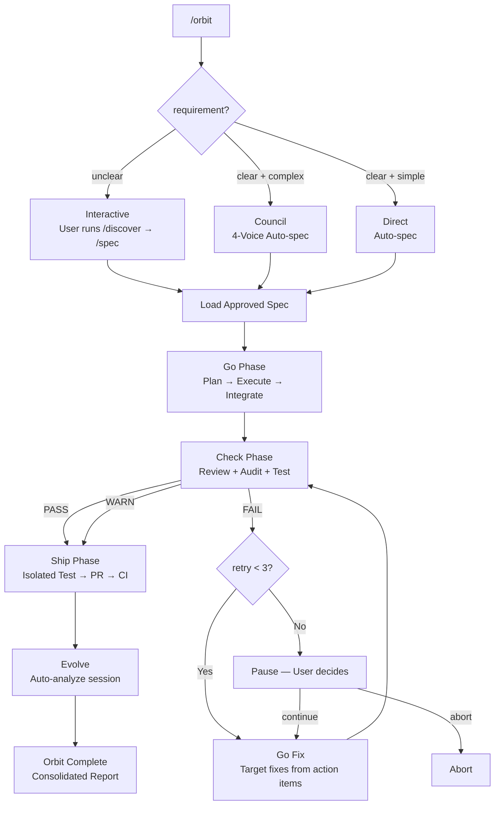

# epic-harness

26 skills (9 pipeline + 17 quality) + self-evolving agent harness.

## Structure

- `skills/` — 26 skills + _dispatch engine
- `registry/` — Seeding resources (embedded in Rust binary at compile time)
  - `presets/` — Cold-start skill templates
- `src/hooks/` — Ring 0 automation + Ring 3 evolution loop
- `hooks/hooks.json` — Claude Code hook manifest. This exact path is the only one
  Claude Code auto-discovers; a manifest under `.claude-plugin/` is never read,
  so hooks defined there never run. Asserted by `tests/plugin_layout_test.rs`.
- `.codex-plugin/hooks.json` — Codex hook manifest
- `src/hooks/` — Rust source (common, guard, observe, polish, resume, snapshot, reflect)
- `docs/` — User-facing documentation and assets
  - `architecture.md`, `quickstart.md`, `demo/`, `references/`, `specs/`
- `integrations/common/` — `HARNESS.md` embedded into the binary (`include_str!`), self-seeded to `~/.harness/HARNESS.md`

## Architecture: 4-Ring Model

- **Ring 0 (Autopilot)**: Hooks auto-maintain quality, restore sessions, learn
- **Ring 1 (Pipeline)**: 9 skills that orchestrate multi-step workflows (discover → spec → go → audit → eval → ship, orbit, evolve, team)
- **Ring 2 (Quality Gates)**: 17 skills that auto-trigger on context signals (tdd, debug, secure, threat-model, vuln-scan, triage, verify, etc.)
- **Ring 3 (Evolve)**: Observe → Analyze → Evolve → Gate → Reload self-improvement loop

## /orbit — Autonomous Pipeline

Single-command spec-to-PR execution with three entry modes.



**State tracking**: `$HARNESS_DIR/orbit/PIPELINE-{timestamp}.json` — updated after every phase transition, survives context compaction.

**Human checkpoints**: mode selection (interactive only when unclear), 3 failed audits (pause).

**Evolve**: runs automatically after PR created + CI green. Skipped on abort.

## Eval System (Ring 3 Core)

Fuses A-Evolve benchmark patterns into Claude Code context.

### Multi-Dimensional Scoring
Every tool call scored on 3 axes:
- `tool_success` (0/1): Did the tool succeed?
- `output_quality` (0.0-1.0): Output quality (per-tool criteria)
- `execution_cost` (0.0-1.0): Efficiency
- **Composite**: `SCORE_WEIGHTS.success×tool_success + SCORE_WEIGHTS.quality×quality + SCORE_WEIGHTS.cost×cost` (default 0.5/0.3/0.2)

All weights configurable via `SCORE_WEIGHTS` in `common.rs`.

### Failure Classification (9 types)
type_error, syntax_error, test_fail, lint_fail, build_fail, permission_denied, timeout, not_found, runtime_error

### Pattern Detection (4 types)
All thresholds defined as constants in `common.rs` for per-project tuning.
Function-name-level context included (extracted from stack traces, error messages).
Error message hash-based dedup for improved precision (`hashString` + `normalizeError`).
- `repeated_same_error`: Consecutive same error + same error hash (`REPEATED_ERROR_MIN`, default 3)
- `fix_then_break`: Edit success → Bash error cycle (`FTB_LOOKAHEAD`=3, `FTB_MIN_CYCLES`=2)
- `long_debug_loop`: Same file in consecutive operations (`DEBUG_LOOP_MIN`, default 5)
- `thrashing`: Edit↔Error alternating (`THRASH_MIN_EDITS`=3, `THRASH_MIN_ERRORS`=3)

### Skill Seeding Thresholds
- Weak tool: success rate < `WEAK_TOOL_RATE`(0.6), min `WEAK_TOOL_MIN_OBS`(5) observations
- Weak file type: success rate < `WEAK_EXT_RATE`(0.5), min `WEAK_EXT_MIN_OBS`(3) observations
- High-frequency error: `HIGH_FREQ_ERROR_MIN`(5)+ occurrences

### Stagnation Gating
- `STAGNATION_LIMIT`(3) sessions without improvement → auto-rollback evolved skills to best checkpoint
- `IMPROVEMENT_THRESHOLD`: 5%
- Trend tracking: improving / stable / declining

### Evolved Skill Validation
Auto-validated by `gate_skills()` in reflect:
- Must have `---` frontmatter delimiter
- Body (after frontmatter) must be ≥ 20 characters
- SKILL.md file must exist in skill directory
- Invalid skills silently removed; skill count capped at `MAX_EVOLVED_SKILLS`(10)

### Evolved Skill Priority
Static skills (tdd, debug, secure, etc.) always take priority over evolved skills. Evolved skills supplement only.

### Skill Structure
All static skills include 4 core sections:
- **Process**: Step-by-step execution procedure
- **Anti-Rationalization**: Excuse | Rebuttal | What to do instead (table)
- **Evidence Required**: Checklist of proof needed for completion claims
- **Red Flags**: Anti-pattern warnings

## Codex Host Support

Codex consumes hook output differently from Claude Code, and the difference is
**per event**, not per host. `src/shared/host.rs` records the one bit the output
helpers need; `hint()`/`raw()` then pick the stream.

| Codex event | Manifest entry | stdout contract |
|---|---|---|
| `SessionStart` | Node runner → `epic-harness resume` | one JSON object carries `additionalContext`; tagged text must not be emitted directly |
| `PreToolUse` (`Bash`) | Node runner → `epic-harness guard` | plain text ignored; JSON `permissionDecision` blocks |
| `PostToolUse` (`*`) | Node runner → `epic-harness observe` | plain text ignored |
| `PostToolUse` (`apply_patch\|Edit\|Write`) | Node runner → `epic-harness polish` | plain text ignored |
| `SubagentStart` | Node runner → `epic-harness observe` | empty output is valid |
| `SubagentStop` | Node runner → `epic-harness observe` | runner validates and forwards JSON; emits `{}` only when the binary is silent |
| `PreCompact` | Node runner → `epic-harness snapshot` | exit 0 with no output = success |
| `SessionEnd` | Node runner → `epic-harness reflect` | advisory output; manifest uses Codex's three-second maximum |

Notes that are easy to get wrong:

- **`reflect` belongs on `SessionEnd`, not `Stop`.** `Stop` is turn-scoped and fires
  once per turn, so mapping reflection there re-analyzes the whole day every turn
  and inflates `total_sessions`.
- **`PostToolUse` uses `*`.** Matching only `Bash` hid every edit, MCP and function
  tool call from Ring 3.
- **Codex edits arrive as `apply_patch`** with the patch body in
  `tool_input.command` and no `file_path`. `polish::patched_files` reads the
  `*** Update File:` / `*** Add File:` / `*** Move to:` headers.
- **Never write plain text to stdout on tool events** — Codex discards it there,
  and on JSON events it corrupts the payload. SessionStart is also serialized:
  a context line beginning with `[` otherwise looks like malformed JSON.
- **All plugin hooks use the Node runner.** It quotes plugin paths, provides
  Windows command overrides, resolves `epic-harness` consistently, and reports
  a missing binary on stderr without corrupting event output. SessionStart
  installs the exact plugin version and runtime revision, then verifies both
  before `resume`.
- **Windows overrides select `cmd.exe` explicitly and enter `run-hook.cmd`.**
  Codex may execute them through PowerShell, where `%PLUGIN_ROOT%` stays literal
  and a native exit 2 is collapsed to exit 1. The wrapper expands the path and
  converts only a structured PreToolUse denial to exit 0 so Codex parses and
  enforces it; other failures remain nonzero.

`epic team sync` writes native Codex agents as flat `~/.codex/agents/{team}-{agent}.toml`
(`name`, `description`, `developer_instructions`). Claude-only frontmatter is dropped:
`model: sonnet` has no defensible Codex equivalent, and `tools:`/`skills:` are
Claude/Epic concepts.

### Host identity

`HookInput` keeps the host's `session_id`, `turn_id`, `tool_use_id`, `agent_id`
and `agent_type`; `shared::host::init` records them once per process.

- `session_id()` returns `{YYYYMMDD}_{host session id}`, falling back to
  `{YYYYMMDD}_{pid}` only when the host sends none. A hook runs in its own
  process, so the PID form produced a distinct "session" per tool call — one
  installation showed 40,804 observations across 37,611 "sessions". The date
  prefix stays because the dashboard reads a session's date from it.
  SessionStart persists that partition date per host session. Later host hooks
  fail if the record is missing or corrupt instead of inventing a new identity.
- Ids are sanitized to `[A-Za-z0-9_-]` and capped at 64 characters: they land in
  `session_{id}.jsonl` and `resume.{id}.lock`.
- `agent_id` is preferred over `EPIC_AGENT_ID` and over hashing an `Agent`
  prompt, so Codex's own subagents keep a stable identity.
- `tool_use_id` is stored with each observation and is the stable key used to
  deduplicate the same host tool call across file and SQLite stores.

### Outcome evidence

Tool success is no longer inferred from output text alone.

1. A structured status in the response (`exit_code`, `is_error`, `success`,
   `status`) is authoritative **both ways** — it can clear a false keyword match
   as well as create a failure.
2. Without one, a call whose output is *fetched content* — `Read`, `Grep`,
   `Glob`, or a read-only Bash command — records `result: "unknown"` instead of a
   failure. Reading a log that contains `TypeError` is not a failed tool call;
   this pattern was 66% of all classified errors.
3. Everything else keeps keyword classification, so build and test failures are
   unaffected.
4. No status **and** no failure text is a success, not an `unknown`. Few tool
   responses carry `exit_code` or `is_error`, so this is the common case:
   scoring it `unknown` left three of four observations in a live session
   unscored, and `analyze()` only reads rows where `score.is_some()`. `unknown`
   is for evidence that looks like failure but cannot be trusted — never for the
   absence of any complaint.

`unknown` observations are left unscored (`score`/`dimensions` NULL) and excluded
from success rates via `ObsStats::evaluated()` — never counted as failures.

An undetermined outcome must stay undetermined everywhere, so all three readers
agree:

- **Stats.** A NULL `result` counts as unknown, not success. Legacy rows carry no
  verdict, and reading them as successes inflated every rate on the dashboard.
- **JSONL dashboard path.** The same split — a row that is neither `success` nor
  `error` is excluded from the rate denominator and from `avg_score`. This path
  previously did the opposite of the SQLite path and read them as failures with a
  zero score.
- **Pattern detection.** `detect_patterns` skips them entirely. Reading the
  failing file between two identical build failures is not evidence the failure
  stopped, but it reset `repeated_same_error` streaks and consumed
  `fix_then_break` lookahead slots.

Nothing writes a verdict-less observation any more: a pre-invocation event has no
tool output, so `observe` tracks the spawn and stores no row.

### Subagents

Both manifests register the subagent lifecycle: Claude observes `Agent` on
`PreToolUse` (the `running` transition needs it; `PostToolUse` only ever sees a
finished agent), and Codex registers `SubagentStart`/`SubagentStop`. Neither
writes an observation — there is no outcome yet — they only update orchestration
state. `guard` treats `apply_patch` as a write tool and reads every file in the
patch envelope for conflict detection.

### Hooks must not block the user

`guard` is the only hook whose exit code decides whether a tool call runs, so it
is the only one where a harness-internal problem can stop the user working. Deny
is reserved for the safety rules. A gap in the harness's own bookkeeping — a
missing SessionStart record, an unresolvable session identity — is reported on
stderr, falls back to today's date, and still evaluates the safety rules. The
other hooks may fail visibly; there it costs an observation, not the shell.

`guard`'s orchestration checks resolve the state directory the same way
`orchestrate` does. `$HARNESS_DIR` remains an override for tests and embedded
hosts, but nothing in a real installation sets it, so reading only the env var
left the pause directive and conflict warnings permanently dead.

### Retention

`db.retention_days` (default 90, `0` disables) deletes older observations at
session end and sweeps stale `resume.*.lock` and `telemetry_error_count_*.txt`
files older than 24h. Persisted `action` text is masked for credentials —
keeping paths, which file-level pattern detection needs — and capped at 2 KB.

### Orbit invariants

`reflect` reports any pipeline marked `complete` whose own state contradicts it:
`audit_fail_count` above `max_retries`, no concrete GitHub pull-request URL in
`pr_url`, or `ci_status` other than `success`. Detection only — the orbit skill
writes the file.

`turn_id` is retained but is not yet used to model turn-scoped analysis.
Project identity is a sanitized canonical project-root name plus a stable hash,
so same-named repositories at different roots do not share harness state.

### Plugin layout

Claude Code auto-discovers plugin hooks from `hooks/hooks.json` and from nowhere
else. A manifest under `.claude-plugin/` is never read, and the failure is
silent: the plugin loads, `claude plugin details` still lists the hook events,
and not one of them fires. Every hook routes through
`registry/scripts/install.js`, so a stale path there disables the whole harness
rather than one hook.

`tests/plugin_layout_test.rs` asserts the manifest location, that no manifest
survives under `.claude-plugin/`, that the bootstrap is loadable under
`"type": "module"`, and that every `registry/scripts/…` path named by either
manifest exists on disk.

Keep the two manifests' matchers in step. `guard` and `polish` must cover the
same edit tools on a host — they drifted once, and `Write` went unformatted on
Claude Code for as long as they did.

### Hosts are not distinguished by `hook_event_name`

Every supported host sends it, Claude Code included, and all of them read the
same structured shapes (`hookSpecificOutput`, `permissionDecision`,
`{"continue":true}`). Choose behaviour by **event**, never by an inferred host.
`None` means only that no event name was supplied — a direct CLI run — and
selects the conservative stderr contract.

### Paths: compare normalized, never raw canonical

`std::fs::canonicalize` returns a verbatim (`\\?\C:\…`) path on Windows, and
`Path::starts_with`/`strip_prefix` match whole components, so `\\?\C:\a` and
`C:\a` never compare equal. Any containment check that canonicalized one side
was therefore false on Windows for every path that existed — which silently
disabled `polish` and `reflect --context` there. Use
`paths::canonical_for_compare` on **both** sides.

### Child processes must not inherit hook stdio

`runHook` reads a hook's stdout through a pipe and waits for EOF. Any child
that outlives the hook — the dashboard server, the browser — keeps that pipe
open and hangs the session. Give every spawned child null stdin, stdout and
stderr. `tests/hook_cli_contract_test.rs` covers this with a stand-in that
outlives the hook.

## Concurrent Session Safety

Observation files use `session_{date}_{host-session-id}.jsonl`. The sanitized
host session ID is stable across hook processes and isolates concurrent host
sessions.

## Cold-Start Presets

On first session with no evolved skills, stack-appropriate preset skills auto-apply for detected stacks (Go, Java, Kotlin, Node.js, PHP, Python, Ruby, Rust).

## Guard Rule Extension

Add custom block/warn rules via `.harness/guard-rules.yaml` in your project root:
```yaml
blocked:
  - pattern: kubectl\s+delete  | msg: kubectl delete blocked
warned:
  - pattern: docker\s+system\s+prune | msg: Docker prune — check first
```

## Cross-Project Learning

Opt-in by creating `~/.harness/projects/{slug}/.cross-project-enabled`.
On session end, patterns export to `~/.harness/global_patterns.jsonl`.
On next session start, weak patterns from other projects shown as hints.

## Skill Attribution (Holdout A/B)

Per-evolved-skill effectiveness is measured with a genuine counterfactual:

- Each day, each under-evaluation skill is deterministically assigned to the
  **active** or **holdout** arm (`hash(skill, date) % attribution_holdout_modulus == 0`
  → holdout). `resume` and `reflect` compute the same assignment independently.
- Active skills are injected into context at session start; holdout skills are
  withheld. `avg_score_with` averages active-arm sessions, `avg_score_without`
  averages holdout-arm sessions (`sessions_holdout` counts them).
- Skills seeded during a session are NOT credited with that session's score —
  attribution uses the pre-seed skill listing.
- Eviction requires evidence from BOTH arms: `sessions_active >= 3`,
  `sessions_holdout >= 2`, and `avg_score_with < avg_score_without - 0.02`.
- After `attribution_eval_sessions` (default 12) total samples the verdict is
  settled: survivors stay active every session.

The pre-holdout scheme (credit every skill on disk each session, derive
"without" from pre-creation history) was confounded by regression to the mean
and is gone.

## Skill Synthesis (host-agnostic)

Seeded skills start from static templates. `reflect` then emits a
**pending-synthesis manifest** (`$HARNESS_DIR/pending_synth.jsonl`) for each
seeded skill — failure evidence (masked error snippets per category, counts,
detected patterns) plus the template body. A host agent (claude/codex/agy,
using its own subagent mechanism with no model specified) reads the manifest,
synthesizes a better body, and applies it via:

    epic-harness evolve accept-synth --skill <name> [--file <path> | --stdin]

The CLI validates the body and re-runs the Critic falsifiability gate before
overwriting the template. Config (`[evolution]`):

- `llm_synthesis` (default true) — gates manifest emission.
- `llm_synthesis_max_per_session` (default 1) — caps manifests per session.

The pending-synthesis ledger uses a locked atomic rewrite. It accepts at most
256 records and 16 KiB per JSONL line. A full or invalid ledger returns an error
instead of dropping work.

If no host ever runs `accept-synth`, the template body persists — synthesis can
only improve a skill, never block seeding. The harness references no CLI binary
and no model name; the previous synchronous `claude -p` subprocess (which hung
under slow/remote hosts) is gone.

## SessionEnd Reflection Queue

`reflect` publishes each SessionEnd job only after it has synced a temporary
file. Publication is no-clobber, so a partial write never appears as
`*.pending`. Two worker slots process at most 64 queue candidates per scan.
Each claim gets a fresh owned lease. Retry, completion, and dead-letter
transitions use atomic replacement and sync the queue directory. Per-session
database keys and typed file projections make crash recovery idempotent. Stale
claims return to the queue. Malformed jobs and jobs that fail three times move
to `*.failed`, which lets a later replay publish the same session again.

## Evolved Skill Injection

`epic resume` (SessionStart) injects active evolved skills through the host's
context contract. Codex receives one JSON `additionalContext` value; Claude
keeps its existing SessionStart output path. The Ring 3 loop closes
deterministically instead of relying on the model scanning `evolved/` by prompt
instruction. Holdout-arm skills are withheld and only announced on stderr for
transparency.

## SkillOpt-Inspired Optimization

Three deep learning-inspired techniques adapted from [SkillOpt](https://arxiv.org/abs/2605.23904) applied to natural language skill evolution.

### Negative Feedback Buffer
- Rejected proposals stored in `rejected_buffer.json` with TTL-based expiry (default: 10 sessions)
- `curate_proposal()` Rule 0: check buffer before generating proposals
- `gate_skills()` auto-registers invalid skills with rejection reasons
- Config: `rejected_buffer_ttl` in `[evolution]`

### Minibatch Reflection
- Observations decomposed into fixed-size batches (default: 8) for structural pattern extraction
- Batches analyzed for dominant error, file clusters, and success rate
- `reusable` when: dominant error ≥60% + ≥2 distinct files + category ≠ "other"
- Reusable insights → skill proposals with origin "minibatch"
- Config: `minibatch_size` in `[evolution]`

### Slow/Meta Update
- Epoch classification via linear regression over last 5 sessions: `Improving` / `Regressing` / `PersistentFailure` / `StableSuccess`
- `meta.json` per evolved skill tracks `slow_updates` array (capped at 20)
- Auto-eviction: `sessions_active ≥ 3 && avg_score_with < avg_score_without - 0.02` → remove + add to rejected buffer

### Prompt Auto-Tuning
- Underperforming evolved skills (where `avg_score_with < avg_score_without`) receive targeted tuning guidance
- Tuning sections appended after `<!-- auto-tuned -->` delimiter in SKILL.md — original content never modified
- Auto-rollback: 3 consecutive declining sessions → tuning stripped, history cleared
- History tracked in `SkillMeta.prompt_tuning_history` (capped at 10 entries per skill)
- Entry point: `auto_tune_skills(metrics)` in `src/evolve/skills.rs`

## Security Pipeline (Ring 2)

Three security assessment skills ported from [defending-code](https://github.com/anthropics/defending-code-reference-harness):

1. **threat-model**: Trust boundary enumeration, threat actor analysis, threat scenario generation → `THREAT_MODEL.md`
2. **vuln-scan**: 4-dimension systematic scanner (injection, auth, data exposure, dependencies) → `VULN-FINDINGS.json`
3. **triage**: Adversarial validation with severity adjustment, chaining analysis, root-cause grouping → `TRIAGE.json`

Pipeline flow: `/threat-model` → `/vuln-scan` → `/triage`

### Audit `--strict` Mode
- Artifact-only delivery: audit modes receive only diff + spec, no builder context
- Cross-check independence: code/security/test modes run blind until synthesis
- Blind scoring: prevents anchoring bias between modes
- No self-review: builder session excluded from audit agent selection
- Activation: `--strict` flag or `mode: strict` in `.harness/engagement.md`

### Engagement Context
- Optional `.harness/engagement.md` in project root for security assessment scoping
- Defines: Authorization, Scope (in/out), Constraints, Environment, Exclusions
- `secure` skill checks for engagement context and loads scope if present
- Reference template: `docs/references/engagement.md`

## Polish → Observe Feedback

Polish hook (format/typecheck) results auto-record into observe pipeline.
Format failure = lint_fail, typecheck failure = build_fail — feeds into pattern detection.

## Dispatch Logging

Skill dispatches logged to `~/.harness/projects/{slug}/dispatch/dispatch_YYYYMMDD.jsonl`.
Analyze via `/evolve history`.

## Unified Memory (harness-mem)

All agents share a single knowledge graph stored in `~/.harness/memory.db` (SQLite + FTS5). Accessed via `epic mem` CLI commands (outputs JSON).

### Smart Recall System

Memory retrieval uses composite scoring instead of simple latest-N:
- **Scoring formula**: `recency(25%) + importance(35%) + access_freq(15%) + FTS_match(25%)`
- **Recency**: Exponential decay with 30-day half-life
- **Importance**: Type-based defaults — decision(0.9), resolution(0.8), concept(0.7), project(0.7), pattern(0.5), error(0.4), session(0.2)
- **Access frequency**: Saturates at 20 accesses (access_count / 20)
- **FTS match**: 1.0 bonus when hint keyword matches via FTS5

### CLI Commands (6)

| Command | Purpose |
|---------|---------|
| `epic mem recall "HINT"` | Smart contextual recall — hint + project + graph neighbors. Primary command for proactive memory retrieval. |
| `epic mem add --title "T" --type TYPE --body "B"` | Add node with auto-importance by type. Optional explicit importance (0.0–1.0). |
| `epic mem search "QUERY"` | FTS5 keyword search, results ranked by importance. Configurable limit. |
| `epic mem list` | Filter by tag/type/project. Returns importance + access_count. |
| `epic mem context` | Project-scoped smart recall (no hint). Use at session start. |
| `epic mem related ID` | BFS graph traversal from a node ID. |

### Memory Lifecycle

- **Access tracking**: Every recall/search/context call increments `access_count` and updates `accessed_at`.
- **Gradual decay**: Nodes untouched for 30+ days lose 10% importance per cycle (floor=0.05). `pinned` tag prevents decay.
- **Stale tagging**: Nodes untouched for 180+ days tagged as `stale` and excluded from recall.
- **Graph augmentation**: `epic mem recall` follows 1-hop edges from top results, returning related nodes with connection counts.

### Node Schema

```
id, type, title, tags, projects, agents, created, updated, body,
importance (REAL 0.0-1.0), access_count (INTEGER), accessed_at (TEXT)
```

### Dispatch Integration

_dispatch skill runs `epic mem recall` with current task context before invoking any skill. Past decisions (importance=0.9) surface first, preventing contradictory choices across sessions.

## Project Side Data

`~/.harness/projects/{slug}/` directory accumulates per-project memory, observations, evolved skills:
- `memory/` — Project patterns and rules
- `sessions/` — Session snapshots
- `obs/` — Tool usage observation logs (JSONL, 3-axis scores)
- `evolved/` — Auto-evolved skills (pattern/tool/filetype/error based)
- `evolved_backup/` — Best-state backup (for stagnation rollback)
- `team/` — /team outputs
- `orchestrator/` — Multi-agent orchestration state (run.json, control.json, agents/{id}/)
- `dispatch/` — Skill dispatch logs (JSONL)
- `orbit/` — /orbit pipeline state files (PIPELINE-*.json)
- `reflect-queue/` — Durable SessionEnd jobs and worker slots
- `eval/` — Eval config, baselines, and results (eval.yaml, baselines/*.json, results/*.json)
- `pending_synth.jsonl` — Bounded host-synthesis backlog
- `metrics.json` — Aggregate stats (score_history, trend, stagnation_count, skill_attribution)
- `evolution.jsonl` — Evolution history (SessionAnalysis + patterns)
- `.cross-project-enabled` — Cross-project learning opt-in marker (optional)

`~/.harness/projects/{slug}/` auto-created on session start. Keep `.harness/guard-rules.yaml` in your project root to share safety rules with your team.

On the first SessionStart, legacy project-local `.harness/` state is validated
before it is copied here. A symlink, non-regular entry, or copy failure keeps
the source tree in place. The migration removes the source only after every
required copy succeeds.

## Version Bump Checklist

When creating a new release tag, update ALL of the following to the same version:

| File | Field | Example |
|------|-------|---------|
| `Cargo.toml` | `version = "x.y.z"` | `0.4.3` |
| `Cargo.lock` | `epic-harness` package version | `0.4.3` |
| `package.json` | `"version": "x.y.z"` | `0.4.3` |
| `plugin.json` | `"version": "x.y.z"` | `0.4.3` |
| `app/package.json` | `"version": "x.y.z"` | `0.4.3` |
| `.claude-plugin/plugin.json` | `"version": "x.y.z"` | `0.4.3` |
| `.codex-plugin/plugin.json` | `"version": "x.y.z"` | `0.4.3` |
| Git tag | `vx.y.z` | `v0.4.3` |

All eight must match before tagging. The manifest contract test enumerates the
seven shipping version files and rejects runtime changes made after an existing
version tag. Update `Cargo.lock` with
`cargo update -p epic-harness --precise x.y.z` after editing `Cargo.toml` — the
`cargo publish` step of `release.yml` runs without `--allow-dirty`, so a stale
lock fails the crates.io publish.

### Dashboard rebuild (before tagging)

The web dashboard is a Svelte app under `app/` that builds to `assets/dashboard.html`,
which is embedded into the binary at compile time. After bumping versions, rebuild
and verify it so the bundled dashboard matches:

```bash
make dashboard-build   # cd app && pnpm install --frozen-lockfile && pnpm run build && cp app/dist/index.html assets/dashboard.html
cmp app/dist/index.html assets/dashboard.html
git add assets/dashboard.html
```

Cargo builds embed the checked-in `assets/dashboard.html`. They do not invoke
`pnpm` or mutate source files. `make dashboard-build` owns local generation.
CI runs the frozen frontend install, checks, tests, and build, then requires an
exact byte comparison between `app/dist/index.html` and the checked-in asset.

The running binary always stamps its own `CARGO_PKG_VERSION` into the served
dashboard via `<meta name="harness-version">` (see `serve.rs`), so the version
shown matches the runtime. The asset rebuild remains required for frontend
behavior, dev-mode fallback, and Settings-page changes.
