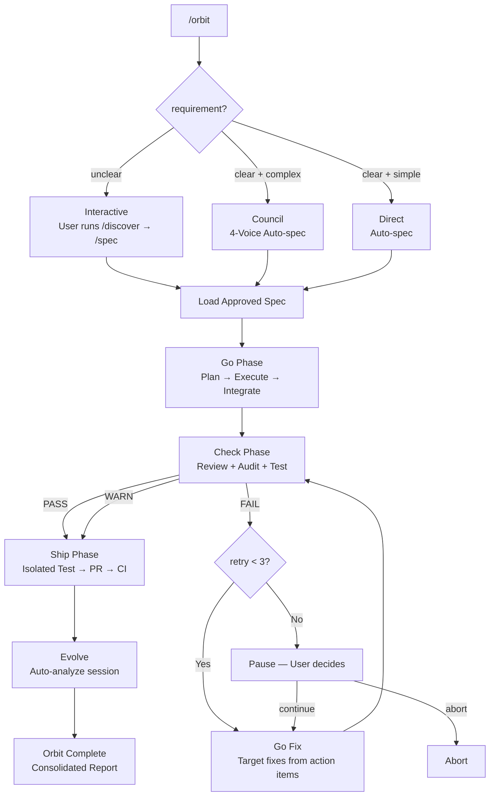

# epic-harness

3 commands + 19 auto-trigger skills + self-evolving agent harness.

## Structure

- `registry/` — Seeding resources (embedded in Rust binary at compile time)
  - `commands/` — 3 slash commands (orbit, evolve, team)
  - `skills/` — 19 auto skills (including spec, go, check, ship, discover, orchestrate) + _dispatch engine
  - `presets/` — Cold-start skill templates
- `hooks/` — Ring 0 automation + Ring 3 evolution loop
  - `hooks/bin/epic-harness` — Rust single binary
- `src/hooks/` — Rust source (common, guard, observe, polish, resume, snapshot, reflect)
- `docs/` — User-facing documentation and assets
  - `architecture.md`, `quickstart.md`, `demo/`, `references/`, `specs/`
- `integrations/` — Per-tool integration files (6 tools):
  - `codex/` — hooks.json, config.toml, prompts/(3), skills/(19)
  - `antigravity/` — gemini-extension.json, GEMINI.md, hooks/hooks.json, skills/(19), commands/(3)
  - `cursor/` — hooks.json, commands/(3), rules/
  - `opencode/` — commands/(3), plugins/epic-harness.js
  - `cline/` — hooks/(5 scripts), rules/epic-harness.md
  - `aider/` — .aider.conf.yml, .aider/CONVENTIONS.md

## Architecture: 4-Ring Model

- **Ring 0 (Autopilot)**: Hooks auto-maintain quality, restore sessions, learn
- **Ring 1 (Commands)**: 3 user-invoked commands (orbit, evolve, team)
- **Ring 2 (Auto Skills)**: Context-triggered skills fire automatically
- **Ring 3 (Evolve)**: Observe → Analyze → Evolve → Gate → Reload self-improvement loop

## /orbit — Autonomous Pipeline

Single-command spec-to-PR execution with two entry modes.



**State tracking**: `$HARNESS_DIR/orbit/PIPELINE-{timestamp}.json` — updated after every phase transition, survives context compaction.

**Human checkpoints**: mode selection (interactive only when unclear), 3 failed checks (pause).

**Evolve**: runs automatically after PR created + CI green. Skipped on abort.

## Eval System (Ring 3 Core)

Fuses A-Evolve benchmark patterns into Claude Code context.

### Multi-Dimensional Scoring
Every tool call scored on 3 axes:
- `tool_success` (0/1): Did the tool succeed?
- `output_quality` (0.0-1.0): Output quality (per-tool criteria)
- `execution_cost` (0.0-1.0): Efficiency
- **Composite**: `SCORE_WEIGHTS.success×tool_success + SCORE_WEIGHTS.quality×quality + SCORE_WEIGHTS.cost×cost` (default 0.5/0.3/0.2)

All weights configurable via `SCORE_WEIGHTS` in `common.rs`.

### Failure Classification (9 types)
type_error, syntax_error, test_fail, lint_fail, build_fail, permission_denied, timeout, not_found, runtime_error

### Pattern Detection (4 types)
All thresholds defined as constants in `common.rs` for per-project tuning.
Function-name-level context included (extracted from stack traces, error messages).
Error message hash-based dedup for improved precision (`hashString` + `normalizeError`).
- `repeated_same_error`: Consecutive same error + same error hash (`REPEATED_ERROR_MIN`, default 3)
- `fix_then_break`: Edit success → Bash error cycle (`FTB_LOOKAHEAD`=3, `FTB_MIN_CYCLES`=2)
- `long_debug_loop`: Same file in consecutive operations (`DEBUG_LOOP_MIN`, default 5)
- `thrashing`: Edit↔Error alternating (`THRASH_MIN_EDITS`=3, `THRASH_MIN_ERRORS`=3)

### Skill Seeding Thresholds
- Weak tool: success rate < `WEAK_TOOL_RATE`(0.6), min `WEAK_TOOL_MIN_OBS`(5) observations
- Weak file type: success rate < `WEAK_EXT_RATE`(0.5), min `WEAK_EXT_MIN_OBS`(3) observations
- High-frequency error: `HIGH_FREQ_ERROR_MIN`(5)+ occurrences

### Stagnation Gating
- `STAGNATION_LIMIT`(3) sessions without improvement → auto-rollback evolved skills to best checkpoint
- `IMPROVEMENT_THRESHOLD`: 5%
- Trend tracking: improving / stable / declining

### Evolved Skill Validation
Auto-validated by `gate_skills()` in reflect:
- Must have `---` frontmatter delimiter
- Body (after frontmatter) must be ≥ 20 characters
- SKILL.md file must exist in skill directory
- Invalid skills silently removed; skill count capped at `MAX_EVOLVED_SKILLS`(10)

### Evolved Skill Priority
Static skills (tdd, debug, secure, etc.) always take priority over evolved skills. Evolved skills supplement only.

### Skill Structure
All static skills include 4 core sections:
- **Process**: Step-by-step execution procedure
- **Anti-Rationalization**: Excuse | Rebuttal | What to do instead (table)
- **Evidence Required**: Checklist of proof needed for completion claims
- **Red Flags**: Anti-pattern warnings

## Concurrent Session Safety

Obs files use `session_{date}_{pid}_{random}.jsonl` format for per-session isolation.
Reflect merges all same-day session files for analysis.

## Cold-Start Presets

On first session with no evolved skills, stack-appropriate preset skills auto-apply for detected stacks (Node.js/Go/Python/Rust).

## Guard Rule Extension

Add custom block/warn rules via `.harness/guard-rules.yaml` in your project root:
```yaml
blocked:
  - pattern: kubectl\s+delete  | msg: kubectl delete blocked
warned:
  - pattern: docker\s+system\s+prune | msg: Docker prune — check first
```

## Cross-Project Learning

Opt-in by creating `~/.harness/projects/{slug}/.cross-project-enabled`.
On session end, patterns export to `~/.harness/global_patterns.jsonl`.
On next session start, weak patterns from other projects shown as hints.

## Skill Attribution

`metrics.json` tracks per-evolved-skill A/B scores:
- `avg_score_with`: Average score in sessions where skill was active
- `avg_score_without`: Average score in sessions where skill was absent
- Positive delta = effective, negative delta = consider removing

## Polish → Observe Feedback

Polish hook (format/typecheck) results auto-record into observe pipeline.
Format failure = lint_fail, typecheck failure = build_fail — feeds into pattern detection.

## Dispatch Logging

Skill dispatches logged to `~/.harness/projects/{slug}/dispatch/dispatch_YYYYMMDD.jsonl`.
Analyze via `/evolve history`.

## Unified Memory (harness-mem) — WIP

> **Status: In Development.** The memory system is under active development. CLI, MCP server, Web UI, and auto-recording pipeline are not yet fully functional. Do not rely on this feature in production.

All agents share a single knowledge graph stored in `~/.harness/memory.db` (SQLite + FTS5). Registered as MCP server `harness-mem` in Claude Code.

### Smart Recall System

Memory retrieval uses composite scoring instead of simple latest-N:
- **Scoring formula**: `recency(25%) + importance(35%) + access_freq(15%) + FTS_match(25%)`
- **Recency**: Exponential decay with 30-day half-life
- **Importance**: Type-based defaults — decision(0.9), resolution(0.8), concept(0.7), project(0.7), pattern(0.5), error(0.4), session(0.2)
- **Access frequency**: Saturates at 20 accesses (access_count / 20)
- **FTS match**: 1.0 bonus when hint keyword matches via FTS5

### MCP Tools (6)

| Tool | Purpose |
|------|---------|
| `mem_recall` | Smart contextual recall — hint + project + graph neighbors. Primary tool for proactive memory retrieval. |
| `mem_add` | Add node with auto-importance by type. Optional explicit importance (0.0–1.0). |
| `mem_search` | FTS5 keyword search, results ranked by importance. Configurable limit. |
| `mem_list` | Filter by tag/type/project. Returns importance + access_count. |
| `mem_context` | Project-scoped smart recall (no hint). Use at session start. |
| `mem_related` | BFS graph traversal from a node ID. |

### Memory Lifecycle

- **Access tracking**: Every recall/search/context call increments `access_count` and updates `accessed_at`.
- **Gradual decay**: Nodes untouched for 30+ days lose 10% importance per cycle (floor=0.05). `pinned` tag prevents decay.
- **Stale tagging**: Nodes untouched for 180+ days tagged as `stale` and excluded from recall.
- **Graph augmentation**: `mem_recall` follows 1-hop edges from top results, returning related nodes with connection counts.

### Node Schema

```
id, type, title, tags, projects, agents, created, updated, body,
importance (REAL 0.0-1.0), access_count (INTEGER), accessed_at (TEXT)
```

### Dispatch Integration

_dispatch skill calls `mem_recall` with current task context before invoking any skill. Past decisions (importance=0.9) surface first, preventing contradictory choices across sessions.

## Project Side Data

`~/.harness/projects/{slug}/` directory accumulates per-project memory, observations, evolved skills:
- `memory/` — Project patterns and rules
- `sessions/` — Session snapshots
- `obs/` — Tool usage observation logs (JSONL, 3-axis scores)
- `evolved/` — Auto-evolved skills (pattern/tool/filetype/error based)
- `evolved_backup/` — Best-state backup (for stagnation rollback)
- `team/` — /team outputs
- `dispatch/` — Skill dispatch logs (JSONL)
- `orbit/` — /orbit pipeline state files (PIPELINE-*.json)
- `metrics.json` — Aggregate stats (score_history, trend, stagnation_count, skill_attribution)
- `evolution.jsonl` — Evolution history (SessionAnalysis + patterns)
- `.cross-project-enabled` — Cross-project learning opt-in marker (optional)

`~/.harness/projects/{slug}/` auto-created on session start. Keep `.harness/guard-rules.yaml` in your project root to share safety rules with your team.

## Version Bump Checklist

When creating a new release tag, update ALL of the following to the same version:

| File | Field | Example |
|------|-------|---------|
| `Cargo.toml` | `version = "x.y.z"` | `0.3.3` |
| `package.json` | `"version": "x.y.z"` | `0.3.3` |
| `.claude-plugin/plugin.json` | `"version": "x.y.z"` | `0.3.3` |
| Git tag | `vx.y.z` | `v0.3.3` |

All four must match before tagging.
