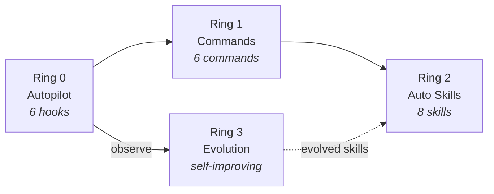
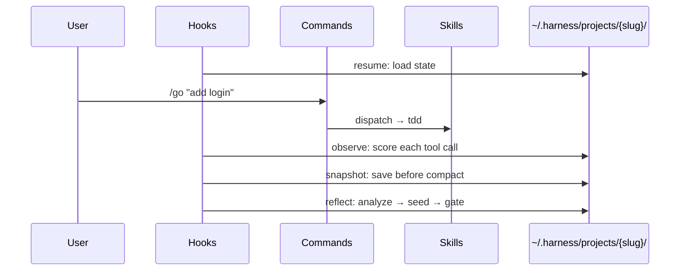

# Architecture

## Design Philosophy

epic-harness aims to be a harness that **gets better on its own**, not one that simply does more.

While other harnesses expand breadth with 20-37 commands, epic-harness takes a different approach: 6 commands + auto-triggered skills + self-evolution. **Minimize surface area, maximize depth.**

### Core Principles

1. **Minimal Surface Area**: 30+ commands compressed to 6. The rest are auto-triggered (Ring 2) or learned from observation (Ring 3).
2. **Observability**: Every tool call is quantitatively scored on 3 axes. Decisions are data-driven, not gut-driven.
3. **Safe Evolution**: Evolved skills must survive gating (validation + cap + stagnation rollback). Static skills always take priority.
4. **Zero Dependencies**: Only Node.js built-in modules. No install burden.

## 4-Ring Model



```
Ring 0 (Invisible)     resume · guard · polish · observe · snapshot · reflect
Ring 1 (User-Invoked)  /spec → /go → /check → /ship    /team  /evolve
Ring 2 (Auto-Trigger)  tdd · debug · secure · perf · simplify · document · verify · context
Ring 3 (Self-Evolve)   observe → analyze → detect patterns → seed skills → gate → reload
```

### Inter-Ring Relationships

| Relationship | Flow | Description |
|-------------|------|-------------|
| Ring 0 → Ring 3 | observe → reflect | Every tool call observation becomes evolution data |
| Ring 3 → Ring 2 | evolved → dispatch | Evolved skills join auto-skills in the next session |
| Ring 1 → Ring 2 | /go → tdd, verify | Skills auto-trigger during command execution |
| Ring 0 → Ring 1 | resume → /go | Session restore provides context for commands |

### Why 4 Rings?

**Fewer rings**: Automation and manual control get tangled — unpredictable behavior.
**More rings**: Inter-layer dependencies become complex — hard to debug.

4 is the **minimum number where concerns separate naturally**:
- What the user doesn't see (Ring 0)
- What the user invokes (Ring 1)
- What the context invokes (Ring 2)
- What the data creates (Ring 3)

## Data Flow



## Evolution Engine (Ring 3) — Design Decisions

### What We Adopted from A-Evolve

| A-Evolve Concept | epic-harness Equivalent | Adaptation |
|-----------------|------------------------|------------|
| Workspace Contract | `~/.harness/projects/{slug}/` directory | Filesystem as interface |
| BatchAnalysis | `analyzeSession()` | JSONL observations → statistical aggregation |
| FailurePatternDetector | `detectPatterns()` | O(n) single-pass, 4 pattern types |
| AdaptiveEvolveEngine | `checkStagnation()` | Stagnation detection → checkpoint rollback |
| Benchmark scoring | 3-axis scoring | tool_success / quality / cost |

### What We Intentionally Excluded

| A-Evolve Feature | Reason for Exclusion |
|-----------------|---------------------|
| ML-based mutation | Hooks must complete in <1s. Statistical heuristics are sufficient. |
| Git tag-based tracking | Avoids polluting user's git history. JSONL logs are used instead. |
| Multiple evolution algorithms | Single environment (Claude Code) doesn't need algorithm branching. |
| BYOA (Bring Your Own Agent) | Plugin operates in single-agent context. Multi-agent is handled by `/team`. |

### Why Heuristics Over ML

1. **Execution time constraint**: Hooks must complete in <1 second. ML inference cost is prohibitive.
2. **Observation data scale**: 10-100 observations per session. Statistical significance doesn't require ML.
3. **Interpretability**: Threshold-based rules are debuggable. "Why was this skill created?" can be answered instantly.
4. **Tuning ergonomics**: A single constant in `common.js` per threshold. More intuitive than ML hyperparameters.

## Skill System Design

### Dispatch Priority Resolution

```
1. User explicit instruction    → "skip tests" → tdd skipped
2. Static skills (8)            → tdd, debug, secure, perf, simplify, document, verify, context
3. Evolved skills               → evo-bash-discipline, evo-fix-type-error, ...
4. Default behavior             → no skill applied
```

When evolved skills conflict with static skills, **static skills always win**. This is intentional:
- Static skills are human-designed, vetted processes
- Evolved skills are auto-generated supplements from data
- Supplements must not replace primary treatment

### Skill Anatomy (4 Required Sections)

Every static skill includes these sections:

| Section | Purpose |
|---------|---------|
| **Process** | Step-by-step execution procedure |
| **Anti-Rationalization** | Excuse → Rebuttal → What to do instead (table) |
| **Evidence Required** | Checklist of proof needed to claim completion |
| **Red Flags** | Anti-pattern warnings |

Anti-Rationalization tables prevent agents from rationalizing shortcuts. Evidence Required sections enforce accountability — "I did it" without output is not proof.

### Function-Level Tracking

Observations include function names extracted from error context (stack traces, error messages) using lightweight regex patterns — no AST or LSP required. Pattern detection reports `involved_functions` alongside `involved_files` for more precise diagnostics.

## Evolved Skill Validation

Every evolved skill undergoes structural validation before surviving the gate:

| Check | Removes If |
|-------|-----------|
| YAML frontmatter parse | Missing or malformed `---` block |
| `name` field | Missing or < 2 characters |
| `description` field | Missing or < 10 characters |
| Body length | < 20 characters after frontmatter |
| Markdown heading | No `#` heading found |
| Actionable section | No `## Remediation`, `## Process`, or `## Red Flags` |

Invalid skills are automatically removed with a log message. This prevents malformed skills from breaking dispatch.

## Guard Rails — Safety Design

| Layer | Protects Against | Mechanism |
|-------|-----------------|-----------|
| guard hook | Dangerous commands (force-push, rm -rf, DROP) | PreToolUse block (exit 2) |
| Skill cap | Evolved skill overflow | MAX_EVOLVED_SKILLS = 10 |
| Stagnation rollback | Bad evolution | 3 sessions without improvement → restore best checkpoint |
| Skill validation | Malformed skills | Frontmatter parsing + required section check |
| Static priority | Evolved skill overreach | Dispatch enforces static > evolved |

## Trade-offs

### What We Chose vs. What We Gave Up

| Chose | Gave Up | Reason |
|-------|---------|--------|
| 6 commands | 23+ commands (gstack) | Minimize surface area. The rest is automated. |
| 7 tools (Claude Code + 6) | Universal cross-harness support | Deep hook integration required for full Ring 0 on each tool. |
| JS single runtime | Python/Bun multi-runtime | Zero dependencies + simple install. |
| File+function tracking | Symbol-level tracking (Serena) | No LSP dependency. Function names via grep-level regex. |
| Heuristic evolution | ML-based evolution (A-Evolve) | Hook execution time constraint + interpretability. |

### Known Limitations

1. **Evolved skill quality**: Auto-generated markdown quality scales with failure data volume. Early sessions may produce superficial skills.
2. **Pattern detection precision**: Matches on same error category + same file. Subtle variations (different line, different root cause) are not distinguishable.
3. **Metrics horizon**: Only the last 50 sessions are retained. Long-term trends require direct analysis of `evolution.jsonl`.
4. **Single agent**: The evolution loop assumes a single Claude Code session. Concurrent multi-agent execution may cause observation conflicts.

## File Map

```
epic-harness/
├── commands/          # Ring 1: 6 slash commands
│   ├── spec.md
│   ├── go.md
│   ├── check.md
│   ├── ship.md
│   ├── team.md
│   └── evolve.md
├── skills/            # Ring 2: 8 auto skills + dispatch
│   ├── _dispatch/SKILL.md    ← central dispatcher
│   ├── tdd/SKILL.md
│   ├── debug/SKILL.md
│   ├── secure/SKILL.md
│   ├── perf/SKILL.md
│   ├── simplify/SKILL.md
│   ├── document/SKILL.md
│   ├── verify/SKILL.md
│   └── context/SKILL.md
├── agents/            # Internal agents (used by /go, /check)
│   ├── builder.md
│   ├── reviewer.md
│   ├── auditor.md
│   └── planner.md
├── hooks/             # Ring 0 + Ring 3
│   ├── hooks.json     ← hook registration (Claude Code)
│   ├── bin/
│   │   └── epic-harness  ← Rust binary (primary, ~4x faster)
│   └── scripts/
│       ├── common.js  ← shared utils + constants + validation
│       ├── resume.js
│       ├── guard.js
│       ├── polish.js
│       ├── observe.js ← 3-axis scoring + function extraction
│       ├── snapshot.js
│       └── reflect.js ← evolution engine (6 phases)
├── integrations/      # Per-tool integration files
│   ├── codex/         # hooks.json, config.toml, prompts/(6), skills/(7), agents/(4)
│   ├── gemini/        # settings.json, GEMINI.md, commands/(6), skills/(7), agents/(4)
│   ├── cursor/        # hooks.json, commands/(6), agents/(4)
│   ├── opencode/      # commands/(6), agents/(4), plugins/epic-harness.js
│   ├── cline/         # hooks/(5 scripts), rules/epic-harness.md
│   └── aider/         # .aider.conf.yml, .aider/CONVENTIONS.md
├── references/        # Checklists
│   ├── security.md
│   ├── performance.md
│   ├── testing.md
│   └── team-patterns.md
├── tests/             # Node.js built-in test runner
└── CLAUDE.md          # Project context
```
