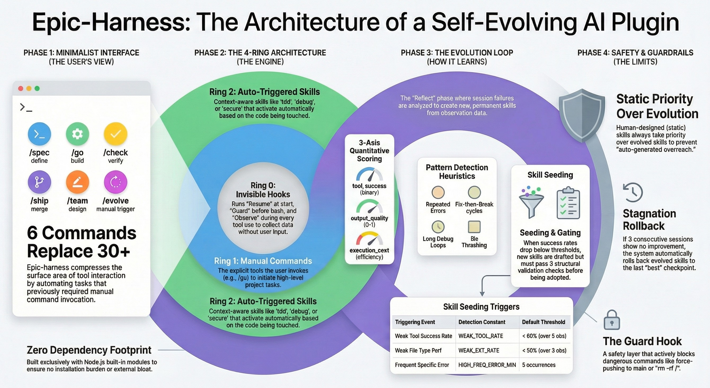
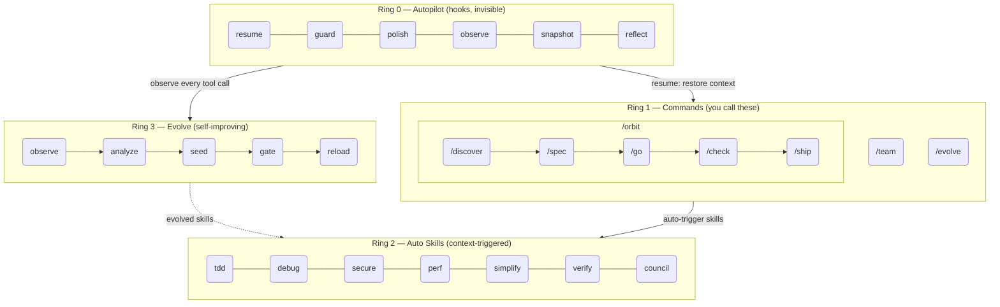
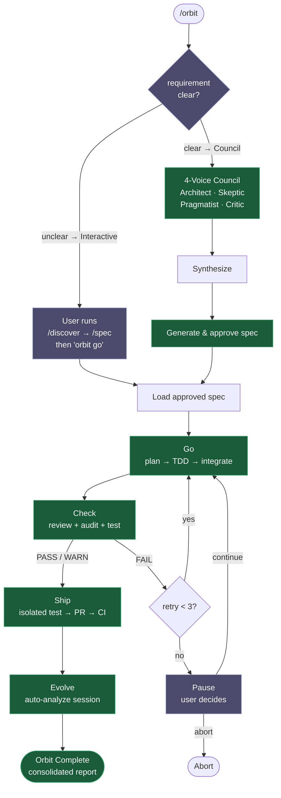
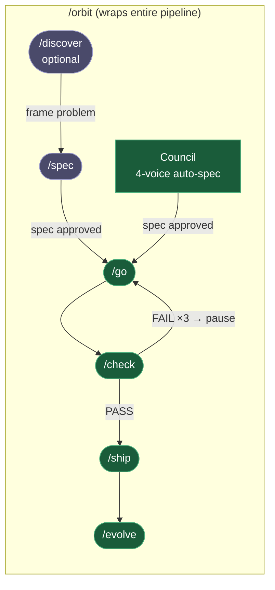

# epic harness

> A self-evolving AI coding agent harness — 8 commands, 1 autonomous pipeline, auto-trigger skills, learns from your failures.

**8 commands. Auto-trigger skills. Self-evolving.**

<p align="center">
<a href="README.md">English</a> | <a href="i18n/ja/README.md">日本語</a> | <a href="i18n/ko/README.md">한국어</a> | <a href="i18n/de/README.md">Deutsch</a> | <a href="i18n/fr/README.md">Français</a> | <a href="i18n/zh-CN/README.md">简体中文</a> | <a href="i18n/zh-TW/README.md">繁體中文</a> | <a href="i18n/pt-BR/README.md">Português</a> | <a href="i18n/es/README.md">Español</a> | <a href="i18n/hi/README.md">हिन्दी</a>
</p>

<p align="center">
  <a href="LICENSE"></a>
  
  
  
  <a href="https://buymeacoffee.com/epicsaga"></a>
</p>

A Claude Code plugin that **replaces 30+ commands with 8**, **auto-triggers skills** based on what you're doing, and **evolves new skills** from your own failure patterns. Less surface area to memorize. More intelligence per keystroke.

<p align="center">
  
</p>

## Install

> **First time?** Read the [Quick Start Guide (5 min)](QUICKSTART.md).

```bash
# Claude Code
/plugin marketplace add epicsagas/plugins && /plugin install epic@epicsagas

# Any other tool
cargo install epic-harness && epic install
```

| Environment | Method |
|-------------|--------|
| **Claude Code** | Plugin marketplace (above) |
| **macOS** | `brew install epicsagas/tap/epic-harness` |
| **Any (with Rust)** | `cargo install epic-harness` |
| **From source** | `git clone` + `cargo install --path .` |

Prerequisites: **Git**. Source/binary installs also need the [Rust toolchain](https://rustup.rs).

### `epic install` — setup wizard

After installing the binary, run `epic install` (or `epic install claude`) to:

1. Create `~/.harness/` directory structure
2. Sync commands, skills, and agents to the tool's config directory
3. Register the MCP server (harness-mem) for Claude Code
4. Create `~/.harness/config.toml` with defaults if absent

On Claude Code, `hooks/setup.sh` auto-runs on session start and installs the binary if missing. No manual step needed after the initial clone.

### Other tools

```bash
epic install codex        # Codex CLI   → ~/.codex/ + ~/.agents/skills/
epic install gemini       # Gemini CLI  → ~/.gemini/
epic install cursor       # Cursor      → ~/.cursor/ (requires Cursor 1.7+)
epic install opencode     # OpenCode    → ~/.config/opencode/
epic install cline        # Cline       → ~/Documents/Cline/Rules/
epic install aider        # Aider       → ~/.aider.conf.yml + ~/.aider/
epic install              # Interactive menu
```

Integration files are **synced** from the binary: missing or outdated files are written. `GEMINI.md` and `AGENTS.md` are only created when absent.

### Verify

```bash
epic --version              # Binary installed
ls ~/.harness/              # Data directory exists
```

Inside a Claude Code session: `/evolve status`

### Quick Demo

**One command, full pipeline:**
```bash
$ /orbit
# Choose mode:
#   1. Interactive  — you run /discover + /spec, then "orbit go"
#   2. Council      — 4-voice council generates spec, you approve
→ spec approved → go (TDD) → check (PASS) → ship (PR + CI) → evolve
```

**Or step through manually:**
```bash
$ /spec "Add JWT auth to the login API"
  → Clarifies requirements → produces SPEC-*.md

$ /go
  → Auto-plans → TDD subagents → DONE (4 min)

$ /check
  → Parallel code review + security audit + tests → PASS

$ /ship
  → Creates PR → CI green → merged
```

## Architecture: 4-Ring Model



## /orbit — Autonomous Pipeline

`/orbit` wraps the entire manual pipeline into a single autonomous execution.



**Purple nodes** — human steps: mode selection (unclear → interactive discover), 3× check failure pause.
**Green nodes** — council auto-spec runs fully autonomous; interactive mode hands off after spec approval.

State persisted in `$HARNESS_DIR/orbit/PIPELINE-{timestamp}.json` — survives context compaction.

## Commands

| Command | What it does |
|---------|-------------|
| `/discover` | Explore and define the problem before specifying a solution — 5 Whys, JTBD, Socratic questioning |
| `/spec` | Define what to build — clarify requirements, produce a spec |
| `/go` | Build it — auto-plan, TDD subagents, 4-state result model (DONE/CONCERNS/NEEDS_CONTEXT/BLOCKED), parallel execution with worktree isolation |
| `/check` | Verify — adaptive expert dispatch (scope-based), parallel code review + security audit + performance |
| `/ship` | Ship — isolated pre-flight test, then PR, CI, merge |
| `/team` | Create and sync org-level agent teams across projects |
| `/evolve` | Manual evolution trigger / status / rollback |
| `/orbit` | **Autonomous pipeline** — runs spec → go → check → ship in one shot. Choose interactive or council mode. |

### Pipeline Overview



**Purple** — manual entry: `/discover` (optional) → `/spec`. **Green** — council auto-spec or autonomous execution after approval: go → check → ship → evolve.

- **Before `/spec`**: if the problem is vague, use `/discover` to frame it first.
- **After `/spec`**: if 3+ requirements and no team linked, `/spec` suggests `/team` before `/go`.
- **`/orbit`**: wraps the full pipeline. Choose **interactive** (you run `/discover` → `/spec`, then "orbit go") or **council** (4-voice council auto-generates spec, you only approve).

## Auto Skills (Ring 2)

Skills trigger automatically. You don't invoke them.

| Skill | Triggers when |
|-------|--------------|
| **tdd** | New feature implementation |
| **debug** | Test failure or error |
| **discover** | Vague request, solution without problem, or unfocused complaint |
| **secure** | Auth/DB/API/secrets code touched |
| **perf** | Loops, queries, rendering code |
| **simplify** | File > 200 lines or high complexity |
| **document** | Public API added or changed |
| **verify** | Before completing /go or /ship |
| **context** | Context window > 70% used |
| **council** | Ambiguous architectural or design decisions |
| **agent-introspection** | Agent self-debugging after repeated failures |

## Hooks (Ring 0)

Run invisibly. Single Rust binary (`epic-harness`) with subcommands.

| Hook | When | Does |
|------|------|------|
| **resume** | Session start | Restore context, load memory, detect stack |
| **guard** | Before Bash | Block force-push-to-main, rm -rf /, DROP prod |
| **polish** | After Edit | Auto-format (Biome/Prettier/ruff/gofmt) + typecheck |
| **observe** | Every tool use | Log to `~/.harness/projects/{slug}/obs/` for evolution + GateGuard hints |
| **snapshot** | Before compact | Save state to `~/.harness/projects/{slug}/sessions/` |
| **reflect** | Session end | Analyze failures, seed evolved skills, gate, extract instincts |

Polish feeds back into observe: format failure → `lint_fail`, TypeScript error → `build_fail`. Edit→Error thrashing gets detected even when errors come from polish.

Each session writes its own `session_{date}_{pid}_{random}.jsonl` — multiple sessions on the same project won't corrupt each other's data.

### Hook Profiles

Via `~/.harness/config.toml` or `EPIC_HOOK_PROFILE` env var:

| Profile | Active hooks |
|---------|-------------|
| `minimal` | guard, observe, resume |
| `standard` (default) | above + polish, reflect, snapshot |
| `strict` | all hooks + future strict-only checks |

### Custom Guard Rules

Add project-specific rules via `.harness/guard-rules.yaml` in your project root:

```yaml
blocked:
  - pattern: kubectl\s+delete\s+namespace | msg: Namespace deletion blocked
warned:
  - pattern: docker\s+system\s+prune | msg: Docker prune — verify first
```

## Team (`epic team`)

Teams are **org-level**, not project-bound. Running `/team` in any project enriches a shared pool of agent definitions — never silently overwrites.

```bash
epic team                              # Interactive: scan → design → write → sync
epic team sync backend                 # Dispatch agents → .claude/agents/backend/
epic team link backend                 # Dispatch + register project in team config
epic team list                         # All teams in current org
epic team list --org netflix           # Teams in a named org
epic team show backend --playbook      # Config + full playbook
epic team delete backend               # Recall from current project only
epic team delete backend --global      # Permanently delete from org store
```

After syncing, agents are available in the next session: `@domain-expert`, `@reviewer`, `@tester`, etc.

| Type | Keyword | Default agents |
|------|---------|---------------|
| Stream-aligned | `stream` | domain-expert, reviewer, tester |
| Platform | `platform` | api-designer, infra-specialist, dx-agent |
| Enabling | `enabling` | specialist |
| Complicated Subsystem | `subsystem` | domain-specialist, integration-tester |

Multi-org: `epic team --org netflix` — separate topology per org.

Merge strategy: changed agents prompt (default: keep existing, backup to `.history/`). Playbook always appends.

## Multi-Tool Support

All tools share the same `~/.harness/projects/{slug}/` data directory.

| Tool | Ring 0 Hooks | Commands | Skills | Agents |
|------|-------------|----------|--------|--------|
| **Claude Code** | ✓ Full | ✓ 8 commands (incl. /orbit) | ✓ 11 skills | ✓ 4 |
| **Codex CLI** | ✓ Full¹ | ✓ 8 prompts (incl. /orbit) | ✓ 7 | ✓ 4 |
| **Gemini CLI** | ✓ Partial² | ✓ 8 commands (incl. /orbit) | ✓ 7 | ✓ 4 |
| **Cursor** | ✓ Full³ | ✓ 8 commands (incl. /orbit) | ✓ via rules | ✓ 4 |
| **OpenCode** | ✓ Partial⁴ | ✓ 8 commands (incl. /orbit) | — | ✓ 4 |
| **Cline** | ✓ Full⁵ | — | — | — |
| **Aider** | —⁶ | — | — | — |

¹ `codex_hooks = true` in `~/.codex/config.toml` · ² Guard at `BeforeModel` level · ³ Cursor 1.7+ · ⁴ JS plugin · ⁵ 5 hook scripts · ⁶ Conventions only

## Unified Memory — WIP

> **Status: In Development.** Not yet fully functional. CLI commands, MCP tools, and Web UI are works in progress.

All agents share a knowledge graph in `~/.harness/memory.db` (SQLite with full-text search). No external runtime.

```
score = recency(25%) + importance(35%) + access_frequency(15%) + FTS_match(25%)
```

### CLI

```bash
epic mem recall "auth refactor" --project my-project   # Smart recall
epic mem add --title "JWT rotation" --type decision    # Add node
epic mem search "JWT"                                  # FTS5 search
epic mem query --type decision --project my-project    # Filter
epic mem context --project my-project                  # Project context
epic mem serve                                         # Web UI → :7700
epic mem mcp-install                                   # Register MCP server
epic mem export --out ./docs/memory                    # Export to Markdown
```

### MCP Tools (6)

| Tool | Purpose |
|------|---------|
| `mem_recall` | Smart contextual recall with hint + project + graph neighbors |
| `mem_add` | Add node with auto-importance by type (or explicit 0.0–1.0) |
| `mem_search` | Keyword search (full-text), ranked by importance |
| `mem_query` | Filter by tag/type/project |
| `mem_context` | Project-scoped smart recall (no hint) |
| `mem_related` | Graph traversal from a node ID (finds connected knowledge) |

### Node Types

| Type | Created by | Importance |
|------|-----------|------------|
| `decision` | Manual / MCP | 0.9 |
| `resolution` | Manual / MCP | 0.8 |
| `concept` | Manual / MCP | 0.7 |
| `project` | Manual / MCP | 0.7 |
| `instinct` | Auto (reflect) | 0.7 |
| `pattern` | Auto (reflect) | 0.5 |
| `error` | Auto (reflect) | 0.4 |
| `session` | Auto (reflect) | 0.2 |

Lifecycle: 30+ days without access → 10% importance decay (floor 0.05). 180+ days → tagged `stale`, excluded from recall. `pinned` tag prevents decay.

## Evolve (Ring 3)

Fuses [A-Evolve](https://github.com/A-EVO-Lab/a-evolve) automated evolution patterns into Claude Code's hook system.

### Scoring

Every tool call scored on 3 axes (weights configurable via `~/.harness/config.toml`):

```
composite = 0.5 × tool_success + 0.3 × output_quality + 0.2 × execution_cost
```

Failure classification (9 types): `type_error` · `syntax_error` · `test_fail` · `lint_fail` · `build_fail` · `permission_denied` · `timeout` · `not_found` · `runtime_error`

### Pattern Detection

| Pattern | Detects | Default threshold |
|---------|---------|-------------------|
| `repeated_same_error` | Same error N+ times | 3 |
| `fix_then_break` | Edit success → build/test fails | 3 lookback, 2 cycles |
| `long_debug_loop` | Stuck on same file | 5 operations |
| `thrashing` | Edit↔Error alternating | 3 edits, 3 errors |

### Evolution Flow

```
Observe (PostToolUse — 3-axis scoring)
    ↓ obs/session_{id}.jsonl
Analyze (SessionEnd)
    ↓ per-tool, per-ext scores + patterns
Propose (Solver — graduated by score: ≥0.90 skip, ≥0.70 moderate, <0.70 full)
    ↓ SkillProposal[] with confidence
Curate (Accept/Merge/Skip, feedback masked from solver)
    ↓ evolved/{skill}/SKILL.md + meta.json
Gate (format check, dedup, cap 10, gated promotion ≥ 3 sessions)
    ↓ evolved_backup/ (best checkpoint)
Instinct (high-success patterns → cross-project memory.db nodes)
    ↓
Reload (next session — resume loads evolved skills)
```

Skill seeding: weak tool (success <60%, min 5 obs), weak file type (success <50%, min 3 obs), high-frequency error (5+ occurrences).

Stagnation: 3 sessions without 5% improvement → auto-rollback to best checkpoint.

```bash
/evolve              # Run now
/evolve status       # Dashboard: scores, trends, patterns, skills
/evolve history      # Full history + skill effectiveness
/evolve cross-project # Cross-project pattern analysis
/evolve rollback     # Restore previous best
/evolve reset        # Clear all evolution data
```

### Skill Effectiveness

Every evolved skill tracked with A/B attribution:

```
/evolve history → Skill Effectiveness

| Skill              | With | Without | Delta |
|--------------------|------|---------|-------|
| evo-ts-care        | 0.87 | 0.72    | +15%  |
| evo-bash-discipline| 0.65 | 0.68    | -3%   |
```

Positive delta = effective. Negative = consider removing via `/evolve rollback`.

### Cold-Start Presets

On first session, stack-appropriate preset skills auto-apply:

| Stack | Presets |
|-------|---------|
| Node.js/TypeScript | `evo-ts-care`, `evo-fix-build-fail` |
| Go | `evo-go-care` |
| Python | `evo-py-care` |
| Rust | `evo-rs-care` |

### Instinct Learning

High-success patterns extracted and promoted across projects:

```
observe (100% confirmed) → extract_instincts() → instinct node (confidence ≥ 0.8)
    → promote to global when observed in ≥ 2 projects
```

## Cross-Project Learning

Opt-in to share failure patterns across projects:

```bash
touch ~/.harness/projects/{slug}/.cross-project-enabled
```

Session end → exports anonymized patterns to `~/.harness/global_patterns.jsonl`. Session start → shows hints from other projects' weak areas.

## Project Data

All data lives in `~/.harness/` (home directory), not in your project root. Survives project deletion, doesn't pollute git history.

```
~/.harness/
├── memory.db                  # SQLite knowledge graph (nodes + edges + FTS5)
├── graph.json                 # Cached graph (for web UI)
├── config.toml                # User configuration
├── global_patterns.jsonl      # Cross-project patterns (opt-in)
├── orgs/                      # Team global store
│   └── {org}/teams/{team}/
│       ├── config.json, mission.md, playbook.md, agents/, .history/
└── projects/{slug}/
    ├── memory/                # Project patterns and rules
    ├── sessions/              # Session snapshots (for resume)
    ├── obs/                   # Tool usage observation logs (JSONL)
    ├── evolved/               # Auto-evolved skills
    │   ├── manifest.json
    │   └── {skill}/SKILL.md + meta.json
    ├── evolved_backup/        # Best checkpoint (for rollback)
    ├── dispatch/              # Skill dispatch logs
    ├── evolution.jsonl        # Full evolution history
    └── metrics.json           # Aggregate stats + skill attribution
```

Share safety rules with your team: `.harness/guard-rules.yaml` in the project root (committed to git).

## Configuration

All tunable parameters in `~/.harness/config.toml`. Absent = hardcoded defaults.

```toml
# Priority: env var (EPIC_HOOK_PROFILE) > this file > defaults

[hook]
profile = "standard"         # "minimal" | "standard" | "strict"
gateguard_hints = true

[scoring]
weights = [0.5, 0.3, 0.2]   # [success, quality, cost]

[evolution]
max_skills = 10
stagnation_limit = 3
improvement_threshold = 0.05
gated_promotion_min = 3

[pattern]
# repeated_error_min = 3
# debug_loop_min = 5
# graduated_scope_skip = 0.90
# graduated_scope_moderate = 0.70

[instinct]
# confidence_threshold = 0.8
# promotion_min_projects = 2
# max_instincts = 20
# min_observations = 10
# min_avg_score = 0.5
```

## Development

```bash
cargo install --path .                                        # Build + install
cp ~/.cargo/bin/epic-harness hooks/bin/epic-harness           # Update plugin binary
cargo test                                                    # Tests
```

Hooks look for the binary in two places: `hooks/bin/epic-harness` (plugin local) → `~/.cargo/bin/epic-harness` (PATH).

## Links

- [Changelog](CHANGELOG.md) — release history
- [Contributing](CONTRIBUTING.md) — how to contribute
- [Security](SECURITY.md) — reporting vulnerabilities
- [Issues](https://github.com/epicsagas/epic-harness/issues) — bug reports and feature requests

## Acknowledgments

- [a-evolve](https://github.com/A-EVO-Lab/a-evolve) — Automated evolution and benchmark patterns
- [agent-skills](https://github.com/addyosmani/agent-skills) — Claude Code agent skill system
- [everything-claude-code](https://github.com/affaan-m/everything-claude-code) — Comprehensive Claude Code patterns
- [gstack](https://github.com/garrytan/gstack) — Plugin architecture reference
- [harness](https://github.com/revfactory/harness) — Hook and harness infrastructure patterns
- [serena](https://github.com/oraios/serena) — Autonomous agent design
- [SuperClaude Framework](https://github.com/SuperClaude-Org/SuperClaude_Framework) — Multi-command framework architecture
- [superpowers](https://github.com/obra/superpowers) — Claude Code extension patterns

## License

[Apache 2.0](LICENSE)
