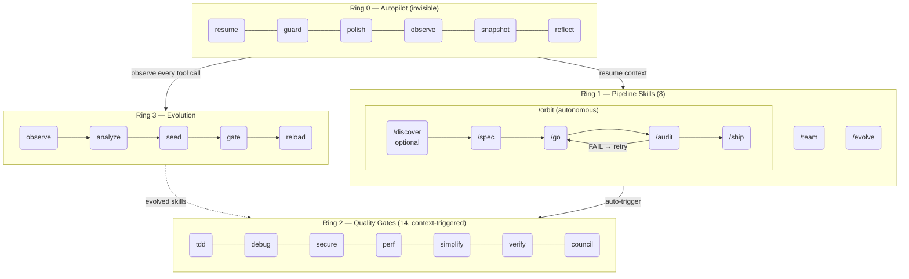
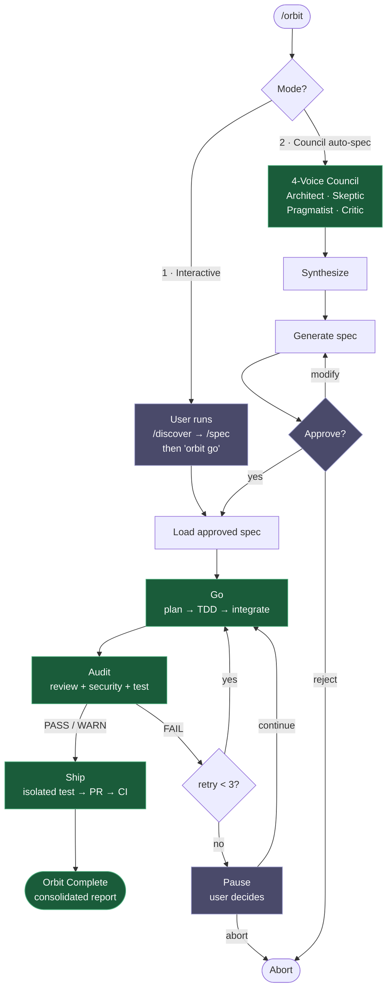
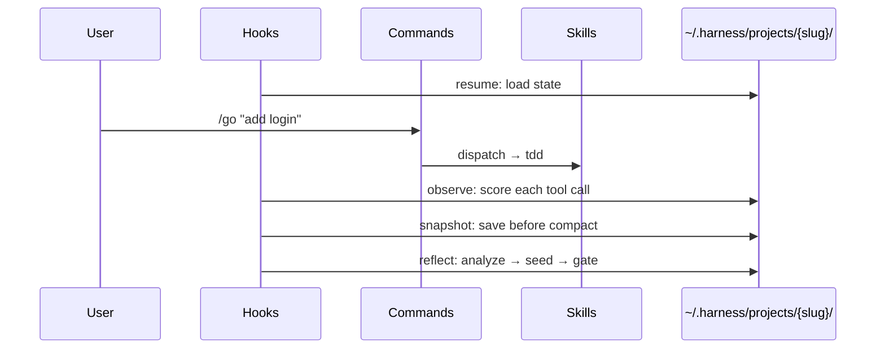

# Architecture

## Design Philosophy

epic-harness aims to be a harness that **gets better on its own**, not one that simply does more.

While other harnesses expand breadth with 20-37 commands, epic-harness takes a different approach: 7 commands + auto-triggered skills + self-evolution. **Minimize surface area, maximize depth.**

### Core Principles

1. **Minimal Surface Area**: 30+ commands compressed to 8. The rest are auto-triggered (Ring 2) or learned from observation (Ring 3).
2. **Observability**: Every tool call is quantitatively scored on 3 axes. Decisions are data-driven, not gut-driven.
3. **Safe Evolution**: Evolved skills must survive gating (validation + cap + stagnation rollback). Static skills always take priority.
4. **Zero Runtime Burden**: Single Rust binary + JS bootstrap (Node built-ins only). No install deps.

## 4-Ring Model



```
Ring 0 (Invisible)     resume · guard · polish · observe · snapshot · reflect
Ring 1 (Pipeline)      /discover → /spec → /go → /audit → /ship  ← wrapped by /orbit
                       /team  /evolve
Ring 2 (Quality Gates) tdd · debug · secure · perf · simplify · document · verify · context · council · agent-introspection
Ring 3 (Self-Evolve)   observe → analyze → detect patterns → seed skills → gate → reload
```

### Inter-Ring Relationships

| Relationship | Flow | Description |
|-------------|------|-------------|
| Ring 0 → Ring 3 | observe → reflect | Every tool call observation becomes evolution data |
| Ring 3 → Ring 2 | evolved → dispatch | Evolved skills join auto-skills in the next session |
| Ring 1 → Ring 2 | /go → tdd, verify | Skills auto-trigger during pipeline execution |
| Ring 0 → Ring 1 | resume → /go | Session restore provides context for pipelines |

### Ring 1: /orbit — Autonomous Pipeline

`/orbit` wraps spec→go→audit→ship into a single autonomous execution. It orchestrates existing skills.



Human checkpoints (purple): mode selection, spec approval, 3× audit failure pause.
Autonomous phases (green): go, audit, ship — run without user intervention.

State tracked in `$HARNESS_DIR/orbit/PIPELINE-{timestamp}.json`.

### Ring 1: Isolation Strategy

Commands use **conditional worktree isolation** to prevent conflicts:

- **`/go`**: Detects file-level conflicts in parallel tasks. Uses `isolation: "worktree"` (Claude Code Agent tool) when tasks modify overlapping files. Otherwise executes in main working tree.
- **`/ship`**: Launches isolated pre-flight test in a clean worktree before creating PR. Simulates CI conditions locally to catch build/test failures before remote execution.
- **`/audit`**: No isolation needed — read-only analysis with no code modification.

### Why 4 Rings?

**Fewer rings**: Automation and manual control get tangled — unpredictable behavior.
**More rings**: Inter-layer dependencies become complex — hard to debug.

4 is the **minimum number where concerns separate naturally**:
- What the user doesn't see (Ring 0)
- What the user invokes (Ring 1)
- What the context invokes (Ring 2)
- What the data creates (Ring 3)

## Data Flow



## Evolution Engine (Ring 3) — Design Decisions

### What We Adopted from A-Evolve

| A-Evolve Concept | epic-harness Equivalent | Adaptation |
|-----------------|------------------------|------------|
| Workspace Contract | `~/.harness/projects/{slug}/` directory | Filesystem as interface |
| BatchAnalysis | `analyzeSession()` | JSONL observations → statistical aggregation |
| FailurePatternDetector | `detectPatterns()` | O(n) single-pass, 4 pattern types |
| AdaptiveEvolveEngine | `checkStagnation()` | Stagnation detection → checkpoint rollback |
| Benchmark scoring | 3-axis scoring | tool_success / quality / cost |

### What We Intentionally Excluded

| A-Evolve Feature | Reason for Exclusion |
|-----------------|---------------------|
| ML-based mutation | Hooks must complete in <1s. Statistical heuristics are sufficient. |
| Git tag-based tracking | Avoids polluting user's git history. JSONL logs are used instead. |
| Multiple evolution algorithms | Single environment (Claude Code) doesn't need algorithm branching. |
| BYOA (Bring Your Own Agent) | Plugin operates in single-agent context. Multi-agent is handled by `/team`. |

### Why Heuristics Over ML

1. **Execution time constraint**: Hooks must complete in <1 second. ML inference cost is prohibitive.
2. **Observation data scale**: 10-100 observations per session. Statistical significance doesn't require ML.
3. **Interpretability**: Threshold-based rules are debuggable. "Why was this skill created?" can be answered instantly.
4. **Tuning ergonomics**: A single constant in `common.rs` per threshold. More intuitive than ML hyperparameters.

## Skill System Design

### Dispatch Priority Resolution

```
1. User explicit instruction    → "skip tests" → tdd skipped
2. Static skills (11)           → tdd, debug, discover, secure, perf, simplify, document, verify, context, council, agent-introspection
3. Evolved skills               → evo-bash-discipline, evo-fix-type-error, ...
4. Default behavior             → no skill applied
```

When evolved skills conflict with static skills, **static skills always win**. This is intentional:
- Static skills are human-designed, vetted processes
- Evolved skills are auto-generated supplements from data
- Supplements must not replace primary treatment

### Skill Anatomy (4 Required Sections)

Every static skill includes these sections:

| Section | Purpose |
|---------|---------|
| **Process** | Step-by-step execution procedure |
| **Anti-Rationalization** | Excuse → Rebuttal → What to do instead (table) |
| **Evidence Required** | Checklist of proof needed to claim completion |
| **Red Flags** | Anti-pattern warnings |

Anti-Rationalization tables prevent agents from rationalizing shortcuts. Evidence Required sections enforce accountability — "I did it" without output is not proof.

### Function-Level Tracking

Observations include function names extracted from error context (stack traces, error messages) using lightweight regex patterns — no AST or LSP required. Pattern detection reports `involved_functions` alongside `involved_files` for more precise diagnostics.

## Evolved Skill Validation

Every evolved skill undergoes structural validation before surviving the gate:

| Check | Removes If |
|-------|-----------|
| YAML frontmatter parse | Missing or malformed `---` block |
| `name` field | Missing or < 2 characters |
| `description` field | Missing or < 10 characters |
| Body length | < 20 characters after frontmatter |
| Markdown heading | No `#` heading found |
| Actionable section | No `## Remediation`, `## Process`, or `## Red Flags` |

Invalid skills are automatically removed with a log message. This prevents malformed skills from breaking dispatch.

## Guard Rails — Safety Design

| Layer | Protects Against | Mechanism |
|-------|-----------------|-----------|
| guard hook | Dangerous commands (force-push, rm -rf, DROP) | PreToolUse block (exit 2) |
| Skill cap | Evolved skill overflow | MAX_EVOLVED_SKILLS = 10 |
| Stagnation rollback | Bad evolution | 3 sessions without improvement → restore best checkpoint |
| Skill validation | Malformed skills | Frontmatter parsing + required section check |
| Static priority | Evolved skill overreach | Dispatch enforces static > evolved |

## Trade-offs

### What We Chose vs. What We Gave Up

| Chose | Gave Up | Reason |
|-------|---------|--------|
| 6 commands | 23+ commands (gstack) | Minimize surface area. The rest is automated. |
| 7 tools (Claude Code + 6) | Universal cross-harness support | Deep hook integration required for full Ring 0 on each tool. |
| Rust single binary (JS bootstrap only) | Python/Bun multi-runtime | One static binary; no runtime install burden. |
| File+function tracking | Symbol-level tracking (Serena) | No LSP dependency. Function names via grep-level regex. |
| Heuristic evolution | ML-based evolution (A-Evolve) | Hook execution time constraint + interpretability. |

### Known Limitations

1. **Evolved skill quality**: Auto-generated markdown quality scales with failure data volume. Early sessions may produce superficial skills.
2. **Pattern detection precision**: Matches on same error category + same file. Subtle variations (different line, different root cause) are not distinguishable.
3. **Metrics horizon**: Only the last 50 sessions are retained. Long-term trends require direct analysis of `evolution.jsonl`.
4. **Single agent**: The evolution loop assumes a single agent session (host-agnostic — claude/codex/agy). Concurrent multi-agent execution may cause observation conflicts. Skill synthesis is decoupled from the session via the pending-manifest protocol, so it survives across sessions and hosts.

## Unified Memory Layer — WIP

> **Status: In Development.** This section describes the target architecture. Implementation is ongoing in `src/hooks/mem/`. CLI, Web UI, and auto-recording are not yet production-ready.

A cross-agent knowledge graph that persists developer decisions, patterns, and context across all supported coding tools.

### Storage Layout

```
~/.harness/
├── memory.db      # SQLite database (WAL mode, FTS5 full-text search)
├── graph.json     # Cached serialized graph (rebuilt for web UI)
└── exports/       # Optional Markdown dump for Git backup (mem export)
```

**Schema:**
- `nodes` — id, type, title, tags, projects, agents, created, updated, body
- `nodes_fts` — FTS5 virtual table (title + body + tags), auto-synced via triggers
- `edges` — id, source, target, relation, weight, ts

Legacy file-based stores (`memory/nodes/*.md`, `memory/edges.jsonl`) are automatically migrated to SQLite on first run and a `memory/.migrated` marker is written to prevent re-migration.

### Node Schema

```yaml
id: <uuid-v4>
title: "JWT rotation strategy"
type: decision          # concept | pattern | project | decision | error
tags: [auth, security]
projects: [my-project]  # optional project scope
created: 2026-04-12T00:00:00Z
updated: 2026-04-12T00:00:00Z
---
Body text in Markdown ...
```

### Edge Relations

Directed edges stored in the `edges` table. Valid relation types:

| Relation | Meaning |
|----------|---------|
| `uses` | Node A depends on or applies Node B |
| `extends` | Node A is a specialization of Node B |
| `conflicts` | Node A and Node B represent conflicting approaches |
| `replaces` | Node A supersedes Node B |
| `related` | Loose association (bidirectional by convention) |
| `caused_by` | Error node A was caused by Node B |

### Access Patterns

| Interface | Description |
|-----------|-------------|
| CLI (`harness mem`) | 15 subcommands: `add`, `edit`, `delete`, `list`, `search`, `related`, `link`, `graph`, `export`, `serve`, `validate`, `migrate`, `context`, `recall` |
| REST API | `epic mem serve` — embedded Rust server, port 7700 |
| Git backup | `epic mem export [--out <dir>]` — dumps all nodes to Markdown |

### Auto-Recording Pipeline

```
PostToolUse hook
    ↓ keyword detection (architectural terms, decision markers)
    ↓ secret masking + sensitive path filtering
    ↓ fire-and-forget (2 s timeout, never blocks the hook)
harness mem add → ~/.harness/memory.db (SQLite INSERT + FTS5 index)
```

The observe hook scans tool output for signals indicating an architectural decision or notable pattern. Matching content is stored as a `decision` or `pattern` node automatically without user action.

### Session Context Injection

On session start, the `resume` hook calls `harness mem context --project <slug>` and injects the returned node summaries as agent context. Only nodes scoped to the current project (or unscoped global nodes) are surfaced, keeping injection size bounded.

### Web UI Architecture

`harness mem serve` starts the REST server and opens `http://localhost:7700`. The UI is a single HTML bundle (embedded in the Rust binary via `include_str!`) with no external CDN dependencies:

- **Graph view**: D3.js force-directed layout — nodes colored by type, edges labeled by relation
- **Search**: Realtime full-text search powered by the index
- **CRUD**: Inline Markdown editor (marked.js rendering) + edge linking panel
- **Theme**: Dark by default

Security: server binds to `127.0.0.1` only, UUID v4 path validation on all node routes, secret masking applied before storage, sensitive file paths filtered from auto-recorded content.

## File Map

```
epic-harness/
├── skills/            # 25 skills (pipeline + quality gates) + _dispatch router + _critic reviewer
│   └── */SKILL.md     # one directory per skill
├── registry/          # Seeding resources (embedded in the Rust binary at compile time)
│   ├── presets/       # Cold-start skill templates per stack
│   ├── rules/         # Seeded host rule files
│   └── scripts/       # install.js plugin bootstrap
├── hooks.json         # Antigravity/Codex-style host hook wiring (repo root)
├── .claude-plugin/    # Claude Code plugin manifest + hooks.json + marketplace.json
├── .codex-plugin/     # Codex plugin manifest
├── mcp_config.json    # harness-mem MCP server wiring
├── integrations/common/
│   └── HARNESS.md     # embedded via include_str!, self-seeded to ~/.harness/
├── src/               # Rust crate — single binary (`epic-harness`)
│   ├── main.rs        # CLI dispatch (hooks, mem, team, eval, orbit, serve, ...)
│   ├── hooks/         # Ring 0: guard, polish, observe, resume, snapshot, reflect
│   ├── evolve/        # Ring 3: analysis, skills, metrics, critic, synthesis, seesaw...
│   ├── store/         # SQLite persistence (observations, metrics, evolution, orbit)
│   ├── mem/           # Unified memory graph (SQLite + FTS5)
│   ├── eval/          # Eval runner, baselines, reports
│   ├── orchestrate/   # Multi-agent orchestration state
│   ├── team/          # `epic team` org/team designer
│   ├── shared/        # types, classification, paths, sanitization, orbit state
│   ├── serve.rs       # Dashboard server
│   ├── config.rs      # ~/.harness/config.toml
│   └── telemetry.rs   # PostHog + Sentry (opt-out)
├── docs/              # architecture, quickstart, references/, specs/, demo/
├── benchmarks/        # bare-vs-epic A/B harness + baselines
├── app/               # Svelte dashboard (builds to assets/dashboard.html)
├── src-tauri/         # Desktop dashboard shell
└── AGENTS.md          # Project context
```
