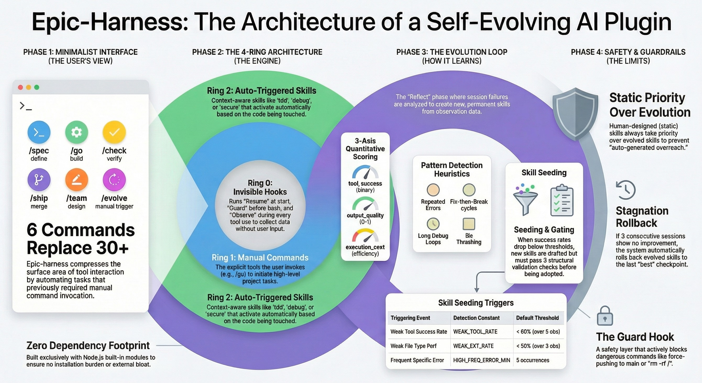

# epic harness

**6 個指令。自動觸發技能。自我進化。**

<p align="center">
<a href="../../README.md">English</a> | <a href="../ja/README.md">日本語</a> | <a href="../ko/README.md">한국어</a> | <a href="../de/README.md">Deutsch</a> | <a href="../fr/README.md">Français</a> | <a href="../zh-CN/README.md">简体中文</a> | <a href="../zh-TW/README.md">繁體中文</a> | <a href="../pt-BR/README.md">Português</a> | <a href="../es/README.md">Español</a> | <a href="../hi/README.md">हिन्दी</a>
</p>

<p align="center">
  <a href="LICENSE"></a>
  
  
  
  
  <a href="https://buymeacoffee.com/epicsaga"></a>
</p>

一個 Claude Code 外掛，**用 6 個指令取代 30 多個**，根據你正在做的事情**自動觸發技能**，並從你自身的失敗模式中**進化出新技能**。更少的記憶負擔，每次按鍵都更聰明。

<p align="center">
  
</p>

## 架構：4 環模型

```
Ring 0 — 自動駕駛（hooks，不可見）
  工作階段恢復、自動格式化、安全護欄、觀測記錄

Ring 1 — 6 個指令（由你呼叫）
  /spec  /go  /check  /ship  /team  /evolve

Ring 2 — 自動技能（依情境觸發）
  tdd · debug · secure · perf · simplify · document · verify · context

Ring 3 — 進化（自我改善）
  觀測工具使用 → 分析失敗 → 自動生成技能 → 品質閘門 → 重新載入
```

## 安裝

```bash
# Claude Code 外掛市場
claude plugins marketplace add epicsagas/epic-harness
claude plugins install epic@epicsagas

# 或手動安裝
git clone https://github.com/epicsagas/epic-harness.git ~/.claude/plugins/epic
```

### Rust 二進位檔（選用，hooks 速度約快 4 倍）

```bash
# Homebrew (macOS)
brew install epicsagas/tap/epic-harness


# 從 crates.io
cargo install epic-harness
# 或使用 cargo-binstall（預建構，更快）
cargo binstall epic-harness

# 從原始碼
cargo install --path .
```

hooks 會自動偵測二進位檔。若不存在，則回退至 Node.js。

## 指令

| 指令 | 功能說明 |
|---------|-------------|
| `/spec` | 定義要建構的內容 — 釐清需求、產出規格 |
| `/go` | 開始建構 — 自動規劃、TDD 子代理、平行執行 |
| `/check` | 驗證 — 平行執行程式碼審查 + 安全稽核 + 效能檢測 |
| `/ship` | 交付 — PR、CI、合併 |
| `/team` | 設計專案專屬的代理團隊 |
| `/evolve` | 手動觸發進化 / 狀態 / 回滾 |

## 自動技能（Ring 2）

技能根據情境自動觸發，無需手動呼叫。

| 技能 | 觸發條件 |
|-------|--------------|
| **tdd** | 實作新功能時 |
| **debug** | 測試失敗或出現錯誤時 |
| **secure** | 觸及認證/資料庫/API/金鑰相關程式碼時 |
| **perf** | 涉及迴圈、查詢、渲染程式碼時 |
| **simplify** | 檔案超過 200 行或複雜度過高時 |
| **document** | 新增或變更公開 API 時 |
| **verify** | 完成 /go 或 /ship 之前 |
| **context** | 上下文視窗使用超過 70% 時 |

## Hooks（Ring 0）

不可見地運行，無需使用者操作。以**單一 Rust 二進位檔**（`epic-harness`）搭配子指令實作，若二進位檔不可用則回退至 Node.js。

```
epic-harness resume | guard | polish | observe | snapshot | reflect
```

| Hook | 時機 | 動作 |
|------|------|------|
| **resume** | 工作階段開始 | 恢復上下文、載入記憶、偵測技術堆疊 |
| **guard** | Bash 執行前 | 阻擋 force-push-to-main、rm -rf /、DROP prod |
| **polish** | 編輯後 | 自動格式化（Biome/Prettier/ruff/gofmt）+ 型別檢查 |
| **observe** | 每次工具使用 | 記錄至 `.harness/obs/` 供進化使用 |
| **snapshot** | 壓縮前 | 儲存狀態至 `.harness/sessions/` |
| **reflect** | 工作階段結束 | 分析失敗、播種進化技能、品質閘門 |

## 評估系統（Ring 3 核心）

將 A-Evolve 的基準測試模式融入 Claude Code 的 hook 系統。

### 多維度評分

每次工具呼叫依 3 個軸向評分。權重可透過 `src/ts/common.ts`（或 `src/hooks/common.rs`）中的 `SCORE_WEIGHTS` 設定：

```
composite = SCORE_WEIGHTS.success × tool_success + SCORE_WEIGHTS.quality × output_quality + SCORE_WEIGHTS.cost × execution_cost
           (default: 0.5)                          (default: 0.3)                             (default: 0.2)
```

| 維度 | 衡量指標 | 各工具準則 |
|-----------|-----------------|-------------------|
| `tool_success` | 是否成功？（0/1） | 9 類失敗分類 |
| `output_quality` | 輸出品質訊號（0.0-1.0） | Bash：警告、空輸出。Edit：重新編輯偵測 |
| `execution_cost` | 效率指標（0.0-1.0） | 輸出大小、靜默成功指令白名單 |

### 失敗分類（9 類）

`type_error` · `syntax_error` · `test_fail` · `lint_fail` · `build_fail` · `permission_denied` · `timeout` · `not_found` · `runtime_error`

### 模式偵測（4 種類型）

所有閾值皆為 `src/ts/common.ts`（或 `src/hooks/common.rs`）中的可設定常數：

| 模式 | 偵測內容 | 常數 | 預設值 |
|---------|---------|----------|---------|
| `repeated_same_error` | 相同錯誤連續出現 N 次以上 | `REPEATED_ERROR_MIN` | 3 |
| `fix_then_break` | 編輯成功 → 建構/測試失敗 | `FTB_LOOKAHEAD` / `FTB_MIN_CYCLES` | 3 / 2 |
| `long_debug_loop` | 對同一檔案持續操作 N 次以上 | `DEBUG_LOOP_MIN` | 5 |
| `thrashing` | 同一檔案上 Edit↔Error 交替出現 | `THRASH_MIN_EDITS` / `THRASH_MIN_ERRORS` | 3 / 3 |

### 技能播種閾值

| 觸發條件 | 常數 | 預設值 |
|---------|----------|---------|
| 弱工具（低成功率） | `WEAK_TOOL_RATE` / `WEAK_TOOL_MIN_OBS` | 0.6 / 5 |
| 弱檔案類型 | `WEAK_EXT_RATE` / `WEAK_EXT_MIN_OBS` | 0.5 / 3 |
| 高頻錯誤 | `HIGH_FREQ_ERROR_MIN` | 5 |

### 停滯閘門

- `STAGNATION_LIMIT`（預設：3）個工作階段無改善 → 自動將進化技能回滾至最佳檢查點
- `IMPROVEMENT_THRESHOLD`（預設：5%）
- 趨勢追蹤：透過線性回歸分為 `improving` / `stable` / `declining`
- 發生衝突時，靜態技能始終優先於進化技能

### 進化流程

```
觀測（PostToolUse — 3 軸評分）
    ↓ .harness/obs/session_{id}.jsonl
分析（SessionEnd）
    ↓ SessionAnalysis：逐工具、逐副檔名、分數分布
    ↓ 模式：repeated_same_error、fix_then_break、long_debug_loop、thrashing
播種（4 條路徑：模式 / 弱工具 / 弱檔案類型 / 高頻錯誤）
    ↓ .harness/evolved/{skill}/SKILL.md
閘門（格式檢查、去重、上限 10 個、停滯檢查）
    ↓ .harness/evolved_backup/（最佳檢查點）
重新載入（下次工作階段 — resume.ts 報告指標 + 載入進化技能）
```

```bash
/evolve              # 立即執行進化
/evolve status       # 儀表板：分數、趨勢、模式、技能
/evolve history      # 長期分析：完整歷史、技能效果、分派統計
/evolve cross-project # 跨專案模式分析
/evolve rollback     # 恢復至先前最佳狀態
/evolve reset        # 清除所有進化資料
```

## 冷啟動預設

無需等待 5 個工作階段才能獲得有用的進化技能。首次工作階段時，epic harness 會偵測你的技術堆疊並自動套用預設技能：

| 技術堆疊 | 預設技能 |
|-------|--------------|
| Node.js/TypeScript | `evo-ts-care`、`evo-fix-build-fail` |
| Go | `evo-go-care` |
| Python | `evo-py-care` |
| Rust | `evo-rs-care` |

預設為補充性質 — 隨著資料累積，它們會被真正的進化技能取代。

## 並行工作階段安全性

每個工作階段寫入自己的觀測檔案（`session_{date}_{pid}_{random}.jsonl`）。同一專案上的多個 Claude Code 工作階段不會互相破壞資料。reflect hook 會合併同一天的所有檔案進行分析。

## 自訂安全規則

透過 `.harness/guard-rules.yaml` 新增專案專屬的安全規則：

```yaml
blocked:
  - pattern: kubectl\s+delete\s+namespace | msg: Namespace deletion blocked
  - pattern: terraform\s+destroy | msg: Terraform destroy blocked
warned:
  - pattern: docker\s+system\s+prune | msg: Docker prune — verify first
```

規則會與內建護欄（force-push-to-main、rm -rf /、DROP prod）合併。

## 跨專案學習

選擇加入以跨專案分享失敗模式：

```bash
touch .harness/.cross-project-enabled  # 選擇加入
```

啟用後：
- 工作階段結束時，匿名化的模式匯出至 `~/.harness-global/patterns.jsonl`
- 工作階段開始時，顯示來自其他專案弱點區域的提示
- 使用 `/evolve cross-project` 查看彙總模式

## 技能效果追蹤

每個進化技能都透過 A/B 歸因分數進行追蹤：

```
/evolve history → 技能效果區段

| Skill              | Sessions | Score With | Score Without | Delta  |
|--------------------|----------|------------|---------------|--------|
| evo-ts-care        | 8        | 0.87       | 0.72          | +15%   |
| evo-bash-discipline| 3        | 0.65       | 0.68          | -3%    |
```

正向差異 = 技能有幫助。負向差異 = 考慮透過 `/evolve rollback` 移除。

## Polish → Observe 回饋

polish hook（自動格式化 + 型別檢查）會將結果回饋至觀測管線：

- 格式化失敗 → 記錄為 `lint_fail`
- TypeScript 錯誤 → 記錄為 `build_fail`
- 成功 → 記錄完整分數

這意味著「編輯 → 型別錯誤 → 編輯 → 型別錯誤」的反覆模式即使錯誤來自 polish hook 而非手動指令，也能被偵測到。

## 專案資料（`.harness/`）

epic harness 會在你的專案中建立 `.harness/` 目錄：

```
.harness/
├── memory/           # 專案模式與規則（持久化）
├── sessions/         # 工作階段快照（供恢復使用）
├── obs/              # 工具使用觀測記錄（JSONL，逐工作階段）
├── evolved/          # 自動進化的技能
├── evolved_backup/   # 最佳檢查點（供停滯回滾使用）
├── dispatch/         # 技能分派記錄（JSONL）
├── team/             # /team 生成的代理與技能
├── evolution.jsonl   # 完整進化歷史
├── metrics.json      # 彙總統計 + 技能歸因
└── guard-rules.yaml  # 自訂安全規則（選用）
```

將 `.harness/` 加入 `.gitignore` 或提交它 — 由你決定。

## 開發

### Rust（主要 — 約快 4 倍）

```bash
cargo install --path .          # 建構 + 安裝至 ~/.cargo/bin/
cp ~/.cargo/bin/epic-harness hooks/bin/epic-harness  # 更新外掛二進位檔
```

### Node.js（備用）

```bash
npm install
npm run build    # TypeScript (src/ts/) → hooks/scripts/*.js
```

### Hooks 如何分派

`hooks.json` 中的每個 hook 會在三個位置尋找 Rust 二進位檔，然後回退至 Node.js：

```
1. 外掛本地：hooks/bin/epic-harness
2. PATH：    ~/.cargo/bin/epic-harness（透過 cargo install）
3. 備用：    node hooks/scripts/<hook>.js
```

### 測試

```bash
cargo test       # 98 個 Rust 單元測試
npm test         # Node.js 單元 + 端對端測試
```

## 致謝

epic harness 的靈感來自以下專案並建立於其概念之上：

- [a-evolve](https://github.com/A-EVO-Lab/a-evolve) — 自動化進化與基準測試模式
- [agent-skills](https://github.com/addyosmani/agent-skills) — Claude Code 代理技能系統
- [everything-claude-code](https://github.com/affaan-m/everything-claude-code) — 全面的 Claude Code 模式
- [gstack](https://github.com/garrytan/gstack) — 外掛架構參考
- [harness](https://github.com/revfactory/harness) — Hook 與 harness 基礎架構模式
- [serena](https://github.com/oraios/serena) — 自主代理設計
- [SuperClaude Framework](https://github.com/SuperClaude-Org/SuperClaude_Framework) — 多指令框架架構
- [superpowers](https://github.com/obra/superpowers) — Claude Code 擴充模式

## 授權條款

[Apache 2.0](LICENSE)
