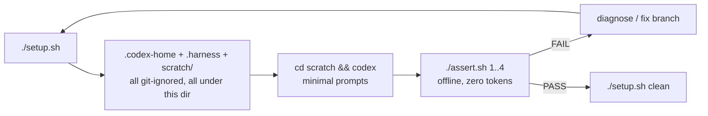

# Codex Live Check

Isolated, repeatable end-to-end verification of the epic-harness Codex host
path against a real Codex CLI session. Reusable for any branch: it exercises
hooks, plugin assets, and the Ring 3 data flow without touching the
developer's real `~/.codex` or `~/.harness`.

This directory IS the fixture. `.envrc` pins the environment, so every `cd`
into it (with direnv allowed once) produces the identical test setup.



## Decisions

- **D1: Full host isolation via `CODEX_HOME`.** Codex supports relocating its
  home directory with the `CODEX_HOME` environment variable (verified on
  codex-cli 0.153.4: an empty `CODEX_HOME` loads zero plugins). The test env
  gets a fresh codex home under `$HOME/.cache/epic-codex-live/`; the real
  `~/.codex` is never read or written except for one read-only copy of
  `auth.json` and a symlink to `.plugin-appserver`. The home must live
  OUTSIDE this repo: codex copies the whole plugin root (the checkout) on
  install, so a CODEX_HOME inside it recurses into itself and dies with
  "File name too long" (measured).
- **D2: Plugin from a local marketplace, hook manifest seeded by hand.**
  `setup.sh` registers `HARNESS_SRC` as a local codex marketplace and runs
  `codex plugin add epic@epicsagas`, so codex serves the skills (orbit, spec,
  go, ...) straight from the checkout: no network, no remote HEAD, and the
  name mismatch that broke marketplace install was fixed by aligning
  `.claude-plugin/marketplace.json` to the plugin manifests' `name: epic`.
  Hooks are a separate question: the user-level `CODEX_HOME/hooks.json` is
  seeded from `HARNESS_SRC/.codex-plugin/hooks.json` (resolving
  `${PLUGIN_ROOT}`), which guarantees the hook registrations fire regardless
  of whether this codex version loads plugin hooks on its own. If case 1
  shows doubled observations, the plugin path fires too; drop the seeded
  file then.
- **D3: Binary from PATH, pinned by `.envrc`.** Hooks call `command -v epic`,
  so the harness binary under test is whatever `epic` resolves to when `codex`
  launches. `.envrc` prepends `~/.cargo/bin` so a `cargo install`ed branch
  build deterministically wins over a Homebrew install (`brew unlink
  epic-harness` is the belt-and-suspenders alternative). `setup.sh` prints
  the resolved binary and version so the record shows what ran.
- **D4: Minimal turns, offline assertions.** LLM tokens are only spent on the
  prompts in `prompts.txt` (a handful of one-liners). Every pass/fail verdict
  is read offline from SQLite, `metrics.json`, the watermark file, and
  `orchestrator/run.json` via `assert.sh`. Codex output is never trusted as
  evidence except for one question (case 2), where only the model can prove
  what reached its context.
- **D5: Injected-context markers, holdout-aware.** `setup.sh` seeds three
  evolved skills containing `HARNESS-CHECK-*` marker sentences. Case 2 asks
  the model to quote a marker, which proves `epic resume` stdout reaches the
  model. The holdout modulus is 3, so all three seeds land in the holdout arm
  with p about 3.7 percent; if that happens, rename the skill directories
  (the holdout hash is name-based) and relaunch.
- **D6: Codex works inside `scratch/`, never on repo files.** The sample
  sources live in `scratch/src/`, which is git-ignored, so test edits never
  dirty the epic-harness working tree. The project slug still derives from
  the git toplevel (`epic-harness`), but `HARNESS_DIR` points at the isolated
  `.harness/`, so no real project data is touched. Avoid `/tmp` for any
  relocated fixture: on macOS it is a symlink, and `mask_path_action`
  relativizes by `strip_prefix(cwd())`, so a symlinked checkout collapses
  paths to `<PATH>` and breaks per-file assertions.
- **D7: Teardown deletes generated dirs only.** `setup.sh clean` removes
  `$HOME/.cache/epic-codex-live/` (codex home + harness data), `scratch/`,
  and `stderr.log`; scripts, docs, and `.envrc` survive for the next run.

## Usage

```bash
cd examples/codex-live-check
direnv allow                      # once; .envrc then applies on every cd here

# 1. Build and install the branch under test (cargo install --path .),
#    then:
./setup.sh                        # env at ~/.cache/epic-codex-live + scratch/
                                  # marketplace add + plugin add included
# ...or test another checkout:
HARNESS_SRC=/path/to/other-checkout ./setup.sh

# 2. Launch and run the prompts from prompts.txt (or /orbit for the
#    autonomous pipeline):
cd scratch
codex 2> ../stderr.log            # stderr kept for holdout checks

# 3. Verdicts (offline, no tokens):
../assert.sh 1                    # apply_patch payload shape
../assert.sh 2                    # holdout/resume stderr
../assert.sh 3                    # subagent events + run.json
../assert.sh 4                    # watermark, attribution, reflect
../assert.sh all

# 4. Teardown (env only; scripts survive)
cd .. && ./setup.sh clean
```

`setup.sh` is idempotent: rerunning refreshes the hook manifest from
`HARNESS_SRC` but keeps session data. `--fresh` wipes the generated dirs
first (use between branch tests). Without direnv, `source .envrc` is
equivalent.

## What each case proves

| Case | Claim under test | Evidence source |
|------|------------------|-----------------|
| 1 | Codex `apply_patch` payloads match the shape `observe`/`polish`/`guard` assume; actions record file paths, not patch bodies | `observations` table |
| 2 | `epic resume` stdout reaches the model; holdout skills are withheld to stderr only | model answer (user-judged) + `stderr.log` |
| 3 | Codex parses agent TOML and emits `SubagentStart`/`SubagentStop` with host agent ids | `orchestrator/run.json`, observations |
| 4 | Turn-scoped `Stop` watermark advances monotonically; observations are project-attributed; reflect counts sessions, not turns | `reflect_watermark.txt`, `metrics.json` |

Any failure where the real Codex payload differs from what the branch assumes
is exactly the result worth reporting on the PR.

## Caveats

- Case 3 needs a Codex version that actually supports subagents and
  `SubagentStart`; an old CLI silently proves nothing. Check `codex --version`.
- `auth.json` is copied, not linked, so re-login in the real env does not
  propagate; `./setup.sh --fresh` re-copies it.
- The TUI plugin screen lists OpenAI's remote catalog and needs the
  `.plugin-appserver` payload; `setup.sh` symlinks it from the real home. The
  test never uses plugins, so a plugin-install failure there is ignorable.
- The SessionStart hook runs `registry/scripts/install.js` from `HARNESS_SRC`;
  keep that checkout alive for the lifetime of the test env.
- direnv must be installed for automatic loading; otherwise `source .envrc`
  before every session.
