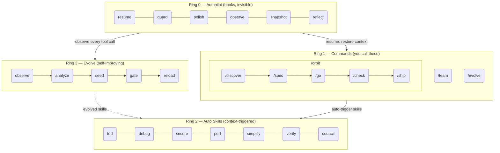
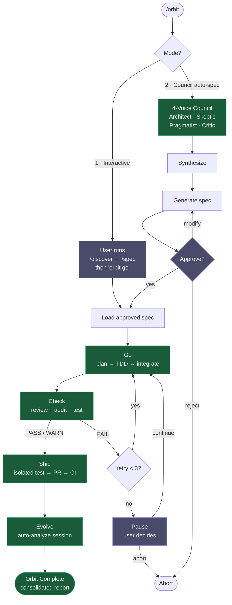

# epic harness

> Ein selbstentwickelndes KI-Coding-Agent-Harness — 8 Befehle, 1 autonome Pipeline, automatisch ausgelöste Skills, lernt aus Ihren Fehlern.

**8 Befehle. Automatisch ausgelöste Skills. Selbstentwickelnd.**

<p align="center">
<a href="../../README.md">English</a> | <a href="../ja/README.md">日本語</a> | <a href="../ko/README.md">한국어</a> | <a href="../de/README.md">Deutsch</a> | <a href="../fr/README.md">Français</a> | <a href="../zh-CN/README.md">简体中文</a> | <a href="../zh-TW/README.md">繁體中文</a> | <a href="../pt-BR/README.md">Português</a> | <a href="../es/README.md">Español</a> | <a href="../hi/README.md">हिन्दी</a>
</p>

<p align="center">
  <a href="LICENSE"></a>
  
  
  
  <a href="https://buymeacoffee.com/epicsaga"></a>
</p>

Ein Claude Code-Plugin, das **30+ Befehle durch 8 ersetzt**, **Skills automatisch auslöst** basierend auf dem, was Sie gerade tun, und **neue Skills entwickelt** aus Ihren eigenen Fehlermustern. Weniger zu merken. Mehr Intelligenz pro Tastendruck.

<p align="center">
  
</p>

## Installation

> **Zum ersten Mal?** Lesen Sie den [Schnellstart-Leitfaden (5 Min.)](../../QUICKSTART.md).

```bash
# Claude Code
/plugin marketplace add epicsagas/plugins && /plugin install epic@epicsagas

# Jedes andere Tool
cargo install epic-harness && epic install
```

| Umgebung | Methode |
|-------------|--------|
| **Claude Code** | Plugin-Marktplatz (oben) |
| **macOS** | `brew install epicsagas/tap/epic-harness` |
| **Beliebig (mit Rust)** | `cargo install epic-harness` |
| **Aus Quellcode** | `git clone` + `cargo install --path .` |

Voraussetzungen: **Git**. Quell-/Binärinstallationen benötigen außerdem die [Rust-Toolchain](https://rustup.rs).

### `epic install` — Einrichtungsassistent

Nach der Installation der Binärdatei führen Sie `epic install` (oder `epic install claude`) aus, um:

1. Die `~/.harness/`-Verzeichnisstruktur zu erstellen
2. Befehle, Skills und Agenten in das Konfigurationsverzeichnis des Tools zu synchronisieren
3. Den MCP-Server (harness-mem) für Claude Code zu registrieren
4. `~/.harness/config.toml` mit Standardwerten zu erstellen, falls nicht vorhanden

Bei Claude Code führt `hooks/setup.sh` beim Sitzungsstart automatisch aus und installiert die Binärdatei, falls sie fehlt. Nach dem ersten Klon ist kein manueller Schritt erforderlich.

### Andere Tools

```bash
epic install codex        # Codex CLI   → ~/.codex/ + ~/.agents/skills/
epic install gemini       # Gemini CLI  → ~/.gemini/
epic install cursor       # Cursor      → ~/.cursor/ (erfordert Cursor 1.7+)
epic install opencode     # OpenCode    → ~/.config/opencode/
epic install cline        # Cline       → ~/Documents/Cline/Rules/
epic install aider        # Aider       → ~/.aider.conf.yml + ~/.aider/
epic install              # Interaktives Menü
```

Integrationsdateien werden von der Binärdatei **synchronisiert**: fehlende oder veraltete Dateien werden geschrieben. `GEMINI.md` und `AGENTS.md` werden nur erstellt, wenn sie nicht vorhanden sind.

### Überprüfen

```bash
epic --version              # Binärdatei installiert
ls ~/.harness/              # Datenverzeichnis vorhanden
```

In einer Claude Code-Sitzung: `/evolve status`

### Kurze Demo

**Ein Befehl, vollständige Pipeline:**
```bash
$ /orbit
# Modus wählen:
#   1. Interaktiv  — Sie führen /discover + /spec aus, dann "orbit go"
#   2. Council     — 4-Stimmen-Council generiert Spec, Sie genehmigen
→ Spec genehmigt → go (TDD) → check (PASS) → ship (PR + CI) → evolve
```

**Oder manuell Schritt für Schritt:**
```bash
$ /spec "JWT-Authentifizierung zur Login-API hinzufügen"
  → Klärt Anforderungen → erzeugt SPEC-*.md

$ /go
  → Automatische Planung → TDD-Subagenten → FERTIG (4 Min.)

$ /check
  → Paralleler Code-Review + Sicherheitsaudit + Tests → PASS

$ /ship
  → Erstellt PR → CI grün → gemergt
```

## Architektur: 4-Ring-Modell



## /orbit — Autonome Pipeline

`/orbit` bündelt die gesamte manuelle Pipeline in eine einzige autonome Ausführung.



**Lila Knoten** — menschliche Checkpoints: Modusauswahl, Spec-Genehmigung, Pause bei 3-fachem Check-Versagen.
**Grüne Knoten** — autonom: go, check, ship, evolve laufen ohne Benutzereingriff.

Zustand wird in `$HARNESS_DIR/orbit/PIPELINE-{timestamp}.json` gespeichert — überlebt Kontext-Komprimierung.

## Befehle

| Befehl | Funktion |
|---------|-------------|
| `/discover` | Problem erkunden und definieren, bevor eine Lösung spezifiziert wird — 5 Whys, JTBD, sokratisches Befragen |
| `/spec` | Definieren, was gebaut werden soll — Anforderungen klären, eine Spec erstellen |
| `/go` | Bauen — automatische Planung, TDD-Subagenten, 4-Zustands-Ergebnismodell (DONE/CONCERNS/NEEDS_CONTEXT/BLOCKED), parallele Ausführung mit Worktree-Isolation |
| `/check` | Verifizieren — adaptiver Experten-Dispatch (scope-basiert), paralleler Code-Review + Sicherheitsaudit + Performance |
| `/ship` | Liefern — isolierter Preflight-Test, dann PR, CI, Merge |
| `/team` | Org-level Agenten-Teams erstellen und über Projekte hinweg synchronisieren |
| `/evolve` | Manueller Evolutions-Trigger / Status / Rollback |
| `/orbit` | **Autonome Pipeline** — führt spec → go → check → ship in einem Durchgang aus. Interaktiven oder Council-Modus wählen. |

---

## Auto Skills (Ring 2)

Skills werden automatisch ausgelöst. Sie rufen sie nicht auf.

| Skill | Wird ausgelöst, wenn |
|-------|--------------|
| **tdd** | Neue Feature-Implementierung |
| **debug** | Testfehler oder Fehler |
| **discover** | Vage Anfrage, Lösung ohne Problem oder unkonzentrierte Beschwerde |
| **secure** | Auth/DB/API/Secrets-Code berührt |
| **perf** | Schleifen, Abfragen, Rendering-Code |
| **simplify** | Datei > 200 Zeilen oder hohe Komplexität |
| **document** | Öffentliche API hinzugefügt oder geändert |
| **verify** | Vor Abschluss von /go oder /ship |
| **context** | Kontextfenster > 70% ausgelastet |
| **council** | Mehrdeutige architektonische oder Design-Entscheidungen |
| **agent-introspection** | Agent-Selbstdebugging nach wiederholten Fehlern |

## Hooks (Ring 0)

Laufen unsichtbar. Einzelne Rust-Binärdatei (`epic-harness`) mit Unterbefehlen.

| Hook | Wann | Funktion |
|------|------|------|
| **resume** | Sitzungsstart | Kontext wiederherstellen, Memory laden, Stack erkennen |
| **guard** | Vor Bash | Force-Push-to-main, rm -rf /, DROP prod blockieren |
| **polish** | Nach Edit | Auto-Format (Biome/Prettier/ruff/gofmt) + Typprüfung |
| **observe** | Bei jeder Tool-Nutzung | In `~/.harness/projects/{slug}/obs/` für Evolution + GateGuard-Hinweise loggen |
| **snapshot** | Vor compact | Zustand in `~/.harness/projects/{slug}/sessions/` speichern |
| **reflect** | Sitzungsende | Fehler analysieren, entwickelte Skills seeden, gaten, Instinkte extrahieren |

Polish speist sich in observe zurück: Formatfehler → `lint_fail`, TypeScript-Fehler → `build_fail`. Edit→Error-Thrashing wird auch erkannt, wenn Fehler von polish kommen.

Jede Sitzung schreibt ihre eigene `session_{date}_{pid}_{random}.jsonl` — mehrere Sitzungen im selben Projekt korrumpieren keine gegenseitigen Daten.

### Hook-Profile

Via `~/.harness/config.toml` oder `EPIC_HOOK_PROFILE`-Umgebungsvariable:

| Profil | Aktive Hooks |
|---------|-------------|
| `minimal` | guard, observe, resume |
| `standard` (Standard) | obige + polish, reflect, snapshot |
| `strict` | alle Hooks + zukünftige strict-only-Prüfungen |

### Benutzerdefinierte Guard-Regeln

Projektspezifische Regeln via `.harness/guard-rules.yaml` im Projektstamm hinzufügen:

```yaml
blocked:
  - pattern: kubectl\s+delete\s+namespace | msg: Namespace deletion blocked
warned:
  - pattern: docker\s+system\s+prune | msg: Docker prune — verify first
```

## Team (`epic team`)

Teams sind **org-level**, nicht projektgebunden. `/team` in einem beliebigen Projekt auszuführen bereichert einen gemeinsamen Pool von Agentendefinitionen — ohne stillschweigendes Überschreiben.

```bash
epic team                              # Interaktiv: scannen → entwerfen → schreiben → synchronisieren
epic team sync backend                 # Agenten nach .claude/agents/backend/ dispatchen
epic team link backend                 # Dispatch + Projekt in Team-Config registrieren
epic team list                         # Alle Teams in aktueller Org
epic team list --org netflix           # Teams in einer benannten Org
epic team show backend --playbook      # Config + vollständiges Playbook
epic team delete backend               # Nur aus aktuellem Projekt entfernen
epic team delete backend --global      # Dauerhaft aus Org-Store löschen
```

Nach der Synchronisierung sind Agenten in der nächsten Sitzung verfügbar: `@domain-expert`, `@reviewer`, `@tester` usw.

| Typ | Schlüsselwort | Standard-Agenten |
|------|---------|---------------|
| Stream-aligned | `stream` | domain-expert, reviewer, tester |
| Platform | `platform` | api-designer, infra-specialist, dx-agent |
| Enabling | `enabling` | specialist |
| Complicated Subsystem | `subsystem` | domain-specialist, integration-tester |

Multi-Org: `epic team --org netflix` — separate Topologie pro Org.

Merge-Strategie: Geänderte Agenten werden abgefragt (Standard: Vorhandenes behalten, Backup in `.history/`). Playbook wird immer angehängt.

## Multi-Tool-Unterstützung

Alle Tools teilen dasselbe `~/.harness/projects/{slug}/`-Datenverzeichnis.

| Tool | Ring 0 Hooks | Befehle | Skills | Agenten |
|------|-------------|----------|--------|--------|
| **Claude Code** | ✓ Voll | ✓ 8 Befehle (inkl. /orbit) | ✓ 11 Skills | ✓ 4 |
| **Codex CLI** | ✓ Voll¹ | ✓ 8 Prompts (inkl. /orbit) | ✓ 7 | ✓ 4 |
| **Gemini CLI** | ✓ Teilweise² | ✓ 8 Befehle (inkl. /orbit) | ✓ 7 | ✓ 4 |
| **Cursor** | ✓ Voll³ | ✓ 8 Befehle (inkl. /orbit) | ✓ über Regeln | ✓ 4 |
| **OpenCode** | ✓ Teilweise⁴ | ✓ 8 Befehle (inkl. /orbit) | — | ✓ 4 |
| **Cline** | ✓ Voll⁵ | — | — | — |
| **Aider** | —⁶ | — | — | — |

¹ `codex_hooks = true` in `~/.codex/config.toml` · ² Guard auf `BeforeModel`-Ebene · ³ Cursor 1.7+ · ⁴ JS-Plugin · ⁵ 5 Hook-Skripte · ⁶ Nur Konventionen

## Unified Memory — WIP

> **Status: In Entwicklung.** Noch nicht vollständig funktionsfähig. CLI-Befehle, MCP-Tools und Web UI sind in Arbeit.

Alle Agenten teilen einen Wissensgraphen in `~/.harness/memory.db` (SQLite mit Volltextsuche). Keine externe Laufzeit.

```
score = recency(25%) + importance(35%) + access_frequency(15%) + FTS_match(25%)
```

### CLI

```bash
epic mem recall "auth refactor" --project my-project   # Intelligenter Abruf
epic mem add --title "JWT rotation" --type decision    # Knoten hinzufügen
epic mem search "JWT"                                  # FTS5-Suche
epic mem query --type decision --project my-project    # Filtern
epic mem context --project my-project                  # Projektkontext
epic mem serve                                         # Web UI → :7700
epic mem mcp-install                                   # MCP-Server registrieren
epic mem export --out ./docs/memory                    # Nach Markdown exportieren
```

### MCP-Tools (6)

| Tool | Zweck |
|------|---------|
| `mem_recall` | Intelligenter kontextueller Abruf mit Hinweis + Projekt + Graph-Nachbarn |
| `mem_add` | Knoten mit Auto-Wichtigkeit nach Typ hinzufügen (oder explizit 0.0–1.0) |
| `mem_search` | Schlüsselwortsuche (Volltext), nach Wichtigkeit gerankt |
| `mem_query` | Nach Tag/Typ/Projekt filtern |
| `mem_context` | Projektbezogener intelligenter Abruf (kein Hinweis) |
| `mem_related` | Graph-Traversal von einer Knoten-ID (findet verbundenes Wissen) |

### Knotentypen

| Typ | Erstellt von | Wichtigkeit |
|------|-----------|------------|
| `decision` | Manuell / MCP | 0.9 |
| `resolution` | Manuell / MCP | 0.8 |
| `concept` | Manuell / MCP | 0.7 |
| `project` | Manuell / MCP | 0.7 |
| `instinct` | Auto (reflect) | 0.7 |
| `pattern` | Auto (reflect) | 0.5 |
| `error` | Auto (reflect) | 0.4 |
| `session` | Auto (reflect) | 0.2 |

Lebenszyklus: 30+ Tage ohne Zugriff → 10% Wichtigkeitsverfall (Minimum 0.05). 180+ Tage → als `stale` markiert, vom Abruf ausgeschlossen. `pinned`-Tag verhindert Verfall.

## Evolve (Ring 3)

Integriert [A-Evolve](https://github.com/A-EVO-Lab/a-evolve) automatisierte Evolutionsmuster in Claude Codes Hook-System.

### Bewertung

Jeder Tool-Aufruf wird auf 3 Achsen bewertet (Gewichte konfigurierbar via `~/.harness/config.toml`):

```
composite = 0.5 × tool_success + 0.3 × output_quality + 0.2 × execution_cost
```

Fehlerklassifizierung (9 Typen): `type_error` · `syntax_error` · `test_fail` · `lint_fail` · `build_fail` · `permission_denied` · `timeout` · `not_found` · `runtime_error`

### Mustererkennung

| Muster | Erkennt | Standardschwellenwert |
|---------|---------|-------------------|
| `repeated_same_error` | Gleicher Fehler N+ mal | 3 |
| `fix_then_break` | Edit-Erfolg → Build/Test schlägt fehl | 3 Rückblick, 2 Zyklen |
| `long_debug_loop` | Feststeckend in derselben Datei | 5 Operationen |
| `thrashing` | Edit↔Error abwechselnd | 3 Edits, 3 Fehler |

### Evolutionsfluss

```
Observe (PostToolUse — 3-axis scoring)
    ↓ obs/session_{id}.jsonl
Analyze (SessionEnd)
    ↓ per-tool, per-ext scores + patterns
Propose (Solver — graduated by score: ≥0.90 skip, ≥0.70 moderate, <0.70 full)
    ↓ SkillProposal[] with confidence
Curate (Accept/Merge/Skip, feedback masked from solver)
    ↓ evolved/{skill}/SKILL.md + meta.json
Gate (format check, dedup, cap 10, gated promotion ≥ 3 sessions)
    ↓ evolved_backup/ (best checkpoint)
Instinct (high-success patterns → cross-project memory.db nodes)
    ↓
Reload (next session — resume loads evolved skills)
```

Skill-Seeding: Schwaches Tool (Erfolg <60%, min. 5 Beobachtungen), schwacher Dateityp (Erfolg <50%, min. 3 Beobachtungen), hochfrequenter Fehler (5+ Vorkommen).

Stagnation: 3 Sitzungen ohne 5% Verbesserung → automatischer Rollback zum besten Checkpoint.

```bash
/evolve              # Jetzt ausführen
/evolve status       # Dashboard: Scores, Trends, Muster, Skills
/evolve history      # Vollständige Geschichte + Skill-Effektivität
/evolve cross-project # Projektübergreifende Musteranalyse
/evolve rollback     # Vorheriges Bestes wiederherstellen
/evolve reset        # Alle Evolutionsdaten löschen
```

### Skill-Effektivität

Jeder entwickelte Skill wird mit A/B-Attribution verfolgt:

```
/evolve history → Skill Effectiveness

| Skill              | With | Without | Delta |
|--------------------|------|---------|-------|
| evo-ts-care        | 0.87 | 0.72    | +15%  |
| evo-bash-discipline| 0.65 | 0.68    | -3%   |
```

Positives Delta = effektiv. Negativ = Entfernung via `/evolve rollback` erwägen.

### Cold-Start-Presets

Bei der ersten Sitzung werden stack-geeignete Preset-Skills automatisch angewendet:

| Stack | Presets |
|-------|---------|
| Node.js/TypeScript | `evo-ts-care`, `evo-fix-build-fail` |
| Go | `evo-go-care` |
| Python | `evo-py-care` |
| Rust | `evo-rs-care` |

### Instinct-Lernen

Hocherfolgreiche Muster werden extrahiert und projektübergreifend gefördert:

```
observe (100% confirmed) → extract_instincts() → instinct node (confidence ≥ 0.8)
    → promote to global when observed in ≥ 2 projects
```

## Projektübergreifendes Lernen

Opt-in, um Fehlermuster über Projekte zu teilen:

```bash
touch ~/.harness/projects/{slug}/.cross-project-enabled
```

Sitzungsende → exportiert anonymisierte Muster nach `~/.harness/global_patterns.jsonl`. Sitzungsstart → zeigt Hinweise aus schwachen Bereichen anderer Projekte.

## Projektdaten

Alle Daten liegen in `~/.harness/` (Home-Verzeichnis), nicht im Projektstamm. Überlebt das Löschen von Projekten und verunreinigt die Git-Historie nicht.

```
~/.harness/
├── memory.db                  # SQLite-Wissensgraph (Knoten + Kanten + FTS5)
├── graph.json                 # Gecachter Graph (für Web UI)
├── config.toml                # Benutzerkonfiguration
├── global_patterns.jsonl      # Projektübergreifende Muster (Opt-in)
├── orgs/                      # Team-Globalspeicher
│   └── {org}/teams/{team}/
│       ├── config.json, mission.md, playbook.md, agents/, .history/
└── projects/{slug}/
    ├── memory/                # Projektmuster und Regeln
    ├── sessions/              # Sitzungs-Snapshots (für resume)
    ├── obs/                   # Tool-Nutzungs-Beobachtungslogs (JSONL)
    ├── evolved/               # Auto-entwickelte Skills
    │   ├── manifest.json
    │   └── {skill}/SKILL.md + meta.json
    ├── evolved_backup/        # Bester Checkpoint (für Rollback)
    ├── dispatch/              # Skill-Dispatch-Logs
    ├── evolution.jsonl        # Vollständige Evolutionsgeschichte
    └── metrics.json           # Aggregierte Statistiken + Skill-Attribution
```

Sicherheitsregeln mit dem Team teilen: `.harness/guard-rules.yaml` im Projektstamm (in git commiten).

## Konfiguration

Alle konfigurierbaren Parameter in `~/.harness/config.toml`. Fehlt = fest kodierte Standardwerte.

```toml
# Priorität: Umgebungsvariable (EPIC_HOOK_PROFILE) > diese Datei > Standardwerte

[hook]
profile = "standard"         # "minimal" | "standard" | "strict"
gateguard_hints = true

[scoring]
weights = [0.5, 0.3, 0.2]   # [success, quality, cost]

[evolution]
max_skills = 10
stagnation_limit = 3
improvement_threshold = 0.05
gated_promotion_min = 3

[pattern]
# repeated_error_min = 3
# debug_loop_min = 5
# graduated_scope_skip = 0.90
# graduated_scope_moderate = 0.70

[instinct]
# confidence_threshold = 0.8
# promotion_min_projects = 2
# max_instincts = 20
# min_observations = 10
# min_avg_score = 0.5
```

## Entwicklung

```bash
cargo install --path .                                        # Bauen + installieren
cp ~/.cargo/bin/epic-harness hooks/bin/epic-harness           # Plugin-Binärdatei aktualisieren
cargo test                                                    # Tests
```

Hooks suchen die Binärdatei an zwei Stellen: `hooks/bin/epic-harness` (Plugin-lokal) → `~/.cargo/bin/epic-harness` (PATH).

## Links

- [Changelog](../../CHANGELOG.md) — Release-Geschichte
- [Beitragen](../../CONTRIBUTING.md) — Wie man beiträgt
- [Sicherheit](../../SECURITY.md) — Sicherheitslücken melden
- [Issues](https://github.com/epicsagas/epic-harness/issues) — Fehlerberichte und Feature-Anfragen

## Danksagungen

- [a-evolve](https://github.com/A-EVO-Lab/a-evolve) — Automatisierte Evolution und Benchmark-Muster
- [agent-skills](https://github.com/addyosmani/agent-skills) — Claude Code-Agenten-Skill-System
- [everything-claude-code](https://github.com/affaan-m/everything-claude-code) — Umfassende Claude Code-Muster
- [gstack](https://github.com/garrytan/gstack) — Plugin-Architektur-Referenz
- [harness](https://github.com/revfactory/harness) — Hook- und Harness-Infrastruktur-Muster
- [serena](https://github.com/oraios/serena) — Autonomes Agenten-Design
- [SuperClaude Framework](https://github.com/SuperClaude-Org/SuperClaude_Framework) — Multi-Command-Framework-Architektur
- [superpowers](https://github.com/obra/superpowers) — Claude Code-Erweiterungsmuster

## Lizenz

[Apache 2.0](../../LICENSE)
