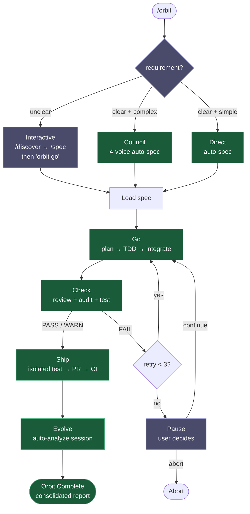
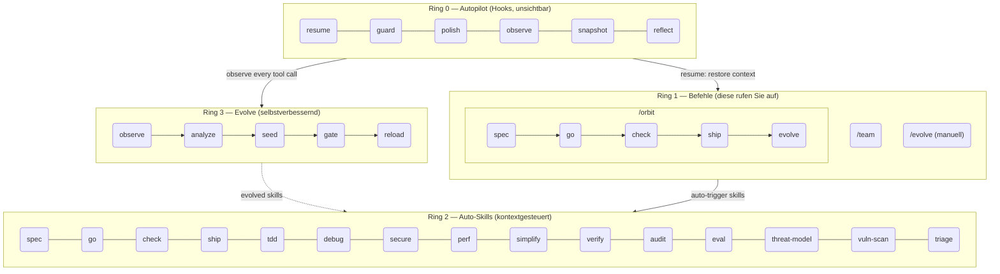

<h1 align="center">Epic Harness</h1>

<blockquote><p align="center">Ein selbstentwickelndes KI-Coding-Agent-Harness — 3 Befehle, 26 Skills, 1 autonome Pipeline, lernt aus Ihren Fehlern.</p></blockquote>

<p align="center"><b>Weniger zu merken. Mehr Intelligenz pro Tastendruck. Wird mit jeder Session intelligenter.</b></p>

<p align="center">
<a href="../../README.md">English</a> | <a href="../ja/README.md">日本語</a> | <a href="../ko/README.md">한국어</a> | <a href="README.md">Deutsch</a> | <a href="../fr/README.md">Français</a> | <a href="../zh-CN/README.md">简体中文</a> | <a href="../zh-TW/README.md">繁體中文</a> | <a href="../pt-BR/README.md">Português</a> | <a href="../es/README.md">Español</a> | <a href="../hi/README.md">हिन्दी</a>
</p>

<p align="center">
  <a href="https://github.com/epicsagas/epic-harness/stargazers"></a>
  <a href="https://github.com/epicsagas/epic-harness/network/members"></a>
  <a href="https://github.com/epicsagas/epic-harness/issues"></a>
  <a href="https://github.com/epicsagas/epic-harness/commits/main"></a>
</p>
<p align="center">
  <a href="../../LICENSE"></a>
  
  
  
  <a href="https://buymeacoffee.com/epicsaga"></a>
</p>

Ein Claude Code Plugin, das **30+ Befehle in 3 Befehle + 26 automatisch ausgelöste Skills konsolidiert** und **neue Skills entwickelt** aus Ihren eigenen Fehlermustern.

<p align="center">
  
</p>

---


### Web-Dashboard — wird automatisch beim Session-Start gestartet

10 Bildschirme mit Echtzeit-Metriken für Eval-Bewertungen, Tool-Statistiken, Orbit-Pipelines, entwickelte Skills und Hook-Zustand. Öffnet sich automatisch bei der ersten Claude Code-Session — kein manuelles Setup erforderlich.

<p align="center">
  
  
</p>

```bash
# Wird automatisch bei der ersten Session gestartet (Standard: http://localhost:7700)
# Port konfigurieren oder deaktivieren in ~/.harness/config.toml:
[dashboard]
port = 7700       # auf 0 setzen, um Auto-Start zu deaktivieren
auto_open = true  # Browser bei erster Session öffnen
```

Bildschirme: **Dashboard** · /orbit Pipeline · Befehle (3) · Skills (26) · Live-Agents · Eval & Evolve · Hooks (6) · Integrationen (6) · harness-mem · Einstellungen

---

## Was es macht

Ein einziger Befehl liefert ein Feature von Ende zu Ende. Skills werden ausgelöst, ohne dass Sie danach fragen. Der Agent wird nach jeder Session intelligenter.

```bash
$ /orbit "JWT-Auth zur Login-API hinzufügen"
→ spec genehmigt → go (TDD-Subagents) → check (PASS) → ship (PR + CI) → evolve
```

Oder Pipeline-Skills direkt aufrufen:

```bash
/spec "JWT-Auth zur Login-API hinzufügen"   # klärt Anforderungen → SPEC-*.md
/go                                          # plant automatisch → TDD-Subagents → 4 Min.
/check                                       # paralleles Review + Sicherheit + Tests → PASS
/ship                                        # isolierter Test → PR → CI grün
```

Skills werden automatisch im Hintergrund ausgelöst — keine zusätzlichen Befehle nötig:

```
Feature schreiben?        → tdd wird ausgelöst (Red→Green→Refactor erzwungen)
Test schlägt fehl?        → debug wird ausgelöst (Ursachenanalyse zuerst, keine zufälligen Fixes)
Auth oder DB berührt?     → secure wird ausgelöst (OWASP-Checkliste, keine Abkürzungen)
Datei erreicht 200 Zeilen? → simplify wird ausgelöst (extrahieren, umbenennen, reduzieren)
```

Nachdem die Session endet, analysiert die **evolve-Schleife**, was fehlschlug, generiert zielgerichtete Skills und lädt sie in der nächsten Session. Der Agent, der mit TypeScript-Build-Fehlern zu kämpfen hatte, wird beim nächsten Mal einen `evo-ts-care`-Skill haben.

---

## Installation

> **Zum ersten Mal hier?** Lesen Sie den [Schnellstart-Leitfaden (5 Min.)](../../docs/quickstart.md).

epic-harness wird als **Plugin** ausgeliefert — Skills, Hooks und der `harness-mem` MCP-Server werden direkt aus dem Plugin-Layout (`skills/`, `hooks.json`, `mcp_config.json`) geladen. Es gibt keinen `install`-Subcommand; jedes Tool liest das Plugin von der Festplatte.

### Claude Code (empfohlen)

```
/plugin marketplace add epicsagas/plugins
/plugin install epic@epicsagas
```

Installiert Binary, Skills, Hooks und den `harness-mem` MCP-Server in einem Schritt.

### Codex CLI

```bash
codex plugin marketplace add epicsagas/plugins
```

Skills und Agents sind sofort verfügbar — keine weiteren Schritte erforderlich.

### agy (Antigravity CLI)

```bash
agy plugin install .
```

27 Skills, Hooks und der `harness-mem` MCP-Server werden automatisch aus `plugin.json` + `skills/` + `hooks.json` + `mcp_config.json` des Plugins erkannt.

### Nur Binary (ohne Plugin-Host)

```bash
brew install epicsagas/tap/epic-harness      # macOS / Linux (Homebrew)
cargo binstall epic-harness                  # vorgefertigtes Binary (Rust)
cargo install epic-harness                   # aus dem Quellcode kompilieren
```

Kein Homebrew? Verwenden Sie das Installationsskript:

```bash
curl --proto '=https' --tlsv1.2 -LsSf \
  https://github.com/epicsagas/epic-harness/releases/latest/download/install.sh | sh
```

Windows:

```powershell
irm https://github.com/epicsagas/epic-harness/releases/latest/download/install.ps1 | iex
```

Das Binary legt `~/.harness/config.toml` und `HARNESS.md` beim ersten Hook-Aufruf automatisch an — kein Setup-Assistent, kein `install`-Schritt.

> `epic-harness --version` zur Überprüfung. Aktualisieren mit `brew upgrade epic-harness` oder durch erneutes Ausführen des Installationsskripts.

Voraussetzungen: **Git**. Quellcode-/Binary-Installationen benötigen zusätzlich die [Rust-Toolchain](https://rustup.rs).

### Überprüfung

```bash
epic --version              # Binary installiert
ls ~/.harness/              # Datenverzeichnis (beim ersten Session-Aufruf automatisch erstellt)
```

In einer Claude Code-Session: `/evolve status`

> **Telemetrie**: Nutzungsberichte sind standardmäßig aktiviert (opt-out). Umschalten mit `epic-harness telemetry status|on|off`.

---

## Telemetrie

epic-harness erfasst standardmäßig **anonyme** Nutzungstelemetrie (opt-out), um Hook-Zuverlässigkeit und Skill-Evolution zu verbessern. Events werden an Posthog gesendet.

**Was wir erfassen:** Command-Name, Dauer, Ergebnis (Erfolg/Misserfolg), Fehlerklasse und Hook-Block-/Fehler-Events — sowie `product`, `product_version`, `os` und eine zufällige `install_id` (UUID bei der ersten Ausführung erzeugt, gespeichert unter `~/.config/epic-harness/install-id`).

**Was wir nie erfassen:** Quellcode, Dateiinhalte, Dateipfade, Umgebungsvariablen, Secrets oder personenbezogene Daten.

**Steuerung:**

```bash
epic-harness telemetry status   # aktuelle Zustimmung anzeigen
epic-harness telemetry off      # deaktivieren (sendet sofort nichts mehr)
epic-harness telemetry on       # wieder aktivieren
```

Die Zustimmung wird unter `~/.config/epic-harness/telemetry-consent` gespeichert. Bei off wird keine Telemetrie gesendet.

---

## Befehle

| Befehl | Was er macht |
|---------|-------------|
| `/orbit` | **Vollständig autonome Pipeline**: spec → go → check → ship → evolve in einem Durchlauf |
| `/team` | Organisations-Bibliotheken durchsuchen, bestehende Teams einbinden oder neue entwerfen (3–6 Agents, synchronisiert zu `.claude/agents/`) |
| `/evolve` | Manueller Evolutions-Trigger — Sessions analysieren, Dashboard anzeigen, Skill-Effektivität prüfen, Rollback durchführen |

Pipeline-Stufen (`/spec`, `/go`, `/check`, `/ship`, `/discover`) sind jetzt **Skills** — werden kontextbasiert automatisch ausgelöst oder können namentlich aufgerufen werden. Alte Befehlsnamen funktionieren weiterhin über Alias-Routing.

---

## /orbit — Autonome Pipeline

`/orbit` fasst die gesamte Pipeline in einer einzigen autonomen Ausführung zusammen. Wählen Sie einen Modus — alles andere läuft automatisch bis zum PR.



**Lila** — manuelle Schritte: Modusauswahl (unklar → interaktiv), 3× Prüf-Fehler Pause.
**Grün** — klar + komplex → Rat (Council) automatischer Spec; klar + einfach → direkter Build; beide vollständig autonom.

Der Status wird in `$HARNESS_DIR/orbit/PIPELINE-{timestamp}.json` gespeichert — übersteht Context-Compaction.

> **Einschränkungen**: Der Agent kann die Pipeline umgehen, wenn er orbit selbst modifiziert oder nur Dokumente bearbeitet. Siehe [Bekannte Probleme (Agent-Beurteilung)](#bekannte-probleme-agent-beurteilung).

---

## Auto-Skills (Ring 2)

Skills werden automatisch basierend auf dem Kontext ausgelöst. Sie rufen sie nicht aktiv auf.

| Skill | Wird ausgelöst wenn |
|-------|---------------------|
| **spec** | Anforderungen müssen definiert werden — konvertiert zu nummeriertem R + AC Dokument |
| **go** | Build-Phase — automatische Planung → TDD-Subagenten → parallele Ausführung → AC-Verifizierung |
| **check** | Review-Phase — paralleles Code-Review + Sicherheitsaudit + Tests mit scope-basierten Extras |
| **ship** | Versand-Phase — isolierter Test → PR mit vollem Check-Report → CI-Überwachung + Auto-Fix |
| **audit** | Vollständiges Audit — parallele Codequalität + Sicherheit + Test-Review mit semantischer Deduplikation |
| **eval** | Qualitäts-Regressionsbewertung mit Baseline-Vergleich — Korrektheit, Performance, Qualität |
| **tdd** | Neues Feature-Implementation oder Bug-Fix |
| **debug** | Testfehler oder Laufzeitfehler |
| **discover** | Vage Anfrage, Lösung ohne Problem, unfokussierte Beschwerde |
| **secure** | Auth / DB / API / Secrets-Code wird berührt |
| **threat-model** | Sicherheits-Scoping — Vertrauensgrenzen-Aufzählung, Bedrohungsakteure, Szenarien → THREAT_MODEL.md |
| **vuln-scan** | Systematischer Schwachstellen-Scan — Injection, Auth, Datenexposition, Abhängigkeiten → VULN-FINDINGS.json |
| **triage** | Adversariale Validierung — Schweregrad-Anpassung, Chaining-Analyse, Ursachen-Gruppierung → TRIAGE.json |
| **perf** | Schleifen, Abfragen, Rendering, Batch-Operationen |
| **simplify** | Datei > 200 Zeilen oder hohe zyklomatische Komplexität |
| **document** | Öffentliche API hinzugefügt oder Signatur geändert |
| **verify** | Vor Abschluss von `/go` oder `/ship` |
| **context** | Context-Fenster > 70% |
| **council** | Mehrdeutige Architektur- oder Designentscheidungen |
| **orchestrate** | Multi-Agent-Orchestrierungsstatus und Live-Agent-Steuerung |
| **agent-introspection** | 3+ aufeinanderfolgende Fehler oder kreisförmiges Wiederholungsmuster |
| **reflect** | Auf Abruf: Nutzen Sie KI als Gedankenverstärker? Kalte, evidenzbasierte Selbsteinschätzung |
| **commit** | Conventional Commits Generierung — automatisch aus git diff |

> **Hinweis zum Token-Budget:** Claude Code lädt Skill-Beschreibungen in jeden Session-Context. Epics 26 Skills passen in den Standardwert `skillListingBudgetFraction: 0.01` (1%). Wenn Sie zusätzliche Skills installieren (z. B. episteme, alcove, obscura), kann die Gesamtzahl das Budget überschreiten und eine "descriptions dropped"-Warnung auslösen. Fügen Sie dies zu `~/.claude/settings.json` hinzu, um das Problem zu beheben:
>
> ```json
> "skillListingBudgetFraction": 0.02
> ```
>
> Verwenden Sie `0.03`, wenn Sie 20+ Skills installiert haben.

---

## Evolve (Ring 3)

Das Harness überwacht jeden Tool-Aufruf, bewertet ihn auf 3 Achsen, erkennt Fehlermuster und generiert zielgerichtete Skills — automatisch, am Ende der Session.

### Bewertung

```
composite = 0.5 × tool_success + 0.3 × output_quality + 0.2 × execution_cost
```

Fehlerklassifizierung (9 Typen): `type_error` · `syntax_error` · `test_fail` · `lint_fail` · `build_fail` · `permission_denied` · `timeout` · `not_found` · `runtime_error`

### Mustererkennung

| Muster | Erkennt | Standard-Schwellenwert |
|---------|---------|------------------------|
| `repeated_same_error` | Gleicher Fehler N+ Mal | 3 |
| `fix_then_break` | Edit-Erfolg → Build/Test schlägt fehl | 3 Lookback, 2 Zyklen |
| `long_debug_loop` | Bei gleicher Datei festgefahren | 5 Operationen |
| `thrashing` | Edit↔Error im Wechsel | 3 Edits, 3 Errors |

### Evolutions-Ablauf

```
Observe (PostToolUse — 3-Achsen-Bewertung)
    ↓ obs/session_{id}.jsonl
Analyze (SessionEnd)
    ↓ pro-Tool, pro-Erweiterung Bewertungen + Muster
Propose (Solver — gestaffelt nach Bewertung: ≥0.90 überspringen, ≥0.70 moderat, <0.70 vollständig)
    ↓ SkillProposal[] mit Konfidenz
Curate (Akzeptieren/Zusammenführen/Überspringen, Feedback vom Solver maskiert)
    ↓ evolved/{skill}/SKILL.md + meta.json
Gate (Formatprüfung, Dedup, Limit 10, gesteuerte Beförderung ≥ 3 Sessions)
    ↓ evolved_backup/ (bester Checkpoint)
Instinct (Erfolgreiche Muster → projektübergreifende memory.db-Knoten)
    ↓
Reload (nächste Session — Resume lädt entwickelte Skills)
```

Skill-Seeding: schwaches Tool (Erfolgsrate <60%, mind. 5 Beobachtungen), schwacher Dateityp (Erfolgsrate <50%, mind. 3 Beobachtungen), hochfrequenter Fehler (5+ Vorkommen).

Stagnation: 3 Sessions ohne 5% Verbesserung → automatischer Rollback zum besten Checkpoint.

### SkillOpt-inspirierte Optimierung

Drei vom Deep Learning inspirierte Techniken, adaptiert von [SkillOpt](https://arxiv.org/abs/2605.23904):

| Technik | Funktionsweise |
|-----------|-------------|
| **Negative Feedback Buffer** | Abgelehnte Vorschläge werden mit TTL-basiertem Ablauf gespeichert; zukünftige Vorschläge werden vor der Generierung gegen den Buffer geprüft |
| **Minibatch Reflection** | Beobachtungen werden in Batches fester Größe für strukturelle Musterextraktion zerlegt; wiederverwendbar wenn dominanter Fehler ≥60% + ≥2 verschiedene Dateien |
| **Slow/Meta Update** | Lineare Regression über die letzten 5 Sessions klassifiziert Epochen als Improving / Regressing / PersistentFailure / StableSuccess; unterperformierende Skills werden automatisch entfernt |

### Prompt Auto-Tuning

Unterperformierende entwickelte Skills erhalten zielgerichtete Tuning-Anleitungen, die nach dem `<!-- auto-tuned -->`-Trennzeichen angehängt werden. Der Originalinhalt wird niemals geändert. 3 aufeinanderfolgende absteigende Sessions → automatischer Rollback des Tunings, Verlauf gelöscht.

### Skill-Effektivität

Jeder entwickelte Skill wird mit A/B-Attribution verfolgt:

```
/evolve history → Skill-Effektivität

| Skill              | Mit  | Ohne  | Delta |
|--------------------|------|-------|-------|
| evo-ts-care        | 0.87 | 0.72  | +15%  |
| evo-bash-discipline| 0.65 | 0.68  | -3%   |
```

Positives Delta = effektiv. Negatives = Entfernung über `/evolve rollback` in Betracht ziehen.

### Kaltstart-Vorlagen

Bei der ersten Session werden stack-gerechte Vorlagen-Skills automatisch angewendet:

| Stack | Vorlagen |
|-------|----------|
| Node.js/TypeScript | `evo-ts-care`, `evo-fix-build-fail` |
| Go | `evo-go-care` |
| Python | `evo-py-care` |
| Rust | `evo-rs-care` |

### Instinct-Lernen

Erfolgreiche Muster werden extrahiert und projektübergreifend gefördert:

```
observe (100% bestätigt) → extract_instincts() → Instinct-Knoten (Konfidenz ≥ 0.8)
    → global fördern wenn in ≥ 2 Projekten beobachtet
```

```bash
/evolve              # Jetzt ausführen
/evolve status       # Dashboard: Bewertungen, Trends, Muster, Skills
/evolve history      # Vollständiger Verlauf + Skill-Effektivität
/evolve cross-project # Projektübergreifende Musteranalyse
/evolve rollback     # Vorherigen besten Stand wiederherstellen
/evolve reset        # Alle Evolutionsdaten löschen
```

---

## Security-Pipeline

Dreistufige Schwachstellen-Bewertungspipeline, portiert von [defending-code](https://github.com/anthropics/defending-code-reference-harness):

```bash
/threat-model    # 1. Vertrauensgrenzen, Bedrohungsakteure, Szenarien → THREAT_MODEL.md
/vuln-scan       # 2. 4-Dimensionen-Scanner (Injection, Auth, Datenexposition, Abhängigkeiten) → VULN-FINDINGS.json
/triage          # 3. Adversariale Validierung, Schweregrad-Anpassung, Chaining → TRIAGE.json
```

### Audit-`--strict`-Modus

Für Sicherheits-Engagements erzwingt der `--strict`-Modus Unabhängigkeit zwischen den Audit-Modi:
- Code-, Sicherheits- und Test-Reviewer erhalten nur den Diff + Spec — kein Builder-Context
- Cross-Check-Unabhängigkeit: Modi laufen blind bis zur Synthese
- Blindes Scoring verhindert Ankereffekt-Bias

Optionaler Engagement-Context über `.harness/engagement.md` im Projektverzeichnis (Autorisierung, Scope, Einschränkungen, Ausschlüsse). Siehe `docs/references/engagement.md` für die Vorlage.

---

## Hooks (Ring 0)

Laufen unsichtbar bei jeder Session. Ein einzelnes Rust-Binary (`epic-harness`) mit Unterbefehlen.

| Hook | Wann | Was er macht |
|------|------|--------------|
| **resume** | Session-Start | Context wiederherstellen, Speicher laden, Stack erkennen |
| **guard** | Vor Bash | Force-Push-to-Main blockieren, `rm -rf /`, DROP prod |
| **polish** | Nach Edit | Auto-Formatierung (Biome/Prettier/ruff/gofmt) + Typprüfung |
| **observe** | Jede Tool-Nutzung | In `~/.harness/projects/{slug}/obs/` für Evolution protokollieren |
| **snapshot** | Vor Compact | Zustand in `~/.harness/projects/{slug}/sessions/` speichern |
| **reflect** | Session-Ende | Fehler analysieren, entwickelte Skills seeden, prüfen, Instincts extrahieren |

Polish meldet Ergebnisse zurück an observe: Formatierungsfehler → `lint_fail`, TypeScript-Fehler → `build_fail`. Edit→Error-Thrashing wird sogar erkannt, wenn die Fehler aus polish stammen.

Jede Session schreibt ihre eigene `session_{date}_{host-session-id}.jsonl` — mehrere gleichzeitige Sessions beschädigen nicht gegenseitig ihre Daten.

### Hook-Profile

Über `~/.harness/config.toml` oder Umgebungsvariable `EPIC_HOOK_PROFILE`:

| Profil | Aktive Hooks |
|---------|-------------|
| `minimal` | guard, observe, resume |
| `standard` (Standard) | oben + polish, reflect, snapshot |
| `strict` | alle Hooks + zukünftige Strict-only-Prüfungen |

### Benutzerdefinierte Guard-Regeln

Projektspezifische Regeln über `.harness/guard-rules.yaml` im Projektverzeichnis hinzufügen:

```yaml
blocked:
  - pattern: kubectl\s+delete\s+namespace | msg: Namespace-Löschung blockiert
warned:
  - pattern: docker\s+system\s+prune | msg: Docker prune — zuerst überprüfen
```

---

## Team (`epic team`)

Teams sind **Organisationsebene**, nicht projektgebunden. Das Ausführen von `/team` in einem beliebigen Projekt bereichert einen gemeinsamen Pool von Agent-Definitionen — überschreibt niemals stillschweigend.

```bash
epic team                              # Interaktiv: scannen → entwerfen → schreiben → synchronisieren
epic team sync backend                 # Agents bereitstellen → .claude/agents/backend/
epic team link backend                 # Bereitstellen + Projekt in Team-Konfiguration registrieren
epic team list                         # Alle Teams in der aktuellen Organisation
epic team list --org netflix           # Teams in einer benannten Organisation
epic team show backend --playbook      # Konfiguration + vollständiges Playbook
epic team delete backend               # Nur aus aktuellem Projekt entfernen
epic team delete backend --global      # Dauerhaft aus dem Organisations-Speicher löschen
```

Nach der Synchronisierung sind Agents in der nächsten Session verfügbar: `@domain-expert`, `@reviewer`, `@tester` usw.

| Typ | Schlüsselwort | Standard-Agents |
|------|---------------|-----------------|
| Stream-aligned | `stream` | domain-expert, reviewer, tester |
| Platform | `platform` | api-designer, infra-specialist, dx-agent |
| Enabling | `enabling` | specialist |
| Complicated Subsystem | `subsystem` | domain-specialist, integration-tester |

Multi-Org: `epic team --org netflix` — separate Topologie pro Organisation.

Merge-Strategie: geänderte Agents fragen nach (Standard: bestehende beibehalten, Backup in `.history/`). Playbook wird immer angehängt.

---

## Multi-Tool-Unterstützung

Alle Tools teilen dasselbe `~/.harness/projects/{slug}/`-Datenverzeichnis.

| Tool | Ring 0 Hooks | Befehle | Skills | Agents |
|------|-------------|----------|--------|--------|
| **Claude Code** | ✓ Vollständig | ✓ 3 Befehle (inkl. /orbit) | ✓ 26 Skills | Live |
| **Codex CLI** | ✓ Vollständig | ✓ 3 Prompts (inkl. /orbit) | ✓ 26 | — |
| **Antigravity** | ✓ Teilweise¹ | ✓ 3 Befehle (inkl. /orbit) | ✓ 26 | — |

¹ Nur PreInvocation/PostInvocation — kein PreToolUse (guard/polish nicht verfügbar)

---

## Architektur: 4-Ring-Modell



---

## Projektübergreifendes Lernen

Optional aktivierbar, um Fehlermuster über Projekte hinweg zu teilen:

```bash
touch ~/.harness/projects/{slug}/.cross-project-enabled
```

Session-Ende → exportiert anonymisierte Muster nach `~/.harness/global_patterns.jsonl`. Session-Start → zeigt Hinweise aus den Schwachstellen anderer Projekte.

---

## Vereinheitlichter Speicher

Alle Agents teilen einen Wissensgraphen in `~/.harness/memory.db` (SQLite mit Volltextsuche). Keine externe Laufzeitumgebung.

```
score = recency(25%) + importance(35%) + access_frequency(15%) + FTS_match(25%)
```

### CLI

```bash
epic mem recall "auth refactor" --project my-project   # Intelligenter Abruf
epic mem add --title "JWT rotation" --type decision    # Knoten hinzufügen
epic mem search "JWT"                                  # FTS5-Suche
epic mem list --type decision --project my-project    # Filtern
epic mem context --project my-project                  # Projekt-Kontext
epic mem serve                                         # Web UI → :7700 oder benutzerdefinierter Port mit --port 8800
epic mem mcp-install                                   # MCP-Server registrieren
epic mem export --out ./docs/memory                    # Nach Markdown exportieren
```

### MCP-Tools (6)

| Tool | Zweck |
|------|-------|
| `mem_recall` | Intelligenter kontextueller Abruf mit Hint + Projekt + Graph-Nachbarn |
| `mem_add` | Knoten hinzufügen mit automatischer Wichtigkeit nach Typ (oder explizit 0.0–1.0) |
| `mem_search` | Schlagwortsuche (Volltext), nach Wichtigkeit sortiert |
| `mem_query` | Filtern nach Tag/Typ/Projekt |
| `mem_context` | Projektbezogener intelligenter Abruf (ohne Hint) |
| `mem_related` | Graph-Traversierung ab einer Knoten-ID (findet verbundenenes Wissen) |

### Knoten-Typen

| Typ | Erstellt von | Wichtigkeit |
|------|-------------|------------|
| `decision` | Manuell / MCP | 0.9 |
| `resolution` | Manuell / MCP | 0.8 |
| `concept` | Manuell / MCP | 0.7 |
| `project` | Manuell / MCP | 0.7 |
| `instinct` | Auto (reflect) | 0.7 |
| `pattern` | Auto (reflect) | 0.5 |
| `error` | Auto (reflect) | 0.4 |
| `session` | Auto (reflect) | 0.2 |

Lebenszyklus: 30+ Tage ohne Zugriff → 10% Wichtigkeitsverfall (Minimum 0.05). 180+ Tage → als `stale` markiert, vom Abruf ausgeschlossen. `pinned`-Tag verhindert Verfall.

---

<details>
<summary><strong>Projektdaten — Verzeichnisstruktur</strong></summary>

## Projektdaten

Alle Daten befinden sich in `~/.harness/` (Home-Verzeichnis), nicht im Projektverzeichnis. Übersteht Projektlöschung, verschmutzt nicht die Git-Historie.

```
~/.harness/
├── memory.db                  # SQLite-Wissensgraph (Knoten + Kanten + FTS5)
├── graph.json                 # Zwischengespeicherter Graph (für Web UI)
├── config.toml                # Benutzerkonfiguration
├── global_patterns.jsonl      # Projektübergreifende Muster (optional)
├── orgs/                      # Globaler Team-Speicher
│   └── {org}/teams/{team}/
│       ├── config.json, mission.md, playbook.md, agents/, .history/
└── projects/{slug}/
    ├── memory/                # Projektmuster und Regeln
    ├── sessions/              # Session-Snapshots (für Resume)
    ├── obs/                   # Tool-Nutzungs-Beobachtungsprotokolle (JSONL)
    ├── evolved/               # Automatisch entwickelte Skills
    │   ├── manifest.json
    │   └── {skill}/SKILL.md + meta.json
    ├── evolved_backup/        # Bester Checkpoint (für Rollback)
    ├── dispatch/              # Skill-Dispatch-Protokolle
    ├── evolution.jsonl        # Vollständige Evolutionshistorie
    └── metrics.json           # Aggregierte Statistiken + Skill-Attribution
```

Sicherheitsregeln mit Ihrem Team teilen: `.harness/guard-rules.yaml` im Projektverzeichnis (in Git eingecheckt).

</details>

---

<details>
<summary><strong>Konfiguration — config.toml-Referenz</strong></summary>

## Konfiguration

Alle einstellbaren Parameter in `~/.harness/config.toml`. Fehlt = fest codierte Standards.

```toml
# Priorität: Umgebungsvariable (EPIC_HOOK_PROFILE) > diese Datei > Standards

[hook]
profile = "standard"         # "minimal" | "standard" | "strict"
gateguard_hints = true

[scoring]
weights = [0.5, 0.3, 0.2]   # [Erfolg, Qualität, Kosten]

[evolution]
max_skills = 10
stagnation_limit = 3
improvement_threshold = 0.05
gated_promotion_min = 3

[pattern]
# repeated_error_min = 3
# debug_loop_min = 5
# graduated_scope_skip = 0.90
# graduated_scope_moderate = 0.70

[instinct]
# confidence_threshold = 0.8
# promotion_min_projects = 2
# max_instincts = 20
# min_observations = 10
# min_avg_score = 0.5
```

</details>

---

## Bekannte Probleme (Agent-Beurteilung)

Diese Probleme entstehen durch die Interpretation des Kontexts durch den Agenten und nicht durch Fehler im Code. Hier aufgeführt, damit Benutzer wissen, worauf sie achten sollten.

### Entdeckte Probleme

| Problem | Wann | Was passiert | Workaround |
|---------|------|-------------|------------|
| **Orbit-Selbstmodifikation-Umgehung** | `/orbit` wird aufgefordert, orbit selbst zu verbessern | Der Agent kann die orbit-Pipeline vollständig überspringen und Dateien ad-hoc auf main bearbeiten, Änderungen uncommittet ohne Spec/PR/Nachverfolgbarkeit lassen | Nach Abschluss von orbit `git status` prüfen. Wenn Änderungen auf main ohne Pipeline-Status vorliegen, manuell committen oder `/orbit` von einem separaten Branch erneut ausführen |
| **Doc-only-Aufgabe überspringt Protokoll** | `/orbit` erhält eine reine Markdown-Änderung (kein Code zum Testen) | Der Agent kann TDD/Test-Phasen als bedeutungslos einstufen und die vollständige Pipeline überspringen | Akzeptabel für reine Dokumentänderungen. Bei gemischtem Code+Doc sicherstellen, dass der Agent keine codebezogenen Phasen überspringt |
| **Modus-Fehlklassifikation** | Anfrage ist grenzwertig zwischen Direct und Council | Der Agent kann Direct wählen, wenn Council (4-Stimmen) mehr Randfälle erkennen würde, oder Council, wenn Direct ausreicht | Wenn der Agent einen Modus wählt, der falsch erscheint, sagen Sie explizit "verwende Council-Modus" oder "verwende Direct-Modus" |

### Bewusste Designentscheidungen

Diese wurden als Erweiterung in Betracht gezogen, aber nach Evaluierung beibehalten:

| Entscheidung | Warum nicht erweitert | Begründung |
|-------------|----------------------|------------|
| **Worktree-Eintritt in der Go-Phase, nicht zu Orbit-Start** | Könnte früher isolieren | Preflight/Modus/Spec sind schreibgeschützt. Frühere Isolation erhöht die Komplexität ohne Nutzen — der Branch wird ohnehin erst in der Go-Phase erstellt |
| **Worktree nach Ship beibehalten** | Könnte nach PR-Merge automatisch entfernt werden | Der Branch ist der PR-Head. Entfernung vor Merge beschädigt den PR. Bereinigung wird dem Benutzer nach dem Merge überlassen |
| **Branch benannt `orbit-{slug}` nicht `feature/{slug}`** | Könnte konventioneller Branch-Namenskonvention entsprechen | `EnterWorktree` erlaubt kein `/` in Namen. Umbenennung nach Erstellung fügt einen Schritt für rein kosmetischen Nutzen hinzu |
| **Kein leichtgewichtiger Pipeline-Pfad für Doc-Änderungen** | Könnte Doc-only erkennen und TDD/Tests überspringen | Erkennung ist fragil (was zählt als "Doc"?). Ein separater Pfad erhöht die Protokollkomplexität für marginalen Gewinn |

---

## Fehlerbehebung

<details>
<summary>command not found: epic nach Installation</summary>

Fügen Sie das Cargo-Bin-Verzeichnis zu Ihrem PATH hinzu:

```bash
export PATH="$HOME/.cargo/bin:$PATH"
```

Fügen Sie diese Zeile zu Ihrer `~/.zshrc` oder `~/.bashrc` hinzu, um sie dauerhaft zu machen.
</details>

<details>
<summary>Hooks werden in Claude Code nicht ausgelöst</summary>

Installieren Sie das Plugin neu, um die Hooks neu zu laden:

```
/plugin install epic@epicsagas
```

Starten Sie dann Claude Code neu. Hooks werden aus der `hooks.json` des Plugins geladen.
</details>

<details>
<summary>Permission denied auf macOS (Gatekeeper)</summary>

macOS kann unsignierte, aus dem Internet heruntergeladene Binaries blockieren:

```bash
xattr -d com.apple.quarantine ~/.cargo/bin/epic-harness
xattr -d com.apple.quarantine ~/.cargo/bin/epic
```
</details>

---

## Entwicklung

```bash
cargo install --path .                                        # Kompilieren + installieren
cargo test                                                    # Tests
```

---

## Links

- [Changelog](../../CHANGELOG.md) — Release-Historie
- [Contributing](../../CONTRIBUTING.md) — Wie Sie beitragen können
- [Security](../../SECURITY.md) — Schwachstellen melden
- [Issues](https://github.com/epicsagas/epic-harness/issues) — Fehlerberichte und Feature-Wünsche

## Danksagung

- [a-evolve](https://github.com/A-EVO-Lab/a-evolve) — Automatisierte Evolution und Benchmark-Muster
- [agent-skills](https://github.com/addyosmani/agent-skills) — Claude Code Agent-Skill-System
- [everything-claude-code](https://github.com/affaan-m/everything-claude-code) — Umfassende Claude Code-Muster
- [gstack](https://github.com/garrytan/gstack) — Plugin-Architektur-Referenz
- [harness](https://github.com/revfactory/harness) — Hook- und Harness-Infrastrukturmuster
- [serena](https://github.com/oraios/serena) — Autonomes Agent-Design
- [SuperClaude Framework](https://github.com/SuperClaude-Org/SuperClaude_Framework) — Multi-Befehl-Framework-Architektur
- [superpowers](https://github.com/obra/superpowers) — Claude Code-Erweiterungsmuster

## Lizenz

[Apache 2.0](../../LICENSE)
