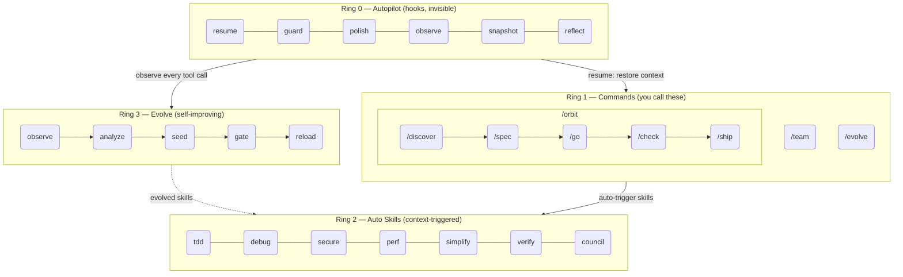
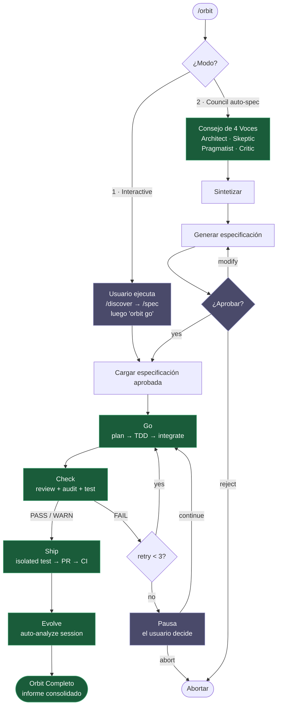

# epic harness

> Un arnés de agente de codificación IA autoelusivo — 8 comandos, 1 pipeline autónomo, habilidades de activación automática, aprende de tus fallos.

**8 comandos. Habilidades de activación automática. Autoelusivo.**

<p align="center">
<a href="../../README.md">English</a> | <a href="../ja/README.md">日本語</a> | <a href="../ko/README.md">한국어</a> | <a href="../de/README.md">Deutsch</a> | <a href="../fr/README.md">Français</a> | <a href="../zh-CN/README.md">简体中文</a> | <a href="../zh-TW/README.md">繁體中文</a> | <a href="../pt-BR/README.md">Português</a> | <a href="../es/README.md">Español</a> | <a href="../hi/README.md">हिन्दी</a>
</p>

<p align="center">
  <a href="LICENSE"></a>
  
  
  
  <a href="https://buymeacoffee.com/epicsaga"></a>
</p>

Un plugin de Claude Code que **reemplaza más de 30 comandos con 8**, **activa habilidades automáticamente** según lo que estés haciendo, y **evoluciona nuevas habilidades** a partir de tus propios patrones de fallo. Menos superficie que memorizar. Más inteligencia por tecla pulsada.

<p align="center">
  
</p>

## Instalación

> **¿Primera vez?** Lee la [Guía de inicio rápido (5 min)](../../QUICKSTART.md).

```bash
# Claude Code
/plugin marketplace add epicsagas/plugins && /plugin install epic@epicsagas

# Cualquier otra herramienta
cargo install epic-harness && epic install
```

| Entorno | Método |
|---------|--------|
| **Claude Code** | Marketplace de plugins (arriba) |
| **macOS** | `brew install epicsagas/tap/epic-harness` |
| **Cualquiera (con Rust)** | `cargo install epic-harness` |
| **Desde el código fuente** | `git clone` + `cargo install --path .` |

Requisitos previos: **Git**. Las instalaciones desde el código fuente o binario también necesitan el [conjunto de herramientas de Rust](https://rustup.rs).

### `epic install` — asistente de configuración

Después de instalar el binario, ejecuta `epic install` (o `epic install claude`) para:

1. Crear la estructura de directorios `~/.harness/`
2. Sincronizar comandos, habilidades y agentes al directorio de configuración de la herramienta
3. Registrar el servidor MCP (harness-mem) para Claude Code
4. Crear `~/.harness/config.toml` con valores predeterminados si no existe

En Claude Code, `hooks/setup.sh` se ejecuta automáticamente al inicio de la sesión e instala el binario si falta. No se necesita ningún paso manual después del clon inicial.

### Otras herramientas

```bash
epic install codex        # Codex CLI   → ~/.codex/ + ~/.agents/skills/
epic install gemini       # Gemini CLI  → ~/.gemini/
epic install cursor       # Cursor      → ~/.cursor/ (requiere Cursor 1.7+)
epic install opencode     # OpenCode    → ~/.config/opencode/
epic install cline        # Cline       → ~/Documents/Cline/Rules/
epic install aider        # Aider       → ~/.aider.conf.yml + ~/.aider/
epic install              # Menú interactivo
```

Los archivos de integración se **sincronizan** desde el binario: los archivos faltantes u obsoletos se escriben. `GEMINI.md` y `AGENTS.md` solo se crean cuando están ausentes.

### Verificación

```bash
epic --version              # Binario instalado
ls ~/.harness/              # Directorio de datos existe
```

Dentro de una sesión de Claude Code: `/evolve status`

### Demostración rápida

**Un comando, pipeline completo:**
```bash
$ /orbit
# Elige el modo:
#   1. Interactivo  — ejecutas /discover + /spec, luego "orbit go"
#   2. Consejo      — el consejo de 4 voces genera la especificación, tú apruebas
→ spec aprobada → go (TDD) → check (PASS) → ship (PR + CI) → evolve
```

**O avanza paso a paso manualmente:**
```bash
$ /spec "Add JWT auth to the login API"
  → Aclara requisitos → produce SPEC-*.md

$ /go
  → Planifica automáticamente → subagentes TDD → DONE (4 min)

$ /check
  → Revisión de código + auditoría de seguridad + pruebas en paralelo → PASS

$ /ship
  → Crea PR → CI verde → fusionado
```

## Arquitectura: Modelo de 4 Anillos



## /orbit — Pipeline Autónomo

`/orbit` envuelve todo el pipeline manual en una única ejecución autónoma.



**Nodos morados** — puntos de control humanos: selección de modo, aprobación de especificación, pausa por 3 fallos de check.
**Nodos verdes** — autónomos: go, check, ship, evolve se ejecutan sin intervención del usuario.

Estado persistido en `$HARNESS_DIR/orbit/PIPELINE-{timestamp}.json` — sobrevive a la compactación del contexto.

## Comandos

| Comando | Qué hace |
|---------|----------|
| `/discover` | Explorar y definir el problema antes de especificar una solución — 5 Porqués, JTBD, cuestionamiento socrático |
| `/spec` | Definir qué construir — aclarar requisitos, producir una especificación |
| `/go` | Construirlo — planificación automática, subagentes TDD, modelo de resultado de 4 estados (DONE/CONCERNS/NEEDS_CONTEXT/BLOCKED), ejecución paralela con aislamiento de worktree |
| `/check` | Verificar — despacho experto adaptativo (basado en alcance), revisión de código + auditoría de seguridad + rendimiento en paralelo |
| `/ship` | Publicar — prueba de pre-vuelo aislada, luego PR, CI, fusión |
| `/team` | Crear y sincronizar equipos de agentes a nivel de organización entre proyectos |
| `/evolve` | Disparador manual de evolución / estado / rollback |
| `/orbit` | **Pipeline autónomo** — ejecuta spec → go → check → ship de una sola vez. Elige el modo interactivo o de consejo. |

---

## Habilidades Automáticas (Ring 2)

Las habilidades se activan automáticamente. No las invocas tú.

| Habilidad | Se activa cuando |
|-----------|-----------------|
| **tdd** | Implementación de nueva funcionalidad |
| **debug** | Fallo de prueba o error |
| **discover** | Solicitud vaga, solución sin problema, o queja desenfocada |
| **secure** | Código de Auth/DB/API/secrets modificado |
| **perf** | Bucles, consultas, código de renderizado |
| **simplify** | Archivo > 200 líneas o alta complejidad |
| **document** | API pública añadida o modificada |
| **verify** | Antes de completar /go o /ship |
| **context** | Ventana de contexto > 70% usada |
| **council** | Decisiones arquitectónicas o de diseño ambiguas |
| **agent-introspection** | Autodepuración del agente tras fallos repetidos |

## Hooks (Ring 0)

Se ejecutan de forma invisible. Binario único de Rust (`epic-harness`) con subcomandos.

| Hook | Cuándo | Qué hace |
|------|--------|----------|
| **resume** | Inicio de sesión | Restaurar contexto, cargar memoria, detectar stack |
| **guard** | Antes de Bash | Bloquear force-push-to-main, rm -rf /, DROP prod |
| **polish** | Después de Edit | Autoformatear (Biome/Prettier/ruff/gofmt) + verificación de tipos |
| **observe** | Cada uso de herramienta | Registrar en `~/.harness/projects/{slug}/obs/` para evolución + sugerencias de GateGuard |
| **snapshot** | Antes de compactar | Guardar estado en `~/.harness/projects/{slug}/sessions/` |
| **reflect** | Fin de sesión | Analizar fallos, sembrar habilidades evolucionadas, puerta, extraer instintos |

Polish retroalimenta en observe: fallo de formato → `lint_fail`, error de TypeScript → `build_fail`. El thrashing Edit→Error se detecta incluso cuando los errores provienen de polish.

Cada sesión escribe su propio `session_{date}_{pid}_{random}.jsonl` — múltiples sesiones en el mismo proyecto no corromperán los datos de las demás.

### Perfiles de Hook

Mediante `~/.harness/config.toml` o la variable de entorno `EPIC_HOOK_PROFILE`:

| Perfil | Hooks activos |
|--------|--------------|
| `minimal` | guard, observe, resume |
| `standard` (predeterminado) | los anteriores + polish, reflect, snapshot |
| `strict` | todos los hooks + futuras verificaciones solo de strict |

### Reglas de Guard personalizadas

Añade reglas específicas del proyecto mediante `.harness/guard-rules.yaml` en la raíz de tu proyecto:

```yaml
blocked:
  - pattern: kubectl\s+delete\s+namespace | msg: Namespace deletion blocked
warned:
  - pattern: docker\s+system\s+prune | msg: Docker prune — verify first
```

## Equipo (`epic team`)

Los equipos son de **nivel de organización**, no están vinculados al proyecto. Ejecutar `/team` en cualquier proyecto enriquece un grupo compartido de definiciones de agentes — nunca sobrescribe silenciosamente.

```bash
epic team                              # Interactivo: escanear → diseñar → escribir → sincronizar
epic team sync backend                 # Despachar agentes → .claude/agents/backend/
epic team link backend                 # Despachar + registrar proyecto en la configuración del equipo
epic team list                         # Todos los equipos en la organización actual
epic team list --org netflix           # Equipos en una organización nombrada
epic team show backend --playbook      # Configuración + playbook completo
epic team delete backend               # Retirar del proyecto actual solo
epic team delete backend --global      # Eliminar permanentemente del almacén de la organización
```

Después de sincronizar, los agentes están disponibles en la próxima sesión: `@domain-expert`, `@reviewer`, `@tester`, etc.

| Tipo | Palabra clave | Agentes predeterminados |
|------|--------------|------------------------|
| Alineado con el flujo | `stream` | domain-expert, reviewer, tester |
| Plataforma | `platform` | api-designer, infra-specialist, dx-agent |
| Habilitador | `enabling` | specialist |
| Subsistema complicado | `subsystem` | domain-specialist, integration-tester |

Multi-organización: `epic team --org netflix` — topología separada por organización.

Estrategia de fusión: los agentes modificados solicitan confirmación (predeterminado: mantener existente, respaldar en `.history/`). El playbook siempre se añade.

## Soporte Multi-Herramienta

Todas las herramientas comparten el mismo directorio de datos `~/.harness/projects/{slug}/`.

| Herramienta | Ring 0 Hooks | Comandos | Habilidades | Agentes |
|-------------|-------------|----------|-------------|---------|
| **Claude Code** | ✓ Completo | ✓ 8 comandos (incl. /orbit) | ✓ 11 habilidades | ✓ 4 |
| **Codex CLI** | ✓ Completo¹ | ✓ 8 prompts (incl. /orbit) | ✓ 7 | ✓ 4 |
| **Gemini CLI** | ✓ Parcial² | ✓ 8 comandos (incl. /orbit) | ✓ 7 | ✓ 4 |
| **Cursor** | ✓ Completo³ | ✓ 8 comandos (incl. /orbit) | ✓ vía rules | ✓ 4 |
| **OpenCode** | ✓ Parcial⁴ | ✓ 8 comandos (incl. /orbit) | — | ✓ 4 |
| **Cline** | ✓ Completo⁵ | — | — | — |
| **Aider** | —⁶ | — | — | — |

¹ `codex_hooks = true` en `~/.codex/config.toml` · ² Guard al nivel `BeforeModel` · ³ Cursor 1.7+ · ⁴ Plugin JS · ⁵ 5 scripts de hook · ⁶ Solo convenciones

## Memoria Unificada — WIP

> **Estado: En desarrollo.** Aún no es completamente funcional. Los comandos CLI, herramientas MCP y la interfaz web están en proceso.

Todos los agentes comparten un grafo de conocimiento en `~/.harness/memory.db` (SQLite con búsqueda de texto completo). Sin tiempo de ejecución externo.

```
score = recency(25%) + importance(35%) + access_frequency(15%) + FTS_match(25%)
```

### CLI

```bash
epic mem recall "auth refactor" --project my-project   # Recuperación inteligente
epic mem add --title "JWT rotation" --type decision    # Añadir nodo
epic mem search "JWT"                                  # Búsqueda FTS5
epic mem query --type decision --project my-project    # Filtrar
epic mem context --project my-project                  # Contexto del proyecto
epic mem serve                                         # Interfaz web → :7700
epic mem mcp-install                                   # Registrar servidor MCP
epic mem export --out ./docs/memory                    # Exportar a Markdown
```

### Herramientas MCP (6)

| Herramienta | Propósito |
|-------------|----------|
| `mem_recall` | Recuperación contextual inteligente con hint + project + vecinos del grafo |
| `mem_add` | Añadir nodo con importancia automática por tipo (o explícita 0.0–1.0) |
| `mem_search` | Búsqueda por palabra clave (texto completo), clasificada por importancia |
| `mem_query` | Filtrar por etiqueta/tipo/proyecto |
| `mem_context` | Recuperación inteligente con ámbito de proyecto (sin hint) |
| `mem_related` | Traversal del grafo desde un ID de nodo (encuentra conocimiento conectado) |

### Tipos de Nodo

| Tipo | Creado por | Importancia |
|------|-----------|-------------|
| `decision` | Manual / MCP | 0.9 |
| `resolution` | Manual / MCP | 0.8 |
| `concept` | Manual / MCP | 0.7 |
| `project` | Manual / MCP | 0.7 |
| `instinct` | Auto (reflect) | 0.7 |
| `pattern` | Auto (reflect) | 0.5 |
| `error` | Auto (reflect) | 0.4 |
| `session` | Auto (reflect) | 0.2 |

Ciclo de vida: más de 30 días sin acceso → 10% de decaimiento de importancia (mínimo 0.05). Más de 180 días → etiquetado como `stale`, excluido de la recuperación. La etiqueta `pinned` evita el decaimiento.

## Evolve (Ring 3)

Fusiona los patrones de evolución automatizada de [A-Evolve](https://github.com/A-EVO-Lab/a-evolve) en el sistema de hooks de Claude Code.

### Puntuación

Cada llamada de herramienta se puntúa en 3 ejes (pesos configurables mediante `~/.harness/config.toml`):

```
composite = 0.5 × tool_success + 0.3 × output_quality + 0.2 × execution_cost
```

Clasificación de fallos (9 tipos): `type_error` · `syntax_error` · `test_fail` · `lint_fail` · `build_fail` · `permission_denied` · `timeout` · `not_found` · `runtime_error`

### Detección de Patrones

| Patrón | Detecta | Umbral predeterminado |
|--------|---------|----------------------|
| `repeated_same_error` | El mismo error N+ veces | 3 |
| `fix_then_break` | Éxito de edición → fallos de build/test | 3 lookahead, 2 ciclos |
| `long_debug_loop` | Atascado en el mismo archivo | 5 operaciones |
| `thrashing` | Alternancia Edit↔Error | 3 ediciones, 3 errores |

### Flujo de Evolución

```
Observe (PostToolUse — puntuación en 3 ejes)
    ↓ obs/session_{id}.jsonl
Analyze (SessionEnd)
    ↓ puntuaciones por herramienta, por extensión + patrones
Propose (Solver — graduado por puntuación: ≥0.90 omitir, ≥0.70 moderado, <0.70 completo)
    ↓ SkillProposal[] con confianza
Curate (Aceptar/Fusionar/Omitir, retroalimentación enmascarada del solver)
    ↓ evolved/{skill}/SKILL.md + meta.json
Gate (verificación de formato, dedup, límite 10, promoción con puerta ≥ 3 sesiones)
    ↓ evolved_backup/ (mejor punto de control)
Instinct (patrones de alto éxito → nodos cross-project memory.db)
    ↓
Reload (siguiente sesión — resume carga habilidades evolucionadas)
```

Siembra de habilidades: herramienta débil (éxito <60%, mín. 5 obs), tipo de archivo débil (éxito <50%, mín. 3 obs), error de alta frecuencia (5+ ocurrencias).

Estancamiento: 3 sesiones sin una mejora del 5% → rollback automático al mejor punto de control.

```bash
/evolve              # Ejecutar ahora
/evolve status       # Panel: puntuaciones, tendencias, patrones, habilidades
/evolve history      # Historial completo + efectividad de habilidades
/evolve cross-project # Análisis de patrones entre proyectos
/evolve rollback     # Restaurar el mejor anterior
/evolve reset        # Borrar todos los datos de evolución
```

### Efectividad de Habilidades

Cada habilidad evolucionada se rastrea con atribución A/B:

```
/evolve history → Skill Effectiveness

| Skill              | With | Without | Delta |
|--------------------|------|---------|-------|
| evo-ts-care        | 0.87 | 0.72    | +15%  |
| evo-bash-discipline| 0.65 | 0.68    | -3%   |
```

Delta positivo = efectivo. Negativo = considera eliminarlo mediante `/evolve rollback`.

### Presets de Inicio en Frío

En la primera sesión, los presets de habilidades apropiados para el stack se aplican automáticamente:

| Stack | Presets |
|-------|---------|
| Node.js/TypeScript | `evo-ts-care`, `evo-fix-build-fail` |
| Go | `evo-go-care` |
| Python | `evo-py-care` |
| Rust | `evo-rs-care` |

### Aprendizaje de Instintos

Los patrones de alto éxito se extraen y promueven entre proyectos:

```
observe (100% confirmado) → extract_instincts() → instinct node (confianza ≥ 0.8)
    → promover a global cuando se observe en ≥ 2 proyectos
```

## Aprendizaje Entre Proyectos

Activa para compartir patrones de fallo entre proyectos:

```bash
touch ~/.harness/projects/{slug}/.cross-project-enabled
```

Fin de sesión → exporta patrones anonimizados a `~/.harness/global_patterns.jsonl`. Inicio de sesión → muestra sugerencias de las áreas débiles de otros proyectos.

## Datos del Proyecto

Todos los datos viven en `~/.harness/` (directorio de inicio), no en la raíz de tu proyecto. Sobrevive a la eliminación del proyecto, no contamina el historial de git.

```
~/.harness/
├── memory.db                  # Grafo de conocimiento SQLite (nodos + aristas + FTS5)
├── graph.json                 # Grafo en caché (para la interfaz web)
├── config.toml                # Configuración del usuario
├── global_patterns.jsonl      # Patrones entre proyectos (opt-in)
├── orgs/                      # Almacén global del equipo
│   └── {org}/teams/{team}/
│       ├── config.json, mission.md, playbook.md, agents/, .history/
└── projects/{slug}/
    ├── memory/                # Patrones y reglas del proyecto
    ├── sessions/              # Snapshots de sesión (para resume)
    ├── obs/                   # Registros de observación de uso de herramientas (JSONL)
    ├── evolved/               # Habilidades autoevolucionadas
    │   ├── manifest.json
    │   └── {skill}/SKILL.md + meta.json
    ├── evolved_backup/        # Mejor punto de control (para rollback)
    ├── dispatch/              # Registros de despacho de habilidades
    ├── evolution.jsonl        # Historial completo de evolución
    └── metrics.json           # Estadísticas agregadas + atribución de habilidades
```

Comparte reglas de seguridad con tu equipo: `.harness/guard-rules.yaml` en la raíz del proyecto (comprometido en git).

## Configuración

Todos los parámetros ajustables en `~/.harness/config.toml`. Ausente = valores predeterminados en el código.

```toml
# Prioridad: variable de entorno (EPIC_HOOK_PROFILE) > este archivo > valores predeterminados

[hook]
profile = "standard"         # "minimal" | "standard" | "strict"
gateguard_hints = true

[scoring]
weights = [0.5, 0.3, 0.2]   # [success, quality, cost]

[evolution]
max_skills = 10
stagnation_limit = 3
improvement_threshold = 0.05
gated_promotion_min = 3

[pattern]
# repeated_error_min = 3
# debug_loop_min = 5
# graduated_scope_skip = 0.90
# graduated_scope_moderate = 0.70

[instinct]
# confidence_threshold = 0.8
# promotion_min_projects = 2
# max_instincts = 20
# min_observations = 10
# min_avg_score = 0.5
```

## Desarrollo

```bash
cargo install --path .                                        # Compilar + instalar
cp ~/.cargo/bin/epic-harness hooks/bin/epic-harness           # Actualizar binario del plugin
cargo test                                                    # Pruebas
```

Los hooks buscan el binario en dos lugares: `hooks/bin/epic-harness` (plugin local) → `~/.cargo/bin/epic-harness` (PATH).

## Enlaces

- [Changelog](../../CHANGELOG.md) — historial de versiones
- [Contributing](../../CONTRIBUTING.md) — cómo contribuir
- [Security](../../SECURITY.md) — reportar vulnerabilidades
- [Issues](https://github.com/epicsagas/epic-harness/issues) — informes de errores y solicitudes de funciones

## Agradecimientos

- [a-evolve](https://github.com/A-EVO-Lab/a-evolve) — Patrones de evolución automatizada y benchmarks
- [agent-skills](https://github.com/addyosmani/agent-skills) — Sistema de habilidades de agente de Claude Code
- [everything-claude-code](https://github.com/affaan-m/everything-claude-code) — Patrones exhaustivos de Claude Code
- [gstack](https://github.com/garrytan/gstack) — Referencia de arquitectura de plugins
- [harness](https://github.com/revfactory/harness) — Patrones de infraestructura de hooks y arnés
- [serena](https://github.com/oraios/serena) — Diseño de agentes autónomos
- [SuperClaude Framework](https://github.com/SuperClaude-Org/SuperClaude_Framework) — Arquitectura de marco multi-comando
- [superpowers](https://github.com/obra/superpowers) — Patrones de extensión de Claude Code

## Licencia

[Apache 2.0](../../LICENSE)
