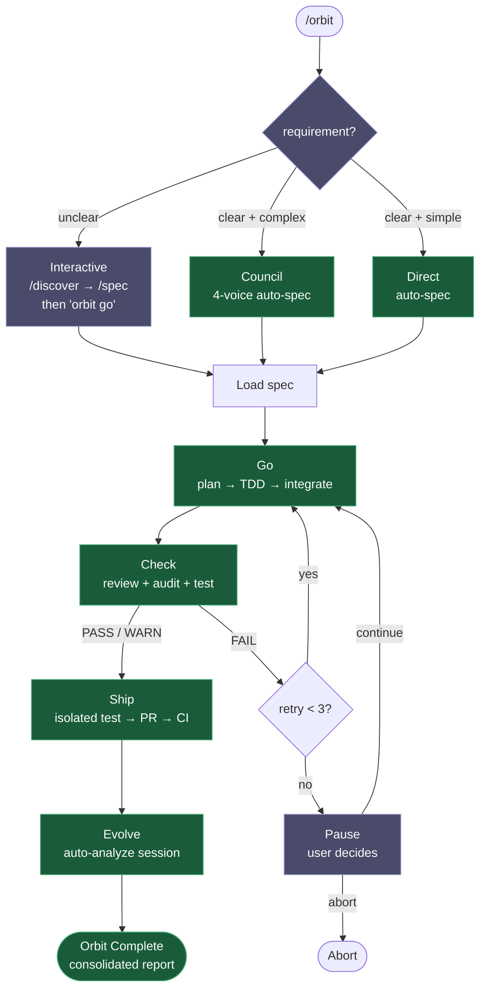
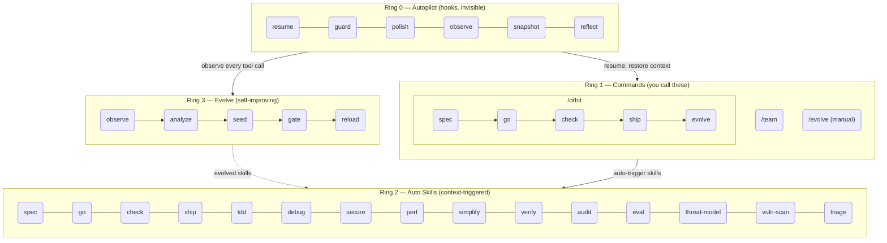

<h1 align="center">Epic Harness</h1>

<blockquote><p align="center">Un arnés de agente de codificación IA autoevolutivo — 3 comandos, 26 skills, 1 pipeline autónomo, aprende de tus fallos.</p></blockquote>

<p align="center"><b>Menos que memorizar. Más inteligencia por tecla pulsada. Se vuelve más inteligente cada sesión.</b></p>

<p align="center">
<a href="../../README.md">English</a> | <a href="../ja/README.md">日本語</a> | <a href="../ko/README.md">한국어</a> | <a href="../de/README.md">Deutsch</a> | <a href="../fr/README.md">Français</a> | <a href="../zh-CN/README.md">简体中文</a> | <a href="../zh-TW/README.md">繁體中文</a> | <a href="../pt-BR/README.md">Português</a> | <a href="../es/README.md">Español</a> | <a href="../hi/README.md">हिन्दी</a>
</p>

<p align="center">
  <a href="https://github.com/epicsagas/epic-harness/stargazers"></a>
  <a href="https://github.com/epicsagas/epic-harness/network/members"></a>
  <a href="https://github.com/epicsagas/epic-harness/issues"></a>
  <a href="https://github.com/epicsagas/epic-harness/commits/main"></a>
</p>
<p align="center">
  <a href="../../LICENSE"></a>
  
  
  
  <a href="https://buymeacoffee.com/epicsaga"></a>
</p>

Un plugin de Claude Code que **consolida más de 30 comandos en 3 comandos + 26 skills de activación automática**, y **evoluciona nuevas habilidades** a partir de tus propios patrones de fallo.

<p align="center">
  
</p>

---


### Panel web — se inicia automáticamente al comenzar la sesión

10 pantallas con métricas en tiempo real para puntuaciones eval, estadísticas de herramientas, pipelines de orbit, habilidades evolucionadas y estado de hooks. Se abre automáticamente con la primera sesión de Claude Code — sin configuración manual necesaria.

<p align="center">
  
  
</p>

```bash
# Se inicia automáticamente en la primera sesión (predeterminado: http://localhost:7700)
# Configura el puerto o desactívalo en ~/.harness/config.toml:
[dashboard]
port = 7700       # establece a 0 para desactivar el inicio automático
auto_open = true  # abrir navegador en la primera sesión
```

Pantallas: **Dashboard** · Pipeline de /orbit · Comandos (3) · Skills (26) · Agentes en vivo · Eval & Evolve · Hooks (6) · Integraciones (6) · harness-mem · Configuración

---

## Qué hace

Un comando lleva una funcionalidad de extremo a extremo. Las habilidades se activan sin que tú las pidas. El agente se vuelve más inteligente después de cada sesión.

```bash
$ /orbit "Agregar autenticación JWT a la API de login"
→ spec approved → go (TDD subagents) → check (PASS) → ship (PR + CI) → evolve
```

O invoca las skills del pipeline directamente:

```bash
/spec "Agregar autenticación JWT a la API de login"   # aclara requisitos → SPEC-*.md
/go                                                     # planificación automática → subagentes TDD → 4 min
/check                                                  # revisión paralela + seguridad + pruebas → PASS
/ship                                                   # prueba aislada → PR → CI en verde
```

Las habilidades se activan automáticamente en segundo plano — sin comandos extra:

```
¿Construyendo una funcionalidad?   → tdd se activa (Red→Green→Refactor obligatorio)
¿Falló una prueba?                 → debug se activa (primero causa raíz, sin parches al azar)
¿Tocaste auth o BD?                → secure se activa (checklist OWASP, sin atajos)
¿Archivo con más de 200 líneas?    → simplify se activa (extraer, renombrar, reducir)
```

Al cerrar la sesión, el **bucle evolve** analiza qué falló, genera habilidades enfocadas y las carga en la siguiente sesión. El agente que tuvo problemas con fallos de build de TypeScript tendrá una habilidad `evo-ts-care` la próxima vez.

---

## Instalación

> **¿Primera vez?** Lee la [Guía de inicio rápido (5 min)](../../docs/quickstart.md).

epic-harness se distribuye como **plugin** — las skills, hooks y el servidor MCP `harness-mem` se cargan directamente desde el diseño del plugin (`skills/`, `hooks.json`, `.mcp.json`). No hay subcomando `install`; cada herramienta lee el plugin desde el disco.

### Claude Code (recomendado)

```
/plugin marketplace add epicsagas/plugins
/plugin install epic@epicsagas
```

Instala automáticamente el binario, las skills, los hooks y el servidor MCP `harness-mem` en un solo paso.

### agy (Antigravity CLI)

```bash
agy plugin install .
```

Las 27 skills, los hooks y el servidor MCP `harness-mem` se descubren automáticamente desde `plugin.json` + `skills/` + `hooks.json` + `.mcp.json` del plugin.

### Codex CLI

```bash
codex plugin marketplace add epicsagas/plugins
```

Las skills y agentes están disponibles inmediatamente — no se necesitan pasos adicionales.

### Solo binario (sin host de plugin)

```bash
brew install epicsagas/tap/epic-harness      # macOS / Linux (Homebrew)
cargo binstall epic-harness                  # binario precompilado (Rust)
cargo install epic-harness                   # compilar desde el código fuente
```

¿No tienes Homebrew? Usa el script de instalación:

```bash
curl --proto '=https' --tlsv1.2 -LsSf \
  https://github.com/epicsagas/epic-harness/releases/latest/download/install.sh | sh
```

Windows:

```powershell
irm https://github.com/epicsagas/epic-harness/releases/latest/download/install.ps1 | iex
```

El binario crea automáticamente `~/.harness/config.toml` y `HARNESS.md` en la primera ejecución del hook — sin asistente de configuración ni paso `install`.

> `epic-harness --version` para verificar. Actualiza con `brew upgrade epic-harness` o vuelve a ejecutar el script de instalación.

Requisitos previos: **Git**. Las instalaciones desde el código fuente o binario también necesitan el [toolchain de Rust](https://rustup.rs).

### Verificación

```bash
epic --version              # Binario instalado
ls ~/.harness/              # Directorio de datos (creado automáticamente en la primera sesión)
```

Dentro de una sesión de Claude Code: `/evolve status`

> **Telemetría**: los informes de uso están activados por defecto (opt-out). Alterna con `epic-harness telemetry status|on|off`.

---

## Telemetría

epic-harness recopila **telemetría anónima** de uso por defecto (opt-out) para mejorar la fiabilidad de los hooks y la evolución de skills. Los eventos se envían a Posthog.

**Lo que recopilamos:** nombre del comando, duración, resultado (éxito/fallo), clase de fallo y eventos de bloqueo/fallo de hooks — además de `product`, `product_version`, `os` y un `install_id` aleatorio (UUID generado en la primera ejecución, almacenado en `~/.config/epic-harness/install-id`).

**Lo que nunca recopilamos:** código fuente, contenido de archivos, rutas de archivos, variables de entorno, secretos ni información de identificación personal.

**Control:**

```bash
epic-harness telemetry status   # mostrar el consentimiento actual
epic-harness telemetry off      # desactivar (detiene todo el envío)
epic-harness telemetry on       # reactivar
```

El consentimiento se almacena en `~/.config/epic-harness/telemetry-consent`. Cuando está off, no se envía telemetría.

---

## Comandos

| Comando | Qué hace |
|---------|----------|
| `/orbit` | **Pipeline autónomo completo**: spec → go → check → ship → evolve en una sola ejecución |
| `/team` | Explorar librerías de la organización, contratar equipos existentes o diseñar nuevos (3–6 agentes, sincronizados a `.claude/agents/`) |
| `/evolve` | Disparador manual de evolución — analizar sesiones, ver panel, inspeccionar efectividad de habilidades, rollback |

Las etapas del pipeline (`/spec`, `/go`, `/check`, `/ship`, `/discover`) ahora son **skills** — se activan automáticamente según el contexto o se pueden invocar por nombre. Los nombres antiguos de comandos siguen funcionando mediante enrutamiento de alias.

---

## /orbit — Pipeline Autónomo

`/orbit` envuelve todo el pipeline en una única ejecución autónoma. Elige un modo — todo lo demás es automático hasta el PR.



**Morado** — pasos humanos: selección de modo (requerimiento poco claro → interactivo), pausa por 3 fallos de check.
**Verde** — claro + complejo → council auto-spec; claro + simple → construcción directa; ambos completamente autónomos.

Estado persistido en `$HARNESS_DIR/orbit/PIPELINE-{timestamp}.json` — sobrevive a la compactación del contexto.

> **Advertencias**: El agente puede omitir el pipeline cuando modifica orbit mismo o cuando solo edita documentación. Consulta [Problemas conocidos (Juicio del agente)](#problemas-conocidos-juicio-del-agente).

---

## Habilidades Automáticas (Ring 2)

Las habilidades se activan automáticamente según el contexto. No las invocas tú.

| Habilidad | Se activa cuando |
|-----------|-----------------|
| **spec** | Necesita definir requisitos — convierte a documento R + AC numerado |
| **go** | Fase de build — planificación automática → sub-agentes TDD → ejecución paralela → verificación AC |
| **check** | Fase de revisión — revisión de código paralela + auditoría de seguridad + tests con extras por ámbito |
| **ship** | Fase de entrega — test aislado → PR con informe completo → monitorización CI + auto-fix |
| **audit** | Auditoría completa — revisión paralela de calidad de código + seguridad + tests con deduplicación semántica |
| **eval** | Evaluación de regresión de calidad con comparación de línea base — corrección, rendimiento, calidad |
| **tdd** | Implementación de nueva funcionalidad o corrección de errores |
| **debug** | Fallo de prueba o error en tiempo de ejecución |
| **discover** | Solicitud vaga, solución sin problema, queja desenfocada |
| **secure** | Código de auth / BD / API / secrets modificado |
| **threat-model** | Alcance de seguridad — enumeración de límites de confianza, actores de amenazas, escenarios → THREAT_MODEL.md |
| **vuln-scan** | Escaneo sistemático de vulnerabilidades — inyección, auth, exposición de datos, dependencias → VULN-FINDINGS.json |
| **triage** | Validación adversarial — ajuste de severidad, análisis de encadenamiento, agrupación por causa raíz → TRIAGE.json |
| **perf** | Bucles, consultas, renderizado, operaciones por lotes |
| **simplify** | Archivo > 200 líneas o alta complejidad ciclomática |
| **document** | API pública añadida o firma modificada |
| **verify** | Antes de completar `/go` o `/ship` |
| **context** | Ventana de contexto > 70% |
| **council** | Decisiones arquitectónicas o de diseño ambiguas |
| **orchestrate** | Estado de orquestación multi-agente e intervención de agentes en tiempo real |
| **agent-introspection** | 3+ fallos consecutivos o patrón de reintentos circular |
| **reflect** | Bajo demanda: ¿estás usando la IA como amplificador del pensamiento? Autoevaluación fría basada en evidencia |
| **commit** | Generación de Conventional Commits — creado automáticamente desde git diff |

> **Nota sobre presupuesto de tokens:** Claude Code carga las descripciones de skills en el contexto de cada sesión. Las 26 skills de epic caben dentro del `skillListingBudgetFraction: 0.01` predeterminado (1%). Si instalas skills adicionales (ej. episteme, alcove, obscura), el total combinado puede exceder el presupuesto y provocar una advertencia de "descriptions dropped". Añade esto a `~/.claude/settings.json` para solucionarlo:
>
> ```json
> "skillListingBudgetFraction": 0.02
> ```
>
> Usa `0.03` si tienes más de 20 skills instaladas.

---

## Evolve (Ring 3)

El arnés monitorea cada llamada de herramienta, la puntúa en 3 ejes, detecta patrones de fallo y genera habilidades enfocadas — automáticamente, al final de la sesión.

### Puntuación

```
composite = 0.5 × tool_success + 0.3 × output_quality + 0.2 × execution_cost
```

Clasificación de fallos (9 tipos): `type_error` · `syntax_error` · `test_fail` · `lint_fail` · `build_fail` · `permission_denied` · `timeout` · `not_found` · `runtime_error`

### Detección de Patrones

| Patrón | Detecta | Umbral predeterminado |
|--------|---------|----------------------|
| `repeated_same_error` | Mismo error N+ veces | 3 |
| `fix_then_break` | Éxito de edición → fallo de build/test | 3 lookback, 2 ciclos |
| `long_debug_loop` | Atascado en el mismo archivo | 5 operaciones |
| `thrashing` | Alternancia Edit↔Error | 3 ediciones, 3 errores |

### Flujo de Evolución

```
Observe (PostToolUse — puntuación en 3 ejes)
    ↓ obs/session_{id}.jsonl
Analyze (SessionEnd)
    ↓ puntuaciones por herramienta, por extensión + patrones
Propose (Solver — graduado por puntuación: ≥0.90 omitir, ≥0.70 moderado, <0.70 completo)
    ↓ SkillProposal[] con confianza
Curate (Aceptar/Fusionar/Omitir, retroalimentación enmascarada del solver)
    ↓ evolved/{skill}/SKILL.md + meta.json
Gate (verificación de formato, dedup, límite 10, promoción con puerta ≥ 3 sesiones)
    ↓ evolved_backup/ (mejor punto de control)
Instinct (patrones de alto éxito → nodos cross-project memory.db)
    ↓
Reload (siguiente sesión — resume carga habilidades evolucionadas)
```

Siembra de habilidades: herramienta débil (éxito <60%, mín. 5 obs), tipo de archivo débil (éxito <50%, mín. 3 obs), error de alta frecuencia (5+ ocurrencias).

Estancamiento: 3 sesiones sin una mejora del 5% → rollback automático al mejor punto de control.

### Optimización Inspirada en SkillOpt

Tres técnicas inspiradas en deep learning adaptadas de [SkillOpt](https://arxiv.org/abs/2605.23904):

| Técnica | Cómo funciona |
|----------|--------------|
| **Búfer de Retroalimentación Negativa** | Las propuestas rechazadas se almacenan con expiración basada en TTL; las propuestas futuras se verifican contra el búfer antes de la generación |
| **Reflexión por Minilotes** | Las observaciones se descomponen en lotes de tamaño fijo para extracción de patrones estructurales; reutilizables cuando el error dominante ≥60% + ≥2 archivos distintos |
| **Actualización Lenta/Meta** | Regresión lineal sobre las últimas 5 sesiones clasifica las épocas como Improving / Regressing / PersistentFailure / StableSuccess; auto-evicta skills con bajo rendimiento |

### Auto-Ajuste de Prompts

Las habilidades evolucionadas con bajo rendimiento reciben orientación de ajuste dirigida que se añade después del delimitador `<!-- auto-tuned -->`. El contenido original nunca se modifica. 3 sesiones consecutivas en declive → rollback automático del ajuste, historial limpiado.

### Efectividad de Habilidades

Cada habilidad evolucionada se rastrea con atribución A/B:

```
/evolve history → Skill Effectiveness

| Skill              | With | Without | Delta |
|--------------------|------|---------|-------|
| evo-ts-care        | 0.87 | 0.72    | +15%  |
| evo-bash-discipline| 0.65 | 0.68    | -3%   |
```

Delta positivo = efectiva. Negativo = considera eliminarla mediante `/evolve rollback`.

### Presets de Inicio en Frío

En la primera sesión, los presets de habilidades apropiados para el stack se aplican automáticamente:

| Stack | Presets |
|-------|---------|
| Node.js/TypeScript | `evo-ts-care`, `evo-fix-build-fail` |
| Go | `evo-go-care` |
| Python | `evo-py-care` |
| Rust | `evo-rs-care` |

### Aprendizaje de Instintos

Los patrones de alto éxito se extraen y promocionan entre proyectos:

```
observe (100% confirmado) → extract_instincts() → instinct node (confianza ≥ 0.8)
    → promover a global cuando se observe en ≥ 2 proyectos
```

```bash
/evolve              # Ejecutar ahora
/evolve status       # Panel: puntuaciones, tendencias, patrones, habilidades
/evolve history      # Historial completo + efectividad de habilidades
/evolve cross-project # Análisis de patrones entre proyectos
/evolve rollback     # Restaurar el mejor anterior
/evolve reset        # Borrar todos los datos de evolución
```

---

## Pipeline de Seguridad

Pipeline de evaluación de vulnerabilidades en tres etapas adaptado de [defending-code](https://github.com/anthropics/defending-code-reference-harness):

```bash
/threat-model    # 1. Límites de confianza, actores de amenazas, escenarios → THREAT_MODEL.md
/vuln-scan       # 2. Escáner de 4 dimensiones (inyección, auth, exposición de datos, dependencias) → VULN-FINDINGS.json
/triage          # 3. Validación adversarial, ajuste de severidad, encadenamiento → TRIAGE.json
```

### Modo Audit `--strict`

Para evaluaciones de seguridad, el modo `--strict` impone independencia entre los modos de auditoría:
- Los revisores de código, seguridad y tests reciben solo el diff + spec — sin contexto del builder
- Independencia de verificación cruzada: los modos se ejecutan a ciegas hasta la síntesis
- Puntuación ciega para prevenir sesgo de anclaje

Contexto de engagement opcional mediante `.harness/engagement.md` en la raíz del proyecto (autorización, alcance, restricciones, exclusiones). Consulta `docs/references/engagement.md` para la plantilla.

---

## Hooks (Ring 0)

Se ejecutan de forma invisible en cada sesión. Binario único de Rust (`epic-harness`) con subcomandos.

| Hook | Cuándo | Qué hace |
|------|--------|----------|
| **resume** | Inicio de sesión | Restaurar contexto, cargar memoria, detectar stack |
| **guard** | Antes de Bash | Bloquear force-push-to-main, `rm -rf /`, DROP prod |
| **polish** | Después de Edit | Autoformatear (Biome/Prettier/ruff/gofmt) + verificación de tipos |
| **observe** | Cada uso de herramienta | Registrar en `~/.harness/projects/{slug}/obs/` para evolución |
| **snapshot** | Antes de compactar | Guardar estado en `~/.harness/projects/{slug}/sessions/` |
| **reflect** | Fin de sesión | Analizar fallos, sembrar habilidades evolucionadas, gate, extraer instintos |

Polish retroalimenta en observe: fallo de formato → `lint_fail`, error de TypeScript → `build_fail`. El thrashing Edit→Error se detecta incluso cuando los errores provienen de polish.

Cada sesión escribe su propio `session_{date}_{pid}_{random}.jsonl` — múltiples sesiones concurrentes no corromperán los datos de las demás.

### Perfiles de Hook

Mediante `~/.harness/config.toml` o la variable de entorno `EPIC_HOOK_PROFILE`:

| Perfil | Hooks activos |
|--------|--------------|
| `minimal` | guard, observe, resume |
| `standard` (predeterminado) | los anteriores + polish, reflect, snapshot |
| `strict` | todos los hooks + futuras verificaciones solo de strict |

### Reglas de Guard Personalizadas

Añade reglas específicas del proyecto mediante `.harness/guard-rules.yaml` en la raíz de tu proyecto:

```yaml
blocked:
  - pattern: kubectl\s+delete\s+namespace | msg: Namespace deletion blocked
warned:
  - pattern: docker\s+system\s+prune | msg: Docker prune — verify first
```

---

## Equipo (`epic team`)

Los equipos son de **nivel de organización**, no están vinculados al proyecto. Ejecutar `/team` en cualquier proyecto enriquece un grupo compartido de definiciones de agentes — nunca sobrescribe silenciosamente.

```bash
epic team                              # Interactivo: escanear → diseñar → escribir → sincronizar
epic team sync backend                 # Despachar agentes → .claude/agents/backend/
epic team link backend                 # Despachar + registrar proyecto en la configuración del equipo
epic team list                         # Todos los equipos en la organización actual
epic team list --org netflix           # Equipos en una organización nombrada
epic team show backend --playbook      # Configuración + playbook completo
epic team delete backend               # Retirar del proyecto actual solo
epic team delete backend --global      # Eliminar permanentemente del almacén de la organización
```

Después de sincronizar, los agentes están disponibles en la próxima sesión: `@domain-expert`, `@reviewer`, `@tester`, etc.

| Tipo | Palabra clave | Agentes predeterminados |
|------|--------------|------------------------|
| Alineado con el flujo | `stream` | domain-expert, reviewer, tester |
| Plataforma | `platform` | api-designer, infra-specialist, dx-agent |
| Habilitador | `enabling` | specialist |
| Subsistema complicado | `subsystem` | domain-specialist, integration-tester |

Multi-organización: `epic team --org netflix` — topología separada por organización.

Estrategia de fusión: los agentes modificados solicitan confirmación (predeterminado: mantener existente, respaldar en `.history/`). El playbook siempre se añade.

---

## Soporte Multi-Herramienta

Todas las herramientas comparten el mismo directorio de datos `~/.harness/projects/{slug}/`.

| Herramienta | Ring 0 Hooks | Comandos | Habilidades | Agentes |
|-------------|-------------|----------|-------------|---------|
| **Claude Code** | ✓ Completo | ✓ 3 comandos (incl. /orbit) | ✓ 26 habilidades | Live |
| **Codex CLI** | ✓ Completo¹ | ✓ 3 prompts (incl. /orbit) | ✓ 26 | — |
| **Antigravity** | ✓ Parcial² | ✓ 3 comandos (incl. /orbit) | ✓ 26 | — |
| **Cursor** | ✓ Completo³ | ✓ 3 comandos (incl. /orbit) | ✓ vía rules | Live |
| **OpenCode** | ✓ Parcial⁴ | ✓ 3 comandos (incl. /orbit) | — | — |
| **Cline** | ✓ Completo⁵ | — | — | — |
| **Aider** | —⁶ | — | — | — |

¹ `codex_hooks = true` en `~/.codex/config.toml` · ² Instalación de plugin; soporte de subagente aún no disponible · ³ Cursor 1.7+ · ⁴ Plugin JS · ⁵ 5 scripts de hook · ⁶ Solo convenciones

---

## Arquitectura: Modelo de 4 Anillos



---

## Aprendizaje Entre Proyectos

Activa para compartir patrones de fallo entre proyectos:

```bash
touch ~/.harness/projects/{slug}/.cross-project-enabled
```

Fin de sesión → exporta patrones anonimizados a `~/.harness/global_patterns.jsonl`. Inicio de sesión → muestra sugerencias de las áreas débiles de otros proyectos.

---

## Memoria Unificada

Todos los agentes comparten un grafo de conocimiento en `~/.harness/memory.db` (SQLite con búsqueda de texto completo). Sin runtime externo.

```
score = recency(25%) + importance(35%) + access_frequency(15%) + FTS_match(25%)
```

### CLI

```bash
epic mem recall "auth refactor" --project my-project   # Recuperación inteligente
epic mem add --title "JWT rotation" --type decision    # Añadir nodo
epic mem search "JWT"                                  # Búsqueda FTS5
epic mem list --type decision --project my-project    # Filtrar
epic mem context --project my-project                  # Contexto del proyecto
epic mem serve                                         # Interfaz web → :7700 o puerto personalizado con --port 8800
epic mem mcp-install                                   # Registrar servidor MCP
epic mem export --out ./docs/memory                    # Exportar a Markdown
```

### Herramientas MCP (6)

| Herramienta | Propósito |
|-------------|----------|
| `mem_recall` | Recuperación contextual inteligente con hint + project + vecinos del grafo |
| `mem_add` | Añadir nodo con importancia automática por tipo (o explícita 0.0–1.0) |
| `mem_search` | Búsqueda por palabra clave (texto completo), clasificada por importancia |
| `mem_query` | Filtrar por etiqueta/tipo/proyecto |
| `mem_context` | Recuperación inteligente con ámbito de proyecto (sin hint) |
| `mem_related` | Traversal del grafo desde un ID de nodo (encuentra conocimiento conectado) |

### Tipos de Nodo

| Tipo | Creado por | Importancia |
|------|-----------|-------------|
| `decision` | Manual / MCP | 0.9 |
| `resolution` | Manual / MCP | 0.8 |
| `concept` | Manual / MCP | 0.7 |
| `project` | Manual / MCP | 0.7 |
| `instinct` | Auto (reflect) | 0.7 |
| `pattern` | Auto (reflect) | 0.5 |
| `error` | Auto (reflect) | 0.4 |
| `session` | Auto (reflect) | 0.2 |

Ciclo de vida: más de 30 días sin acceso → 10% de decaimiento de importancia (mínimo 0.05). Más de 180 días → etiquetado como `stale`, excluido de la recuperación. La etiqueta `pinned` evita el decaimiento.

---

<details>
<summary><strong>Datos del Proyecto — estructura de directorios</strong></summary>

## Datos del Proyecto

Todos los datos viven en `~/.harness/` (directorio home), no en la raíz de tu proyecto. Sobrevive a la eliminación del proyecto, no contamina el historial de git.

```
~/.harness/
├── memory.db                  # Grafo de conocimiento SQLite (nodos + aristas + FTS5)
├── graph.json                 # Grafo en caché (para la interfaz web)
├── config.toml                # Configuración del usuario
├── global_patterns.jsonl      # Patrones entre proyectos (opt-in)
├── orgs/                      # Almacén global del equipo
│   └── {org}/teams/{team}/
│       ├── config.json, mission.md, playbook.md, agents/, .history/
└── projects/{slug}/
    ├── memory/                # Patrones y reglas del proyecto
    ├── sessions/              # Snapshots de sesión (para resume)
    ├── obs/                   # Registros de observación de uso de herramientas (JSONL)
    ├── evolved/               # Habilidades autoevolucionadas
    │   ├── manifest.json
    │   └── {skill}/SKILL.md + meta.json
    ├── evolved_backup/        # Mejor punto de control (para rollback)
    ├── dispatch/              # Registros de despacho de habilidades
    ├── evolution.jsonl        # Historial completo de evolución
    └── metrics.json           # Estadísticas agregadas + atribución de habilidades
```

Comparte reglas de seguridad con tu equipo: `.harness/guard-rules.yaml` en la raíz del proyecto (comprometido en git).

</details>

---

<details>
<summary><strong>Configuración — referencia de config.toml</strong></summary>

## Configuración

Todos los parámetros ajustables en `~/.harness/config.toml`. Ausente = valores predeterminados en el código.

```toml
# Prioridad: variable de entorno (EPIC_HOOK_PROFILE) > este archivo > valores predeterminados

[hook]
profile = "standard"         # "minimal" | "standard" | "strict"
gateguard_hints = true

[scoring]
weights = [0.5, 0.3, 0.2]   # [success, quality, cost]

[evolution]
max_skills = 10
stagnation_limit = 3
improvement_threshold = 0.05
gated_promotion_min = 3

[pattern]
# repeated_error_min = 3
# debug_loop_min = 5
# graduated_scope_skip = 0.90
# graduated_scope_moderate = 0.70

[instinct]
# confidence_threshold = 0.8
# promotion_min_projects = 2
# max_instincts = 20
# min_observations = 10
# min_avg_score = 0.5
```

</details>

---

## Problemas conocidos (Juicio del agente)

Estos problemas surgen de la interpretación del contexto por parte del agente en lugar de errores en el código. Se listan aquí para que los usuarios sepan qué vigilar.

### Problemas descubiertos

| Problema | Cuándo | Qué sucede | Solución alternativa |
|----------|--------|------------|---------------------|
| **Omisión de autoduplicación en orbit** | Se pide a `/orbit` que mejore orbit mismo | El agente puede omitir el pipeline de orbit completamente y editar archivos ad-hoc en main, dejando cambios sin confirmar sin spec/PR/trazabilidad | Después de que orbit complete, verifica `git status`. Si hay cambios en main sin un estado de pipeline, confirma manualmente o vuelve a ejecutar `/orbit` desde una rama separada |
| **Tarea solo de docs omite el protocolo** | `/orbit` recibe un cambio solo de markdown (sin código para probar) | El agente puede juzgar las fases de TDD/test como innecesarias y omitir el pipeline completo | Aceptable para cambios puramente de documentación. Para código+docs mixtos, asegúrate de que el agente no omita las fases relacionadas con código |
| **Clasificación errónea de modo** | La solicitud está en el límite entre Direct y Council | El agente puede elegir Direct cuando Council (4 voces) capturaría más casos extremos, o Council cuando Direct bastaría | Si el agente elige un modo que no parece correcto, di "usa el modo Council" o "usa el modo Direct" explícitamente |

### Decisiones de diseño intencionales

Se consideraron para mejora pero se mantuvieron tal cual después de la evaluación:

| Decisión | Por qué no se mejoró | Fundamento |
|----------|---------------------|------------|
| **Worktree entra en la fase Go, no al inicio de orbit** | Podría aislar desde el preflight | Preflight/mode/spec son de solo lectura. Aislar antes añade complejidad sin beneficio — la rama no se crea hasta la fase Go de todos modos |
| **Worktree preservado después de Ship** | Podría eliminarse automáticamente al fusionar el PR | La rama es la cabeza del PR. Eliminarla antes de fusionar rompe el PR. La limpieza se deja al usuario después de la fusión |
| **Rama nombrada `orbit-{slug}` no `feature/{slug}`** | Podría coincidir con la nomenclatura convencional de ramas | `EnterWorktree` no permite `/` en los nombres. Renombrar post-creación añade un paso solo por beneficio cosmético |
| **Sin pipeline ligero para cambios de docs** | Podría detectar solo-docs y omitir TDD/tests | La detección es frágil (¿qué cuenta como "doc"?). Añadir una ruta separada aumenta la complejidad del protocolo para una ganancia marginal |

---

## Solución de problemas

<details>
<summary>command not found: epic después de instalar</summary>

Añade el directorio bin de Cargo a tu PATH:

```bash
export PATH="$HOME/.cargo/bin:$PATH"
```

Añade esta línea a tu `~/.zshrc` o `~/.bashrc` para hacerlo permanente.
</details>

<details>
<summary>Los hooks no se ejecutan en Claude Code</summary>

Reinstala el plugin para recargar los hooks:

```
/plugin install epic@epicsagas
```

Luego reinicia Claude Code. Los hooks se cargan desde el `hooks.json` del plugin.
</details>

<details>
<summary>Permission denied en macOS (Gatekeeper)</summary>

macOS puede bloquear binarios sin firma descargados de internet:

```bash
xattr -d com.apple.quarantine ~/.cargo/bin/epic-harness
xattr -d com.apple.quarantine ~/.cargo/bin/epic
```
</details>

<details>
<summary>epic: binario no encontrado dentro de los hooks del plugin</summary>

El plugin busca el binario primero en `hooks/bin/epic-harness`. Después de actualizar con `cargo install`, cópialo:

```bash
cp ~/.cargo/bin/epic-harness hooks/bin/epic-harness
```
</details>

---

## Desarrollo

```bash
cargo install --path .                                        # Compilar + instalar
cp ~/.cargo/bin/epic-harness hooks/bin/epic-harness           # Actualizar binario del plugin
cargo test                                                    # Pruebas
```

Los hooks buscan el binario en dos lugares: `hooks/bin/epic-harness` (plugin local) → `~/.cargo/bin/epic-harness` (PATH).

---

## Enlaces

- [Changelog](../../CHANGELOG.md) — historial de versiones
- [Contributing](../../CONTRIBUTING.md) — cómo contribuir
- [Security](../../SECURITY.md) — reportar vulnerabilidades
- [Issues](https://github.com/epicsagas/epic-harness/issues) — informes de errores y solicitudes de funcionalidades

## Agradecimientos

- [a-evolve](https://github.com/A-EVO-Lab/a-evolve) — Patrones de evolución automatizada y benchmarks
- [agent-skills](https://github.com/addyosmani/agent-skills) — Sistema de habilidades de agente de Claude Code
- [everything-claude-code](https://github.com/affaan-m/everything-claude-code) — Patrones exhaustivos de Claude Code
- [gstack](https://github.com/garrytan/gstack) — Referencia de arquitectura de plugins
- [harness](https://github.com/revfactory/harness) — Patrones de infraestructura de hooks y arnés
- [serena](https://github.com/oraios/serena) — Diseño de agentes autónomos
- [SuperClaude Framework](https://github.com/SuperClaude-Org/SuperClaude_Framework) — Arquitectura de framework multi-comando
- [superpowers](https://github.com/obra/superpowers) — Patrones de extensión de Claude Code

## Licencia

[Apache 2.0](../../LICENSE)
