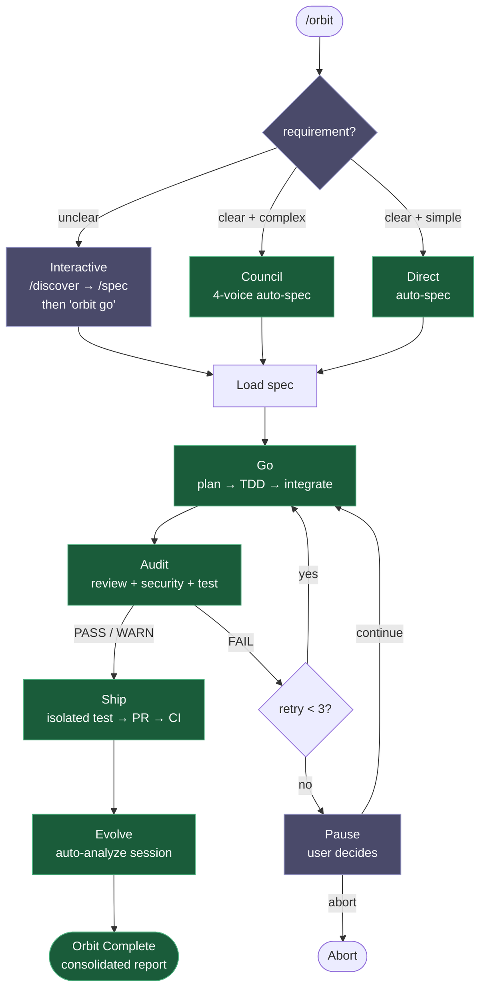
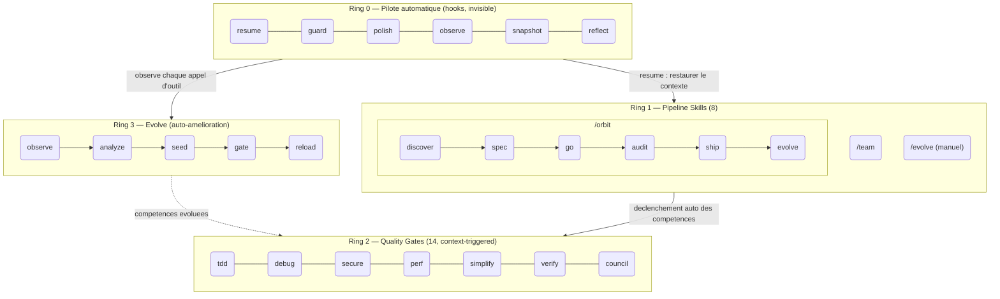

<h1 align="center">Epic Harness</h1>

<blockquote><p align="center">Un harnais d'agent IA multi-outil qui apprend de chaque session — 22 skills, pipelines autonomes et moteur auto-evolutif.</p></blockquote>

<p align="center"><b>Un harnais, cinq outils IA. Autonome du spec au PR. Plus intelligent a chaque session.</b></p>

<p align="center">
<a href="../../README.md">English</a> | <a href="../ja/README.md">日本語</a> | <a href="../ko/README.md">한국어</a> | <a href="../de/README.md">Deutsch</a> | <a href="./README.md">Francais</a> | <a href="../zh-CN/README.md">简体中文</a> | <a href="../zh-TW/README.md">繁體中文</a> | <a href="../pt-BR/README.md">Portugues</a> | <a href="../es/README.md">Espanol</a> | <a href="../hi/README.md">हिन्दी</a>
</p>

<p align="center">
  <a href="https://github.com/epicsagas/epic-harness/stargazers"></a>
  <a href="https://github.com/epicsagas/epic-harness/network/members"></a>
  <a href="https://github.com/epicsagas/epic-harness/issues"></a>
  <a href="https://github.com/epicsagas/epic-harness/commits/main"></a>
</p>
<p align="center">
  <a href="../../LICENSE"></a>
  
  
  
  <a href="https://buymeacoffee.com/epicsaga"></a>
</p>

Un harnais d'agent IA multi-outil avec **22 skills (8 pipeline + 14 quality gates)**, un **moteur auto-evolutif**, une **memoire unifiee** et une **pipeline autonome en une commande** (`/orbit`). Compatible avec Claude Code, Codex, Cursor, OpenCode et Cline — tous partageant le meme repertoire `~/.harness/`. Apres chaque session, la boucle d'evolution analyse les echecs, genere des skills cibles et les charge pour la prochaine session.

<p align="center">
  
</p>

---


### Tableau de bord web — 10 écrans de métriques en temps réel
<p align="center">
  
  
</p>

---

## Ce qu'il fait

Une seule commande livre une fonctionnalite de bout en bout. Les competences se declenchent sans que vous les demandiez. L'agent devient plus intelligent apres chaque session.

```bash
$ /orbit "Add JWT auth to the login API"
→ spec approved → go (TDD subagents) → audit (PASS) → ship (PR + CI) → evolve
```

Ou invoquer les skills du pipeline directement :

```bash
/spec "Add JWT auth to the login API"   # clarifie les exigences → SPEC-*.md
/go                                      # planification automatique → sous-agents TDD → 4 min
/audit                                   # revue parallele + securite + tests → PASS
/ship                                    # test isole → PR → CI vert
```

Les competences se declenchent automatiquement en arriere-plan — aucune commande supplementaire :

```
Vous ecrivez une fonctionnalite ?  → tdd se declenche (Red→Green→Refactor applique)
Un test echoue ?                    → debug se declenche (cause racine d'abord, pas de corrections au hasard)
Vous touchez a l'auth ou la BDD ?   → secure se declenche (liste de controle OWASP, pas de raccourcis)
Un fichier depasse 200 lignes ?     → simplify se declenche (extraire, renommer, reduire)
```

Apres la fin de la session, la **boucle evolve** analyse ce qui a echoue, genere des competences ciblees et les charge lors de la prochaine session. L'agent qui a eu des difficultes avec les echecs de build TypeScript aura une competence `evo-ts-care` la prochaine fois.

---

## Installation

> **Premiere fois ?** Lisez le [Guide de demarrage rapide (5 min)](../../docs/quickstart.md).

### Claude Code (recommande)

```
/plugin marketplace add epicsagas/plugins
/plugin install epic@epicsagas
```

Installe automatiquement le binaire et enregistre tous les hooks en une seule etape.

### Codex CLI

```bash
codex plugin marketplace add epicsagas/plugins
```

Installe automatiquement les 22 competences et enregistre les hooks. Disponible immediatement — aucune etape supplementaire necessaire.
Mise a jour avec `codex plugin update epic@epicsagas`.

### Antigravity (Gemini CLI)

```bash
agy plugins install https://github.com/epicsagas/epic-harness
```

Installe automatiquement le plugin (compétences, agents, commandes, hooks) et l'enregistre au prochain démarrage de session.

### macOS / Linux

```bash
brew install epicsagas/tap/epic-harness
```

Pas de Homebrew ? Utilisez le script d'installation :

```bash
curl --proto '=https' --tlsv1.2 -LsSf \
  https://github.com/epicsagas/epic-harness/releases/latest/download/install.sh | sh
```

### Windows

```powershell
irm https://github.com/epicsagas/epic-harness/releases/latest/download/install.ps1 | iex
```

### Via la chaine d'outils Rust

```bash
cargo binstall epic-harness   # binaire precompile (rapide)
cargo install epic-harness    # compilation depuis les sources
```

Puis executez l'assistant de configuration :

```bash
epic install cursor         # Cursor IDE
```

> `epic-harness --version` pour verifier. Mettez a jour avec `brew upgrade epic-harness` ou re-executez le script d'installation.

Prerequis : **Git**. Les installations depuis les sources/binaires necessitent egalement la [chaine d'outils Rust](https://rustup.rs).

### `epic install` — assistant de configuration

Apres avoir installe le binaire, executez `epic install` (ou `epic install claude`) pour :

1. Creer la structure de repertoire `~/.harness/`
2. Synchroniser les commandes et competences vers le repertoire de configuration de l'outil
3. Enregistrer le serveur MCP (harness-mem) pour Claude Code
4. Creer `~/.harness/config.toml` avec les valeurs par defaut s'il est absent

Sur Claude Code, `hooks/install.js` s'execute automatiquement au demarrage de la session et installe le binaire s'il est manquant. Aucune etape manuelle necessaire apres le clone initial.

### Autres outils

```bash
epic install cursor         # Cursor         → ~/.cursor/ (necessite Cursor 1.7+)
epic install opencode     # OpenCode    → ~/.config/opencode/
epic install cline        # Cline       → ~/Documents/Cline/Rules/
epic install aider        # Aider       → ~/.aider.conf.yml + ~/.aider/
epic install              # Menu interactif
```

Les fichiers d'integration sont **synchronises** depuis le binaire : les fichiers manquants ou obsoletes sont ecrits. `AGENTS.md` n'est cree que lorsqu'il est absent.

### Verifier

```bash
epic --version              # Binaire installe
ls ~/.harness/              # Le repertoire de donnees existe
```

Dans une session Claude Code : `/evolve status`

---

## Pipeline Skills (Ring 1)

| Skill | Ce qu'elle fait |
|-------|-----------------|
| **discover** | Clarifie les exigences — 5 Pourquoi, JTBD, socratique |
| **spec** | Definit les exigences — convertit en document R + AC numerote |
| **go** | Phase de build — planification auto → sous-agents TDD → execution parallele → verification AC |
| **audit** | Phase de review — revue de code parallele + audit de securite + tests avec extras par scope |
| **ship** | Phase de livraison — test isole → PR avec rapport complet → surveillance CI + auto-fix |
| **evolve** | Declencheur d'evolution — analyser les sessions, voir le tableau de bord, inspecter l'efficacite des competences, restaurer |
| **/orbit** | **Pipeline autonome complet** : discover → spec → go → audit → ship → evolve en une seule execution |
| **/team** | Parcourir les bibliotheques d'organisation, recruter des equipes existantes ou en concevoir de nouvelles (3–6 agents, synchronises vers `.claude/agents/`) |

Les etapes du pipeline (`discover`, `spec`, `go`, `audit`, `ship`, `evolve`) sont des **skills** — declenchees automatiquement selon le contexte ou appelables par nom. `/orbit` encapsule l'ensemble du pipeline en une seule execution autonome.

---

## /orbit — Pipeline autonome

`/orbit` encapsule l'ensemble du pipeline en une seule execution autonome. Choisissez un mode — tout le reste est automatique jusqu'a la PR.



**Violet** — etapes humaines : selection du mode (flou → interactif), pause apres 3 echecs de audit.
**Vert** — clair + complexe → auto-spec en conseil ; clair + simple → construction directe ; les deux entierement autonomes.

Etat persiste dans `$HARNESS_DIR/orbit/PIPELINE-{timestamp}.json` — survit a la compaction du contexte.

> **Reserves** : L'agent peut contourner le pipeline lorsqu'il modifie orbit lui-meme ou lorsqu'il modifie uniquement de la documentation. Voir [Problemes connus ( Jugement de l'agent)](#known-issues-agent-judgment).

---

## Quality Gates — Ring 2 (declenchement contextuel)

Les competences se declenchent automatiquement en fonction du contexte. Vous ne les invoquez pas.

| Competence | Se declenche quand |
|-----------|-------------------|
| **tdd** | Implementation d'une nouvelle fonctionnalite ou correction de bug |
| **debug** | Echec de test ou erreur d'execution |
| **secure** | Code d'auth / BDD / API / secrets modifie |
| **perf** | Boucles, requetes, rendu, operations par lot |
| **simplify** | Fichier > 200 lignes ou complexite cyclomatique elevee |
| **verify** | Avant de completer `/go` ou `/ship` |
| **council** | Decisions architecturales ou de conception ambigues |
| **document** | API publique ajoutee ou signature modifiee |
| **context** | Fenetre de contexte > 70 % |
| **agent-introspection** | 3+ echecs consecutifs ou schema de reessai circulaire |
| **reflect** | A la demande `/reflect` : auto-évaluation humaine — "Est-ce que j'utilise l'IA comme amplificateur de pensée ?" 5 dimensions à partir des données du hook |
| **orchestrate** | Statut d'orchestration multi-agent et controle des agents en direct |
| **commit** | Generation Conventional Commits — cree automatiquement depuis git diff |

---

## Evolve (Ring 3)

Le harnais observe chaque appel d'outil, le evalue sur 3 axes, detecte les schemas d'echec et genere des competences ciblees — automatiquement, en fin de session.

### Notation

```
composite = 0.5 × tool_success + 0.3 × output_quality + 0.2 × execution_cost
```

Classification des echecs (9 types) : `type_error` · `syntax_error` · `test_fail` · `lint_fail` · `build_fail` · `permission_denied` · `timeout` · `not_found` · `runtime_error`

### Detection de schemas

| Schema | Detecte | Seuil par defaut |
|--------|---------|------------------|
| `repeated_same_error` | Meme erreur N+ fois | 3 |
| `fix_then_break` | Succes d'edition → echec de build/test | 3 en retrospective, 2 cycles |
| `long_debug_loop` | Bloque sur le meme fichier | 5 operations |
| `thrashing` | Alternance Edition↔Erreur | 3 editions, 3 erreurs |

### Flux d'evolution

```
Observe (PostToolUse — notation sur 3 axes)
    ↓ obs/session_{id}.jsonl
Analyze (SessionEnd)
    ↓ scores par outil, par extension + schemas
Propose (Solver — gradue par score : ≥0.90 ignorer, ≥0.70 modere, <0.70 complet)
    ↓ SkillProposal[] avec confiance
Curate (Accepter/Fusionner/Ignorer, retour masque au solveur)
    ↓ evolved/{skill}/SKILL.md + meta.json
Gate (verification de format, dedoublonnage, plafond 10, promotion controlee ≥ 3 sessions)
    ↓ evolved_backup/ (meilleur point de controle)
Instinct (schemas a fort taux de succes → noeuds memory.db inter-projets)
    ↓
Reload (prochaine session — resume charge les competences evoluees)
```

Seeding de competences : outil faible (succes <60 %, min 5 obs), type de fichier faible (succes <50 %, min 3 obs), erreur frequente (5+ occurrences).

Stagnation : 3 sessions sans 5 % d'amelioration → retour automatique au meilleur point de controle.

### Efficacite des competences

Chaque competence evoluee est suivie avec une attribution A/B :

```
/evolve history → Efficacite des competences

| Competence         | Avec | Sans  | Delta |
|--------------------|------|-------|-------|
| evo-ts-care        | 0.87 | 0.72  | +15%  |
| evo-bash-discipline| 0.65 | 0.68  | -3%   |
```

Delta positif = efficace. Negatif = envisager la suppression via `/evolve rollback`.

### Presets de demarrage a froid

Lors de la premiere session, des competences preset adaptees a la pile s'appliquent automatiquement :

| Pile | Presets |
|------|---------|
| Node.js/TypeScript | `evo-ts-care`, `evo-fix-build-fail` |
| Go | `evo-go-care` |
| Python | `evo-py-care` |
| Rust | `evo-rs-care` |

### Apprentissage par instinct

Les schemas a fort taux de succes sont extraits et promus entre projets :

```
observe (100 % confirme) → extract_instincts() → noeud instinct (confiance ≥ 0.8)
    → promu au niveau global quand observe dans ≥ 2 projets
```

```bash
/evolve              # Executer maintenant
/evolve status       # Tableau de bord : scores, tendances, schemas, competences
/evolve history      # Historique complet + efficacite des competences
/evolve cross-project # Analyse de schemas inter-projets
/evolve rollback     # Restaurer le meilleur precedent
/evolve reset        # Effacer toutes les donnees d'evolution
```

---

## Hooks (Ring 0)

S'executent de maniere invisible a chaque session. Binaire Rust unique (`epic-harness`) avec des sous-commandes.

| Hook | Quand | Fait |
|------|-------|------|
| **resume** | Debut de session | Restaurer le contexte, charger la memoire, detecter la pile |
| **guard** | Avant Bash | Bloquer force-push-to-main, `rm -rf /`, DROP prod |
| **polish** | Apres Edit | Formatage automatique (Biome/Prettier/ruff/gofmt) + verification de types |
| **observe** | Chaque utilisation d'outil | Journaliser vers `~/.harness/projects/{slug}/obs/` pour l'evolution |
| **snapshot** | Avant compactage | Sauvegarder l'etat vers `~/.harness/projects/{slug}/sessions/` |
| **reflect** | Fin de session | Moteur d'évolution auto : analyse des échecs, seeding de skills, mise à jour des métriques, ingest mémoire. Nourrit `/reflect` |

Polish alimente observe : echec de formatage → `lint_fail`, erreur TypeScript → `build_fail`. Le va-et-vient Edition→Erreur est detecte meme lorsque les erreurs proviennent de polish.

Chaque session ecrit son propre `session_{date}_{pid}_{random}.jsonl` — des sessions concurrentes multiples ne corrompront pas les donnees des autres.

### Profils de hook

Via `~/.harness/config.toml` ou la variable d'environnement `EPIC_HOOK_PROFILE` :

| Profil | Hooks actifs |
|---------|-------------|
| `minimal` | guard, observe, resume |
| `standard` (par defaut) | ci-dessus + polish, reflect, snapshot |
| `strict` | tous les hooks + controles stricts futurs |

### Regles de garde personnalisees

Ajoutez des regles specifiques au projet via `.harness/guard-rules.yaml` a la racine de votre projet :

```yaml
blocked:
  - pattern: kubectl\s+delete\s+namespace | msg: Suppression de namespace bloquee
warned:
  - pattern: docker\s+system\s+prune | msg: Nettoyage Docker — verifiez d'abord
```

---

## Team (`epic team`)

Les equipes sont au **niveau organisation**, pas liees a un projet. Executer `/team` dans n'importe quel projet enrichit un pool partage de definitions d'agents — ne remplace jamais silencieusement.

```bash
epic team                              # Interactif : scan → conception → ecriture → synchronisation
epic team sync backend                 # Repartir les agents → .claude/agents/backend/
epic team link backend                 # Repartir + enregistrer le projet dans la config d'equipe
epic team list                         # Toutes les equipes de l'organisation actuelle
epic team list --org netflix           # Equipes dans une organisation nommee
epic team show backend --playbook      # Config + playbook complet
epic team delete backend               # Retirer du projet actuel uniquement
epic team delete backend --global      # Supprimer definitivement du store d'organisation
```

Apres synchronisation, les agents sont disponibles dans la prochaine session : `@domain-expert`, `@reviewer`, `@tester`, etc.

| Type | Mot-cle | Agents par defaut |
|------|----------|-------------------|
| Aligné sur le flux | `stream` | domain-expert, reviewer, tester |
| Plateforme | `platform` | api-designer, infra-specialist, dx-agent |
| Facilitateur | `enabling` | specialist |
| Sous-systeme complexe | `subsystem` | domain-specialist, integration-tester |

Multi-organisation : `epic team --org netflix` — topologie separee par organisation.

Strategie de fusion : les agents modifies invitent (par defaut : conserver l'existant, sauvegarder dans `.history/`). Le playbook est toujours ajoute.

---

## Support multi-outils

Tous les outils partagent le meme repertoire de donnees `~/.harness/projects/{slug}/`.

| Outil | Hooks Ring 0 | Competences | Agents |
|-------|-------------|-------------|--------|
| **Claude Code** | ✓ Complet | ✓ 22 competences | Live |
| **Codex CLI** | ✓ Complet¹ | ✓ 22 | — |
| **Cursor** | ✓ Complet² | ✓ 22 | Live |
| **OpenCode** | ✓ Partiel³ | — | — |
| **Cline** | ✓ Complet⁴ | — | — |
| **Aider** | —⁵ | — | — |

¹ Plugin marketplace · ² Cursor 1.7+ · ³ Plugin JS · ⁴ 5 scripts de hook · ⁵ Conventions uniquement

---

## Architecture : Modele 4-Ring



---

## Apprentissage inter-projets

Activez le partage de schemas d'echec entre projets :

```bash
touch ~/.harness/projects/{slug}/.cross-project-enabled
```

Fin de session → exporte les schemas anonymises vers `~/.harness/global_patterns.jsonl`. Debut de session → affiche des indices provenant des zones faibles d'autres projets.

---

## Memoire unifiee

Tous les agents partagent un graphe de connaissances dans `~/.harness/memory.db` (SQLite avec recherche en texte integral). Aucun runtime externe.

```
score = recence(25%) + importance(35%) + frequence_acces(15%) + correspondance_FTS(25%)
```

### CLI

```bash
epic mem recall "auth refactor" --project my-project   # Rappel intelligent
epic mem add --title "JWT rotation" --type decision    # Ajouter un noeud
epic mem search "JWT"                                  # Recherche FTS5
epic mem list --type decision --project my-project    # Filtrer
epic mem context --project my-project                  # Contexte projet
epic mem serve                                         # Interface Web → :7700 ou port personnalise avec --port 8800
epic mem mcp-install                                   # Enregistrer le serveur MCP
epic mem export --out ./docs/memory                    # Exporter en Markdown
```

### Outils MCP (6)

| Outil | Objectif |
|-------|----------|
| `mem_recall` | Rappel contextuel intelligent avec indice + projet + voisins du graphe |
| `mem_add` | Ajouter un noeud avec auto-importance par type (ou explicite 0.0–1.0) |
| `mem_search` | Recherche par mot-cle (texte integral), classe par importance |
| `mem_query` | Filtrer par tag/type/projet — alias de `mem_list` |
| `mem_context` | Rappel contextuel intelligent par projet (sans indice) |
| `mem_related` | Traversee de graphe depuis un ID de noeud (trouve les connaissances connectees) |

### Types de noeuds

| Type | Cree par | Importance |
|------|----------|------------|
| `decision` | Manuel / MCP | 0.9 |
| `resolution` | Manuel / MCP | 0.8 |
| `concept` | Manuel / MCP | 0.7 |
| `project` | Manuel / MCP | 0.7 |
| `instinct` | Auto (reflect) | 0.7 |
| `pattern` | Auto (reflect) | 0.5 |
| `error` | Auto (reflect) | 0.4 |
| `session` | Auto (reflect) | 0.2 |

Cycle de vie : 30+ jours sans acces → 10 % de decroissance d'importance (plancher 0.05). 180+ jours → etiquete `stale`, exclu du rappel. Le tag `pinned` empeche la decroissance.

> **Interface Web** : La visualisation du graphe est en cours d'amelioration active — le regroupement, la mise en evidence des voisins et le mode hors ligne de secours ont ete recemment integres. D'autres ameliorations sont en cours.

---

<details>
<summary><strong>Donnees projet — structure des repertoires</strong></summary>

## Donnees projet

Toutes les donnees se trouvent dans `~/.harness/` (repertoire personnel), pas dans la racine de votre projet. Survit a la suppression du projet, ne pollue pas l'historique git.

```
~/.harness/
├── memory.db                  # Graphe de connaissances SQLite (noeuds + aretes + FTS5)
├── graph.json                 # Graphe en cache (pour l'interface Web)
├── config.toml                # Configuration utilisateur
├── global_patterns.jsonl      # Modeles inter-projets (opt-in)
├── orgs/                      # Store global des equipes
│   └── {org}/teams/{team}/
│       ├── config.json, mission.md, playbook.md, agents/, .history/
└── projects/{slug}/
    ├── memory/                # Modeles et regles du projet
    ├── sessions/              # Instantanes de session (pour resume)
    ├── obs/                   # Journaux d'observation d'utilisation des outils (JSONL)
    ├── evolved/               # Competences auto-evoluees
    │   ├── manifest.json
    │   └── {skill}/SKILL.md + meta.json
    ├── evolved_backup/        # Meilleur point de controle (pour retour en arriere)
    ├── dispatch/              # Journaux de repartition des competences
    ├── evolution.jsonl        # Historique complet d'evolution
    └── metrics.json           # Statistiques agregees + attribution des competences
```

Partagez les regles de securite avec votre equipe : `.harness/guard-rules.yaml` a la racine du projet (commite dans git).

</details>

---

<details>
<summary><strong>Configuration — reference config.toml</strong></summary>

## Configuration

Tous les parametres ajustables dans `~/.harness/config.toml`. Absent = valeurs par defaut en dur.

```toml
# Priorite : variable d'env (EPIC_HOOK_PROFILE) > ce fichier > valeurs par defaut

[hook]
profile = "standard"         # "minimal" | "standard" | "strict"
gateguard_hints = true

[scoring]
weights = [0.5, 0.3, 0.2]   # [succes, qualite, cout]

[evolution]
max_skills = 10
stagnation_limit = 3
improvement_threshold = 0.05
gated_promotion_min = 3

[pattern]
# repeated_error_min = 3
# debug_loop_min = 5
# graduated_scope_skip = 0.90
# graduated_scope_moderate = 0.70

[instinct]
# confidence_threshold = 0.8
# promotion_min_projects = 2
# max_instincts = 20
# min_observations = 10
# min_avg_score = 0.5
```

</details>

---

## Problemes connus ( Jugement de l'agent)

Ces problemes decoulent de l'interpretation du contexte par l'agent plutot que de bogues dans le code. Liste ici pour que les utilisateurs sachent a quoi faire attention.

### Problemes detectes

| Probleme | Quand | Ce qui se passe | Contournement |
|----------|-------|-----------------|---------------|
| **Contournement d'auto-modification orbit** | `/orbit` est demande pour ameliorer orbit lui-meme | L'agent peut contourner entierement le pipeline orbit et modifier les fichiers de maniere ad-hoc sur main, laissant des modifications non commitees sans spec/PR/traçabilite | Apres la completion d'orbit, verifiez `git status`. Si des modifications sont sur main sans etat de pipeline, commitez manuellement ou relancez `/orbit` depuis une branche separee |
| **Tache doc-only saute le protocole** | `/orbit` recoit une modification markdown uniquement (pas de code a tester) | L'agent peut juger les phases TDD/test comme depourvues de sens et sauter le pipeline complet | Acceptable pour les modifications purement documentaires. Pour les modifications mixtes code+doc, assurez-vous que l'agent ne saute pas les phases liees au code |
| **Mauvaise classification de mode** | La demande est a la limite entre Direct et Council | L'agent peut choisir Direct quand Council (4 voix) attraperait plus de cas limites, ou Council quand Direct suffit | Si l'agent choisit un mode qui semble inapproprie, dites explicitement « utilisez le mode Council » ou « utilisez le mode Direct » |

### Choix de conception intentionnels

Ceux-ci ont ete envisages pour amelioration mais maintenus tels quels apres evaluation :

| Choix | Pourquoi non ameliore | Justification |
|-------|----------------------|---------------|
| **Worktree entre en phase Go, pas au debut d'orbit** | Pourrait isoler des la pre-vol | La pre-vol/mode/spec sont en lecture seule. Isoler plus tot ajoute de la complexite sans benefice — la branche n'est pas creee avant la phase Go de toute facon |
| **Worktree preserve apres Ship** | pourrait supprimer automatiquement a la fusion de la PR | La branche est la tete de la PR. La supprimer avant la fusion casse la PR. Le nettoyage est laisse a l'utilisateur apres la fusion |
| **Branche nommee `orbit-{slug}` et non `feature/{slug}`** | Pourrait correspondre a la nomenclature conventionnelle des branches | `EnterWorktree` n'autorise pas `/` dans les noms. Renommer apres creation ajoute une etape pour un benefice uniquement cosmetique |
| **Pas de chemin de pipeline leger pour les modifications de doc** | Pourrait detecter doc-only et sauter TDD/tests | La detection est fragile (qu'est-ce qui compte comme « doc » ?). Ajouter un chemin separe augmente la complexite du protocole pour un gain marginal |

---

## Depannage

<details>
<summary>command not found : epic apres l'installation</summary>

Ajoutez le repertoire binaire Cargo a votre PATH :

```bash
export PATH="$HOME/.cargo/bin:$PATH"
```

Ajoutez cette ligne a votre `~/.zshrc` ou `~/.bashrc` pour la rendre permanente.
</details>

<details>
<summary>Les hooks ne se declenchent pas dans Claude Code</summary>

Re-executez l'installation pour synchroniser les hooks dans les parametres de Claude Code :

```bash
epic install claude
```

Puis redemarrez Claude Code. Les hooks sont ecrits dans `~/.claude/settings.json`.
</details>

<details>
<summary>Permission denied sur macOS (Gatekeeper)</summary>

macOS peut bloquer les binaires non signes telecharges depuis Internet :

```bash
xattr -d com.apple.quarantine ~/.cargo/bin/epic-harness
xattr -d com.apple.quarantine ~/.cargo/bin/epic
```
</details>

<details>
<summary>epic : binaire introuvable dans les hooks du plugin</summary>

Le plugin cherche d'abord le binaire dans `hooks/bin/epic-harness`. Apres une mise a jour via `cargo install`, copiez-le :

```bash
cp ~/.cargo/bin/epic-harness hooks/bin/epic-harness
```
</details>

---

## Developpement

```bash
cargo install --path .                                        # Compilation + installation
cp ~/.cargo/bin/epic-harness hooks/bin/epic-harness           # Mettre a jour le binaire du plugin
cargo test                                                    # Tests
```

Les hooks cherchent le binaire a deux endroits : `hooks/bin/epic-harness` (local au plugin) → `~/.cargo/bin/epic-harness` (PATH).

---

## Liens

- [Journal des modifications](../../CHANGELOG.md) — historique des versions
- [Contribuer](../../CONTRIBUTING.md) — comment contribuer
- [Securite](../../SECURITY.md) — signaler des vulnerabilites
- [Issues](https://github.com/epicsagas/epic-harness/issues) — rapports de bogues et demandes de fonctionnalites

## Remerciements

- [a-evolve](https://github.com/A-EVO-Lab/a-evolve) — Evolution automatisee et schemas de benchmark
- [agent-skills](https://github.com/addyosmani/agent-skills) — Systeme de competences d'agent Claude Code
- [everything-claude-code](https://github.com/affaan-m/everything-claude-code) — Patterns complets Claude Code
- [gstack](https://github.com/garrytan/gstack) — Reference d'architecture de plugin
- [harness](https://github.com/revfactory/harness) — Patterns d'infrastructure de hook et de harnais
- [serena](https://github.com/oraios/serena) — Conception d'agent autonome
- [SuperClaude Framework](https://github.com/SuperClaude-Org/SuperClaude_Framework) — Architecture de framework multi-commandes
- [superpowers](https://github.com/obra/superpowers) — Patterns d'extension Claude Code

## Licence

[Apache 2.0](../../LICENSE)
