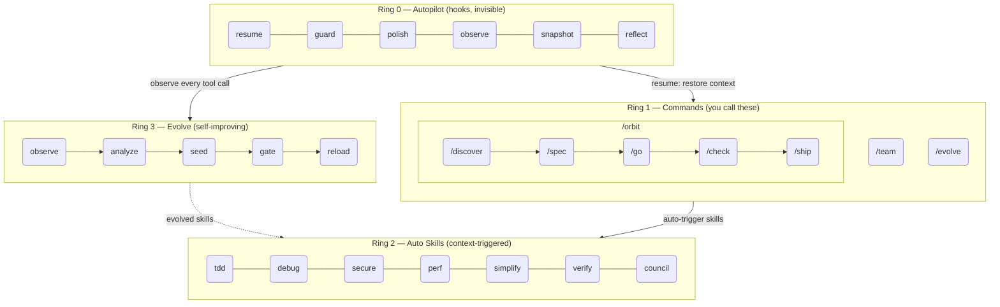
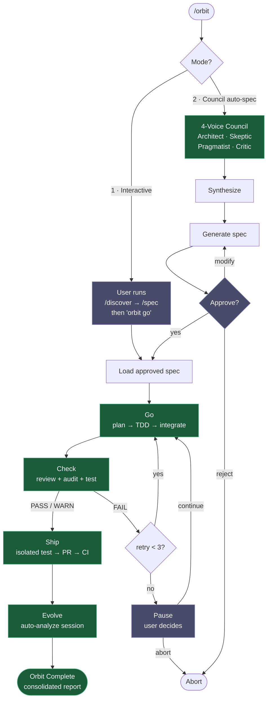

# epic harness

> Un harnais d'agent de codage IA auto-évolutif — 8 commandes, 1 pipeline autonome, compétences à déclenchement automatique, apprend de vos échecs.

**8 commandes. Compétences à déclenchement automatique. Auto-évolutif.**

<p align="center">
<a href="../../README.md">English</a> | <a href="../ja/README.md">日本語</a> | <a href="../ko/README.md">한국어</a> | <a href="../de/README.md">Deutsch</a> | <a href="../fr/README.md">Français</a> | <a href="../zh-CN/README.md">简体中文</a> | <a href="../zh-TW/README.md">繁體中文</a> | <a href="../pt-BR/README.md">Português</a> | <a href="../es/README.md">Español</a> | <a href="../hi/README.md">हिन्दी</a>
</p>

<p align="center">
  <a href="LICENSE"></a>
  
  
  
  <a href="https://buymeacoffee.com/epicsaga"></a>
</p>

Un plugin Claude Code qui **remplace 30+ commandes par 8**, **déclenche automatiquement des compétences** en fonction de ce que vous faites, et **fait évoluer de nouvelles compétences** à partir de vos propres schémas d'échecs. Moins de surface à mémoriser. Plus d'intelligence par frappe de touche.

<p align="center">
  
</p>

## Installation

> **Première fois ?** Lisez le [Guide de démarrage rapide (5 min)](../../QUICKSTART.md).

```bash
# Claude Code
/plugin marketplace add epicsagas/plugins && /plugin install epic@epicsagas

# Tout autre outil
cargo install epic-harness && epic install
```

| Environnement | Méthode |
|-------------|--------|
| **Claude Code** | Marketplace de plugins (ci-dessus) |
| **macOS** | `brew install epicsagas/tap/epic-harness` |
| **Quelconque (avec Rust)** | `cargo install epic-harness` |
| **Depuis les sources** | `git clone` + `cargo install --path .` |

Prérequis : **Git**. Les installations depuis les sources/binaires nécessitent également la [chaîne d'outils Rust](https://rustup.rs).

### `epic install` — assistant de configuration

Après avoir installé le binaire, exécutez `epic install` (ou `epic install claude`) pour :

1. Créer la structure de répertoires `~/.harness/`
2. Synchroniser les commandes, compétences et agents dans le répertoire de configuration de l'outil
3. Enregistrer le serveur MCP (harness-mem) pour Claude Code
4. Créer `~/.harness/config.toml` avec les valeurs par défaut si absent

Avec Claude Code, `hooks/setup.sh` s'exécute automatiquement au démarrage de session et installe le binaire s'il est manquant. Aucune étape manuelle n'est requise après le clonage initial.

### Autres outils

```bash
epic install codex        # Codex CLI   → ~/.codex/ + ~/.agents/skills/
epic install gemini       # Gemini CLI  → ~/.gemini/
epic install cursor       # Cursor      → ~/.cursor/ (nécessite Cursor 1.7+)
epic install opencode     # OpenCode    → ~/.config/opencode/
epic install cline        # Cline       → ~/Documents/Cline/Rules/
epic install aider        # Aider       → ~/.aider.conf.yml + ~/.aider/
epic install              # Menu interactif
```

Les fichiers d'intégration sont **synchronisés** depuis le binaire : les fichiers manquants ou obsolètes sont écrits. `GEMINI.md` et `AGENTS.md` ne sont créés que lorsqu'ils sont absents.

### Vérifier

```bash
epic --version              # Binaire installé
ls ~/.harness/              # Répertoire de données existant
```

Dans une session Claude Code : `/evolve status`

### Démonstration rapide

**Une commande, pipeline complet :**
```bash
$ /orbit
# Choisir le mode :
#   1. Interactif  — vous exécutez /discover + /spec, puis "orbit go"
#   2. Council     — le council à 4 voix génère la spec, vous approuvez
→ spec approuvée → go (TDD) → check (PASS) → ship (PR + CI) → evolve
```

**Ou procéder manuellement étape par étape :**
```bash
$ /spec "Ajouter l'auth JWT à l'API de connexion"
  → Clarifie les exigences → produit SPEC-*.md

$ /go
  → Planification automatique → sous-agents TDD → TERMINÉ (4 min)

$ /check
  → Révision de code parallèle + audit de sécurité + tests → PASS

$ /ship
  → Crée la PR → CI vert → fusionné
```

## Architecture : modèle à 4 anneaux



## /orbit — Pipeline autonome

`/orbit` regroupe l'ensemble du pipeline manuel en une seule exécution autonome.



**Nœuds violets** — points de contrôle humains : sélection du mode, approbation de la spec, pause en cas de 3 échecs de vérification.
**Nœuds verts** — autonomes : go, check, ship, evolve s'exécutent sans intervention de l'utilisateur.

L'état est conservé dans `$HARNESS_DIR/orbit/PIPELINE-{timestamp}.json` — survit à la compaction du contexte.

## Commandes

| Commande | Fonction |
|---------|-------------|
| `/discover` | Explorer et définir le problème avant de spécifier une solution — 5 Pourquoi, JTBD, questionnement socratique |
| `/spec` | Définir ce qu'il faut construire — clarifier les exigences, produire une spec |
| `/go` | Construire — planification automatique, sous-agents TDD, modèle de résultat à 4 états (DONE/CONCERNS/NEEDS_CONTEXT/BLOCKED), exécution parallèle avec isolation worktree |
| `/check` | Vérifier — dispatch expert adaptatif (basé sur la portée), révision de code parallèle + audit de sécurité + performance |
| `/ship` | Livrer — test preflight isolé, puis PR, CI, merge |
| `/team` | Créer et synchroniser des équipes d'agents au niveau org entre les projets |
| `/evolve` | Déclencheur d'évolution manuel / statut / rollback |
| `/orbit` | **Pipeline autonome** — exécute spec → go → check → ship en une seule fois. Choisir le mode interactif ou council. |

---

## Compétences automatiques (Ring 2)

Les compétences se déclenchent automatiquement. Vous ne les invoquez pas.

| Compétence | Se déclenche quand |
|-------|--------------|
| **tdd** | Nouvelle implémentation de fonctionnalité |
| **debug** | Échec de test ou erreur |
| **discover** | Demande vague, solution sans problème, ou plainte non ciblée |
| **secure** | Code Auth/DB/API/secrets touché |
| **perf** | Boucles, requêtes, code de rendu |
| **simplify** | Fichier > 200 lignes ou haute complexité |
| **document** | API publique ajoutée ou modifiée |
| **verify** | Avant de terminer /go ou /ship |
| **context** | Fenêtre de contexte > 70% utilisée |
| **council** | Décisions architecturales ou de conception ambiguës |
| **agent-introspection** | Auto-débogage de l'agent après des échecs répétés |

## Hooks (Ring 0)

S'exécutent de manière invisible. Binaire Rust unique (`epic-harness`) avec sous-commandes.

| Hook | Quand | Fonction |
|------|------|------|
| **resume** | Démarrage de session | Restaurer le contexte, charger la mémoire, détecter la stack |
| **guard** | Avant Bash | Bloquer force-push-to-main, rm -rf /, DROP prod |
| **polish** | Après Edit | Auto-format (Biome/Prettier/ruff/gofmt) + vérification de types |
| **observe** | À chaque utilisation d'outil | Logger dans `~/.harness/projects/{slug}/obs/` pour l'évolution + les indices GateGuard |
| **snapshot** | Avant compact | Sauvegarder l'état dans `~/.harness/projects/{slug}/sessions/` |
| **reflect** | Fin de session | Analyser les échecs, seeder les compétences évoluées, gater, extraire les instincts |

Polish se répercute dans observe : échec de format → `lint_fail`, erreur TypeScript → `build_fail`. Le thrashing Edit→Error est détecté même quand les erreurs viennent de polish.

Chaque session écrit son propre `session_{date}_{pid}_{random}.jsonl` — plusieurs sessions sur le même projet ne corrompent pas les données des autres.

### Profils de hooks

Via `~/.harness/config.toml` ou la variable d'environnement `EPIC_HOOK_PROFILE` :

| Profil | Hooks actifs |
|---------|-------------|
| `minimal` | guard, observe, resume |
| `standard` (par défaut) | ci-dessus + polish, reflect, snapshot |
| `strict` | tous les hooks + futures vérifications strict-only |

### Règles de garde personnalisées

Ajoutez des règles spécifiques au projet via `.harness/guard-rules.yaml` dans la racine du projet :

```yaml
blocked:
  - pattern: kubectl\s+delete\s+namespace | msg: Namespace deletion blocked
warned:
  - pattern: docker\s+system\s+prune | msg: Docker prune — verify first
```

## Équipe (`epic team`)

Les équipes sont au **niveau org**, pas liées à un projet. Exécuter `/team` dans n'importe quel projet enrichit un pool partagé de définitions d'agents — sans écraser silencieusement.

```bash
epic team                              # Interactif : scanner → concevoir → écrire → synchroniser
epic team sync backend                 # Dispatcher les agents vers .claude/agents/backend/
epic team link backend                 # Dispatcher + enregistrer le projet dans la config d'équipe
epic team list                         # Toutes les équipes dans l'org actuelle
epic team list --org netflix           # Équipes dans une org nommée
epic team show backend --playbook      # Config + playbook complet
epic team delete backend               # Supprimer uniquement du projet actuel
epic team delete backend --global      # Supprimer définitivement du store org
```

Après synchronisation, les agents sont disponibles dans la session suivante : `@domain-expert`, `@reviewer`, `@tester`, etc.

| Type | Mot-clé | Agents par défaut |
|------|---------|---------------|
| Stream-aligned | `stream` | domain-expert, reviewer, tester |
| Platform | `platform` | api-designer, infra-specialist, dx-agent |
| Enabling | `enabling` | specialist |
| Complicated Subsystem | `subsystem` | domain-specialist, integration-tester |

Multi-org : `epic team --org netflix` — topologie séparée par org.

Stratégie de fusion : les agents modifiés sont demandés en confirmation (par défaut : conserver l'existant, sauvegarder dans `.history/`). Le playbook est toujours annexé.

## Support multi-outils

Tous les outils partagent le même répertoire de données `~/.harness/projects/{slug}/`.

| Outil | Hooks Ring 0 | Commandes | Compétences | Agents |
|------|-------------|----------|--------|--------|
| **Claude Code** | ✓ Complet | ✓ 8 commandes (dont /orbit) | ✓ 11 compétences | ✓ 4 |
| **Codex CLI** | ✓ Complet¹ | ✓ 8 prompts (dont /orbit) | ✓ 7 | ✓ 4 |
| **Gemini CLI** | ✓ Partiel² | ✓ 8 commandes (dont /orbit) | ✓ 7 | ✓ 4 |
| **Cursor** | ✓ Complet³ | ✓ 8 commandes (dont /orbit) | ✓ via règles | ✓ 4 |
| **OpenCode** | ✓ Partiel⁴ | ✓ 8 commandes (dont /orbit) | — | ✓ 4 |
| **Cline** | ✓ Complet⁵ | — | — | — |
| **Aider** | —⁶ | — | — | — |

¹ `codex_hooks = true` dans `~/.codex/config.toml` · ² Guard au niveau `BeforeModel` · ³ Cursor 1.7+ · ⁴ Plugin JS · ⁵ 5 scripts de hooks · ⁶ Conventions uniquement

## Mémoire unifiée — WIP

> **Statut : En développement.** Pas encore entièrement fonctionnel. Les commandes CLI, les outils MCP et l'interface Web sont en cours de développement.

Tous les agents partagent un graphe de connaissances dans `~/.harness/memory.db` (SQLite avec recherche plein texte). Aucun runtime externe.

```
score = recency(25%) + importance(35%) + access_frequency(15%) + FTS_match(25%)
```

### CLI

```bash
epic mem recall "auth refactor" --project my-project   # Rappel intelligent
epic mem add --title "JWT rotation" --type decision    # Ajouter un nœud
epic mem search "JWT"                                  # Recherche FTS5
epic mem query --type decision --project my-project    # Filtrer
epic mem context --project my-project                  # Contexte du projet
epic mem serve                                         # Interface Web → :7700
epic mem mcp-install                                   # Enregistrer le serveur MCP
epic mem export --out ./docs/memory                    # Exporter en Markdown
```

### Outils MCP (6)

| Outil | Objectif |
|------|---------|
| `mem_recall` | Rappel contextuel intelligent avec indice + projet + voisins du graphe |
| `mem_add` | Ajouter un nœud avec auto-importance par type (ou explicite 0.0–1.0) |
| `mem_search` | Recherche par mot-clé (plein texte), classée par importance |
| `mem_query` | Filtrer par tag/type/projet |
| `mem_context` | Rappel intelligent limité au projet (sans indice) |
| `mem_related` | Traversée du graphe depuis un ID de nœud (trouve les connaissances connectées) |

### Types de nœuds

| Type | Créé par | Importance |
|------|-----------|------------|
| `decision` | Manuel / MCP | 0.9 |
| `resolution` | Manuel / MCP | 0.8 |
| `concept` | Manuel / MCP | 0.7 |
| `project` | Manuel / MCP | 0.7 |
| `instinct` | Auto (reflect) | 0.7 |
| `pattern` | Auto (reflect) | 0.5 |
| `error` | Auto (reflect) | 0.4 |
| `session` | Auto (reflect) | 0.2 |

Cycle de vie : 30+ jours sans accès → déclin de 10% de l'importance (plancher 0.05). 180+ jours → marqué `stale`, exclu du rappel. Le tag `pinned` empêche le déclin.

## Evolve (Ring 3)

Fusionne les schémas d'évolution automatisée d'[A-Evolve](https://github.com/A-EVO-Lab/a-evolve) dans le système de hooks de Claude Code.

### Scoring

Chaque appel d'outil est noté sur 3 axes (poids configurables via `~/.harness/config.toml`) :

```
composite = 0.5 × tool_success + 0.3 × output_quality + 0.2 × execution_cost
```

Classification des échecs (9 types) : `type_error` · `syntax_error` · `test_fail` · `lint_fail` · `build_fail` · `permission_denied` · `timeout` · `not_found` · `runtime_error`

### Détection de schémas

| Schéma | Détecte | Seuil par défaut |
|---------|---------|-------------------|
| `repeated_same_error` | Même erreur N+ fois | 3 |
| `fix_then_break` | Succès d'édition → échec de build/test | 3 rétrolook, 2 cycles |
| `long_debug_loop` | Bloqué sur le même fichier | 5 opérations |
| `thrashing` | Alternance Edit↔Erreur | 3 éditions, 3 erreurs |

### Flux d'évolution

```
Observe (PostToolUse — 3-axis scoring)
    ↓ obs/session_{id}.jsonl
Analyze (SessionEnd)
    ↓ per-tool, per-ext scores + patterns
Propose (Solver — graduated by score: ≥0.90 skip, ≥0.70 moderate, <0.70 full)
    ↓ SkillProposal[] with confidence
Curate (Accept/Merge/Skip, feedback masked from solver)
    ↓ evolved/{skill}/SKILL.md + meta.json
Gate (format check, dedup, cap 10, gated promotion ≥ 3 sessions)
    ↓ evolved_backup/ (best checkpoint)
Instinct (high-success patterns → cross-project memory.db nodes)
    ↓
Reload (next session — resume loads evolved skills)
```

Seeding de compétences : outil faible (succès <60%, min 5 observations), type de fichier faible (succès <50%, min 3 observations), erreur haute fréquence (5+ occurrences).

Stagnation : 3 sessions sans amélioration de 5% → rollback automatique vers le meilleur checkpoint.

```bash
/evolve              # Exécuter maintenant
/evolve status       # Tableau de bord : scores, tendances, schémas, compétences
/evolve history      # Historique complet + efficacité des compétences
/evolve cross-project # Analyse de schémas inter-projets
/evolve rollback     # Restaurer le meilleur précédent
/evolve reset        # Effacer toutes les données d'évolution
```

### Efficacité des compétences

Chaque compétence évoluée est suivie avec attribution A/B :

```
/evolve history → Skill Effectiveness

| Skill              | With | Without | Delta |
|--------------------|------|---------|-------|
| evo-ts-care        | 0.87 | 0.72    | +15%  |
| evo-bash-discipline| 0.65 | 0.68    | -3%   |
```

Delta positif = efficace. Négatif = envisager la suppression via `/evolve rollback`.

### Presets cold-start

À la première session, des compétences preset adaptées à la stack s'appliquent automatiquement :

| Stack | Presets |
|-------|---------|
| Node.js/TypeScript | `evo-ts-care`, `evo-fix-build-fail` |
| Go | `evo-go-care` |
| Python | `evo-py-care` |
| Rust | `evo-rs-care` |

### Apprentissage par instinct

Les schémas à haute réussite sont extraits et promus entre les projets :

```
observe (100% confirmed) → extract_instincts() → instinct node (confidence ≥ 0.8)
    → promote to global when observed in ≥ 2 projects
```

## Apprentissage inter-projets

Opt-in pour partager les schémas d'échecs entre projets :

```bash
touch ~/.harness/projects/{slug}/.cross-project-enabled
```

Fin de session → exporte les schémas anonymisés vers `~/.harness/global_patterns.jsonl`. Début de session → affiche des indices provenant des zones faibles d'autres projets.

## Données du projet

Toutes les données résident dans `~/.harness/` (répertoire personnel), pas dans la racine du projet. Survit à la suppression du projet, ne pollue pas l'historique git.

```
~/.harness/
├── memory.db                  # Graphe de connaissances SQLite (nœuds + arêtes + FTS5)
├── graph.json                 # Graphe mis en cache (pour l'interface Web)
├── config.toml                # Configuration utilisateur
├── global_patterns.jsonl      # Schémas inter-projets (opt-in)
├── orgs/                      # Store global des équipes
│   └── {org}/teams/{team}/
│       ├── config.json, mission.md, playbook.md, agents/, .history/
└── projects/{slug}/
    ├── memory/                # Schémas et règles du projet
    ├── sessions/              # Snapshots de session (pour resume)
    ├── obs/                   # Logs d'observation d'utilisation des outils (JSONL)
    ├── evolved/               # Compétences auto-évoluées
    │   ├── manifest.json
    │   └── {skill}/SKILL.md + meta.json
    ├── evolved_backup/        # Meilleur checkpoint (pour rollback)
    ├── dispatch/              # Logs de dispatch des compétences
    ├── evolution.jsonl        # Historique d'évolution complet
    └── metrics.json           # Statistiques agrégées + attribution des compétences
```

Partagez les règles de sécurité avec votre équipe : `.harness/guard-rules.yaml` dans la racine du projet (commité dans git).

## Configuration

Tous les paramètres configurables dans `~/.harness/config.toml`. Absent = valeurs par défaut codées en dur.

```toml
# Priorité : variable d'env (EPIC_HOOK_PROFILE) > ce fichier > valeurs par défaut

[hook]
profile = "standard"         # "minimal" | "standard" | "strict"
gateguard_hints = true

[scoring]
weights = [0.5, 0.3, 0.2]   # [success, quality, cost]

[evolution]
max_skills = 10
stagnation_limit = 3
improvement_threshold = 0.05
gated_promotion_min = 3

[pattern]
# repeated_error_min = 3
# debug_loop_min = 5
# graduated_scope_skip = 0.90
# graduated_scope_moderate = 0.70

[instinct]
# confidence_threshold = 0.8
# promotion_min_projects = 2
# max_instincts = 20
# min_observations = 10
# min_avg_score = 0.5
```

## Développement

```bash
cargo install --path .                                        # Compiler + installer
cp ~/.cargo/bin/epic-harness hooks/bin/epic-harness           # Mettre à jour le binaire du plugin
cargo test                                                    # Tests
```

Les hooks cherchent le binaire à deux endroits : `hooks/bin/epic-harness` (plugin local) → `~/.cargo/bin/epic-harness` (PATH).

## Liens

- [Changelog](../../CHANGELOG.md) — historique des versions
- [Contribution](../../CONTRIBUTING.md) — comment contribuer
- [Sécurité](../../SECURITY.md) — signaler des vulnérabilités
- [Issues](https://github.com/epicsagas/epic-harness/issues) — rapports de bugs et demandes de fonctionnalités

## Remerciements

- [a-evolve](https://github.com/A-EVO-Lab/a-evolve) — Évolution automatisée et schémas de benchmarks
- [agent-skills](https://github.com/addyosmani/agent-skills) — Système de compétences d'agents Claude Code
- [everything-claude-code](https://github.com/affaan-m/everything-claude-code) — Schémas Claude Code complets
- [gstack](https://github.com/garrytan/gstack) — Référence d'architecture de plugins
- [harness](https://github.com/revfactory/harness) — Schémas d'infrastructure hooks et harness
- [serena](https://github.com/oraios/serena) — Conception d'agents autonomes
- [SuperClaude Framework](https://github.com/SuperClaude-Org/SuperClaude_Framework) — Architecture de framework multi-commandes
- [superpowers](https://github.com/obra/superpowers) — Schémas d'extension Claude Code

## Licence

[Apache 2.0](../../LICENSE)
