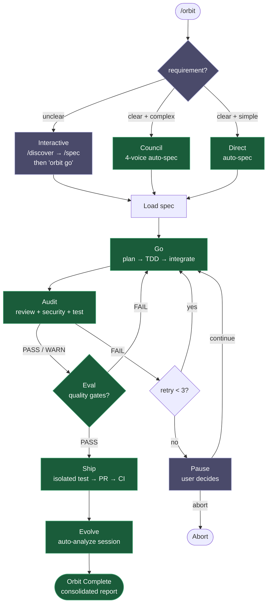
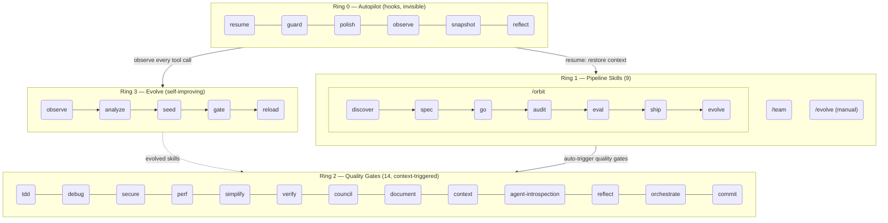

<h1 align="center">Epic Harness</h1>

<blockquote><p align="center">हर सेशन से सीखने वाला मल्टी-टूल AI एजेंट हार्नेस — 23 स्किल्स, स्वायत्त पाइपलाइन, और स्व-विकास इंजन।</p></blockquote>

<p align="center"><b>एक हार्नेस, छह AI टूल। स्पेक से PR तक स्वायत्त। हर सेशन के साथ और स्मार्ट।</b></p>

<p align="center">
<a href="../../README.md">English</a> | <a href="../ja/README.md">日本語</a> | <a href="../ko/README.md">한국어</a> | <a href="../de/README.md">Deutsch</a> | <a href="../fr/README.md">Français</a> | <a href="../zh-CN/README.md">简体中文</a> | <a href="../zh-TW/README.md">繁體中文</a> | <a href="../pt-BR/README.md">Português</a> | <a href="../es/README.md">Español</a> | <a href="../hi/README.md">हिन्दी</a>
</p>

<p align="center">
  <a href="https://github.com/epicsagas/epic-harness/stargazers"></a>
  <a href="https://github.com/epicsagas/epic-harness/network/members"></a>
  <a href="https://github.com/epicsagas/epic-harness/issues"></a>
  <a href="https://github.com/epicsagas/epic-harness/commits/main"></a>
</p>
<p align="center">
  <a href="../../LICENSE"></a>
  
  
  
  <a href="https://buymeacoffee.com/epicsaga"></a>
</p>

एक मल्टी-टूल AI एजेंट हार्नेस जिसमें **23 स्किल्स (9 पाइपलाइन + 14 क्वालिटी गेट्स)**, **स्व-विकास इंजन**, **एकीकृत मेमोरी**, और **एकल-कमांड स्वायत्त पाइपलाइन** (`/orbit`) है। Claude Code, Codex, Cursor, OpenCode और Cline के साथ काम करता है — सभी एक ही `~/.harness/` डेटा डायरेक्टरी साझा करते हैं। हर सेशन के बाद, evolve लूप विफलताओं का विश्लेषण करता है, लक्षित स्किल्स उत्पन्न करता है, और अगली बार लोड करता है।

<p align="center">
  
</p>

---


### वेब डैशबोर्ड — 10-स्क्रीन रियल-टाइम मेट्रिक्स
<p align="center">
  
  
</p>

---

## यह क्या करता है

एक कमांड एंड-टू-एंड फीचर शिप करता है। स्किल्स आपके पूछे बिना चलती हैं। हर सेशन के बाद एजेंट और स्मार्ट होता जाता है।

```bash
$ /orbit "लॉगिन API में JWT auth जोड़ो"
→ spec approved → go (TDD subagents) → audit (PASS) → eval → ship (PR + CI) → evolve
```

या पाइपलाइन स्किल्स को सीधे इनवोक करें:

```bash
/spec "Add JWT auth to the login API"   # आवश्यकताएँ स्पष्ट करता है → SPEC-*.md
/go                                      # ऑटो-प्लान → TDD subagents → 4 मिनट
/audit                                   # समानांतर review + security + tests → PASS
/ship                                    # isolated test → PR → CI green
```

स्किल्स बैकग्राउंड में अपने-आप ट्रिगर होती हैं — बिना अतिरिक्त कमांड:

```
फीचर बना रहे हैं?       → tdd ट्रिगर (Red→Green→Refactor अनिवार्य)
टेस्ट फेल हुआ?          → debug ट्रिगर (पहले root cause, कोई random fix नहीं)
Auth या DB छू रहे हैं?   → secure ट्रिगर (OWASP checklist, कोई shortcut नहीं)
फ़ाइल 200 लाइनों तक?     → simplify ट्रिगर (extract, rename, reduce)
```

सेशन खत्म होने के बाद, **evolve loop** विश्लेषण करता है कि क्या टूटा, targeted skills बनाता है, और अगले सेशन में लोड करता है। जो एजेंट TypeScript build विफलताओं से जूझ रहा था, अगली बार उसके पास `evo-ts-care` स्किल होगी।

---

## इंस्टॉलेशन

> **पहली बार?** [त्वरित प्रारंभ गाइड (5 मिनट)](../../docs/quickstart.md) पढ़ें। डेटा स्टोरेज विवरण के लिए [डेटा मैप](../../docs/data-map.md) देखें।

### Claude Code (अनुशंसित)

```
/plugin marketplace add epicsagas/plugins
/plugin install epic@epicsagas
```

बाइनरी ऑटो-इंस्टॉल करता है और सभी hooks को एक ही चरण में रजिस्टर करता है।

### Codex CLI

```bash
codex plugin marketplace add epicsagas/plugins
```

सभी 23 स्किल्स ऑटो-इंस्टॉल होती हैं और hooks रजिस्टर हो जाते हैं। तुरंत उपलब्ध — कोई अतिरिक्त चरण आवश्यक नहीं। `codex plugin update epic@epicsagas` से अपडेट करें।

### macOS / Linux

```bash
brew install epicsagas/tap/epic-harness
```

Homebrew नहीं है? इंस्टॉलर स्क्रिप्ट का उपयोग करें:

```bash
curl --proto '=https' --tlsv1.2 -LsSf \
  https://github.com/epicsagas/epic-harness/releases/latest/download/install.sh | sh
```

### Windows

```powershell
irm https://github.com/epicsagas/epic-harness/releases/latest/download/install.ps1 | iex
```

### Rust टूलचेन के माध्यम से

```bash
cargo binstall epic-harness   # प्री-बिल्ट बाइनरी (तेज़)
cargo install epic-harness    # सोर्स से बिल्ड
```

फिर सेटअप विज़ार्ड चलाएं:

```bash
epic install cursor         # Cursor IDE
```

> `epic-harness --version` सत्यापित करने के लिए। `brew upgrade epic-harness` या इंस्टॉलर स्क्रिप्ट दोबारा चलाकर अपडेट करें।

पूर्वापेक्षाएं: **Git**। सोर्स/बाइनरी इंस्टॉल के लिए [Rust टूलचेन](https://rustup.rs) भी आवश्यक।

### `epic install` — सेटअप विज़ार्ड

बाइनरी इंस्टॉल करने के बाद, `epic install` (या `epic install claude`) चलाएं:

1. `~/.harness/` डायरेक्टरी संरचना बनाएं
2. कमांड और स्किल्स को टूल के कॉन्फिग डायरेक्टरी में सिंक करें
3. Claude Code के लिए MCP सर्वर (harness-mem) रजिस्टर करें
4. यदि अनुपस्थित हो तो `~/.harness/config.toml` डिफ़ॉल्ट के साथ बनाएं

Claude Code में, `hooks/install.js` सेशन स्टार्ट पर ऑटो-चलता है और यदि बाइनरी गायब हो तो इंस्टॉल करता है। प्रारंभिक क्लोन के बाद कोई मैन्युअल चरण आवश्यक नहीं।

### अन्य टूल्स

```bash
epic install cursor         # Cursor         → ~/.cursor/ (Cursor 1.7+ आवश्यक)
epic install opencode     # OpenCode    → ~/.config/opencode/
epic install cline        # Cline       → ~/Documents/Cline/Rules/
epic install aider        # Aider       → ~/.aider.conf.yml + ~/.aider/
epic install              # इंटरेक्टिव मेनू
```

इंटीग्रेशन फ़ाइलें बाइनरी से **सिंक** होती हैं: गायब या पुरानी फ़ाइलें लिखी जाती हैं। `GEMINI.md` और `AGENTS.md` केवल तभी बनाए जाते हैं जब अनुपस्थित हों।

### सत्यापन

```bash
epic --version              # बाइनरी इंस्टॉल है
ls ~/.harness/              # डेटा डायरेक्टरी मौजूद है
```

Claude Code सेशन के अंदर: `/evolve status`

---

## पाइपलाइन स्किल्स (Ring 1)

| स्किल | यह क्या करता है |
|---------|-------------|
| `/orbit` | **पूर्ण स्वायत्त पाइपलाइन**: discover → spec → go → audit → ship → evolve एक ही शॉट में |
| `/discover` | अस्पष्ट अनुरोधों को स्पष्ट करता है — 5 Whys, JTBD, Socratic |
| `/spec` | आवश्यकताओं को परिभाषित करता है — क्रमांकित R + AC दस्तावेज़ |
| `/go` | बिल्ड चरण — ऑटो-प्लानिंग → TDD सब-एजेंट → समानांतर निष्पादन |
| `/audit` | समीक्षा चरण — समानांतर कोड समीक्षा + सुरक्षा ऑडिट + टेस्ट |
| /eval | मूल्यांकन चरण — 4-आयामी गुणवत्ता और प्रतिगमन जाँच (शुद्धता, प्रदर्शन, गुणवत्ता, प्रतिगमन) |
| `/ship` | शिपिंग चरण — आइसोलेटेड टेस्ट → PR → CI मॉनिटरिंग + ऑटो-फिक्स |
| `/evolve` | मैन्युअल एवोल्यूशन ट्रिगर — सेशन विश्लेषण, डैशबोर्ड देखें, स्किल प्रभावशीलता निरीक्षण, rollback |
| `/team` | ऑर्ग लाइब्रेरी ब्राउज़ करें, मौजूदा टीमों को हायर करें, या नई डिज़ाइन करें (3–6 एजेंट, `.claude/agents/` में सिंक) |

---

## /orbit — स्वायत्त पाइपलाइन

`/orbit` पूर्ण पाइपलाइन को एकल स्वायत्त निष्पादन में लपेटता है। एक मोड चुनें — PR तक सब कुछ स्वचालित।



**बैंगनी** — मानव चरण: मोड चयन (अस्पष्ट → इंटरेक्टिव), 3× audit विफलता पर रुकना।
**हरा** — clear + complex → council auto-spec; clear + simple → direct build; दोनों पूर्ण रूप से स्वायत्त।

स्थिति `$HARNESS_DIR/orbit/PIPELINE-{timestamp}.json` में बनी रहती है — context compaction के बाद भी जीवित।

> **चेतावनी**: एजेंट orbit को स्वयं संशोधित करते समय या केवल docs संपादित करते समय पाइपलाइन को बायपास कर सकता है। [Known Issues (Agent Judgment)](#known-issues-agent-judgment) देखें।

---

## क्वालिटी गेट्स (Ring 2)

स्किल्स संदर्भ के आधार पर स्वचालित रूप से ट्रिगर होती हैं। आप उन्हें बुलाते नहीं हैं।

| स्किल | कब ट्रिगर होती है |
|-------|--------------|
| **tdd** | नई फीचर इम्प्लीमेंटेशन या बग फिक्स |
| **debug** | टेस्ट विफलता या runtime error |
| **secure** | Auth / DB / API / secrets कोड छूा गया |
| **perf** | लूप, क्वेरी, रेंडरिंग, batch operations |
| **simplify** | फ़ाइल > 200 लाइनें या उच्च cyclomatic complexity |
| **verify** | `/go` या `/ship` पूरा करने से पहले |
| **council** | अस्पष्ट architectural या design निर्णय |
| **document** | सार्वजनिक API जोड़ा गया या signature बदली |
| **context** | Context window > 70% |
| **agent-introspection** | 3+ लगातार विफलताएं या circular retry पैटर्न |
| **reflect** | ऑन-डिमांड `/reflect`: मानव स्व-मूल्यांकन — "क्या मैं AI को विचार एम्पलीफायर के रूप में उपयोग कर रहा हूँ?" हुक-संग्रहित डेटा से 5-आयामी मूल्यांकन |
| **orchestrate** | मल्टी-एजेंट ऑर्केस्ट्रेशन स्टेटस और लाइव एजेंट नियंत्रण |
| **commit** | Conventional Commits जनरेशन — git diff से ऑटो-जनरेट किया गया |

---

## Evolve (Ring 3)

हार्नेस हर टूल कॉल को देखता है, 3 अक्षों पर स्कोर करता है, विफलता पैटर्न का पता लगाता है, और targeted skills बनाता है — स्वचालित रूप से, सेशन के अंत में।

### स्कोरिंग

```
composite = 0.5 × tool_success + 0.3 × output_quality + 0.2 × execution_cost
```

विफलता वर्गीकरण (9 प्रकार): `type_error` · `syntax_error` · `test_fail` · `lint_fail` · `build_fail` · `permission_denied` · `timeout` · `not_found` · `runtime_error`

### पैटर्न डिटेक्शन

| पैटर्न | पता लगाता है | डिफ़ॉल्ट थ्रेशोल्ड |
|---------|---------|-------------------|
| `repeated_same_error` | वही error N+ बार | 3 |
| `fix_then_break` | Edit सफलता → build/test विफलता | 3 lookback, 2 cycles |
| `long_debug_loop` | उसी फ़ाइल पर अटका | 5 operations |
| `thrashing` | Edit↔Error बदलाव | 3 edits, 3 errors |

### एवोल्यूशन फ्लो

```
Observe (PostToolUse — 3-अक्ष स्कोरिंग)
    ↓ obs/session_{id}.jsonl
Analyze (SessionEnd)
    ↓ प्रति-टूल, प्रति-ext स्कोर + पैटर्न
Propose (Solver — स्कोर द्वारा graduated: ≥0.90 skip, ≥0.70 moderate, <0.70 full)
    ↓ SkillProposal[] confidence के साथ
Curate (Accept/Merge/Skip, solver से feedback masked)
    ↓ evolved/{skill}/SKILL.md + meta.json
Gate (format check, dedup, cap 10, gated promotion ≥ 3 sessions)
    ↓ evolved_backup/ (best checkpoint)
Instinct (high-success patterns → cross-project memory.db nodes)
    ↓
Reload (अगला सेशन — resume विकसित स्किल्स लोड करता है)
```

स्किल सीडिंग: weak tool (success <60%, min 5 obs), weak file type (success <50%, min 3 obs), high-frequency error (5+ occurrences)।

### SkillOpt-प्रेरित अनुकूलन

प्राकृतिक भाषा कौशल विकास पर लागू डीप लर्निंग से प्रेरित तीन तकनीकें:

| तकनीक | क्या करती है |
|--------|-------------|
| **नेगेटिव फीडबैक बफर** | अस्वीकृत कौशल प्रस्तावों को TTL-आधारित समाप्ति के साथ संग्रहित करता है — ज्ञात खराब कौशल को पुनः उत्पन्न होने से रोकता है |
| **मिनीबैच प्रतिबिंब** | संरचनात्मक पैटर्न निष्कर्षण के लिए अवलोकनों को निश्चित-आकार बैचों में विघटित करता है — सत्र औसत से छिपे माइक्रो-पैटर्न को पकड़ता है |
| **स्लो/मेटा अपडेट** | युगों को वर्गीकृत करता है (Improving/Regressing/PersistentFailure/StableSuccess) और धीमे पैरामीटर अपडेट रिकॉर्ड करता है — दीर्घकालिक रुझानों के अनुसार विकास रणनीति को अनुकूलित करता है |

[SkillOpt (arXiv 2605.23904)](https://arxiv.org/abs/2605.23904) से अनुकूलित। `[evolution]` में `rejected_buffer_ttl` और `minibatch_size` के माध्यम से कॉन्फ़िगर करने योग्य।

स्थिरता: 5% सुधार के बिना 3 सेशन → best checkpoint पर ऑटो-rollback।

### स्किल प्रभावशीलता

हर विकसित स्किल A/B attribution के साथ ट्रैक की जाती है:

```
/evolve history → Skill Effectiveness

| Skill              | With | Without | Delta |
|--------------------|------|---------|-------|
| evo-ts-care        | 0.87 | 0.72    | +15%  |
| evo-bash-discipline| 0.65 | 0.68    | -3%   |
```

पॉज़िटिव delta = प्रभावी। नेगेटिव = `/evolve rollback` के माध्यम से हटाने पर विचार करें।

### कोल्ड-स्टार्ट प्रीसेट

पहले सेशन में, stack-उपयुक्त preset स्किल्स ऑटो-अप्लाई होती हैं:

| Stack | प्रीसेट |
|-------|---------|
| Node.js/TypeScript | `evo-ts-care`, `evo-fix-build-fail` |
| Go | `evo-go-care` |
| Python | `evo-py-care` |
| Rust | `evo-rs-care` |

### इंस्टिंक्ट लर्निंग

उच्च-सफलता पैटर्न निकाले और प्रोजेक्ट्स के पार promote किए जाते हैं:

```
observe (100% confirmed) → extract_instincts() → instinct node (confidence ≥ 0.8)
    → global में promote जब ≥ 2 प्रोजेक्ट्स में देखा गया
```

```bash
/evolve              # अभी चलाएं
/evolve status       # डैशबोर्ड: scores, trends, patterns, skills
/evolve history      # पूर्ण इतिहास + स्किल प्रभावशीलता
/evolve cross-project # क्रॉस-प्रोजेक्ट पैटर्न विश्लेषण
/evolve rollback     # पिछला सर्वश्रेष्ठ पुनर्स्थापित करें
/evolve reset        # सभी एवोल्यूशन डेटा साफ़ करें
```

---

## Hooks (Ring 0)

हर सेशन में अदृश्य रूप से चलते हैं। सबकमांड के साथ एकल Rust बाइनरी (`epic-harness`)।

| Hook | कब | क्या करता है |
|------|------|------|
| **resume** | सेशन स्टार्ट | context पुनर्स्थापित करें, memory लोड करें, stack detect करें |
| **guard** | Bash से पहले | force-push-to-main, `rm -rf /`, DROP prod ब्लॉक करें |
| **polish** | Edit के बाद | ऑटो-format (Biome/Prettier/ruff/gofmt) + typecheck |
| **observe** | हर टूल उपयोग | `~/.harness/projects/{slug}/obs/` में log करें एवोल्यूशन के लिए |
| **snapshot** | compact से पहले | `~/.harness/projects/{slug}/sessions/` में state save करें |
| **reflect** | सेशन एंड | स्वचालित विकास इंजन: विफलता विश्लेषण, स्किल सीडिंग, मेट्रिक्स अपडेट, मेमोरी इंजेस्ट। `/reflect` स्किल को डेटा प्रदान करता है |

Polish observe में फीडबैक देता है: format विफलता → `lint_fail`, TypeScript error → `build_fail`। Edit→Error thrashing तब भी detect होता है जब errors polish से आते हैं।

प्रत्येक सेशन अपना `session_{date}_{pid}_{random}.jsonl` लिखता है — कई समवर्ती सेशन एक-दूसरे के डेटा को corrupt नहीं करेंगे।

### Hook प्रोफ़ाइल

`~/.harness/config.toml` या `EPIC_HOOK_PROFILE` env var के माध्यम से:

| प्रोफ़ाइल | सक्रिय hooks |
|---------|-------------|
| `minimal` | guard, observe, resume |
| `standard` (डिफ़ॉल्ट) | उपरोक्त + polish, reflect, snapshot |
| `strict` | सभी hooks + भविष्य के strict-only checks |

### कस्टम Guard नियम

अपने प्रोजेक्ट रूट में `.harness/guard-rules.yaml` के माध्यम से प्रोजेक्ट-विशिष्ट नियम जोड़ें:

```yaml
blocked:
  - pattern: kubectl\s+delete\s+namespace | msg: Namespace deletion blocked
warned:
  - pattern: docker\s+system\s+prune | msg: Docker prune — verify first
```

---

## टीम (`epic team`)

टीमें **ऑर्ग-स्तरीय** हैं, प्रोजेक्ट-बाउंड नहीं। किसी भी प्रोजेक्ट में `/team` चलाना एजेंट परिभाषाओं के साझा पूल को समृद्ध करता है — कभी चुपचाप overwrite नहीं करता।

```bash
epic team                              # इंटरेक्टिव: scan → design → write → sync
epic team sync backend                 # एजेंट dispatch → .claude/agents/backend/
epic team link backend                 # Dispatch + team config में प्रोजेक्ट register
epic team list                         # वर्तमान org में सभी टीमें
epic team list --org netflix           # नामित org में टीमें
epic team show backend --playbook      # Config + पूर्ण playbook
epic team delete backend               # केवल वर्तमान प्रोजेक्ट से recall
epic team delete backend --global      # Org store से स्थायी रूप से हटाएं
```

Sync करने के बाद, एजेंट अगले सेशन में उपलब्ध होते हैं: `@domain-expert`, `@reviewer`, `@tester`, आदि।

| प्रकार | कीवर्ड | डिफ़ॉल्ट एजेंट |
|------|---------|---------------|
| Stream-aligned | `stream` | domain-expert, reviewer, tester |
| Platform | `platform` | api-designer, infra-specialist, dx-agent |
| Enabling | `enabling` | specialist |
| Complicated Subsystem | `subsystem` | domain-specialist, integration-tester |

मल्टी-org: `epic team --org netflix` — प्रत्येक org के लिए अलग topology।

Merge रणनीति: बदले गए एजेंट prompt करते हैं (डिफ़ॉल्ट: मौजूदा रखें, `.history/` में backup)। Playbook हमेशा append होता है।

---

## मल्टी-टूल समर्थन

सभी टूल एक ही `~/.harness/projects/{slug}/` डेटा डायरेक्टरी साझा करते हैं।

| टूल | Ring 0 Hooks | स्किल्स | एजेंट |
|------|-------------|--------|--------|
| **Claude Code** | ✓ पूर्ण | ✓ 23 स्किल्स | Live |
| **Codex CLI** | ✓ पूर्ण¹ | ✓ 23 | — |
| **Cursor** | ✓ पूर्ण³ | ✓ rules के माध्यम से | Live |
| **OpenCode** | ✓ आंशिक⁴ | — | — |
| **Cline** | ✓ पूर्ण⁵ | — | — |
| **Aider** | —⁶ | — | — |

¹ Plugin marketplace · ³ Cursor 1.7+ · ⁴ JS प्लगइन · ⁵ 5 hook स्क्रिप्ट · ⁶ केवल Conventions

---

## आर्किटेक्चर: 4-रिंग मॉडल



---

## क्रॉस-प्रोजेक्ट लर्निंग

प्रोजेक्ट्स के पार विफलता पैटर्न साझा करने के लिए opt-in करें:

```bash
touch ~/.harness/projects/{slug}/.cross-project-enabled
```

सेशन एंड → anonymized patterns को `~/.harness/global_patterns.jsonl` में export। सेशन स्टार्ट → अन्य प्रोजेक्ट्स के कमज़ोर क्षेत्रों से hints दिखाता है।

---

## एकीकृत मेमोरी

सभी एजेंट `~/.harness/memory.db` (full-text search के साथ SQLite) में एक knowledge graph साझा करते हैं। कोई बाहरी runtime नहीं।

```
score = recency(25%) + importance(35%) + access_frequency(15%) + FTS_match(25%)
```

### CLI

```bash
epic mem recall "auth refactor" --project my-project   # स्मार्ट recall
epic mem add --title "JWT rotation" --type decision    # नोड जोड़ें
epic mem search "JWT"                                  # FTS5 खोज
epic mem list --type decision --project my-project    # फ़िल्टर
epic mem context --project my-project                  # प्रोजेक्ट context
epic mem serve                                         # Web UI → :7700 या --port 8800 के साथ कस्टम port
epic mem mcp-install                                   # MCP सर्वर register करें
epic mem export --out ./docs/memory                    # Markdown में export
```

### CLI कमांड (6)

| कमांड | उद्देश्य |
|--------|---------|
| `epic-harness mem recall "HINT"` | hint + project + graph neighbors के साथ स्मार्ट contextual recall |
| `epic-harness mem add --title "T" --type TYPE --body "B"` | type के अनुसार auto-importance (या explicit 0.0–1.0) के साथ नोड जोड़ें |
| `epic-harness mem search "QUERY"` | keyword खोज (full-text), importance के अनुसार ranked |
| `epic-harness mem list` | tag/type/project द्वारा फ़िल्टर |
| `epic-harness mem context` | प्रोजेक्ट-scoped स्मार्ट recall (कोई hint नहीं) |
| `epic-harness mem related ID` | नोड ID से graph traversal (connected knowledge ढूंढता है) |

### नोड प्रकार

| प्रकार | किसके द्वारा बनाया | Importance |
|------|-----------|------------|
| `decision` | मैन्युअल / MCP | 0.9 |
| `resolution` | मैन्युअल / MCP | 0.8 |
| `concept` | मैन्युअल / MCP | 0.7 |
| `project` | मैन्युअल / MCP | 0.7 |
| `instinct` | ऑटो (reflect) | 0.7 |
| `pattern` | ऑटो (reflect) | 0.5 |
| `error` | ऑटो (reflect) | 0.4 |
| `session` | ऑटो (reflect) | 0.2 |

Lifecycle: 30+ दिन बिना access → 10% importance decay (floor 0.05)। 180+ दिन → `stale` tag, recall से बाहर। `pinned` tag decay रोकता है।

> **Web UI**: Graph visualization सक्रिय रूप से सुधारा जा रहा है — clustering, neighbor highlighting, और offline fallback हाल ही में जोड़े गए। अधिक सुधार जारी।

---

<details>
<summary><strong>प्रोजेक्ट डेटा — directory layout</strong></summary>

## प्रोजेक्ट डेटा

सभी डेटा `~/.harness/` (होम डायरेक्टरी) में रहता है, आपके प्रोजेक्ट रूट में नहीं। प्रोजेक्ट deletion से बचा रहता है, git history pollute नहीं करता।

```
~/.harness/
├── memory.db                  # SQLite knowledge graph (nodes + edges + FTS5)
├── graph.json                 # Cached graph (web UI के लिए)
├── config.toml                # User configuration
├── global_patterns.jsonl      # Cross-project patterns (opt-in)
├── orgs/                      # Team global store
│   └── {org}/teams/{team}/
│       ├── config.json, mission.md, playbook.md, agents/, .history/
└── projects/{slug}/
    ├── memory/                # प्रोजेक्ट patterns और rules
    ├── sessions/              # सेशन snapshots (resume के लिए)
    ├── obs/                   # Tool usage observation logs (JSONL)
    ├── evolved/               # ऑटो-विकसित स्किल्स
    │   ├── manifest.json
    │   └── {skill}/SKILL.md + meta.json
    ├── evolved_backup/        # Best checkpoint (rollback के लिए)
    ├── dispatch/              # Skill dispatch logs
    ├── evolution.jsonl        # पूर्ण एवोल्यूशन इतिहास
    └── metrics.json           # Aggregate stats + skill attribution
```

अपनी टीम के साथ safety rules साझा करें: प्रोजेक्ट रूट में `.harness/guard-rules.yaml` (git में committed)।

</details>

---

<details>
<summary><strong>कॉन्फिगरेशन — config.toml reference</strong></summary>

## कॉन्फिगरेशन

`~/.harness/config.toml` में सभी tunable parameters। अनुपस्थित = hardcoded defaults।

```toml
# प्राथमिकता: env var (EPIC_HOOK_PROFILE) > यह फ़ाइल > defaults

[hook]
profile = "standard"         # "minimal" | "standard" | "strict"
gateguard_hints = true

[scoring]
weights = [0.5, 0.3, 0.2]   # [success, quality, cost]

[evolution]
max_skills = 10
stagnation_limit = 3
improvement_threshold = 0.05
gated_promotion_min = 3
# rejected_buffer_ttl = 10    # अस्वीकृत प्रस्तावों की समाप्ति से पहले सत्र
# minibatch_size = 8          # पैटर्न निष्कर्षण के लिए प्रति मिनीबैच अवलोकन

[pattern]
# repeated_error_min = 3
# debug_loop_min = 5
# graduated_scope_skip = 0.90
# graduated_scope_moderate = 0.70

[instinct]
# confidence_threshold = 0.8
# promotion_min_projects = 2
# max_instincts = 20
# min_observations = 10
# min_avg_score = 0.5
```

</details>

---

## Known Issues (Agent Judgment)

ये issues कोड में bugs के बजाय एजेंट के context interpretation से उत्पन्न होते हैं। यहां सूचीबद्ध हैं ताकि users जान सकें कि क्या देखना है।

### खोजी गई समस्याएं

| समस्या | कब | क्या होता है | Workaround |
|-------|------|-------------|------------|
| **Orbit self-modification bypass** | `/orbit` से orbit को स्वयं सुधारने को कहा जाता है | एजेंट orbit पाइपलाइन को पूरी तरह skip कर सकता है और main पर ad-hoc फ़ाइलें edit कर सकता है, बिना spec/PR/traceability के uncommitted changes छोड़ता है | Orbit पूरा होने के बाद, `git status` चेक करें। यदि main पर pipeline state के बिना changes हैं, manually commit करें या अलग branch से `/orbit` दोबारा चलाएं |
| **Doc-only task skips protocol** | `/orbit` को केवल markdown change मिलता है (test करने के लिए कोई code नहीं) | एजेंट TDD/test phases को अर्थहीन मान सकता है और पूर्ण पाइपलाइन skip कर सकता है | Pure doc changes के लिए स्वीकार्य। Mixed code+doc के लिए, सुनिश्चित करें कि एजेंट code-related phases skip न करे |
| **Mode misclassification** | अनुरोध Direct और Council के बीच borderline है | एजेंट Direct चुन सकता है जब Council (4-voice) अधिक edge cases पकड़ता, या Council जब Direct पर्याप्त है | यदि एजेंट गलत मोड चुनता है, तो स्पष्ट रूप से "use Council mode" या "use Direct mode" कहें |

### जानबूझकर किए गए design choices

इन्हें enhancement के लिए विचार किया गया था लेकिन मूल्यांकन के बाद ऐसे ही रखा गया:

| Choice | क्यों enhance नहीं किया | तर्क |
|--------|-----------------|-----------|
| **Worktree Go phase में enter होता है, orbit start में नहीं** | Preflight से isolate कर सकते थे | Preflight/mode/spec read-only हैं। पहले isolate करना बिना लाभ के complexity जोड़ता है — branch Go phase तक बनता ही नहीं |
| **Ship के बाद Worktree preserved** | PR merge पर auto-remove कर सकते थे | Branch PR head है। Merge से पहले हटाना PR तोड़ देगा। Cleanup user पर merge के बाद छोड़ा जाता है |
| **Branch का नाम `orbit-{slug}` है, `feature/{slug}` नहीं** | Conventional branch naming से match कर सकते थे | `EnterWorktree` names में `/` allow नहीं करता। Post-creation rename केवल cosmetic लाभ के लिए एक step जोड़ता है |
| **Doc changes के लिए कोई lightweight pipeline path नहीं** | Doc-only detect कर TDD/tests skip कर सकते थे | Detection fragile है (क्या "doc" माना जाए?)। अलग path जोड़ना marginal gain के लिए protocol complexity बढ़ाता है |

---

## ट्रबलशूटिंग

<details>
<summary>install के बाद command not found: epic</summary>

Cargo bin डायरेक्टरी को अपने PATH में जोड़ें:

```bash
export PATH="$HOME/.cargo/bin:$PATH"
```

इस line को अपने `~/.zshrc` या `~/.bashrc` में जोड़ें ताकि यह permanent हो जाए।
</details>

<details>
<summary>Hooks Claude Code में fire नहीं हो रहे</summary>

Hooks को Claude Code settings में sync करने के लिए install दोबारा चलाएं:

```bash
epic install claude
```

फिर Claude Code restart करें। Hooks `~/.claude/settings.json` में लिखे जाते हैं।
</details>

<details>
<summary>macOS पर Permission denied (Gatekeeper)</summary>

macOS internet से download किए गए unsigned binaries को block कर सकता है:

```bash
xattr -d com.apple.quarantine ~/.cargo/bin/epic-harness
xattr -d com.apple.quarantine ~/.cargo/bin/epic
```
</details>

<details>
<summary>epic: plugin hooks के अंदर binary not found</summary>

Plugin पहले `hooks/bin/epic-harness` में binary ढूंढता है। `cargo install` के माध्यम से update करने के बाद, इसे copy करें:

```bash
cp ~/.cargo/bin/epic-harness hooks/bin/epic-harness
```
</details>

---

## डेवलपमेंट

```bash
cargo install --path .                                        # Build + install
cp ~/.cargo/bin/epic-harness hooks/bin/epic-harness           # Plugin binary update
cargo test                                                    # Tests
```

Hooks binary दो जगहों पर ढूंढते हैं: `hooks/bin/epic-harness` (plugin local) → `~/.cargo/bin/epic-harness` (PATH)।

---

## लिंक

- [Changelog](../../CHANGELOG.md) — release इतिहास
- [Contributing](../../CONTRIBUTING.md) — कैसे योगदान करें
- [Security](../../SECURITY.md) — vulnerabilities report करना
- [Issues](https://github.com/epicsagas/epic-harness/issues) — bug reports और feature requests

## आभार

- [SkillOpt](https://arxiv.org/abs/2605.23904) — डीप लर्निंग-प्रेरित कौशल अनुकूलन (नेगेटिव फीडबैक बफर, मिनीबैच प्रतिबिंब, स्लो/मेटा अपडेट)
- [a-evolve](https://github.com/A-EVO-Lab/a-evolve) — स्वचालित एवोल्यूशन और benchmark patterns
- [agent-skills](https://github.com/addyosmani/agent-skills) — Claude Code एजेंट skill system
- [everything-claude-code](https://github.com/affaan-m/everything-claude-code) — व्यापक Claude Code patterns
- [gstack](https://github.com/garrytan/gstack) — Plugin architecture reference
- [harness](https://github.com/revfactory/harness) — Hook और harness infrastructure patterns
- [serena](https://github.com/oraios/serena) — स्वायत्त एजेंट design
- [SuperClaude Framework](https://github.com/SuperClaude-Org/SuperClaude_Framework) — Multi-command framework architecture
- [superpowers](https://github.com/obra/superpowers) — Claude Code extension patterns

## लाइसेंस

[Apache 2.0](../../LICENSE)
