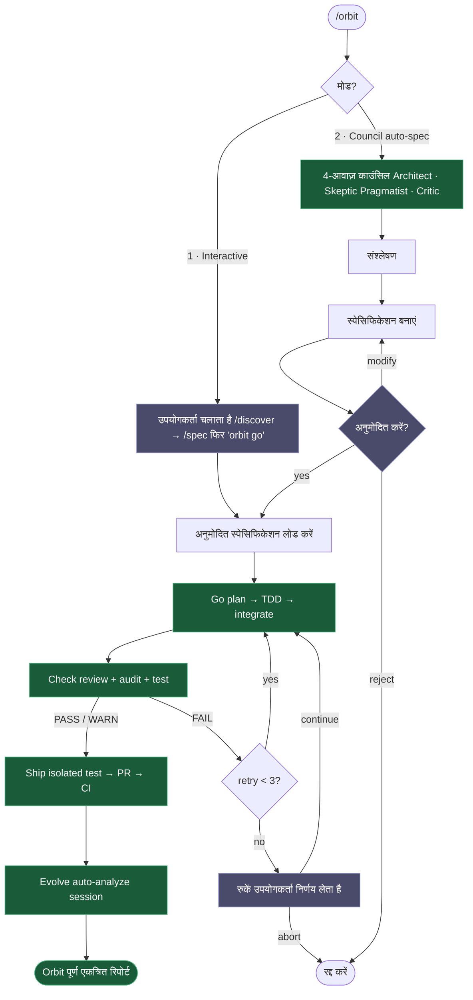
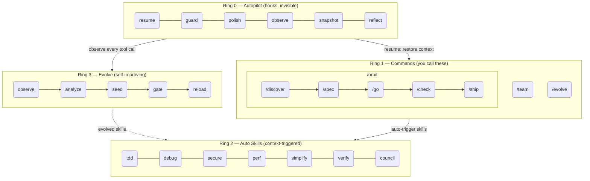

<h1 align="center">Epic Harness</h1>

<blockqoute><p align="center">एक स्व-विकसित AI कोडिंग एजेंट हार्नेस — 8 कमांड, 1 स्वायत्त पाइपलाइन, ऑटो-ट्रिगर स्किल्स, आपकी विफलताओं से सीखता है।</p></blockqoute>

<p align="center"><b>8 कमांड। ऑटो-ट्रिगर स्किल्स। स्व-विकसित।</b></p>

<p align="center">
<a href="../../README.md">English</a> | <a href="../ja/README.md">日本語</a> | <a href="../ko/README.md">한국어</a> | <a href="../de/README.md">Deutsch</a> | <a href="../fr/README.md">Français</a> | <a href="../zh-CN/README.md">简体中文</a> | <a href="../zh-TW/README.md">繁體中文</a> | <a href="../pt-BR/README.md">Português</a> | <a href="../es/README.md">Español</a> | <a href="../hi/README.md">हिन्दी</a>
</p>

<p align="center">
  <a href="LICENSE"></a>
  
  
  
  <a href="https://buymeacoffee.com/epicsaga"></a>
</p>

एक Claude Code प्लगइन जो **30+ कमांड को 8 से बदलता है**, **आप जो कर रहे हैं उसके आधार पर स्वचालित रूप से स्किल्स ट्रिगर करता है**, और **आपके अपने विफलता पैटर्न से नई स्किल्स विकसित करता है**। याद रखने के लिए कम सतह। प्रत्येक कीस्ट्रोक में अधिक बुद्धिमत्ता।

<p align="center">
  
</p>

---

## यह क्या करता है

एक कमांड आपके फीचर को आइडिया से merge तक पहुंचा देता है। स्किल्स सही समय पर अपने-आप एक्टिव होती हैं। और हर सेशन के साथ एजेंट और मजबूत होता जाता है।

```bash
$ /orbit "लॉगिन API में JWT auth जोड़ो"
→ spec approved → go (TDD subagents) → check (PASS) → ship (PR + CI) → evolve
```

या पूरा कंट्रोल रखते हुए स्टेप-बाय-स्टेप चलाएँ:

```bash
/spec "लॉगिन API में JWT auth जोड़ो"   # आवश्यकताएँ साफ करें → SPEC-*.md
/go                                      # ऑटो-प्लान → TDD subagents → 4 मिनट
/check                                   # समानांतर review + security + tests → PASS
/ship                                    # isolated test → PR → CI green
```

स्किल्स बैकग्राउंड में अपने-आप चलती हैं — बिना अतिरिक्त कमांड:

```
नई feature बना रहे हैं?        → tdd ट्रिगर (Red→Green→Refactor अनिवार्य)
टेस्ट फेल हुआ?                 → debug ट्रिगर (पहले root cause, कोई blind fix नहीं)
auth/DB बदला?                  → secure ट्रिगर (OWASP checklist, कोई shortcut नहीं)
फ़ाइल 200+ लाइनों की?          → simplify ट्रिगर (extract, rename, simplify)
```

सेशन खत्म होने पर **evolve loop** देखता है कि कहाँ रुकावट आई, targeted skills बनाता है, और अगली सेशन में लोड कर देता है। आज TypeScript build में अटके? अगली बार `evo-ts-care` साथ होगा।

---

## इंस्टॉलेशन

> **पहली बार?** [त्वरित प्रारंभ गाइड (5 मिनट)](../../QUICKSTART.md) पढ़ें।

```bash
# Claude Code
/plugin marketplace add epicsagas/plugins && /plugin install epic@epicsagas

# कोई भी अन्य टूल
cargo install epic-harness && epic install
```

| वातावरण | विधि |
|---------|------|
| **Claude Code** | प्लगइन मार्केटप्लेस (ऊपर) |
| **macOS** | `brew install epicsagas/tap/epic-harness` |
| **कोई भी (Rust के साथ)** | `cargo install epic-harness` |
| **सोर्स से** | `git clone` + `cargo install --path .` |

पूर्वापेक्षाएं: **Git**। सोर्स/बाइनरी इंस्टॉल के लिए [Rust टूलचेन](https://rustup.rs) भी आवश्यक है।

### `epic install` — सेटअप विज़ार्ड

बाइनरी इंस्टॉल करने के बाद, `epic install` (या `epic install claude`) चलाएं:

1. `~/.harness/` डायरेक्टरी संरचना बनाएं
2. कमांड, स्किल्स और एजेंट को टूल के कॉन्फिग डायरेक्टरी में सिंक करें
3. Claude Code के लिए MCP सर्वर (harness-mem) रजिस्टर करें
4. यदि अनुपस्थित हो तो `~/.harness/config.toml` को डिफ़ॉल्ट के साथ बनाएं

Claude Code में, `hooks/setup.sh` सत्र प्रारंभ पर स्वचालित रूप से चलता है और यदि बाइनरी अनुपस्थित हो तो उसे इंस्टॉल करता है। प्रारंभिक क्लोन के बाद कोई मैन्युअल कदम आवश्यक नहीं।

### अन्य टूल्स

```bash
epic install codex        # Codex CLI   → ~/.codex/ + ~/.agents/skills/
epic install gemini       # Gemini CLI  → ~/.gemini/
epic install cursor       # Cursor      → ~/.cursor/ (Cursor 1.7+ आवश्यक)
epic install opencode     # OpenCode    → ~/.config/opencode/
epic install cline        # Cline       → ~/Documents/Cline/Rules/
epic install aider        # Aider       → ~/.aider.conf.yml + ~/.aider/
epic install              # इंटरेक्टिव मेनू
```

इंटीग्रेशन फ़ाइलें बाइनरी से **सिंक** होती हैं: गायब या पुरानी फ़ाइलें लिखी जाती हैं। `GEMINI.md` और `AGENTS.md` केवल तभी बनाए जाते हैं जब अनुपस्थित हों।

### सत्यापन

```bash
epic --version              # बाइनरी इंस्टॉल है
ls ~/.harness/              # डेटा डायरेक्टरी मौजूद है
```

Claude Code सत्र के अंदर: `/evolve status`

### त्वरित डेमो

**एक कमांड, पूरी पाइपलाइन:**
```bash
$ /orbit
# मोड चुनें:
#   1. इंटरेक्टिव  — आप /discover + /spec चलाते हैं, फिर "orbit go"
#   2. काउंसिल    — 4-आवाज़ काउंसिल स्पेसिफिकेशन बनाती है, आप अनुमोदित करते हैं
→ spec अनुमोदित → go (TDD) → check (PASS) → ship (PR + CI) → evolve
```

**या मैन्युअल रूप से चरण दर चरण आगे बढ़ें:**
```bash
$ /spec "Add JWT auth to the login API"
  → आवश्यकताओं को स्पष्ट करता है → SPEC-*.md उत्पन्न करता है

$ /go
  → स्वचालित रूप से योजना बनाता है → TDD सबएजेंट → DONE (4 मिनट)

$ /check
  → समानांतर कोड रिव्यू + सुरक्षा ऑडिट + परीक्षण → PASS

$ /ship
  → PR बनाता है → CI हरा → मर्ज
```

## /orbit — स्वायत्त पाइपलाइन

`/orbit` संपूर्ण मैन्युअल पाइपलाइन को एकल स्वायत्त निष्पादन में लपेटता है।



**बैंगनी नोड** — मानव चेकपॉइंट: मोड चयन, स्पेसिफिकेशन अनुमोदन, 3× check विफलता पर रुकना।
**हरे नोड** — स्वायत्त: go, check, ship, evolve उपयोगकर्ता हस्तक्षेप के बिना चलते हैं।

`$HARNESS_DIR/orbit/PIPELINE-{timestamp}.json` में स्थिति बनी रहती है — संदर्भ कम्पैक्शन के बाद भी जीवित रहती है।

## कमांड

| कमांड | क्या करता है |
|-------|-------------|
| `/discover` | समाधान निर्दिष्ट करने से पहले समस्या को खोजें और परिभाषित करें — 5 क्यों, JTBD, सुकराती प्रश्न |
| `/spec` | क्या बनाना है परिभाषित करें — आवश्यकताओं को स्पष्ट करें, एक स्पेसिफिकेशन बनाएं |
| `/go` | इसे बनाएं — ऑटो-प्लान, TDD सबएजेंट, 4-स्टेट रिजल्ट मॉडल (DONE/CONCERNS/NEEDS_CONTEXT/BLOCKED), worktree आइसोलेशन के साथ समानांतर निष्पादन |
| `/check` | सत्यापित करें — अनुकूली विशेषज्ञ डिस्पैच (स्कोप-आधारित), समानांतर कोड रिव्यू + सुरक्षा ऑडिट + प्रदर्शन |
| `/ship` | प्रकाशित करें — आइसोलेटेड प्री-फ्लाइट परीक्षण, फिर PR, CI, मर्ज |
| `/team` | प्रोजेक्ट के पार ऑर्ग-स्तरीय एजेंट टीमें बनाएं और सिंक करें |
| `/evolve` | मैन्युअल एवोल्यूशन ट्रिगर / स्टेटस / rollback |
| `/orbit` | **स्वायत्त पाइपलाइन** — spec → go → check → ship एक बार में चलाता है। इंटरेक्टिव या काउंसिल मोड चुनें। |

---

## ऑटो स्किल्स (Ring 2)

स्किल्स स्वचालित रूप से ट्रिगर होती हैं। आप उन्हें नहीं बुलाते।

| स्किल | कब ट्रिगर होती है |
|-------|-----------------|
| **tdd** | नई फीचर इम्प्लीमेंटेशन |
| **debug** | टेस्ट विफलता या एरर |
| **discover** | अस्पष्ट अनुरोध, समस्या के बिना समाधान, या अनफोकस्ड शिकायत |
| **secure** | Auth/DB/API/secrets कोड में बदलाव |
| **perf** | लूप, क्वेरी, रेंडरिंग कोड |
| **simplify** | फ़ाइल > 200 लाइनें या उच्च जटिलता |
| **document** | सार्वजनिक API जोड़ा या बदला गया |
| **verify** | /go या /ship पूरा करने से पहले |
| **context** | संदर्भ विंडो > 70% उपयोग |
| **council** | अस्पष्ट आर्किटेक्चरल या डिज़ाइन निर्णय |
| **agent-introspection** | बार-बार विफलताओं के बाद एजेंट सेल्फ-डीबगिंग |

## Hooks (Ring 0)

अदृश्य रूप से चलते हैं। सबकमांड के साथ एकल Rust बाइनरी (`epic-harness`)।

| Hook | कब | क्या करता है |
|------|-----|------------|
| **resume** | सत्र प्रारंभ | संदर्भ पुनर्स्थापित करें, मेमोरी लोड करें, स्टैक डिटेक्ट करें |
| **guard** | Bash से पहले | force-push-to-main, rm -rf /, DROP prod ब्लॉक करें |
| **polish** | Edit के बाद | ऑटो-फॉर्मेट (Biome/Prettier/ruff/gofmt) + टाइपचेक |
| **observe** | प्रत्येक टूल उपयोग | `~/.harness/projects/{slug}/obs/` में लॉग करें एवोल्यूशन + GateGuard संकेतों के लिए |
| **snapshot** | कम्पैक्ट से पहले | `~/.harness/projects/{slug}/sessions/` में स्टेट सेव करें |
| **reflect** | सत्र समाप्त | विफलताओं का विश्लेषण करें, विकसित स्किल्स सीड करें, गेट करें, इंस्टिंक्ट निकालें |

Polish का observe में फीडबैक: फॉर्मेट विफलता → `lint_fail`, TypeScript एरर → `build_fail`। Edit→Error thrashing तब भी डिटेक्ट होता है जब एरर polish से आते हैं।

प्रत्येक सत्र अपना `session_{date}_{pid}_{random}.jsonl` लिखता है — एक ही प्रोजेक्ट पर कई सत्र एक-दूसरे के डेटा को दूषित नहीं करेंगे।

### Hook प्रोफ़ाइल

`~/.harness/config.toml` या `EPIC_HOOK_PROFILE` env var के माध्यम से:

| प्रोफ़ाइल | सक्रिय hooks |
|-----------|------------|
| `minimal` | guard, observe, resume |
| `standard` (डिफ़ॉल्ट) | उपरोक्त + polish, reflect, snapshot |
| `strict` | सभी hooks + भविष्य के strict-only चेक |

### कस्टम Guard नियम

अपने प्रोजेक्ट रूट में `.harness/guard-rules.yaml` के माध्यम से प्रोजेक्ट-विशिष्ट नियम जोड़ें:

```yaml
blocked:
  - pattern: kubectl\s+delete\s+namespace | msg: Namespace deletion blocked
warned:
  - pattern: docker\s+system\s+prune | msg: Docker prune — verify first
```

## टीम (`epic team`)

टीमें **ऑर्ग-स्तरीय** हैं, प्रोजेक्ट से बंधी नहीं। किसी भी प्रोजेक्ट में `/team` चलाने से एजेंट परिभाषाओं का एक साझा पूल समृद्ध होता है — कभी चुपचाप ओवरराइट नहीं होता।

```bash
epic team                              # इंटरेक्टिव: स्कैन → डिज़ाइन → लिखें → सिंक
epic team sync backend                 # एजेंट डिस्पैच → .claude/agents/backend/
epic team link backend                 # डिस्पैच + टीम कॉन्फिग में प्रोजेक्ट रजिस्टर करें
epic team list                         # वर्तमान ऑर्ग में सभी टीमें
epic team list --org netflix           # नामित ऑर्ग में टीमें
epic team show backend --playbook      # कॉन्फिग + पूर्ण playbook
epic team delete backend               # केवल वर्तमान प्रोजेक्ट से वापस लें
epic team delete backend --global      # ऑर्ग स्टोर से स्थायी रूप से हटाएं
```

सिंक करने के बाद, एजेंट अगले सत्र में उपलब्ध होते हैं: `@domain-expert`, `@reviewer`, `@tester`, आदि।

| प्रकार | कीवर्ड | डिफ़ॉल्ट एजेंट |
|--------|--------|--------------|
| स्ट्रीम-अलाइन्ड | `stream` | domain-expert, reviewer, tester |
| प्लेटफ़ॉर्म | `platform` | api-designer, infra-specialist, dx-agent |
| सक्षम करने वाला | `enabling` | specialist |
| जटिल सबसिस्टम | `subsystem` | domain-specialist, integration-tester |

मल्टी-ऑर्ग: `epic team --org netflix` — प्रत्येक ऑर्ग के लिए अलग टोपोलॉजी।

मर्ज रणनीति: बदले गए एजेंट पुष्टि मांगते हैं (डिफ़ॉल्ट: मौजूदा रखें, `.history/` में बैकअप)। Playbook हमेशा जोड़ा जाता है।

## मल्टी-टूल समर्थन

सभी टूल एक ही `~/.harness/projects/{slug}/` डेटा डायरेक्टरी साझा करते हैं।

| टूल | Ring 0 Hooks | कमांड | स्किल्स | एजेंट |
|-----|------------|-------|---------|------|
| **Claude Code** | ✓ पूर्ण | ✓ 8 कमांड (incl. /orbit) | ✓ 11 स्किल्स | ✓ 4 |
| **Codex CLI** | ✓ पूर्ण¹ | ✓ 8 prompts (incl. /orbit) | ✓ 7 | ✓ 4 |
| **Gemini CLI** | ✓ आंशिक² | ✓ 8 कमांड (incl. /orbit) | ✓ 7 | ✓ 4 |
| **Cursor** | ✓ पूर्ण³ | ✓ 8 कमांड (incl. /orbit) | ✓ rules के माध्यम से | ✓ 4 |
| **OpenCode** | ✓ आंशिक⁴ | ✓ 8 कमांड (incl. /orbit) | — | ✓ 4 |
| **Cline** | ✓ पूर्ण⁵ | — | — | — |
| **Aider** | —⁶ | — | — | — |

¹ `~/.codex/config.toml` में `codex_hooks = true` · ² `BeforeModel` स्तर पर Guard · ³ Cursor 1.7+ · ⁴ JS प्लगइन · ⁵ 5 hook स्क्रिप्ट · ⁶ केवल कन्वेंशन

## एकीकृत मेमोरी — WIP

> **स्टेटस: विकास में।** अभी पूरी तरह कार्यात्मक नहीं। CLI कमांड, MCP टूल और वेब UI प्रगति में हैं।

सभी एजेंट `~/.harness/memory.db` (SQLite फुल-टेक्स्ट सर्च के साथ) में एक नॉलेज ग्राफ साझा करते हैं। कोई बाहरी रनटाइम नहीं।

```
score = recency(25%) + importance(35%) + access_frequency(15%) + FTS_match(25%)
```

### CLI

```bash
epic mem recall "auth refactor" --project my-project   # स्मार्ट रिकॉल
epic mem add --title "JWT rotation" --type decision    # नोड जोड़ें
epic mem search "JWT"                                  # FTS5 खोज
epic mem query --type decision --project my-project    # फ़िल्टर
epic mem context --project my-project                  # प्रोजेक्ट संदर्भ
epic mem serve                                         # वेब UI → :7700
epic mem mcp-install                                   # MCP सर्वर रजिस्टर करें
epic mem export --out ./docs/memory                    # Markdown में एक्सपोर्ट करें
```

### MCP टूल (6)

| टूल | उद्देश्य |
|-----|---------|
| `mem_recall` | hint + project + ग्राफ पड़ोसियों के साथ स्मार्ट संदर्भ रिकॉल |
| `mem_add` | प्रकार के अनुसार ऑटो-महत्व (या स्पष्ट 0.0–1.0) के साथ नोड जोड़ें |
| `mem_search` | कीवर्ड खोज (फुल-टेक्स्ट), महत्व के अनुसार रैंक |
| `mem_query` | tag/type/project के अनुसार फ़िल्टर |
| `mem_context` | प्रोजेक्ट-स्कोप्ड स्मार्ट रिकॉल (कोई hint नहीं) |
| `mem_related` | नोड ID से ग्राफ ट्रैवर्सल (जुड़े ज्ञान खोजता है) |

### नोड प्रकार

| प्रकार | किसने बनाया | महत्व |
|--------|-----------|------|
| `decision` | मैन्युअल / MCP | 0.9 |
| `resolution` | मैन्युअल / MCP | 0.8 |
| `concept` | मैन्युअल / MCP | 0.7 |
| `project` | मैन्युअल / MCP | 0.7 |
| `instinct` | ऑटो (reflect) | 0.7 |
| `pattern` | ऑटो (reflect) | 0.5 |
| `error` | ऑटो (reflect) | 0.4 |
| `session` | ऑटो (reflect) | 0.2 |

जीवनचक्र: 30+ दिन बिना पहुंच के → 10% महत्व क्षय (न्यूनतम 0.05)। 180+ दिन → `stale` टैग, रिकॉल से बाहर। `pinned` टैग क्षय रोकता है।

## Evolve (Ring 3)

Claude Code के hook सिस्टम में [A-Evolve](https://github.com/A-EVO-Lab/a-evolve) के स्वचालित एवोल्यूशन पैटर्न को फ्यूज़ करता है।

### स्कोरिंग

प्रत्येक टूल कॉल 3 अक्षों पर स्कोर होता है (`~/.harness/config.toml` के माध्यम से कॉन्फिगर योग्य वज़न):

```
composite = 0.5 × tool_success + 0.3 × output_quality + 0.2 × execution_cost
```

विफलता वर्गीकरण (9 प्रकार): `type_error` · `syntax_error` · `test_fail` · `lint_fail` · `build_fail` · `permission_denied` · `timeout` · `not_found` · `runtime_error`

### पैटर्न डिटेक्शन

| पैटर्न | डिटेक्ट करता है | डिफ़ॉल्ट थ्रेशोल्ड |
|--------|---------------|-------------------|
| `repeated_same_error` | वही एरर N+ बार | 3 |
| `fix_then_break` | Edit सफलता → build/test विफलता | 3 lookback, 2 साइकिल |
| `long_debug_loop` | उसी फ़ाइल पर अटका | 5 ऑपरेशन |
| `thrashing` | Edit↔Error बदलाव | 3 edits, 3 errors |

### एवोल्यूशन फ्लो

```
Observe (PostToolUse — 3-अक्ष स्कोरिंग)
    ↓ obs/session_{id}.jsonl
Analyze (SessionEnd)
    ↓ प्रति-टूल, प्रति-ext स्कोर + पैटर्न
Propose (Solver — स्कोर द्वारा स्नातक: ≥0.90 छोड़ें, ≥0.70 मध्यम, <0.70 पूर्ण)
    ↓ SkillProposal[] विश्वास के साथ
Curate (स्वीकार/मर्ज/छोड़ें, solver से फीडबैक छिपा)
    ↓ evolved/{skill}/SKILL.md + meta.json
Gate (फॉर्मेट चेक, dedup, कैप 10, ≥ 3 सत्र गेटेड प्रमोशन)
    ↓ evolved_backup/ (सर्वश्रेष्ठ चेकपॉइंट)
Instinct (उच्च-सफलता पैटर्न → cross-project memory.db नोड)
    ↓
Reload (अगला सत्र — resume विकसित स्किल्स लोड करता है)
```

स्किल सीडिंग: कमज़ोर टूल (सफलता <60%, न्यूनतम 5 obs), कमज़ोर फ़ाइल प्रकार (सफलता <50%, न्यूनतम 3 obs), उच्च-आवृत्ति एरर (5+ घटनाएं)।

स्थिरता: 5% सुधार के बिना 3 सत्र → सर्वश्रेष्ठ चेकपॉइंट पर ऑटो-rollback।

```bash
/evolve              # अभी चलाएं
/evolve status       # डैशबोर्ड: स्कोर, ट्रेंड, पैटर्न, स्किल्स
/evolve history      # पूर्ण इतिहास + स्किल प्रभावशीलता
/evolve cross-project # क्रॉस-प्रोजेक्ट पैटर्न विश्लेषण
/evolve rollback     # पिछला सर्वश्रेष्ठ पुनर्स्थापित करें
/evolve reset        # सभी एवोल्यूशन डेटा साफ़ करें
```

### स्किल प्रभावशीलता

प्रत्येक विकसित स्किल को A/B एट्रिब्यूशन के साथ ट्रैक किया जाता है:

```
/evolve history → Skill Effectiveness

| Skill              | With | Without | Delta |
|--------------------|------|---------|-------|
| evo-ts-care        | 0.87 | 0.72    | +15%  |
| evo-bash-discipline| 0.65 | 0.68    | -3%   |
```

पॉज़िटिव डेल्टा = प्रभावी। नेगेटिव = `/evolve rollback` के माध्यम से हटाने पर विचार करें।

### कोल्ड-स्टार्ट प्रीसेट

पहले सत्र में, स्टैक-उपयुक्त प्रीसेट स्किल्स स्वचालित रूप से लागू होती हैं:

| Stack | Presets |
|-------|---------|
| Node.js/TypeScript | `evo-ts-care`, `evo-fix-build-fail` |
| Go | `evo-go-care` |
| Python | `evo-py-care` |
| Rust | `evo-rs-care` |

### इंस्टिंक्ट लर्निंग

उच्च-सफलता पैटर्न निकाले और प्रोजेक्ट के पार प्रमोट किए जाते हैं:

```
observe (100% पुष्टि) → extract_instincts() → instinct node (विश्वास ≥ 0.8)
    → global में प्रमोट करें जब ≥ 2 प्रोजेक्ट में देखा गया हो
```

## आर्किटेक्चर: 4-रिंग मॉडल



## क्रॉस-प्रोजेक्ट लर्निंग

प्रोजेक्ट के पार विफलता पैटर्न साझा करने के लिए ऑप्ट-इन करें:

```bash
touch ~/.harness/projects/{slug}/.cross-project-enabled
```

सत्र समाप्त → `~/.harness/global_patterns.jsonl` में अनाम पैटर्न एक्सपोर्ट करता है। सत्र प्रारंभ → अन्य प्रोजेक्ट के कमज़ोर क्षेत्रों से संकेत दिखाता है।

## प्रोजेक्ट डेटा

सभी डेटा `~/.harness/` (होम डायरेक्टरी) में रहता है, आपके प्रोजेक्ट रूट में नहीं। प्रोजेक्ट हटाने के बाद भी जीवित रहता है, git इतिहास को प्रदूषित नहीं करता।

```
~/.harness/
├── memory.db                  # SQLite नॉलेज ग्राफ (नोड + एज + FTS5)
├── graph.json                 # कैश्ड ग्राफ (वेब UI के लिए)
├── config.toml                # उपयोगकर्ता कॉन्फिगरेशन
├── global_patterns.jsonl      # क्रॉस-प्रोजेक्ट पैटर्न (opt-in)
├── orgs/                      # टीम ग्लोबल स्टोर
│   └── {org}/teams/{team}/
│       ├── config.json, mission.md, playbook.md, agents/, .history/
└── projects/{slug}/
    ├── memory/                # प्रोजेक्ट पैटर्न और नियम
    ├── sessions/              # सत्र snapshots (resume के लिए)
    ├── obs/                   # टूल उपयोग अवलोकन लॉग (JSONL)
    ├── evolved/               # ऑटो-विकसित स्किल्स
    │   ├── manifest.json
    │   └── {skill}/SKILL.md + meta.json
    ├── evolved_backup/        # सर्वश्रेष्ठ चेकपॉइंट (rollback के लिए)
    ├── dispatch/              # स्किल डिस्पैच लॉग
    ├── evolution.jsonl        # पूर्ण एवोल्यूशन इतिहास
    └── metrics.json           # एकत्रित आंकड़े + स्किल एट्रिब्यूशन
```

अपनी टीम के साथ सुरक्षा नियम साझा करें: प्रोजेक्ट रूट में `.harness/guard-rules.yaml` (git में कमिट)।

## कॉन्फिगरेशन

`~/.harness/config.toml` में सभी ट्यूनेबल पैरामीटर। अनुपस्थित = हार्डकोडेड डिफ़ॉल्ट।

```toml
# प्राथमिकता: env var (EPIC_HOOK_PROFILE) > यह फ़ाइल > डिफ़ॉल्ट

[hook]
profile = "standard"         # "minimal" | "standard" | "strict"
gateguard_hints = true

[scoring]
weights = [0.5, 0.3, 0.2]   # [success, quality, cost]

[evolution]
max_skills = 10
stagnation_limit = 3
improvement_threshold = 0.05
gated_promotion_min = 3

[pattern]
# repeated_error_min = 3
# debug_loop_min = 5
# graduated_scope_skip = 0.90
# graduated_scope_moderate = 0.70

[instinct]
# confidence_threshold = 0.8
# promotion_min_projects = 2
# max_instincts = 20
# min_observations = 10
# min_avg_score = 0.5
```

## विकास

```bash
cargo install --path .                                        # बिल्ड + इंस्टॉल
cp ~/.cargo/bin/epic-harness hooks/bin/epic-harness           # प्लगइन बाइनरी अपडेट करें
cargo test                                                    # परीक्षण
```

Hooks बाइनरी दो जगहों पर देखते हैं: `hooks/bin/epic-harness` (प्लगइन लोकल) → `~/.cargo/bin/epic-harness` (PATH)।

## लिंक

- [Changelog](../../CHANGELOG.md) — रिलीज़ इतिहास
- [Contributing](../../CONTRIBUTING.md) — कैसे योगदान करें
- [Security](../../SECURITY.md) — कमज़ोरियां रिपोर्ट करना
- [Issues](https://github.com/epicsagas/epic-harness/issues) — बग रिपोर्ट और फीचर अनुरोध

## आभार

- [a-evolve](https://github.com/A-EVO-Lab/a-evolve) — स्वचालित एवोल्यूशन और बेंचमार्क पैटर्न
- [agent-skills](https://github.com/addyosmani/agent-skills) — Claude Code एजेंट स्किल सिस्टम
- [everything-claude-code](https://github.com/affaan-m/everything-claude-code) — व्यापक Claude Code पैटर्न
- [gstack](https://github.com/garrytan/gstack) — प्लगइन आर्किटेक्चर संदर्भ
- [harness](https://github.com/revfactory/harness) — Hook और हार्नेस इन्फ्रास्ट्रक्चर पैटर्न
- [serena](https://github.com/oraios/serena) — स्वायत्त एजेंट डिज़ाइन
- [SuperClaude Framework](https://github.com/SuperClaude-Org/SuperClaude_Framework) — मल्टी-कमांड फ्रेमवर्क आर्किटेक्चर
- [superpowers](https://github.com/obra/superpowers) — Claude Code एक्सटेंशन पैटर्न

## लाइसेंस

[Apache 2.0](../../LICENSE)
