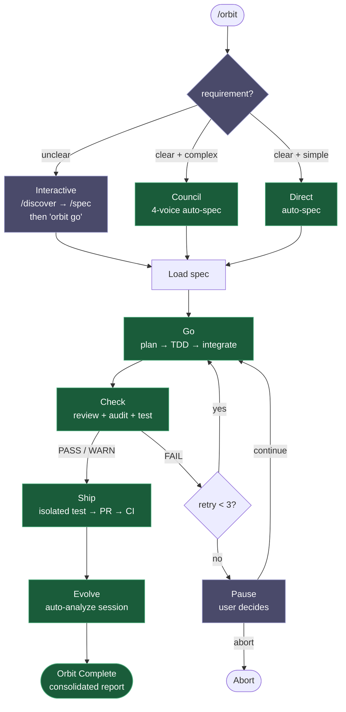
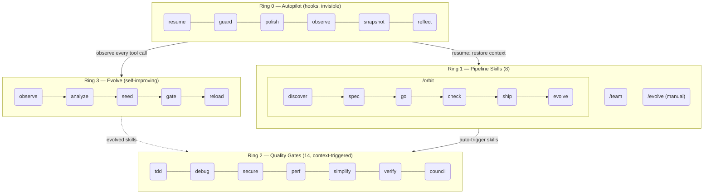

<h1 align="center">Epic Harness</h1>

<blockquote><p align="center">すべてのセッションから学習するマルチツールAIエージェントハーネス — 22のスキル、自律パイプライン、自己進化エンジン。</p></blockquote>

<p align="center"><b>1つのハーネス、6つのAIツール。スペックからPRまで自律実行。セッションを重ねるほどスマートに。</b></p>

<p align="center">
<a href="../../README.md">English</a> | <a href="../ja/README.md">日本語</a> | <a href="../ko/README.md">한국어</a> | <a href="../de/README.md">Deutsch</a> | <a href="../fr/README.md">Français</a> | <a href="../zh-CN/README.md">简体中文</a> | <a href="../zh-TW/README.md">繁體中文</a> | <a href="../pt-BR/README.md">Português</a> | <a href="../es/README.md">Español</a> | <a href="../hi/README.md">हिन्दी</a>
</p>

<p align="center">
  <a href="https://github.com/epicsagas/epic-harness/stargazers"></a>
  <a href="https://github.com/epicsagas/epic-harness/network/members"></a>
  <a href="https://github.com/epicsagas/epic-harness/issues"></a>
  <a href="https://github.com/epicsagas/epic-harness/commits/main"></a>
</p>
<p align="center">
  <a href="../../LICENSE"></a>
  
  
  
  <a href="https://buymeacoffee.com/epicsaga"></a>
</p>

**22のスキル（8パイプライン + 14品質ゲート）**、**自己進化エンジン**、**統合メモリ**、**単一コマンド自律パイプライン**（`/orbit`）を備えたマルチツールAIエージェントハーネス。Claude Code、Codex、Cursor、OpenCode、Clineに対応し、すべてのツールが同じ `~/.harness/` データディレクトリを共有します。各セッション終了後、evolveループが失敗を分析し、ターゲットを絞ったスキルを生成して次回のセッションに読み込みます。

<p align="center">
  
</p>

---


### Webダッシュボード — 10画面のリアルタイムメトリクス
<p align="center">
  
  
</p>

---

## できること

1つのコマンドで機能をエンドツーエンドでシップできます。スキルはあなたが指示しなくても自動発火。エージェントは毎セッション確実にスマートになります。

```bash
$ /orbit "ログインAPIにJWT認証を追加"
→ spec approved → go (TDD subagents) → check (PASS) → ship (PR + CI) → evolve
```

パイプラインスキルを直接呼び出すこともできます:

```bash
/spec "ログインAPIにJWT認証を追加"   # 要件を明確化 → SPEC-*.md
/go                                   # 自動計画 → TDDサブエージェント → 4分
/check                                # 並列レビュー + セキュリティ + テスト → PASS
/ship                                 # 分離テスト → PR → CIグリーン
```

スキルはバックグラウンドで自動トリガー — 追加コマンド不要:

```
機能開発中?              → tdd 発火 (Red→Green→Refactor を強制)
テスト失敗?              → debug 発火 (まず根本原因、やみくも修正なし)
auth/DB を変更?          → secure 発火 (OWASPチェックリスト、近道なし)
ファイルが200行超?        → simplify 発火 (抽出・リネーム・簡素化)
```

セッション終了後、**evolveループ**が何が壊れたかを分析し、狙いを絞ったスキルを生成して次回セッションで読み込みます。今日 TypeScript ビルドで詰まったエージェントは、次回 `evo-ts-care` スキルを持っています。

---

## インストール

> **初めての方は** [クイックスタートガイド（5分）](../../docs/quickstart.md)をお読みください。

### Claude Code（推奨）

```
/plugin marketplace add epicsagas/plugins
/plugin install epic@epicsagas
```

バイナリを自動インストールし、すべてのフックを一度に登録します。

### Codex CLI

```bash
codex plugin marketplace add epicsagas/plugins
```

22のスキルをすべて自動インストールし、フックを登録します。追加の手順なしですぐに利用可能です。`codex plugin update epic@epicsagas` で更新できます。

### Antigravity (Gemini CLI)

```bash
agy plugins install https://github.com/epicsagas/epic-harness
```

プラグイン（スキル、エージェント、コマンド、フック）を自動インストールし、次回セッション開始時に登録します。

### macOS / Linux

```bash
brew install epicsagas/tap/epic-harness
```

Homebrewがない場合は、インストーラースクリプトを使用:

```bash
curl --proto '=https' --tlsv1.2 -LsSf \
  https://github.com/epicsagas/epic-harness/releases/latest/download/install.sh | sh
```

### Windows

```powershell
irm https://github.com/epicsagas/epic-harness/releases/latest/download/install.ps1 | iex
```

### Rustツールチェーン経由

```bash
cargo binstall epic-harness   # プリビルドバイナリ（高速）
cargo install epic-harness    # ソースからビルド
```

その後、セットアップウィザードを実行:

```bash
epic install cursor         # Cursor IDE
```

> `epic-harness --version` で確認。`brew upgrade epic-harness` またはインストーラースクリプトの再実行で更新。

前提条件: **Git**。ソース/バイナリインストールには [Rustツールチェーン](https://rustup.rs) も必要です。

### `epic install` — セットアップウィザード

バイナリをインストールした後、`epic install`（または `epic install claude`）を実行して:

1. `~/.harness/` ディレクトリ構造を作成
2. コマンド、スキルをツールの設定ディレクトリに同期
3. Claude CodeにMCPサーバー（harness-mem）を登録
4. 不在の場合、デフォルト設定で `~/.harness/config.toml` を作成

Claude Codeでは、`hooks/install.js` がセッション開始時に自動実行され、バイナリが欠落している場合はインストールされます。初回クローン後に手動の手順は不要です。

### その他のツール

```bash
epic install cursor         # Cursor         → ~/.cursor/ (Cursor 1.7+が必要)
epic install opencode     # OpenCode    → ~/.config/opencode/
epic install cline        # Cline       → ~/Documents/Cline/Rules/
epic install aider        # Aider       → ~/.aider.conf.yml + ~/.aider/
epic install              # インタラクティブメニュー
```

統合ファイルはバイナリから**同期**されます: 欠落または古いファイルが書き込まれます。`AGENTS.md` は不在の場合のみ作成されます。

### 確認

```bash
epic --version              # バイナリがインストールされている
ls ~/.harness/              # データディレクトリが存在する
```

Claude Codeセッション内: `/evolve status`

---

## パイプラインスキル（Ring 1）

| スキル | 機能 |
|-------|------|
| **/orbit** | **完全自律パイプライン**: discover → spec → go → check → ship → evolve を一括実行 |
| **discover** | 曖昧なリクエストを明確化 — 5 Whys、JTBD、ソクラテス対話 |
| **spec** | 要件を番号付きR + ACドキュメントに変換 |
| **go** | 自動計画 → TDDサブエージェント → 並列実行 → AC検証 |
| **check** | 並列コードレビュー + セキュリティ監査 + テスト |
| **ship** | 分離テスト → チェックレポート付きPR → CI監視 + 自動修正 |
| **evolve** | 手動進化トリガー — セッション分析、ダッシュボード表示、スキル有効性確認、ロールバック |
| **team** | orgのライブラリを閲覧、既存チームを雇用、または新規設計（3–6エージェント、`.claude/agents/` に同期） |

`discover` → `spec` → `go` → `check` → `ship` → `evolve` は `/orbit` でラップされます。`team` と `evolve` は手動呼び出しです。

---

## /orbit — 自律パイプライン

`/orbit` はパイプライン全体を単一の自律実行にまとめます。モードを選ぶだけで、PRまでは完全にハンズフリーです。



**紫** — ヒューマンステップ: モード選択（unclear → インタラクティブ）、3回のチェック失敗時の一時停止。
**緑** — clear + complex → council自動spec; clear + simple → 直接ビルド; どちらも完全に自律。

状態は `$HARNESS_DIR/orbit/PIPELINE-{timestamp}.json` に保持され、コンテキスト圧縮後も維持されます。

> **注意**: orbit自体の変更やドキュメントのみの編集時、エージェントがパイプラインをバイパスする場合があります。[既知の問題（エージェント判断）](#既知の問題エージェント判断)を参照してください。

---

## 品質ゲート（Ring 2）

スキルはコンテキストに基づいて自動的にトリガーされます。手動で呼び出す必要はありません。

| スキル | トリガー条件 |
|-------|-------------|
| **tdd** | 新機能の実装またはバグ修正 |
| **debug** | テスト失敗またはランタイムエラー |
| **secure** | auth / DB / API / シークレットのコードに触れた場合 |
| **perf** | ループ、クエリ、レンダリング、バッチ操作 |
| **simplify** | ファイルが200行超または高サイクロマティック複雑度 |
| **verify** | `/go` または `/ship` 完了前 |
| **council** | 曖昧なアーキテクチャまたは設計の決定 |

---

## 進化（Ring 3）

ハーネスはすべてのツール呼び出しを監視し、3軸でスコアリングし、失敗パターンを検出し、狙いを絞ったスキルを自動的に生成します — セッション終了時に。

### スコアリング

```
composite = 0.5 × tool_success + 0.3 × output_quality + 0.2 × execution_cost
```

失敗の分類（9種類）: `type_error` · `syntax_error` · `test_fail` · `lint_fail` · `build_fail` · `permission_denied` · `timeout` · `not_found` · `runtime_error`

### パターン検出

| パターン | 検出内容 | デフォルト閾値 |
|---------|---------|---------------|
| `repeated_same_error` | 同じエラーがN回以上 | 3 |
| `fix_then_break` | 編集成功 → ビルド/テスト失敗 | ルックバック3、2サイクル |
| `long_debug_loop` | 同じファイルでスタック | 5操作 |
| `thrashing` | 編集↔エラーの交互発生 | 3回の編集、3回のエラー |

### 進化フロー

```
Observe (PostToolUse — 3-axis scoring)
    ↓ obs/session_{id}.jsonl
Analyze (SessionEnd)
    ↓ per-tool, per-ext scores + patterns
Propose (Solver — graduated by score: ≥0.90 skip, ≥0.70 moderate, <0.70 full)
    ↓ SkillProposal[] with confidence
Curate (Accept/Merge/Skip, feedback masked from solver)
    ↓ evolved/{skill}/SKILL.md + meta.json
Gate (format check, dedup, cap 10, gated promotion ≥ 3 sessions)
    ↓ evolved_backup/ (best checkpoint)
Instinct (high-success patterns → cross-project memory.db nodes)
    ↓
Reload (next session — resume loads evolved skills)
```

スキルシーディング: 弱いツール（成功率 <60%、最低5観測）、弱いファイルタイプ（成功率 <50%、最低3観測）、高頻度エラー（5回以上）。

停滞: 5%改善なしで3セッション → ベストチェックポイントに自動ロールバック。

### スキル有効性

すべての進化スキルはA/Bアトリビューションで追跡されます:

```
/evolve history → Skill Effectiveness

| Skill              | With | Without | Delta |
|--------------------|------|---------|-------|
| evo-ts-care        | 0.87 | 0.72    | +15%  |
| evo-bash-discipline| 0.65 | 0.68    | -3%   |
```

正のデルタ = 有効。負 = `/evolve rollback` による削除を検討。

### コールドスタートプリセット

最初のセッションでは、スタックに適したプリセットスキルが自動適用されます:

| スタック | プリセット |
|--------|-----------|
| Node.js/TypeScript | `evo-ts-care`, `evo-fix-build-fail` |
| Go | `evo-go-care` |
| Python | `evo-py-care` |
| Rust | `evo-rs-care` |

### 本能学習

高成功率のパターンが抽出され、プロジェクト横断で促進されます:

```
observe (100% confirmed) → extract_instincts() → instinct node (confidence ≥ 0.8)
    → promote to global when observed in ≥ 2 projects
```

```bash
/evolve              # 今すぐ実行
/evolve status       # ダッシュボード: スコア、トレンド、パターン、スキル
/evolve history      # 完全な履歴 + スキル有効性
/evolve cross-project # クロスプロジェクトパターン分析
/evolve rollback     # 以前のベストを復元
/evolve reset        # すべての進化データをクリア
```

---

## フック（Ring 0）

見えない形で毎セッション実行されます。サブコマンド付きの単一Rustバイナリ（`epic-harness`）。

| フック | タイミング | 機能 |
|------|----------|------|
| **resume** | セッション開始 | コンテキストの復元、メモリの読み込み、スタックの検出 |
| **guard** | Bash実行前 | force-push-to-main、`rm -rf /`、DROP prod をブロック |
| **polish** | 編集後 | 自動フォーマット（Biome/Prettier/ruff/gofmt）+ 型チェック |
| **observe** | すべてのツール使用時 | `~/.harness/projects/{slug}/obs/` にログを記録（進化用） |
| **snapshot** | compact前 | `~/.harness/projects/{slug}/sessions/` に状態を保存 |
| **reflect** | セッション終了 | 自動進化エンジン: 失敗分析、スキルシード、メトリクス更新、メモリインジェスト。`/reflect` スキルにデータを提供 |

Polishはobserveにフィードバックします: フォーマット失敗 → `lint_fail`、TypeScriptエラー → `build_fail`。polishからエラーが来る場合でも、Edit→Errorスラッシングが検出されます。

各セッションは独自の `session_{date}_{pid}_{random}.jsonl` を書き込みます — 複数の並行セッションが互いのデータを破損することはありません。

### フックプロファイル

`~/.harness/config.toml` または `EPIC_HOOK_PROFILE` 環境変数経由:

| プロファイル | アクティブなフック |
|------------|-----------------|
| `minimal` | guard, observe, resume |
| `standard`（デフォルト） | 上記 + polish, reflect, snapshot |
| `strict` | すべてのフック + 将来のstrict専用チェック |

### カスタムガードルール

プロジェクトルートの `.harness/guard-rules.yaml` でプロジェクト固有のルールを追加:

```yaml
blocked:
  - pattern: kubectl\s+delete\s+namespace | msg: Namespace deletion blocked
warned:
  - pattern: docker\s+system\s+prune | msg: Docker prune — verify first
```

---

## チーム（`epic team`）

チームは**orgレベル**であり、プロジェクトに縛られません。任意のプロジェクトで `/team` を実行すると、エージェント定義の共有プールが充実します — 黙って上書きすることはありません。

```bash
epic team                              # インタラクティブ: スキャン → デザイン → 書き込み → 同期
epic team sync backend                 # エージェントを .claude/agents/backend/ にディスパッチ
epic team link backend                 # ディスパッチ + チーム設定にプロジェクトを登録
epic team list                         # 現在のorgのすべてのチーム
epic team list --org netflix           # 指定のorgのチーム
epic team show backend --playbook      # 設定 + 完全なプレイブック
epic team delete backend               # 現在のプロジェクトからのみ削除
epic team delete backend --global      # orgストアから永久に削除
```

同期後、エージェントは次のセッションで利用可能になります: `@domain-expert`、`@reviewer`、`@tester` など。

| タイプ | キーワード | デフォルトエージェント |
|------|----------|---------------------|
| Stream-aligned | `stream` | domain-expert, reviewer, tester |
| Platform | `platform` | api-designer, infra-specialist, dx-agent |
| Enabling | `enabling` | specialist |
| Complicated Subsystem | `subsystem` | domain-specialist, integration-tester |

マルチorg: `epic team --org netflix` — orgごとに別のトポロジー。

マージ戦略: 変更されたエージェントはプロンプトを表示（デフォルト: 既存を保持、`.history/` にバックアップ）。プレイブックは常に追記。

---

## マルチツールサポート

すべてのツールが同じ `~/.harness/projects/{slug}/` データディレクトリを共有します。

| ツール | Ring 0 フック | スキル | エージェント |
|------|-------------|--------|----------|
| **Claude Code** | ✓ フル | ✓ 22スキル | Live |
| **Codex CLI** | ✓ フル¹ | ✓ 22 | — |
| **Cursor** | ✓ フル³ | ✓ ルール経由 | Live |
| **OpenCode** | ✓ 部分⁴ | — | — |
| **Cline** | ✓ フル⁵ | — | — |
| **Aider** | —⁶ | — | — |

¹ Plugin marketplace · ³ Cursor 1.7+ · ⁴ JSプラグイン · ⁵ 5つのフックスクリプト · ⁶ 規約のみ

---

## アーキテクチャ: 4-Ring モデル



---

## クロスプロジェクト学習

プロジェクト横断で失敗パターンを共有するにはオプトインします:

```bash
touch ~/.harness/projects/{slug}/.cross-project-enabled
```

セッション終了 → 匿名化されたパターンを `~/.harness/global_patterns.jsonl` にエクスポート。セッション開始 → 他のプロジェクトの弱い領域からのヒントを表示。

---

## 統合メモリ

すべてのエージェントが `~/.harness/memory.db`（全文検索付きSQLite）のナレッジグラフを共有します。外部ランタイム不要。

```
score = recency(25%) + importance(35%) + access_frequency(15%) + FTS_match(25%)
```

### CLI

```bash
epic mem recall "auth refactor" --project my-project   # スマートリコール
epic mem add --title "JWT rotation" --type decision    # ノードを追加
epic mem search "JWT"                                  # FTS5検索
epic mem list --type decision --project my-project     # フィルター
epic mem context --project my-project                  # プロジェクトコンテキスト
epic mem serve                                         # Web UI → :7700 または --port 8800 でカスタムポート
epic mem mcp-install                                   # MCPサーバーを登録
epic mem export --out ./docs/memory                    # Markdownにエクスポート
```

### MCPツール（6）

| ツール | 目的 |
|------|------|
| `mem_recall` | ヒント + プロジェクト + グラフ隣接ノードによるスマートコンテキストリコール |
| `mem_add` | タイプ別自動重要度でノードを追加（または明示的な0.0–1.0） |
| `mem_search` | キーワード検索（全文）、重要度でランク付け |
| `mem_query` | タグ/タイプ/プロジェクトでフィルター — `mem_list` のエイリアス |
| `mem_context` | プロジェクトスコープのスマートリコール（ヒントなし） |
| `mem_related` | ノードIDからのグラフトラバーサル（接続された知識を検索） |

### ノードタイプ

| タイプ | 作成者 | 重要度 |
|------|--------|--------|
| `decision` | 手動 / MCP | 0.9 |
| `resolution` | 手動 / MCP | 0.8 |
| `concept` | 手動 / MCP | 0.7 |
| `project` | 手動 / MCP | 0.7 |
| `instinct` | 自動（reflect） | 0.7 |
| `pattern` | 自動（reflect） | 0.5 |
| `error` | 自動（reflect） | 0.4 |
| `session` | 自動（reflect） | 0.2 |

ライフサイクル: アクセスなしで30日以上 → 重要度が10%低下（最低0.05）。180日以上 → `stale` タグが付き、リコールから除外。`pinned` タグは低下を防止。

> **Web UI**: グラフ可視化は積極的に改善中です — クラスタリング、近隣ハイライト、オフラインフォールバックが最近追加されました。さらに改良を進めています。

---

<details>
<summary><strong>プロジェクトデータ — ディレクトリレイアウト</strong></summary>

## プロジェクトデータ

すべてのデータはプロジェクトルートではなく `~/.harness/`（ホームディレクトリ）に存在します。プロジェクト削除後も維持され、gitの履歴を汚染しません。

```
~/.harness/
├── memory.db                  # SQLiteナレッジグラフ（ノード + エッジ + FTS5）
├── graph.json                 # キャッシュされたグラフ（Web UI用）
├── config.toml                # ユーザー設定
├── global_patterns.jsonl      # クロスプロジェクトパターン（オプトイン）
├── orgs/                      # チームグローバルストア
│   └── {org}/teams/{team}/
│       ├── config.json, mission.md, playbook.md, agents/, .history/
└── projects/{slug}/
    ├── memory/                # プロジェクトパターンとルール
    ├── sessions/              # セッションスナップショット（resume用）
    ├── obs/                   # ツール使用観察ログ（JSONL）
    ├── evolved/               # 自動進化スキル
    │   ├── manifest.json
    │   └── {skill}/SKILL.md + meta.json
    ├── evolved_backup/        # ベストチェックポイント（ロールバック用）
    ├── dispatch/              # スキルディスパッチログ
    ├── evolution.jsonl        # 完全な進化履歴
    └── metrics.json           # 集計統計 + スキルアトリビューション
```

安全ルールをチームと共有: プロジェクトルートの `.harness/guard-rules.yaml`（gitにコミット）。

</details>

---

<details>
<summary><strong>設定 — config.toml リファレンス</strong></summary>

## 設定

`~/.harness/config.toml` のすべての調整可能なパラメーター。不在 = ハードコードされたデフォルト。

```toml
# 優先順位: 環境変数（EPIC_HOOK_PROFILE）> このファイル > デフォルト

[hook]
profile = "standard"         # "minimal" | "standard" | "strict"
gateguard_hints = true

[scoring]
weights = [0.5, 0.3, 0.2]   # [success, quality, cost]

[evolution]
max_skills = 10
stagnation_limit = 3
improvement_threshold = 0.05
gated_promotion_min = 3

[pattern]
# repeated_error_min = 3
# debug_loop_min = 5
# graduated_scope_skip = 0.90
# graduated_scope_moderate = 0.70

[instinct]
# confidence_threshold = 0.8
# promotion_min_projects = 2
# max_instincts = 20
# min_observations = 10
# min_avg_score = 0.5
```

</details>

---

## 既知の問題（エージェント判断）

コードのバグではなく、エージェントのコンテキスト解釈によって発生する問題です。ユーザーが注意すべき点をまとめています。

### 発見された問題

| 問題 | 発生条件 | 現象 | 回避策 |
|------|---------|------|--------|
| **Orbit自己変更のバイパス** | `/orbit`にorbit自体の改善を要求 | エージェントがorbitパイプライン全体をスキップし、mainに直接編集。spec/PR/トレーサビリティなしで変更が未コミット状態に | orbit完了後に`git status`を確認。パイプライン状態なしでmainに変更がある場合、手動コミットするか別ブランチで`/orbit`を再実行 |
| **ドキュメントのみのタスクでプロトコル省略** | `/orbit`にMarkdownのみの変更（テスト対象コードなし）を指示 | エージェントがTDD/テストフェーズを不要と判断し、パイプライン全体をスキップ | 純粋なドキュメント変更は許容可能。コード+ドキュメントの混在時は、コード関連フェーズがスキップされていないか確認 |
| **モード誤分類** | DirectとCouncilの境界にあるリクエスト | Council（4ボイス）が適切な場面でDirectを選択、またはその逆 | エージェントの選択が不適切に思える場合は、「Councilモードを使用」または「Directモードを使用」と明示的に指定 |

### 意図的な設計選択

強化を検討したが、評価後に現状維持とした項目:

| 選択 | 強化しなかった理由 | 根拠 |
|------|-------------------|------|
| **Goフェーズでのみワークツリーに入る** | preflightから隔離可能 | Preflight/mode/specは読み取り専用。早期隔離はメリットなく複雑さが増加 — ブランチ作成自体がGoフェーズ |
| **Ship後にワークツリーを保持** | PRマージ後に自動削除可能 | ブランチがPRヘッド。マージ前の削除はPRを壊す。クリーンアップはユーザーがマージ後に実施 |
| **ブランチ名が`feature/{slug}`ではなく`orbit-{slug}`** | 命名規則に合わせ可能 | `EnterWorktree`が名前に`/`を許可しない。作成後のリネームは見た目のメリットのみで手順が増える |
| **ドキュメントのみの変更に軽量パイプラインなし** | doc-only検出でTDD/テストスキップ可能 | 検出が不安定（「ドキュメント」の定義が曖昧）。限界的な利益に対してプロトコルの複雑さが増加 |

---

## トラブルシューティング

<details>
<summary>インストール後に command not found: epic となる</summary>

CargoのbinディレクトリをPATHに追加:

```bash
export PATH="$HOME/.cargo/bin:$PATH"
```

この行を `~/.zshrc` または `~/.bashrc` に追加して永続化してください。
</details>

<details>
<summary>Claude Codeでフックが実行されない</summary>

インストールを再実行してフックをClaude Code設定に同期:

```bash
epic install claude
```

その後Claude Codeを再起動。フックは `~/.claude/settings.json` に書き込まれます。
</details>

<details>
<summary>macOSで Permission denied（Gatekeeper）</summary>

macOSがインターネットからダウンロードされた未署名バイナリをブロックする場合があります:

```bash
xattr -d com.apple.quarantine ~/.cargo/bin/epic-harness
xattr -d com.apple.quarantine ~/.cargo/bin/epic
```
</details>

<details>
<summary>epic: プラグインフック内でバイナリが見つからない</summary>

プラグインはまず `hooks/bin/epic-harness` でバイナリを探します。`cargo install` で更新した後、コピーしてください:

```bash
cp ~/.cargo/bin/epic-harness hooks/bin/epic-harness
```
</details>

---

## 開発

```bash
cargo install --path .                                        # ビルド + インストール
cp ~/.cargo/bin/epic-harness hooks/bin/epic-harness           # プラグインバイナリを更新
cargo test                                                    # テスト
```

フックはバイナリを2か所で探します: `hooks/bin/epic-harness`（プラグインローカル）→ `~/.cargo/bin/epic-harness`（PATH）。

---

## リンク

- [変更履歴](../../CHANGELOG.md) — リリース履歴
- [コントリビューション](../../CONTRIBUTING.md) — コントリビューション方法
- [セキュリティ](../../SECURITY.md) — 脆弱性の報告
- [Issues](https://github.com/epicsagas/epic-harness/issues) — バグレポートと機能リクエスト

## 謝辞

- [a-evolve](https://github.com/A-EVO-Lab/a-evolve) — 自動進化とベンチマークパターン
- [agent-skills](https://github.com/addyosmani/agent-skills) — Claude Codeエージェントスキルシステム
- [everything-claude-code](https://github.com/affaan-m/everything-claude-code) — 包括的なClaude Codeパターン
- [gstack](https://github.com/garrytan/gstack) — プラグインアーキテクチャの参考
- [harness](https://github.com/revfactory/harness) — フックとハーネスのインフラパターン
- [serena](https://github.com/oraios/serena) — 自律エージェント設計
- [SuperClaude Framework](https://github.com/SuperClaude-Org/SuperClaude_Framework) — マルチコマンドフレームワークアーキテクチャ
- [superpowers](https://github.com/obra/superpowers) — Claude Code拡張パターン

## ライセンス

[Apache 2.0](../../LICENSE)
