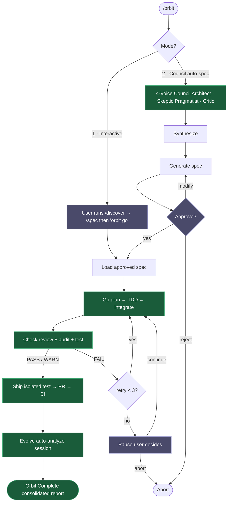
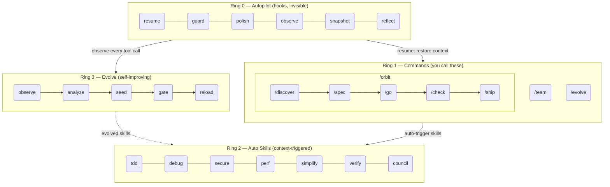

<h1 align="center">Epic Harness</h1>

<blockqoute><p align="center">自己進化するAIコーディングエージェントハーネス — 8つのコマンド、1つの自律パイプライン、自動トリガースキル、失敗から学習します。</p></blockqoute>

<p align="center"><b>8つのコマンド。自動トリガースキル。自己進化。</b></p>

<p align="center">
<a href="../../README.md">English</a> | <a href="../ja/README.md">日本語</a> | <a href="../ko/README.md">한국어</a> | <a href="../de/README.md">Deutsch</a> | <a href="../fr/README.md">Français</a> | <a href="../zh-CN/README.md">简体中文</a> | <a href="../zh-TW/README.md">繁體中文</a> | <a href="../pt-BR/README.md">Português</a> | <a href="../es/README.md">Español</a> | <a href="../hi/README.md">हिन्दी</a>
</p>

<p align="center">
  <a href="LICENSE"></a>
  
  
  
  <a href="https://buymeacoffee.com/epicsaga"></a>
</p>

Claude Codeプラグインで、**30以上のコマンドを8つに置き換え**、現在の作業内容に基づいて**スキルを自動トリガー**し、自分の失敗パターンから**新しいスキルを進化**させます。覚えるべき操作が少なく、キーストローク当たりの知性が高まります。

<p align="center">
  
</p>

---

## できること

1つのコマンドで、機能をアイデアからマージまで一気に進められます。必要なスキルは必要な瞬間に自動起動。セッションを重ねるほど、エージェントは確実に強くなります。

```bash
$ /orbit "ログインAPIにJWT認証を追加"
→ spec approved → go (TDD subagents) → check (PASS) → ship (PR + CI) → evolve
```

もちろん、手動で段階的に進めることも可能です:

```bash
/spec "ログインAPIにJWT認証を追加"   # 要件を明確化 → SPEC-*.md
/go                                   # 自動計画 → TDDサブエージェント → 4分
/check                                # 並列レビュー + セキュリティ + テスト → PASS
/ship                                 # 分離テスト → PR → CIグリーン
```

スキルはバックグラウンドで自動トリガー — 追加コマンド不要:

```
機能開発中?              → tdd 発火 (Red→Green→Refactor を強制)
テスト失敗?              → debug 発火 (まず根本原因、やみくも修正なし)
auth/DB を変更?          → secure 発火 (OWASPチェックリスト、近道なし)
ファイルが200行超?        → simplify 発火 (抽出・リネーム・簡素化)
```

セッション終了後、**evolveループ**がボトルネックを分析し、狙いを絞ったスキルを生成して次回に読み込みます。今日 TypeScript ビルドで詰まっても、次回は `evo-ts-care` が助けます。

---

## インストール

> **初めての方は** [クイックスタートガイド（5分）](../../QUICKSTART.md)をお読みください。

```bash
# Claude Code
/plugin marketplace add epicsagas/plugins && /plugin install epic@epicsagas

# その他のツール
cargo install epic-harness && epic install
```

| 環境 | 方法 |
|-------------|--------|
| **Claude Code** | プラグインマーケットプレイス（上記） |
| **macOS** | `brew install epicsagas/tap/epic-harness` |
| **任意（Rustあり）** | `cargo install epic-harness` |
| **ソースから** | `git clone` + `cargo install --path .` |

前提条件: **Git**。ソース/バイナリインストールには [Rustツールチェーン](https://rustup.rs) も必要です。

### `epic install` — セットアップウィザード

バイナリをインストールした後、`epic install`（または `epic install claude`）を実行して:

1. `~/.harness/` ディレクトリ構造を作成
2. コマンド、スキル、エージェントをツールの設定ディレクトリに同期
3. Claude CodeにMCPサーバー（harness-mem）を登録
4. 不在の場合、デフォルト設定で `~/.harness/config.toml` を作成

Claude Codeでは、`hooks/setup.sh` がセッション開始時に自動実行され、バイナリが欠落している場合はインストールされます。初回クローン後に手動の手順は不要です。

### その他のツール

```bash
epic install codex        # Codex CLI   → ~/.codex/ + ~/.agents/skills/
epic install gemini       # Gemini CLI  → ~/.gemini/
epic install cursor       # Cursor      → ~/.cursor/ (Cursor 1.7+が必要)
epic install opencode     # OpenCode    → ~/.config/opencode/
epic install cline        # Cline       → ~/Documents/Cline/Rules/
epic install aider        # Aider       → ~/.aider.conf.yml + ~/.aider/
epic install              # インタラクティブメニュー
```

統合ファイルはバイナリから**同期**されます：欠落または古いファイルが書き込まれます。`GEMINI.md` と `AGENTS.md` は不在の場合のみ作成されます。

### 確認

```bash
epic --version              # バイナリがインストールされている
ls ~/.harness/              # データディレクトリが存在する
```

Claude Codeセッション内: `/evolve status`

### クイックデモ

**1つのコマンドで完全なパイプライン:**
```bash
$ /orbit
# モードを選択:
#   1. インタラクティブ  — /discover + /spec を実行してから "orbit go"
#   2. Council      — 4声コンシルがspecを生成し、あなたが承認
→ spec承認 → go (TDD) → check (PASS) → ship (PR + CI) → evolve
```

**または手動でステップを進める:**
```bash
$ /spec "ログインAPIにJWT認証を追加"
  → 要件を明確化 → SPEC-*.md を生成

$ /go
  → 自動計画 → TDDサブエージェント → 完了（4分）

$ /check
  → 並列コードレビュー + セキュリティ監査 + テスト → PASS

$ /ship
  → PRを作成 → CI グリーン → マージ
```

## /orbit — 自律パイプライン

`/orbit` は手動パイプライン全体を単一の自律実行にまとめます。



**紫のノード** — ヒューマンチェックポイント: モード選択、spec承認、3回のチェック失敗時の一時停止。
**緑のノード** — 自律: go、check、ship、evolveはユーザー介入なしで実行されます。

状態は `$HARNESS_DIR/orbit/PIPELINE-{timestamp}.json` に保持され、コンテキスト圧縮後も生き残ります。

## コマンド

| コマンド | 機能 |
|---------|-------------|
| `/discover` | ソリューションを指定する前に問題を探索して定義する — 5 Whys、JTBD、ソクラテス的質問法 |
| `/spec` | 構築するものを定義する — 要件を明確化し、specを作成する |
| `/go` | 構築する — 自動計画、TDDサブエージェント、4状態結果モデル（DONE/CONCERNS/NEEDS_CONTEXT/BLOCKED）、ワークツリー分離による並列実行 |
| `/check` | 検証する — 適応型エキスパートディスパッチ（スコープベース）、並列コードレビュー + セキュリティ監査 + パフォーマンス |
| `/ship` | リリースする — 分離されたプレフライトテスト、次にPR、CI、マージ |
| `/team` | プロジェクト横断でorg レベルのエージェントチームを作成・同期する |
| `/evolve` | 手動進化トリガー / ステータス / ロールバック |
| `/orbit` | **自律パイプライン** — spec → go → check → ship を一括実行。インタラクティブモードまたはcouncilモードを選択。 |

---

## 自動スキル（Ring 2）

スキルは自動的にトリガーされます。手動で呼び出す必要はありません。

| スキル | トリガー条件 |
|-------|--------------|
| **tdd** | 新機能の実装 |
| **debug** | テスト失敗またはエラー |
| **discover** | 曖昧なリクエスト、問題のないソリューション、または焦点の定まらない不満 |
| **secure** | 認証/DB/API/シークレットのコードに触れた場合 |
| **perf** | ループ、クエリ、レンダリングコード |
| **simplify** | ファイルが200行超または高複雑度 |
| **document** | パブリックAPIが追加または変更された場合 |
| **verify** | `/go` または `/ship` 完了前 |
| **context** | コンテキストウィンドウが70%超 |
| **council** | 曖昧なアーキテクチャまたは設計の決定 |
| **agent-introspection** | 繰り返し失敗後のエージェント自己デバッグ |

## フック（Ring 0）

見えない形で実行されます。サブコマンド付きの単一Rustバイナリ（`epic-harness`）。

| フック | タイミング | 機能 |
|------|------|------|
| **resume** | セッション開始 | コンテキストの復元、メモリの読み込み、スタックの検出 |
| **guard** | Bash実行前 | force-push-to-main、rm -rf /、DROP prodをブロック |
| **polish** | 編集後 | 自動フォーマット（Biome/Prettier/ruff/gofmt）+ 型チェック |
| **observe** | すべてのツール使用時 | 進化 + GateGuardヒントのために `~/.harness/projects/{slug}/obs/` にログ |
| **snapshot** | compact前 | `~/.harness/projects/{slug}/sessions/` に状態を保存 |
| **reflect** | セッション終了 | 失敗を分析し、進化スキルをシード、ゲート、本能を抽出 |

Polishはobserveにフィードバックします: フォーマット失敗 → `lint_fail`、TypeScriptエラー → `build_fail`。polishからエラーが来る場合でも、Edit→Errorスラッシングが検出されます。

各セッションは独自の `session_{date}_{pid}_{random}.jsonl` を書き込みます — 同じプロジェクト上の複数のセッションはお互いのデータを破損しません。

### フックプロファイル

`~/.harness/config.toml` または `EPIC_HOOK_PROFILE` 環境変数経由:

| プロファイル | アクティブなフック |
|---------|-------------|
| `minimal` | guard, observe, resume |
| `standard`（デフォルト） | 上記 + polish, reflect, snapshot |
| `strict` | すべてのフック + 将来のstrict専用チェック |

### カスタムガードルール

プロジェクトルートの `.harness/guard-rules.yaml` でプロジェクト固有のルールを追加:

```yaml
blocked:
  - pattern: kubectl\s+delete\s+namespace | msg: Namespace deletion blocked
warned:
  - pattern: docker\s+system\s+prune | msg: Docker prune — verify first
```

## チーム（`epic team`）

チームは**org レベル**であり、プロジェクトに縛られません。任意のプロジェクトで `/team` を実行すると、エージェント定義の共有プールが充実します — 黙って上書きすることはありません。

```bash
epic team                              # インタラクティブ: スキャン → デザイン → 書き込み → 同期
epic team sync backend                 # エージェントを .claude/agents/backend/ にディスパッチ
epic team link backend                 # ディスパッチ + チーム設定にプロジェクトを登録
epic team list                         # 現在のorgのすべてのチーム
epic team list --org netflix           # 指定のorgのチーム
epic team show backend --playbook      # 設定 + 完全なプレイブック
epic team delete backend               # 現在のプロジェクトからのみ削除
epic team delete backend --global      # orgストアから永久に削除
```

同期後、エージェントは次のセッションで利用可能になります: `@domain-expert`、`@reviewer`、`@tester` など。

| タイプ | キーワード | デフォルトエージェント |
|------|---------|---------------|
| Stream-aligned | `stream` | domain-expert, reviewer, tester |
| Platform | `platform` | api-designer, infra-specialist, dx-agent |
| Enabling | `enabling` | specialist |
| Complicated Subsystem | `subsystem` | domain-specialist, integration-tester |

マルチorg: `epic team --org netflix` — orgごとに別のトポロジー。

マージ戦略: 変更されたエージェントはプロンプトを表示（デフォルト: 既存を保持、`.history/` にバックアップ）。プレイブックは常に追記されます。

## マルチツールサポート

すべてのツールが同じ `~/.harness/projects/{slug}/` データディレクトリを共有します。

| ツール | Ring 0 フック | コマンド | スキル | エージェント |
|------|-------------|----------|--------|--------|
| **Claude Code** | ✓ フル | ✓ 8コマンド（/orbitを含む） | ✓ 11スキル | ✓ 4 |
| **Codex CLI** | ✓ フル¹ | ✓ 8プロンプト（/orbitを含む） | ✓ 7 | ✓ 4 |
| **Gemini CLI** | ✓ 部分²  | ✓ 8コマンド（/orbitを含む） | ✓ 7 | ✓ 4 |
| **Cursor** | ✓ フル³ | ✓ 8コマンド（/orbitを含む） | ✓ ルール経由 | ✓ 4 |
| **OpenCode** | ✓ 部分⁴ | ✓ 8コマンド（/orbitを含む） | — | ✓ 4 |
| **Cline** | ✓ フル⁵ | — | — | — |
| **Aider** | —⁶ | — | — | — |

¹ `~/.codex/config.toml` で `codex_hooks = true` · ² `BeforeModel` レベルでのガード · ³ Cursor 1.7+ · ⁴ JSプラグイン · ⁵ 5つのフックスクリプト · ⁶ 規約のみ

## 統合メモリ — WIP

> **ステータス: 開発中。** まだ完全には機能していません。CLIコマンド、MCPツール、Web UIは開発中です。

すべてのエージェントが `~/.harness/memory.db`（全文検索付きSQLite）のナレッジグラフを共有します。外部ランタイムは不要です。

```
score = recency(25%) + importance(35%) + access_frequency(15%) + FTS_match(25%)
```

### CLI

```bash
epic mem recall "auth refactor" --project my-project   # スマートリコール
epic mem add --title "JWT rotation" --type decision    # ノードを追加
epic mem search "JWT"                                  # FTS5検索
epic mem query --type decision --project my-project    # フィルター
epic mem context --project my-project                  # プロジェクトコンテキスト
epic mem serve                                         # Web UI → :7700 or custom port with --port 8800
epic mem mcp-install                                   # MCPサーバーを登録
epic mem export --out ./docs/memory                    # Markdownにエクスポート
```

### MCPツール（6）

| ツール | 目的 |
|------|---------|
| `mem_recall` | ヒント + プロジェクト + グラフ隣接ノードによるスマートコンテキストリコール |
| `mem_add` | タイプ別自動重要度でノードを追加（または明示的な0.0–1.0） |
| `mem_search` | キーワード検索（全文）、重要度でランク付け |
| `mem_query` | タグ/タイプ/プロジェクトでフィルター |
| `mem_context` | プロジェクトスコープのスマートリコール（ヒントなし） |
| `mem_related` | ノードIDからのグラフトラバーサル（接続された知識を検索） |

### ノードタイプ

| タイプ | 作成者 | 重要度 |
|------|-----------|------------|
| `decision` | 手動 / MCP | 0.9 |
| `resolution` | 手動 / MCP | 0.8 |
| `concept` | 手動 / MCP | 0.7 |
| `project` | 手動 / MCP | 0.7 |
| `instinct` | 自動（reflect） | 0.7 |
| `pattern` | 自動（reflect） | 0.5 |
| `error` | 自動（reflect） | 0.4 |
| `session` | 自動（reflect） | 0.2 |

ライフサイクル: アクセスなしで30日以上 → 重要度が10%低下（最低0.05）。180日以上 → `stale` タグが付き、リコールから除外。`pinned` タグは劣化を防ぎます。

## 進化（Ring 3）

[A-Evolve](https://github.com/A-EVO-Lab/a-evolve) の自動進化パターンをClaude Codeのフックシステムに統合します。

### スコアリング

すべてのツール呼び出しは3軸でスコアリングされます（`~/.harness/config.toml` で設定可能な重み）:

```
composite = 0.5 × tool_success + 0.3 × output_quality + 0.2 × execution_cost
```

失敗の分類（9種類）: `type_error` · `syntax_error` · `test_fail` · `lint_fail` · `build_fail` · `permission_denied` · `timeout` · `not_found` · `runtime_error`

### パターン検出

| パターン | 検出内容 | デフォルト閾値 |
|---------|---------|-------------------|
| `repeated_same_error` | 同じエラーがN回以上 | 3 |
| `fix_then_break` | 編集成功 → ビルド/テスト失敗 | 3ルックバック、2サイクル |
| `long_debug_loop` | 同じファイルでスタック | 5回の操作 |
| `thrashing` | 編集↔エラーの交互発生 | 3回の編集、3回のエラー |

### 進化フロー

```
Observe (PostToolUse — 3-axis scoring)
    ↓ obs/session_{id}.jsonl
Analyze (SessionEnd)
    ↓ per-tool, per-ext scores + patterns
Propose (Solver — graduated by score: ≥0.90 skip, ≥0.70 moderate, <0.70 full)
    ↓ SkillProposal[] with confidence
Curate (Accept/Merge/Skip, feedback masked from solver)
    ↓ evolved/{skill}/SKILL.md + meta.json
Gate (format check, dedup, cap 10, gated promotion ≥ 3 sessions)
    ↓ evolved_backup/ (best checkpoint)
Instinct (high-success patterns → cross-project memory.db nodes)
    ↓
Reload (next session — resume loads evolved skills)
```

スキルシーディング: 弱いツール（成功率60%未満、最低5観測）、弱いファイルタイプ（成功率50%未満、最低3観測）、高頻度エラー（5回以上）。

停滞: 5%改善なしで3セッション → ベストチェックポイントに自動ロールバック。

```bash
/evolve              # 今すぐ実行
/evolve status       # ダッシュボード: スコア、トレンド、パターン、スキル
/evolve history      # 完全な履歴 + スキル有効性
/evolve cross-project # クロスプロジェクトパターン分析
/evolve rollback     # 以前のベストを復元
/evolve reset        # すべての進化データをクリア
```

### スキル有効性

すべての進化スキルはA/Bアトリビューションで追跡されます:

```
/evolve history → Skill Effectiveness

| Skill              | With | Without | Delta |
|--------------------|------|---------|-------|
| evo-ts-care        | 0.87 | 0.72    | +15%  |
| evo-bash-discipline| 0.65 | 0.68    | -3%   |
```

正のデルタ = 有効。負 = `/evolve rollback` による削除を検討。

### コールドスタートプリセット

最初のセッションでは、スタックに適したプリセットスキルが自動適用されます:

| スタック | プリセット |
|-------|---------|
| Node.js/TypeScript | `evo-ts-care`, `evo-fix-build-fail` |
| Go | `evo-go-care` |
| Python | `evo-py-care` |
| Rust | `evo-rs-care` |

### 本能学習

高成功率のパターンが抽出され、プロジェクト横断で促進されます:

```
observe (100% confirmed) → extract_instincts() → instinct node (confidence ≥ 0.8)
    → promote to global when observed in ≥ 2 projects
```

## アーキテクチャ: 4-Ring モデル



## クロスプロジェクト学習

プロジェクト横断で失敗パターンを共有するにはオプトインします:

```bash
touch ~/.harness/projects/{slug}/.cross-project-enabled
```

セッション終了 → 匿名化されたパターンを `~/.harness/global_patterns.jsonl` にエクスポート。セッション開始 → 他のプロジェクトの弱い領域からのヒントを表示。

## プロジェクトデータ

すべてのデータはプロジェクトルートではなく `~/.harness/`（ホームディレクトリ）に存在します。プロジェクト削除後も生き残り、gitの履歴を汚染しません。

```
~/.harness/
├── memory.db                  # SQLiteナレッジグラフ（ノード + エッジ + FTS5）
├── graph.json                 # キャッシュされたグラフ（Web UI用）
├── config.toml                # ユーザー設定
├── global_patterns.jsonl      # クロスプロジェクトパターン（オプトイン）
├── orgs/                      # チームグローバルストア
│   └── {org}/teams/{team}/
│       ├── config.json, mission.md, playbook.md, agents/, .history/
└── projects/{slug}/
    ├── memory/                # プロジェクトパターンとルール
    ├── sessions/              # セッションスナップショット（resume用）
    ├── obs/                   # ツール使用観察ログ（JSONL）
    ├── evolved/               # 自動進化スキル
    │   ├── manifest.json
    │   └── {skill}/SKILL.md + meta.json
    ├── evolved_backup/        # ベストチェックポイント（ロールバック用）
    ├── dispatch/              # スキルディスパッチログ
    ├── evolution.jsonl        # 完全な進化履歴
    └── metrics.json           # 集計統計 + スキルアトリビューション
```

安全ルールをチームと共有: プロジェクトルートの `.harness/guard-rules.yaml`（gitにコミット）。

## 設定

`~/.harness/config.toml` のすべての調整可能なパラメーター。不在 = ハードコードされたデフォルト。

```toml
# 優先順位: 環境変数（EPIC_HOOK_PROFILE）> このファイル > デフォルト

[hook]
profile = "standard"         # "minimal" | "standard" | "strict"
gateguard_hints = true

[scoring]
weights = [0.5, 0.3, 0.2]   # [success, quality, cost]

[evolution]
max_skills = 10
stagnation_limit = 3
improvement_threshold = 0.05
gated_promotion_min = 3

[pattern]
# repeated_error_min = 3
# debug_loop_min = 5
# graduated_scope_skip = 0.90
# graduated_scope_moderate = 0.70

[instinct]
# confidence_threshold = 0.8
# promotion_min_projects = 2
# max_instincts = 20
# min_observations = 10
# min_avg_score = 0.5
```

## 開発

```bash
cargo install --path .                                        # ビルド + インストール
cp ~/.cargo/bin/epic-harness hooks/bin/epic-harness           # プラグインバイナリを更新
cargo test                                                    # テスト
```

フックはバイナリを2か所で探します: `hooks/bin/epic-harness`（プラグインローカル）→ `~/.cargo/bin/epic-harness`（PATH）。

## リンク

- [変更履歴](../../CHANGELOG.md) — リリース履歴
- [コントリビューション](../../CONTRIBUTING.md) — コントリビューション方法
- [セキュリティ](../../SECURITY.md) — 脆弱性の報告
- [Issues](https://github.com/epicsagas/epic-harness/issues) — バグレポートと機能リクエスト

## 謝辞

- [a-evolve](https://github.com/A-EVO-Lab/a-evolve) — 自動進化とベンチマークパターン
- [agent-skills](https://github.com/addyosmani/agent-skills) — Claude Codeエージェントスキルシステム
- [everything-claude-code](https://github.com/affaan-m/everything-claude-code) — 包括的なClaude Codeパターン
- [gstack](https://github.com/garrytan/gstack) — プラグインアーキテクチャの参考
- [harness](https://github.com/revfactory/harness) — フックとハーネスのインフラパターン
- [serena](https://github.com/oraios/serena) — 自律エージェント設計
- [SuperClaude Framework](https://github.com/SuperClaude-Org/SuperClaude_Framework) — マルチコマンドフレームワークアーキテクチャ
- [superpowers](https://github.com/obra/superpowers) — Claude Code拡張パターン

## ライセンス

[Apache 2.0](../../LICENSE)
