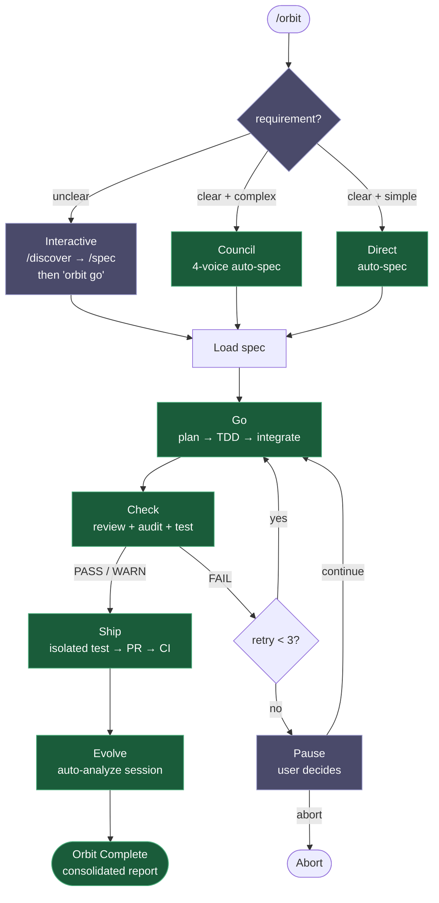
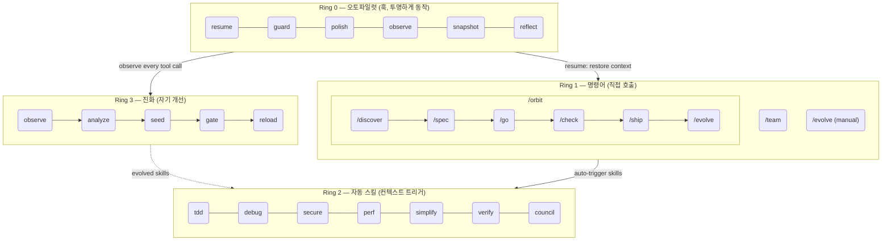

<h1 align="center">Epic Harness</h1>

<blockquote><p align="center">자기 진화형 AI 코딩 에이전트 하네스 — 8개 명령어, 1개 자율 파이프라인, 자동 트리거 스킬, 실패로부터 학습.</p></blockquote>

<p align="center"><b>외울 것은 적게. 키 입력당 지능은 더 높게. 세션이 반복될수록 더 똑똑해집니다.</b></p>

<p align="center">
<a href="../../README.md">English</a> | <a href="../ja/README.md">日本語</a> | <a href="../ko/README.md">한국어</a> | <a href="../de/README.md">Deutsch</a> | <a href="../fr/README.md">Français</a> | <a href="../zh-CN/README.md">简体中文</a> | <a href="../zh-TW/README.md">繁體中文</a> | <a href="../pt-BR/README.md">Português</a> | <a href="../es/README.md">Español</a> | <a href="../hi/README.md">हिन्दी</a>
</p>

<p align="center">
  <a href="https://github.com/epicsagas/epic-harness/stargazers"></a>
  <a href="https://github.com/epicsagas/epic-harness/network/members"></a>
  <a href="https://github.com/epicsagas/epic-harness/issues"></a>
  <a href="https://github.com/epicsagas/epic-harness/commits/main"></a>
</p>
<p align="center">
  <a href="../../LICENSE"></a>
  
  
  
  <a href="https://buymeacoffee.com/epicsaga"></a>
</p>

**30개 이상의 명령어를 8개로 대체**하고, 현재 작업 맥락에 따라 **스킬을 자동으로 트리거**하며, 실패 패턴으로부터 **새로운 스킬을 스스로 진화**시키는 Claude Code 플러그인입니다.

<p align="center">
  
</p>

---


### 웹 대시보드 — 10개 화면 실시간 메트릭
<p align="center">
  
  
</p>

---

## 무엇을 하나요

명령어 하나로 기능을 엔드투엔드로 제공합니다. 스킬은 요청하지 않아도 자동으로 발동합니다. 에이전트는 매 세션마다 더 똑똑해집니다.

```bash
$ /orbit "로그인 API에 JWT 인증 추가"
→ spec approved → go (TDD subagents) → check (PASS) → ship (PR + CI) → evolve
```

원하면 수동으로 단계별 진행도 가능합니다:

```bash
/spec "로그인 API에 JWT 인증 추가"   # 요구사항 명확화 → SPEC-*.md
/go                                    # 자동 계획 → TDD 서브에이전트 → 4분
/check                                 # 병렬 리뷰 + 보안 + 테스트 → PASS
/ship                                  # 격리 테스트 → PR → CI green
```

스킬은 백그라운드에서 자동 발동 — 추가 명령이 필요 없습니다:

```
기능 개발 중인가요?          → tdd 발동 (Red→Green→Refactor 강제)
테스트가 실패했나요?         → debug 발동 (원인 중심, 무작위 수정 금지)
auth/DB 코드를 수정했나요?   → secure 발동 (OWASP 체크리스트, 지름길 금지)
파일이 200줄을 넘었나요?     → simplify 발동 (추출, 리네이밍, 단순화)
```

세션이 끝나면 **evolve 루프**가 무엇이 망가졌는지 분석하고, 타겟팅된 스킬을 생성하여 다음 세션에 로드합니다. 오늘 TypeScript 빌드에서 막혔다면, 다음 세션에는 `evo-ts-care` 스킬이 준비되어 있습니다.

---

## 설치

> **처음이라면?** [빠른 시작 가이드 (5분)](../../docs/quickstart.md)를 읽어보세요.

### Claude Code (권장)

```
/plugin marketplace add epicsagas/plugins
/plugin install epic@epicsagas
```

바이너리를 자동 설치하고 모든 훅을 한 번에 등록합니다.

### macOS / Linux

```bash
brew install epicsagas/tap/epic-harness
```

Homebrew가 없다면 인스톨러 스크립트를 사용하세요:

```bash
curl --proto '=https' --tlsv1.2 -LsSf \
  https://github.com/epicsagas/epic-harness/releases/latest/download/epic-harness-installer.sh | sh
```

### Windows

```powershell
irm https://github.com/epicsagas/epic-harness/releases/latest/download/epic-harness-installer.ps1 | iex
```

### Rust 툴체인으로 설치

```bash
cargo binstall epic-harness   # 사전 빌드된 바이너리 (빠름)
cargo install epic-harness    # 소스에서 빌드
```

그 다음 설정 마법사를 실행하세요:

```bash
epic install          # Claude Code (기본값)
epic install codex    # Codex CLI
epic install gemini   # Gemini CLI
```

> `epic-harness --version`으로 확인. 업데이트는 `brew upgrade epic-harness` 또는 인스톨러 스크립트 재실행.

필수 조건: **Git**. 소스/바이너리 설치는 [Rust 툴체인](https://rustup.rs)도 필요합니다.

### `epic install` — 설정 마법사

바이너리 설치 후 `epic install` (또는 `epic install claude`)을 실행하면:

1. `~/.harness/` 디렉토리 구조 생성
2. 명령어, 스킬, 에이전트를 도구 설정 디렉토리에 동기화
3. Claude Code용 MCP 서버(harness-mem) 등록
4. `~/.harness/config.toml` 기본값으로 생성 (없는 경우)

Claude Code에서는 세션 시작 시 `hooks/setup.sh`가 자동 실행되어 바이너리가 없으면 설치합니다. 초기 클론 이후 수동 작업이 필요 없습니다.

### 다른 도구

```bash
epic install codex        # Codex CLI   → ~/.codex/ + ~/.agents/skills/
epic install gemini       # Gemini CLI  → ~/.gemini/
epic install cursor       # Cursor      → ~/.cursor/ (Cursor 1.7+ 필요)
epic install opencode     # OpenCode    → ~/.config/opencode/
epic install cline        # Cline       → ~/Documents/Cline/Rules/
epic install aider        # Aider       → ~/.aider.conf.yml + ~/.aider/
epic install              # 인터랙티브 메뉴
```

통합 파일은 바이너리에서 **동기화**됩니다: 누락되거나 오래된 파일이 기록됩니다. `GEMINI.md`와 `AGENTS.md`는 없을 때만 생성됩니다.

### 확인

```bash
epic --version              # 바이너리 설치 확인
ls ~/.harness/              # 데이터 디렉토리 확인
```

Claude Code 세션 안에서: `/evolve status`

---

## 명령어

| 명령어 | 기능 |
|--------|------|
| `/orbit` | **전체 자율 파이프라인**: spec → go → check → ship → evolve을 한 번에 실행 |
| `/discover` | 먼저 문제를 정의 — 5 Whys, JTBD, 소크라테스식 질문 (최대 3라운드) |
| `/spec` | 요구사항을 번호가 매겨진 R + AC 문서로 변환, `SPEC-{timestamp}.md`로 저장 |
| `/go` | 자동 계획 → TDD 서브에이전트 → worktree 격리 병렬 실행 → AC 검증 |
| `/check` | 병렬 리뷰 + 보안 감사 + 테스트, 범위 기반 추가 항목 (API 계약, 접근성, 마이그레이션 안전성) |
| `/ship` | 깨끗한 worktree에서 격리 사전 테스트 → 전체 체크 리포트가 포함된 PR → CI 감시 + 자동 수정 |
| `/team` | 조직 라이브러리 탐색, 기존 팀 고용, 또는 새로 설계 (3–6 에이전트, `.claude/agents/`에 동기화) |
| `/evolve` | 수동 진화 트리거 — 세션 분석, 대시보드 보기, 스킬 효과 검사, 롤백 |

---

## /orbit — 자율 파이프라인

`/orbit`은 전체 파이프라인을 하나의 자율 실행으로 감쌉니다. 모드만 선택하면 — PR이 생성될 때까지 모든 것이 자동입니다.



**보라색** — 사람 개입: 모드 선택 (불분명한 경우만 인터랙티브), 3회 check 실패 시 일시정지.
**초록색** — 명확 + 복잡 → council 자동 스펙; 명확 + 단순 → direct 빌드; 둘 다 완전 자율 실행.

상태는 `$HARNESS_DIR/orbit/PIPELINE-{timestamp}.json`에 저장 — 컨텍스트 압축에도 유지됩니다.

> **참고**: 에이전트가 orbit 자체를 수정하거나 문서만 편집할 때 파이프라인을 우회할 수 있습니다. [알려진 이슈 (에이전트 판단)](#알려진-이슈-에이전트-판단)을 참조하세요.

---

## 자동 스킬 (Ring 2)

스킬은 컨텍스트에 따라 자동으로 트리거됩니다. 직접 호출할 필요가 없습니다.

| 스킬 | 트리거 조건 |
|------|------------|
| **tdd** | 새로운 기능 구현 또는 버그 수정 |
| **debug** | 테스트 실패 또는 런타임 에러 |
| **discover** | 불분명한 요청, 문제 없는 솔루션, 초점 없는 불만 |
| **secure** | 인증/DB/API/시크릿 코드 수정 시 |
| **perf** | 루프, 쿼리, 렌더링, 배치 작업 |
| **simplify** | 파일이 200줄 초과이거나 순환 복잡도가 높을 때 |
| **document** | 퍼블릭 API 추가 또는 서명 변경 |
| **verify** | `/go` 또는 `/ship` 완료 전 |
| **context** | 컨텍스트 윈도우 사용률 > 70% |
| **council** | 모호한 아키텍처 또는 설계 결정 |
| **agent-introspection** | 3회 이상 연속 실패 또는 순환 재시도 패턴 |
| **reflect** | 온디맨드: AI를 사고 증폭기로 활용하고 있는가? 냉정한 증거 기반 자기 평가 |

---

## 진화 (Ring 3)

하네스는 모든 도구 호출을 감시하고, 3개 축으로 평가하며, 실패 패턴을 감지하고, 타겟팅된 스킬을 자동으로 생성합니다 — 세션 종료 시 자동으로.

### 스코어링

```
composite = 0.5 × tool_success + 0.3 × output_quality + 0.2 × execution_cost
```

실패 분류 (9가지): `type_error` · `syntax_error` · `test_fail` · `lint_fail` · `build_fail` · `permission_denied` · `timeout` · `not_found` · `runtime_error`

### 패턴 감지

| 패턴 | 감지 대상 | 기본 임계값 |
|------|----------|------------|
| `repeated_same_error` | 동일 에러 N회 이상 | 3 |
| `fix_then_break` | Edit 성공 → 빌드/테스트 실패 | lookback 3, 2 cycles |
| `long_debug_loop` | 동일 파일에서 정체 | 5회 |
| `thrashing` | Edit↔Error 반복 | 편집 3회, 에러 3회 |

### 진화 흐름

```
Observe (PostToolUse — 3축 스코어링)
    ↓ obs/session_{id}.jsonl
Analyze (SessionEnd)
    ↓ 도구별, 확장자별 점수 + 패턴
Propose (Solver — 점수별 단계적 처리: ≥0.90 건너뜀, ≥0.70 보통, <0.70 전체)
    ↓ SkillProposal[] with confidence
Curate (Accept/Merge/Skip, solver에게 피드백 마스킹)
    ↓ evolved/{skill}/SKILL.md + meta.json
Gate (포맷 검사, 중복 제거, 10개 상한, 3세션 이상 게이티드 프로모션)
    ↓ evolved_backup/ (최적 체크포인트)
Instinct (고성공 패턴 → 크로스 프로젝트 memory.db 노드)
    ↓
Reload (다음 세션 — resume이 진화 스킬 로드)
```

스킬 시드: 약한 도구 (성공률 <60%, 최소 5회 관측), 약한 파일 유형 (성공률 <50%, 최소 3회 관측), 고빈도 에러 (5회 이상).

정체: 3세션 동안 5% 개선 없음 → 최적 체크포인트로 자동 롤백.

### 스킬 효과

모든 진화 스킬은 A/B 기여도로 추적됩니다:

```
/evolve history → Skill Effectiveness

| Skill              | With | Without | Delta |
|--------------------|------|---------|-------|
| evo-ts-care        | 0.87 | 0.72    | +15%  |
| evo-bash-discipline| 0.65 | 0.68    | -3%   |
```

양수 delta = 효과적. 음수 = `/evolve rollback`으로 제거 검토.

### 콜드 스타트 프리셋

첫 세션에서 스택에 맞는 프리셋 스킬이 자동 적용됩니다:

| 스택 | 프리셋 |
|------|--------|
| Node.js/TypeScript | `evo-ts-care`, `evo-fix-build-fail` |
| Go | `evo-go-care` |
| Python | `evo-py-care` |
| Rust | `evo-rs-care` |

### Instinct 학습

고성공 패턴이 추출되어 프로젝트 간 공유됩니다:

```
observe (100% 확인) → extract_instincts() → instinct 노드 (confidence ≥ 0.8)
    → 2개 이상 프로젝트에서 관측 시 글로벌로 프로모션
```

```bash
/evolve              # 지금 실행
/evolve status       # 대시보드: 점수, 추세, 패턴, 스킬
/evolve history      # 전체 이력 + 스킬 효과
/evolve cross-project # 크로스 프로젝트 패턴 분석
/evolve rollback     # 이전 최적 상태로 복원
/evolve reset        # 모든 진화 데이터 초기화
```

---

## 훅 (Ring 0)

모든 세션에서 투명하게 실행됩니다. 단일 Rust 바이너리(`epic-harness`)의 서브커맨드로 구현됩니다.

| 훅 | 시점 | 동작 |
|----|------|------|
| **resume** | 세션 시작 | 컨텍스트 복원, 메모리 로드, 스택 감지 |
| **guard** | Bash 실행 전 | force-push-to-main, `rm -rf /`, DROP prod 차단 |
| **polish** | Edit 후 | 자동 포맷 (Biome/Prettier/ruff/gofmt) + 타입체크 |
| **observe** | 모든 도구 사용 시 | `~/.harness/projects/{slug}/obs/`에 로깅 |
| **snapshot** | compact 전 | `~/.harness/projects/{slug}/sessions/`에 상태 저장 |
| **reflect** | 세션 종료 | 실패 분석, 진화 스킬 시드, 게이트, instinct 추출 |

polish는 observe로 피드백됩니다: 포맷 실패 → `lint_fail`, TypeScript 에러 → `build_fail`. Edit→Error 쓰래싱은 에러가 polish에서 발생해도 감지됩니다.

각 세션은 자체 `session_{date}_{pid}_{random}.jsonl`에 기록 — 여러 동시 세션이 서로의 데이터를 손상시키지 않습니다.

### 훅 프로파일

`~/.harness/config.toml` 또는 `EPIC_HOOK_PROFILE` 환경 변수로 설정:

| 프로파일 | 활성 훅 |
|---------|---------|
| `minimal` | guard, observe, resume |
| `standard` (기본값) | 위 + polish, reflect, snapshot |
| `strict` | 모든 훅 + 향후 strict 전용 검사 |

### 커스텀 가드 규칙

프로젝트 루트의 `.harness/guard-rules.yaml`에 프로젝트별 규칙을 추가합니다:

```yaml
blocked:
  - pattern: kubectl\s+delete\s+namespace | msg: Namespace deletion blocked
warned:
  - pattern: docker\s+system\s+prune | msg: Docker prune — verify first
```

---

## 팀 (`epic team`)

팀은 **조직 수준**이며 프로젝트에 종속되지 않습니다. 어느 프로젝트에서 `/team`을 실행해도 공유 에이전트 정의 풀이 풍부해집니다 — 절대 조용히 덮어쓰지 않습니다.

```bash
epic team                              # 인터랙티브: 스캔 → 설계 → 작성 → 동기화
epic team sync backend                 # 에이전트 디스패치 → .claude/agents/backend/
epic team link backend                 # 디스패치 + 팀 설정에 프로젝트 등록
epic team list                         # 현재 조직의 모든 팀
epic team list --org netflix           # 특정 조직의 팀
epic team show backend --playbook      # 설정 + 전체 플레이북
epic team delete backend               # 현재 프로젝트에서만 제거
epic team delete backend --global      # 조직 저장소에서 영구 삭제
```

동기화 후 다음 세션부터 에이전트를 사용할 수 있습니다: `@domain-expert`, `@reviewer`, `@tester` 등.

| 유형 | 키워드 | 기본 에이전트 |
|------|--------|--------------|
| Stream-aligned | `stream` | domain-expert, reviewer, tester |
| Platform | `platform` | api-designer, infra-specialist, dx-agent |
| Enabling | `enabling` | specialist |
| Complicated Subsystem | `subsystem` | domain-specialist, integration-tester |

멀티 조직: `epic team --org netflix` — 조직별 별도 토폴로지.

병합 전략: 변경된 에이전트는 프롬프트 표시 (기본값: 기존 유지, `.history/`에 백업). 플레이북은 항상 추가됩니다.

---

## 멀티 도구 지원

모든 도구가 동일한 `~/.harness/projects/{slug}/` 데이터 디렉토리를 공유합니다.

| 도구 | Ring 0 훅 | 명령어 | 스킬 | 에이전트 |
|------|-----------|--------|------|---------|
| **Claude Code** | ✓ 전체 | ✓ 8개 명령어 (/orbit 포함) | ✓ 11개 스킬 | ✓ 4개 |
| **Codex CLI** | ✓ 전체¹ | ✓ 8개 프롬프트 (/orbit 포함) | ✓ 7개 | ✓ 4개 |
| **Gemini CLI** | ✓ 부분² | ✓ 8개 명령어 (/orbit 포함) | ✓ 7개 | ✓ 4개 |
| **Cursor** | ✓ 전체³ | ✓ 8개 명령어 (/orbit 포함) | ✓ 규칙 경유 | ✓ 4개 |
| **OpenCode** | ✓ 부분⁴ | ✓ 8개 명령어 (/orbit 포함) | — | ✓ 4개 |
| **Cline** | ✓ 전체⁵ | — | — | — |
| **Aider** | —⁶ | — | — | — |

¹ `~/.codex/config.toml`에 `codex_hooks = true` 필요 · ² `BeforeModel` 레벨에서 guard 실행 · ³ Cursor 1.7+ · ⁴ JS 플러그인 · ⁵ 5개 훅 스크립트 · ⁶ 컨벤션만

---

## 아키텍처: 4-Ring 모델



---

## 크로스 프로젝트 학습

프로젝트 간 실패 패턴 공유를 옵트인할 수 있습니다:

```bash
touch ~/.harness/projects/{slug}/.cross-project-enabled
```

세션 종료 시 익명화된 패턴을 `~/.harness/global_patterns.jsonl`로 내보냅니다. 세션 시작 시 다른 프로젝트의 취약 영역에 대한 힌트가 표시됩니다.

---

## 통합 메모리

모든 에이전트가 `~/.harness/memory.db`(SQLite + 전체 텍스트 검색)의 지식 그래프를 공유합니다. 외부 런타임 불필요.

```
score = recency(25%) + importance(35%) + access_frequency(15%) + FTS_match(25%)
```

### CLI

```bash
epic mem recall "auth refactor" --project my-project   # 스마트 리콜
epic mem add --title "JWT rotation" --type decision    # 노드 추가
epic mem search "JWT"                                  # FTS5 검색
epic mem list --type decision --project my-project    # 필터
epic mem context --project my-project                  # 프로젝트 컨텍스트
epic mem serve                                         # Web UI → :7700 또는 --port 8800으로 커스텀 포트
epic mem mcp-install                                   # MCP 서버 등록
epic mem export --out ./docs/memory                    # Markdown 내보내기
```

### MCP 도구 (6개)

| 도구 | 목적 |
|------|------|
| `mem_recall` | 힌트 + 프로젝트 + 그래프 이웃을 활용한 스마트 컨텍스트 리콜 |
| `mem_add` | 유형별 자동 중요도로 노드 추가 (또는 명시적 0.0–1.0) |
| `mem_search` | 키워드 검색 (전체 텍스트), 중요도 순 정렬 |
| `mem_query` | 태그/유형/프로젝트별 필터 |
| `mem_context` | 프로젝트 범위 스마트 리콜 (힌트 없음) |
| `mem_related` | 노드 ID에서 그래프 탐색 (연결된 지식 발견) |

### 노드 유형

| 유형 | 생성 주체 | 중요도 |
|------|----------|--------|
| `decision` | 수동 / MCP | 0.9 |
| `resolution` | 수동 / MCP | 0.8 |
| `concept` | 수동 / MCP | 0.7 |
| `project` | 수동 / MCP | 0.7 |
| `instinct` | 자동 (reflect) | 0.7 |
| `pattern` | 자동 (reflect) | 0.5 |
| `error` | 자동 (reflect) | 0.4 |
| `session` | 자동 (reflect) | 0.2 |

수명 주기: 30일 이상 미접근 → 중요도 10% 감쇠 (최소 0.05). 180일 이상 → `stale` 태그, 리콜 제외. `pinned` 태그는 감쇠를 방지합니다.

> **Web UI**: 그래프 시각화는 적극 개선 중입니다 — 클러스터링, 이웃 하이라이트, 오프라인 폴백이 최근 추가되었습니다. 더 많은 개선이 진행 중입니다.

---

<details>
<summary><strong>프로젝트 데이터 — 디렉토리 레이아웃</strong></summary>

## 프로젝트 데이터

모든 데이터는 프로젝트 루트가 아닌 홈 디렉토리의 `~/.harness/`에 저장됩니다. 프로젝트 삭제에도 유지되며 git 이력을 오염시키지 않습니다.

```
~/.harness/
├── memory.db                  # SQLite 지식 그래프 (nodes + edges + FTS5)
├── graph.json                 # 캐시된 그래프 (Web UI용)
├── config.toml                # 사용자 설정
├── global_patterns.jsonl      # 크로스 프로젝트 패턴 (옵트인)
├── orgs/                      # 팀 글로벌 저장소
│   └── {org}/teams/{team}/
│       ├── config.json, mission.md, playbook.md, agents/, .history/
└── projects/{slug}/
    ├── memory/                # 프로젝트 패턴 및 규칙
    ├── sessions/              # 세션 스냅샷 (resume용)
    ├── obs/                   # 도구 사용 관측 로그 (JSONL)
    ├── evolved/               # 자동 진화 스킬
    │   ├── manifest.json
    │   └── {skill}/SKILL.md + meta.json
    ├── evolved_backup/        # 최적 체크포인트 (롤백용)
    ├── dispatch/              # 스킬 디스패치 로그
    ├── evolution.jsonl        # 전체 진화 이력
    └── metrics.json           # 집계 통계 + 스킬 기여도
```

프로젝트 루트의 `.harness/guard-rules.yaml`을 통해 팀과 안전 규칙을 공유할 수 있습니다 (git에 커밋됨).

</details>

---

<details>
<summary><strong>설정 — config.toml 참조</strong></summary>

## 설정

모든 조정 가능한 파라미터는 `~/.harness/config.toml`에 있습니다. 없으면 하드코딩된 기본값을 사용합니다.

```toml
# 우선순위: 환경 변수 (EPIC_HOOK_PROFILE) > 이 파일 > 기본값

[hook]
profile = "standard"         # "minimal" | "standard" | "strict"
gateguard_hints = true

[scoring]
weights = [0.5, 0.3, 0.2]   # [success, quality, cost]

[evolution]
max_skills = 10
stagnation_limit = 3
improvement_threshold = 0.05
gated_promotion_min = 3

[pattern]
# repeated_error_min = 3
# debug_loop_min = 5
# graduated_scope_skip = 0.90
# graduated_scope_moderate = 0.70

[instinct]
# confidence_threshold = 0.8
# promotion_min_projects = 2
# max_instincts = 20
# min_observations = 10
# min_avg_score = 0.5
```

</details>

---

## 알려진 이슈 (에이전트 판단)

코드 버그가 아닌 에이전트의 문맥 해석으로 인해 발생하는 이슈입니다. 사용자가 주의해야 할 사항을 정리합니다.

### 발견된 이슈

| 이슈 | 발생 조건 | 현상 | 해결 방법 |
|------|----------|------|-----------|
| **Orbit 자체 수정 우회** | `/orbit`에 orbit 자체 개선을 요청 | 에이전트가 orbit 파이프라인을 완전히 건너뛰고 main에 임의 편집. spec/PR/추적성 없이 변경사항이 미커밋 상태로 방치 | orbit 완료 후 `git status` 확인. main에 파이프라인 상태 없이 변경이 있으면 수동 커밋하거나 별도 브랜치에서 `/orbit` 재실행 |
| **문서 전용 작업 프로토콜 생략** | `/orbit`에 마크다운 전용 변경(테스트할 코드 없음) 수신 | 에이전트가 TDD/테스트 단계를 무의미하다고 판단하여 전체 파이프라인 생략 | 순수 문서 변경은 허용 가능. 코드+문서 혼합 시 코드 관련 단계가 생략되지 않았는지 확인 |
| **모드 오분류** | Direct와 Council의 경계에 있는 요청 | Direct면 Council(4음성)이 더 많은 엣지 케이스를 포착할 수 있는데 Direct를 선택하거나, 그 반대의 경우 | 에이전트가 선택한 모드가 부적절해 보이면 "Council 모드 사용" 또는 "Direct 모드 사용"이라고 명시적으로 지정 |

### 의도적 설계 선택

개선을 고려했으나 평가 후 현행 유지하기로 결정한 사항:

| 선택 | 강화하지 않은 이유 | 근거 |
|------|-------------------|------|
| **Go 페이즈에서만 워크트리 진입** | preflight부터 격리 가능 | Preflight/mode/spec은 읽기 전용. 더 일찍 격리하면 이득 없이 복잡도만 증가 — 브랜치 생성 자체가 Go 단계이므로 |
| **Ship 후 워크트리 유지** | PR 병합 후 자동 삭제 가능 | 브랜치가 PR 헤드. 병합 전 삭제하면 PR이 깨짐. 정리는 사용자가 병합 후 수행 |
| **브랜치명이 `feature/{slug}`가 아닌 `orbit-{slug}`** | 컨벤션에 맞출 수 있음 | `EnterWorktree`가 이름에 `/`를 허용하지 않음. 생성 후 개명은 외관상 이득만 있고 단계만 추가 |
| **문서 전용 변경에 대한 경량 파이프라인 경로 없음** | doc-only 감지 후 TDD/테스트 스킵 가능 | 감지가 불안정함 ("문서"의 기준?). marginal gain에 비해 프로토콜 복잡도만 증가 |

---

## 문제 해결

<details>
<summary>install 후 command not found: epic</summary>

Cargo bin 디렉토리를 PATH에 추가하세요:

```bash
export PATH="$HOME/.cargo/bin:$PATH"
```

이 줄을 `~/.zshrc` 또는 `~/.bashrc`에 추가하여 영구적으로 만드세요.
</details>

<details>
<summary>Claude Code에서 훅이 실행되지 않음</summary>

설치를 다시 실행하여 훅을 Claude Code 설정에 동기화하세요:

```bash
epic install claude
```

그 다음 Claude Code를 재시작하세요. 훅은 `~/.claude/settings.json`에 기록됩니다.
</details>

<details>
<summary>macOS에서 Permission denied (Gatekeeper)</summary>

macOS가 인터넷에서 다운로드한 서명되지 않은 바이너리를 차단할 수 있습니다:

```bash
xattr -d com.apple.quarantine ~/.cargo/bin/epic-harness
xattr -d com.apple.quarantine ~/.cargo/bin/ep
```
</details>

<details>
<summary>epic: plugin hooks 내에서 바이너리를 찾을 수 없음</summary>

플러그인은 먼저 `hooks/bin/epic-harness`에서 바이너리를 찾습니다. `cargo install`으로 업데이트한 후 복사하세요:

```bash
cp ~/.cargo/bin/epic-harness hooks/bin/epic-harness
```
</details>

---

## 개발

```bash
cargo install --path .                                        # 빌드 + 설치
cp ~/.cargo/bin/epic-harness hooks/bin/epic-harness           # 플러그인 바이너리 업데이트
cargo test                                                    # 테스트
```

훅은 두 곳에서 바이너리를 찾습니다: `hooks/bin/epic-harness` (플러그인 로컬) → `~/.cargo/bin/epic-harness` (PATH).

---

## 링크

- [Changelog](../../CHANGELOG.md) — 릴리즈 이력
- [Contributing](../../CONTRIBUTING.md) — 기여 방법
- [Security](../../SECURITY.md) — 취약점 보고
- [Issues](https://github.com/epicsagas/epic-harness/issues) — 버그 리포트 및 기능 요청

## 감사의 말

- [a-evolve](https://github.com/A-EVO-Lab/a-evolve) — 자동화된 진화 및 벤치마크 패턴
- [agent-skills](https://github.com/addyosmani/agent-skills) — Claude Code 에이전트 스킬 시스템
- [everything-claude-code](https://github.com/affaan-m/everything-claude-code) — 종합 Claude Code 패턴
- [gstack](https://github.com/garrytan/gstack) — 플러그인 아키텍처 레퍼런스
- [harness](https://github.com/revfactory/harness) — 훅 및 하네스 인프라 패턴
- [serena](https://github.com/oraios/serena) — 자율 에이전트 설계
- [SuperClaude Framework](https://github.com/SuperClaude-Org/SuperClaude_Framework) — 멀티 명령어 프레임워크 아키텍처
- [superpowers](https://github.com/obra/superpowers) — Claude Code 확장 패턴

## 라이선스

[Apache 2.0](../../LICENSE)
