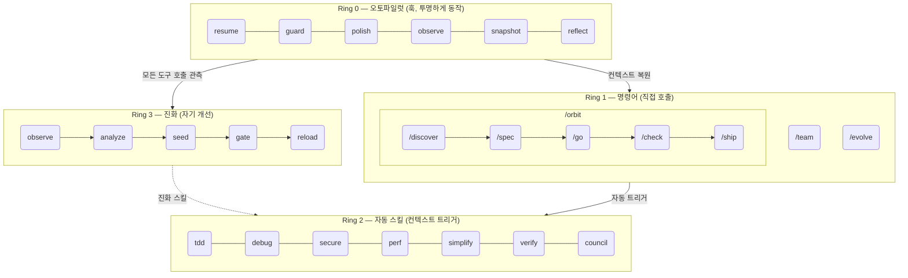
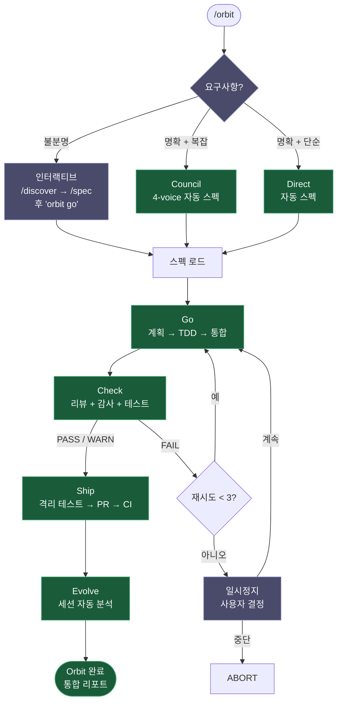
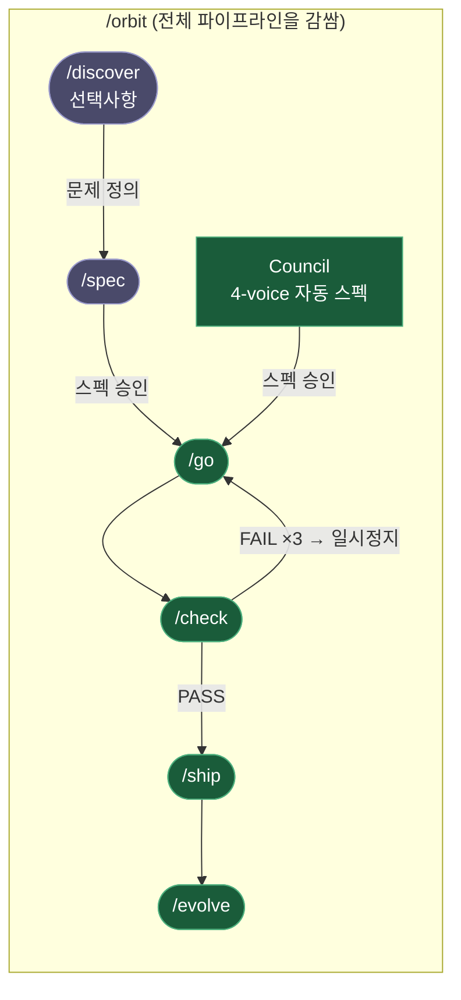

# epic harness

> 자기 진화형 AI 코딩 에이전트 하네스 — 8개 명령어, 1개 자율 파이프라인, 자동 트리거 스킬, 실패로부터 학습.

**8개 명령어. 자동 트리거 스킬. 자기 진화형.**

<p align="center">
<a href="../../README.md">English</a> | <a href="../ja/README.md">日本語</a> | <a href="../ko/README.md">한국어</a> | <a href="../de/README.md">Deutsch</a> | <a href="../fr/README.md">Français</a> | <a href="../zh-CN/README.md">简体中文</a> | <a href="../zh-TW/README.md">繁體中文</a> | <a href="../pt-BR/README.md">Português</a> | <a href="../es/README.md">Español</a> | <a href="../hi/README.md">हिन्दी</a>
</p>

<p align="center">
  <a href="LICENSE"></a>
  
  
  
  <a href="https://buymeacoffee.com/epicsaga"></a>
</p>

**30개 이상의 명령어를 8개로 대체**하고, 현재 작업 맥락에 따라 **스킬을 자동으로 트리거**하며, 실패 패턴으로부터 **새로운 스킬을 스스로 진화**시키는 Claude Code 플러그인입니다. 외울 것은 적게, 키 입력당 지능은 더 높게.

<p align="center">
  
</p>

## 설치

> **처음이라면?** [빠른 시작 가이드 (5분)](../../QUICKSTART.md)를 읽어보세요.

```bash
# Claude Code
/plugin marketplace add epicsagas/plugins && /plugin install epic@epicsagas

# 그 외 도구
cargo install epic-harness && epic install
```

| 환경 | 방법 |
|------|------|
| **Claude Code** | 플러그인 마켓플레이스 (위) |
| **macOS** | `brew install epicsagas/tap/epic-harness` |
| **Rust 사용 가능** | `cargo install epic-harness` |
| **소스에서** | `git clone` + `cargo install --path .` |

필수 조건: **Git**. 소스/바이너리 설치는 [Rust 툴체인](https://rustup.rs)도 필요합니다.

### `epic install` — 설정 마법사

바이너리 설치 후 `epic install` (또는 `epic install claude`)을 실행하면:

1. `~/.harness/` 디렉토리 구조 생성
2. 명령어, 스킬, 에이전트를 도구 설정 디렉토리에 동기화
3. Claude Code용 MCP 서버(harness-mem) 등록
4. `~/.harness/config.toml` 기본값으로 생성 (없는 경우)

Claude Code에서는 세션 시작 시 `hooks/setup.sh`가 자동 실행되어 바이너리가 없으면 설치합니다. 초기 클론 이후 수동 작업이 필요 없습니다.

### 다른 도구에 설치

```bash
epic install codex        # Codex CLI   → ~/.codex/ + ~/.agents/skills/
epic install gemini       # Gemini CLI  → ~/.gemini/
epic install cursor       # Cursor      → ~/.cursor/ (Cursor 1.7+ 필요)
epic install opencode     # OpenCode    → ~/.config/opencode/
epic install cline        # Cline       → ~/Documents/Cline/Rules/
epic install aider        # Aider       → ~/.aider.conf.yml + ~/.aider/
epic install              # 인터랙티브 메뉴
```

통합 파일은 바이너리에서 **동기화**됩니다: 누락되거나 오래된 파일이 기록됩니다. `GEMINI.md`와 `AGENTS.md`는 없을 때만 생성됩니다.

### 확인

```bash
epic --version              # 바이너리 설치 확인
ls ~/.harness/              # 데이터 디렉토리 확인
```

Claude Code 세션 안에서: `/evolve status`

### 빠른 데모

**명령어 하나로 전체 파이프라인:**
```bash
$ /orbit
# 모드 선택:
#   1. Interactive  — /discover + /spec 직접 실행 후 "orbit go"
#   2. Council      — 4-voice council이 스펙 생성, 승인만 하면 됨
→ 스펙 승인 → go (TDD) → check (PASS) → ship (PR + CI) → evolve
```

**또는 단계별로:**
```bash
$ /spec "로그인 API에 JWT 인증 추가"
  → 요구사항 명확화 → SPEC-*.md 생성

$ /go
  → 자동 계획 → TDD 서브에이전트 → 완료 (4분)

$ /check
  → 병렬 코드 리뷰 + 보안 감사 + 테스트 → PASS

$ /ship
  → PR 생성 → CI 통과 → 머지
```

## 아키텍처: 4-Ring 모델



## /orbit — 자율 파이프라인

`/orbit`은 수동 파이프라인 전체를 하나의 자율 실행으로 감쌉니다.



**보라색** — 사람 개입: 모드 선택 (불분명한 경우만 인터랙티브), 3회 실패 시 일시정지.
**초록색** — 명확+복잡 → council 자동 스펙, 명확+단순 → direct 빌드, 둘 다 완전 자율 실행.

상태는 `$HARNESS_DIR/orbit/PIPELINE-{timestamp}.json`에 저장 — 컨텍스트 압축에도 유지됩니다.

## 명령어

| 명령어 | 기능 |
|--------|------|
| `/discover` | 솔루션 전에 문제 탐색 및 정의 — 5 Whys, JTBD, 소크라테스식 질문 |
| `/spec` | 무엇을 만들지 정의 — 요구사항 명확화, 스펙 작성 |
| `/go` | 빌드 실행 — 자동 계획, TDD 서브에이전트, 4단계 결과 모델, worktree 격리 병렬 실행 |
| `/check` | 검증 — 범위 기반 적응형 전문가 디스패치, 병렬 코드 리뷰 + 보안 감사 + 성능 점검 |
| `/ship` | 배포 — 격리 사전 테스트 후 PR, CI, 머지 |
| `/team` | 프로젝트 간 조직 수준 에이전트 팀 생성 및 동기화 |
| `/evolve` | 수동 진화 트리거 / 상태 확인 / 롤백 |
| `/orbit` | **자율 파이프라인** — spec → go → check → ship을 한 번에. 인터랙티브 또는 council 모드 선택. |

### 파이프라인 개요



**보라색** — 수동 단계: `/discover` (선택사항) → `/spec`. **초록색** — council 자동 스펙 또는 스펙 승인 후 자율 실행: go → check → ship → evolve.

- **`/spec` 전에**: 문제가 불분명하면 `/discover`로 먼저 정의하세요.
- **`/spec` 후에**: 요구사항이 3개 이상이고 팀이 없으면 `/spec`이 `/team`을 제안합니다.
- **`/orbit`**: 전체 파이프라인을 감쌉니다. **인터랙티브** (`/discover` → `/spec` 직접 실행 후 "orbit go") 또는 **council** (4-voice council이 스펙 자동 생성, 승인만) 선택.

## 자동 스킬 (Ring 2)

스킬은 자동으로 트리거됩니다. 직접 호출할 필요가 없습니다.

| 스킬 | 트리거 조건 |
|------|------------|
| **tdd** | 새로운 기능 구현 시 |
| **debug** | 테스트 실패 또는 에러 발생 시 |
| **discover** | 불분명한 요청, 문제 없는 솔루션, 또는 초점 없는 불만 |
| **secure** | 인증/DB/API/시크릿 코드 수정 시 |
| **perf** | 루프, 쿼리, 렌더링 코드 작업 시 |
| **simplify** | 파일이 200줄 초과이거나 복잡도가 높을 때 |
| **document** | 퍼블릭 API 추가 또는 변경 시 |
| **verify** | /go 또는 /ship 완료 전 |
| **context** | 컨텍스트 윈도우 사용률 70% 초과 시 |
| **council** | 모호한 아키텍처 또는 설계 결정 시 |
| **agent-introspection** | 반복 실패 후 에이전트 자기 디버깅 |

## 훅 (Ring 0)

투명하게 실행됩니다. 단일 Rust 바이너리(`epic-harness`)의 서브커맨드로 구현됩니다.

| 훅 | 시점 | 동작 |
|----|------|------|
| **resume** | 세션 시작 | 컨텍스트 복원, 메모리 로드, 스택 감지 |
| **guard** | Bash 실행 전 | force-push-to-main, rm -rf /, DROP prod 차단 |
| **polish** | Edit 후 | 자동 포맷 (Biome/Prettier/ruff/gofmt) + 타입체크 |
| **observe** | 모든 도구 사용 시 | `~/.harness/projects/{slug}/obs/`에 로깅 |
| **snapshot** | compact 전 | `~/.harness/projects/{slug}/sessions/`에 상태 저장 |
| **reflect** | 세션 종료 | 실패 분석, 진화 스킬 시드, 게이트, instinct 추출 |

polish는 observe로 피드백됩니다: 포맷 실패 → `lint_fail`, TypeScript 에러 → `build_fail`. Edit→Error 쓰래싱은 polish 훅에서 발생해도 감지됩니다.

각 세션은 자체 `session_{date}_{pid}_{random}.jsonl`에 기록 — 동일 프로젝트의 여러 세션이 동시에 실행되어도 데이터가 손상되지 않습니다.

### 훅 프로파일

`~/.harness/config.toml` 또는 `EPIC_HOOK_PROFILE` 환경 변수로 설정:

| 프로파일 | 활성 훅 |
|---------|---------|
| `minimal` | guard, observe, resume |
| `standard` (기본값) | 위 + polish, reflect, snapshot |
| `strict` | 모든 훅 + 향후 strict 전용 검사 |

### 커스텀 가드 규칙

프로젝트 루트의 `.harness/guard-rules.yaml`에 프로젝트별 규칙을 추가합니다:

```yaml
blocked:
  - pattern: kubectl\s+delete\s+namespace | msg: Namespace deletion blocked
warned:
  - pattern: docker\s+system\s+prune | msg: Docker prune — verify first
```

## 팀 (`epic team`)

팀은 **조직 수준**이며 프로젝트에 종속되지 않습니다. 어느 프로젝트에서 `/team`을 실행해도 공유 에이전트 정의 풀이 풍부해집니다 — 절대 조용히 덮어쓰지 않습니다.

```bash
epic team                              # 인터랙티브: 스캔 → 설계 → 작성 → 동기화
epic team sync backend                 # 에이전트 디스패치 → .claude/agents/backend/
epic team link backend                 # 디스패치 + 팀 설정에 프로젝트 등록
epic team list                         # 현재 조직의 모든 팀
epic team list --org netflix           # 특정 조직의 팀
epic team show backend --playbook      # 설정 + 전체 플레이북
epic team delete backend               # 현재 프로젝트에서만 제거
epic team delete backend --global      # 조직 저장소에서 영구 삭제
```

동기화 후 다음 세션부터 에이전트를 사용할 수 있습니다: `@domain-expert`, `@reviewer`, `@tester` 등.

| 유형 | 키워드 | 기본 에이전트 |
|------|--------|--------------|
| Stream-aligned | `stream` | domain-expert, reviewer, tester |
| Platform | `platform` | api-designer, infra-specialist, dx-agent |
| Enabling | `enabling` | specialist |
| Complicated Subsystem | `subsystem` | domain-specialist, integration-tester |

멀티 조직: `epic team --org netflix` — 조직별 별도 토폴로지.

병합 전략: 변경된 에이전트는 프롬프트 (기본값: 기존 유지, `.history/`에 백업). 플레이북은 항상 추가됩니다.

## 멀티 도구 지원

모든 도구가 동일한 `~/.harness/projects/{slug}/` 데이터 디렉토리를 공유합니다.

| 도구 | Ring 0 훅 | 명령어 | 스킬 | 에이전트 |
|------|-----------|--------|------|---------|
| **Claude Code** | ✓ 전체 | ✓ 8개 (/orbit 포함) | ✓ 11개 | ✓ 4개 |
| **Codex CLI** | ✓ 전체¹ | ✓ 8개 (/orbit 포함) | ✓ 7개 | ✓ 4개 |
| **Gemini CLI** | ✓ 부분² | ✓ 8개 (/orbit 포함) | ✓ 7개 | ✓ 4개 |
| **Cursor** | ✓ 전체³ | ✓ 8개 (/orbit 포함) | ✓ 규칙 경유 | ✓ 4개 |
| **OpenCode** | ✓ 부분⁴ | ✓ 8개 (/orbit 포함) | — | ✓ 4개 |
| **Cline** | ✓ 전체⁵ | — | — | — |
| **Aider** | —⁶ | — | — | — |

¹ `~/.codex/config.toml`에 `codex_hooks = true` 필요 · ² `BeforeModel` 레벨에서 guard 실행 · ³ Cursor 1.7+ · ⁴ JS 플러그인 · ⁵ 5개 훅 스크립트 · ⁶ 컨벤션만

## 통합 메모리 — WIP

> **개발 중.** CLI 명령어, MCP 도구, Web UI는 아직 완전히 동작하지 않습니다.

모든 에이전트가 `~/.harness/memory.db`(SQLite + FTS5) 지식 그래프를 공유합니다. 외부 런타임 불필요.

```
score = recency(25%) + importance(35%) + access_frequency(15%) + FTS_match(25%)
```

### CLI

```bash
epic mem recall "auth refactor" --project my-project   # 스마트 리콜
epic mem add --title "JWT rotation" --type decision    # 노드 추가
epic mem search "JWT"                                  # FTS5 검색
epic mem query --type decision --project my-project    # 필터
epic mem context --project my-project                  # 프로젝트 컨텍스트
epic mem serve                                         # Web UI → :7700
epic mem mcp-install                                   # MCP 서버 등록
epic mem export --out ./docs/memory                    # Markdown 내보내기
```

### MCP 도구 (6개)

| 도구 | 목적 |
|------|------|
| `mem_recall` | 힌트 + 프로젝트 + 그래프 이웃을 활용한 스마트 컨텍스트 리콜 |
| `mem_add` | 유형별 자동 중요도로 노드 추가 (또는 명시적 0.0–1.0) |
| `mem_search` | 키워드 검색 (전체 텍스트), 중요도 순 정렬 |
| `mem_query` | 태그/유형/프로젝트별 필터 |
| `mem_context` | 프로젝트 범위 스마트 리콜 (힌트 없음) |
| `mem_related` | 노드 ID에서 그래프 탐색 |

### 노드 유형

| 유형 | 생성 주체 | 중요도 |
|------|----------|--------|
| `decision` | 수동 / MCP | 0.9 |
| `resolution` | 수동 / MCP | 0.8 |
| `concept` | 수동 / MCP | 0.7 |
| `project` | 수동 / MCP | 0.7 |
| `instinct` | 자동 (reflect) | 0.7 |
| `pattern` | 자동 (reflect) | 0.5 |
| `error` | 자동 (reflect) | 0.4 |
| `session` | 자동 (reflect) | 0.2 |

수명 주기: 30일 이상 미접근 → 중요도 10% 감쇠 (최소 0.05). 180일 이상 → `stale` 태그, 리콜 제외. `pinned` 태그는 감쇠 면역.

## 진화 (Ring 3)

[A-Evolve](https://github.com/A-EVO-Lab/a-evolve) 자동화 진화 패턴을 Claude Code 훅 시스템에 통합합니다.

### 스코어링

모든 도구 호출은 3개 축으로 평가됩니다 (`~/.harness/config.toml`에서 가중치 설정 가능):

```
composite = 0.5 × tool_success + 0.3 × output_quality + 0.2 × execution_cost
```

실패 분류 (9가지): `type_error` · `syntax_error` · `test_fail` · `lint_fail` · `build_fail` · `permission_denied` · `timeout` · `not_found` · `runtime_error`

### 패턴 감지

| 패턴 | 감지 대상 | 기본 임계값 |
|------|----------|------------|
| `repeated_same_error` | 동일 에러 N회 이상 | 3 |
| `fix_then_break` | Edit 성공 → 빌드/테스트 실패 | lookback 3, 2 cycles |
| `long_debug_loop` | 동일 파일에서 정체 | 5회 |
| `thrashing` | Edit↔Error 반복 | 편집 3회, 에러 3회 |

### 진화 흐름

```
Observe (PostToolUse — 3축 스코어링)
    ↓ obs/session_{id}.jsonl
Analyze (SessionEnd)
    ↓ 도구별, 확장자별 점수 + 패턴
Propose (Solver — 점수별 단계적 처리: ≥0.90 건너뜀, ≥0.70 보통, <0.70 전체)
    ↓ SkillProposal[] with confidence
Curate (Accept/Merge/Skip)
    ↓ evolved/{skill}/SKILL.md + meta.json
Gate (포맷 검사, 중복 제거, 10개 상한, 3세션 이상 게이티드 프로모션)
    ↓ evolved_backup/ (최적 체크포인트)
Instinct (고성공 패턴 → 크로스 프로젝트 memory.db 노드)
    ↓
Reload (다음 세션 — resume이 진화 스킬 로드)
```

스킬 시드: 약한 도구 (성공률 <60%, 최소 5회 관측), 약한 파일 유형 (성공률 <50%, 최소 3회 관측), 고빈도 에러 (5회 이상).

정체: 3세션 동안 5% 개선 없음 → 최적 체크포인트로 자동 롤백.

```bash
/evolve              # 지금 실행
/evolve status       # 대시보드: 점수, 추세, 패턴, 스킬
/evolve history      # 전체 이력 + 스킬 효과
/evolve cross-project # 크로스 프로젝트 패턴 분석
/evolve rollback     # 이전 최적 상태로 복원
/evolve reset        # 모든 진화 데이터 초기화
```

### 스킬 효과 추적

모든 진화 스킬은 A/B 기여도로 추적됩니다:

```
/evolve history → Skill Effectiveness

| Skill              | With | Without | Delta |
|--------------------|------|---------|-------|
| evo-ts-care        | 0.87 | 0.72    | +15%  |
| evo-bash-discipline| 0.65 | 0.68    | -3%   |
```

양수 delta = 효과적. 음수 = `/evolve rollback`으로 제거 검토.

### 콜드 스타트 프리셋

첫 세션에서 스택에 맞는 프리셋 스킬이 자동 적용됩니다:

| 스택 | 프리셋 |
|------|--------|
| Node.js/TypeScript | `evo-ts-care`, `evo-fix-build-fail` |
| Go | `evo-go-care` |
| Python | `evo-py-care` |
| Rust | `evo-rs-care` |

### Instinct 학습

고성공 패턴이 추출되어 프로젝트 간 공유됩니다:

```
observe (100% 확인) → extract_instincts() → instinct 노드 (confidence ≥ 0.8)
    → 2개 이상 프로젝트에서 관측 시 글로벌로 프로모션
```

## 크로스 프로젝트 학습

프로젝트 간 실패 패턴 공유를 옵트인할 수 있습니다:

```bash
touch ~/.harness/projects/{slug}/.cross-project-enabled
```

세션 종료 시 익명화된 패턴을 `~/.harness/global_patterns.jsonl`로 내보냅니다. 세션 시작 시 다른 프로젝트의 취약 영역에 대한 힌트가 표시됩니다.

## 프로젝트 데이터

모든 데이터는 프로젝트 루트가 아닌 `~/.harness/`에 저장됩니다. 프로젝트를 삭제해도 유지되며 git 이력을 오염시키지 않습니다.

```
~/.harness/
├── memory.db                  # SQLite 지식 그래프 (nodes + edges + FTS5)
├── graph.json                 # 캐시된 그래프 (Web UI용)
├── config.toml                # 사용자 설정
├── global_patterns.jsonl      # 크로스 프로젝트 패턴 (옵트인)
├── orgs/                      # 팀 글로벌 저장소
│   └── {org}/teams/{team}/
│       ├── config.json, mission.md, playbook.md, agents/, .history/
└── projects/{slug}/
    ├── memory/                # 프로젝트 패턴 및 규칙
    ├── sessions/              # 세션 스냅샷 (resume용)
    ├── obs/                   # 도구 사용 관측 로그 (JSONL)
    ├── evolved/               # 자동 진화 스킬
    │   ├── manifest.json
    │   └── {skill}/SKILL.md + meta.json
    ├── evolved_backup/        # 최적 체크포인트 (롤백용)
    ├── dispatch/              # 스킬 디스패치 로그
    ├── orbit/                 # /orbit 파이프라인 상태 파일
    ├── evolution.jsonl        # 전체 진화 이력
    └── metrics.json           # 집계 통계 + 스킬 기여도
```

프로젝트 루트의 `.harness/guard-rules.yaml`을 통해 팀과 안전 규칙을 공유할 수 있습니다 (git에 포함).

## 설정

모든 조정 가능한 파라미터는 `~/.harness/config.toml`에 있습니다. 없으면 하드코딩된 기본값을 사용합니다.

```toml
# 우선순위: 환경 변수 (EPIC_HOOK_PROFILE) > 이 파일 > 기본값

[hook]
profile = "standard"         # "minimal" | "standard" | "strict"
gateguard_hints = true

[scoring]
weights = [0.5, 0.3, 0.2]   # [success, quality, cost]

[evolution]
max_skills = 10
stagnation_limit = 3
improvement_threshold = 0.05
gated_promotion_min = 3

[pattern]
# repeated_error_min = 3
# debug_loop_min = 5
# graduated_scope_skip = 0.90
# graduated_scope_moderate = 0.70

[instinct]
# confidence_threshold = 0.8
# promotion_min_projects = 2
# max_instincts = 20
# min_observations = 10
# min_avg_score = 0.5
```

## 개발

```bash
cargo install --path .                                        # 빌드 + 설치
cp ~/.cargo/bin/epic-harness hooks/bin/epic-harness           # 플러그인 바이너리 업데이트
cargo test                                                    # 테스트
```

훅은 두 곳에서 바이너리를 찾습니다: `hooks/bin/epic-harness` (플러그인 로컬) → `~/.cargo/bin/epic-harness` (PATH).

## 링크

- [Changelog](../../CHANGELOG.md) — 릴리즈 이력
- [Contributing](../../CONTRIBUTING.md) — 기여 방법
- [Security](../../SECURITY.md) — 취약점 보고
- [Issues](https://github.com/epicsagas/epic-harness/issues) — 버그 리포트 및 기능 요청

## 감사의 말

- [a-evolve](https://github.com/A-EVO-Lab/a-evolve) — 자동화된 진화 및 벤치마크 패턴
- [agent-skills](https://github.com/addyosmani/agent-skills) — Claude Code 에이전트 스킬 시스템
- [everything-claude-code](https://github.com/affaan-m/everything-claude-code) — 종합 Claude Code 패턴
- [gstack](https://github.com/garrytan/gstack) — 플러그인 아키텍처 레퍼런스
- [harness](https://github.com/revfactory/harness) — 훅 및 하네스 인프라 패턴
- [serena](https://github.com/oraios/serena) — 자율 에이전트 설계
- [SuperClaude Framework](https://github.com/SuperClaude-Org/SuperClaude_Framework) — 멀티 명령어 프레임워크 아키텍처
- [superpowers](https://github.com/obra/superpowers) — Claude Code 확장 패턴

## 라이선스

[Apache 2.0](../../LICENSE)
