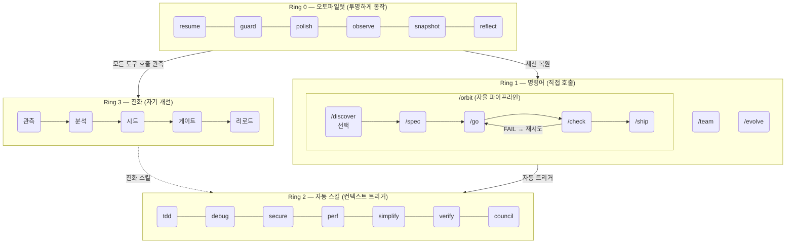
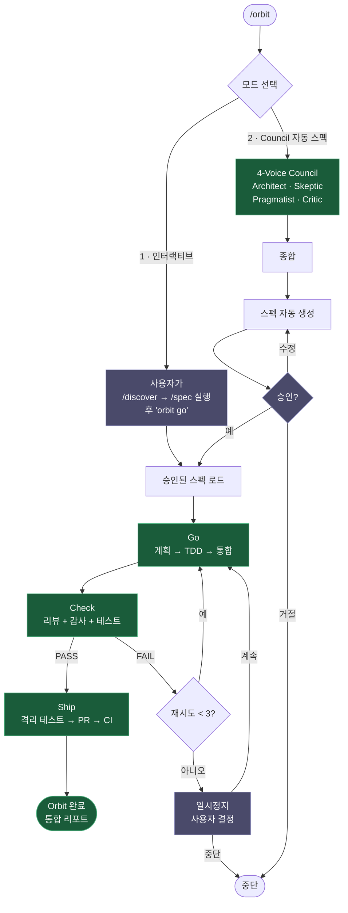

# epic harness

**8개의 명령어. 자율 파이프라인. 자동 트리거 스킬. 자기 진화형.**

<p align="center">
<a href="../../README.md">English</a> | <a href="../ja/README.md">日本語</a> | <a href="../ko/README.md">한국어</a> | <a href="../de/README.md">Deutsch</a> | <a href="../fr/README.md">Français</a> | <a href="../zh-CN/README.md">简体中文</a> | <a href="../zh-TW/README.md">繁體中文</a> | <a href="../pt-BR/README.md">Português</a> | <a href="../es/README.md">Español</a> | <a href="../hi/README.md">हिन्दी</a>
</p>

<p align="center">
  <a href="LICENSE"></a>
  
  
  
  
  <a href="https://buymeacoffee.com/epicsaga"></a>
</p>

**30개 이상의 명령어를 8개로 대체**하고, 현재 작업 맥락에 따라 **스킬을 자동으로 트리거**하며, 실패 패턴으로부터 **새로운 스킬을 스스로 진화**시키는 Claude Code 플러그인입니다. 외울 것은 적게, 키 입력당 지능은 더 높게.

<p align="center">
  
</p>

## 아키텍처: 4-Ring 모델



## 설치

```
# Claude Code 플러그인 (권장)
/plugin marketplace add epicsagas/plugins
/plugin install epic@epicsagas
```

```bash
# 또는 소스에서 설치
git clone https://github.com/epicsagas/epic-harness.git
cd epic-harness
cargo install --path .
epic install
```

### 바이너리에서 설치

```bash
# Homebrew (macOS)
brew install epicsagas/tap/epic-harness

# crates.io에서
cargo install epic-harness

# 사전 빌드 바이너리 (빠름, 컴파일 불필요)
cargo binstall epic-harness

# 소스에서
cargo install --path .
```

바이너리는 훅에 의해 자동으로 감지됩니다. 없으면 Node.js로 폴백합니다.

## 멀티 도구 지원

epic-harness는 Claude Code와 6개의 추가 AI 코딩 도구에서 동작합니다. 모든 도구는 동일한 `~/.harness/projects/{slug}/` 데이터 디렉토리를 공유합니다.

| 도구 | Ring 0 훅 | 명령어/프롬프트 | 스킬 | 에이전트 |
|------|-------------|------------------|--------|--------|
| **Claude Code** | ✓ 전체 | ✓ 8개 명령어 (/orbit 포함) | ✓ 11개 스킬 | ✓ 4개 |
| **Codex CLI** | ✓ 전체¹ | ✓ 8개 프롬프트 (/orbit 포함) | ✓ 7개 (`~/.agents/skills/`) | ✓ 4개 |
| **Gemini CLI** | ✓ 부분²  | ✓ 8개 명령어 (/orbit 포함) | ✓ 7개 | ✓ 4개 |
| **Cursor** | ✓ 전체³ | ✓ 8개 명령어 (/orbit 포함) | ✓ 규칙 경유 | ✓ 4개 |
| **OpenCode** | ✓ 부분⁴ | ✓ 8개 명령어 (/orbit 포함) | — | ✓ 4개 |
| **Cline** | ✓ 전체⁵ | — | — | — |
| **Aider** | —⁶ | — | — | — |

¹ `~/.codex/config.toml`에 `codex_hooks = true` 필요; PostToolUse는 Bash만 가로챔
² `PreToolUse` 동등 기능 없음 — guard가 `BeforeModel` 레벨에서 실행
³ Cursor 1.7+ 필요
⁴ JS 플러그인: `session.created` / `tool.execute.before` / `tool.execute.after` / `session.idle`
⁵ PreToolUse / PostToolUse / TaskStart / TaskResume / TaskCancel 훅 스크립트
⁶ 훅 시스템 없음 — 컨벤션을 `.aider/CONVENTIONS.md` + `.aider.conf.yml`로 주입

### 다른 도구에 설치

```bash
# 인터랙티브 메뉴 (설치할 도구 선택)
epic install

# 직접 설치
epic install codex        # Codex CLI   → ~/.codex/ + ~/.agents/skills/
epic install gemini       # Gemini CLI  → ~/.gemini/
epic install cursor       # Cursor      → ~/.cursor/ (Cursor 1.7+ 필요)
epic install opencode     # OpenCode    → ~/.config/opencode/
epic install cline        # Cline       → ~/Documents/Cline/Rules/
epic install aider        # Aider       → ~/.aider.conf.yml + ~/.aider/

# 프로젝트 로컬 설치
epic install cursor --local

# 변경 없이 미리보기
epic install gemini --dry-run
```

도구 디렉토리의 통합 파일(`hooks.json`, 명령어, 에이전트, 스킬, 규칙 등)은 바이너리에서 **동기화**됩니다: 누락되거나 오래된 파일이 기록됩니다. `GEMINI.md` 및 `AGENTS.md`는 없을 때만 생성됩니다.

## 통합 메모리

모든 에이전트는 `~/.harness/memory.db`(SQLite + FTS5)에 저장된 단일 지식 그래프를 공유합니다. Node.js나 외부 런타임이 필요하지 않습니다.

### 스마트 리콜

메모리 검색은 최근 N개 항목을 단순히 덤프하는 대신 **복합 점수**를 사용합니다:

```
score = recency(25%) + importance(35%) + access_frequency(15%) + FTS_match(25%)
```

- **중요도** 노드 유형별 자동 설정: decision(0.9) > resolution(0.8) > concept(0.7) > pattern(0.5) > error(0.4) > session(0.2)
- **접근 추적**: 자주 리콜되는 메모리는 자연스럽게 상위에 표시됨
- **점진적 감쇠**: 사용하지 않은 메모리는 시간이 지남에 따라 중요도 감소 (30일마다 10%, 최소 0.05)
- **그래프 보강**: 리콜은 1-홉 엣지를 따라 관련 컨텍스트를 표면화

### CLI

```bash
# 스마트 리콜 — 현재 작업에 맞게 관련성 순위 정렬
epic mem recall "auth refactor" --project my-project

# 메모리 노드 추가 (중요도는 유형별 자동 설정, 또는 명시적 지정)
epic mem add --title "JWT rotation strategy" --type decision --tags auth --body "..."
epic mem add --title "Custom pattern" --type concept --importance 0.8 --body "..."

# 필터 쿼리 (중요도 + 접근 횟수 포함)
epic mem query --type decision --project my-project

# 전체 텍스트 검색 (중요도 순 정렬)
epic mem search "JWT"

# 스마트 컨텍스트 (중요도 가중, 최신순 아님)
epic mem context --project my-project

# 지식 그래프 웹 UI
epic mem serve          # → http://localhost:7700

# Claude Code에 MCP 서버로 등록 (Node.js 불필요)
epic mem mcp-install

# 모든 노드를 Markdown으로 내보내기 (Git 백업용)
epic mem export --out ./docs/memory
```

### MCP 도구 (6개)

MCP 서버로 등록 시(`epic mem mcp-install`), 에이전트가 이 도구들을 직접 호출할 수 있습니다:

| 도구 | 목적 |
|------|---------|
| `mem_recall` | **주요.** 힌트 + 프로젝트 + 그래프 이웃을 활용한 스마트 컨텍스트 리콜 |
| `mem_add` | 유형별 자동 중요도로 노드 추가 (또는 명시적 0.0–1.0) |
| `mem_search` | FTS5 키워드 검색, 중요도 순 정렬 |
| `mem_query` | 태그/유형/프로젝트별 필터 |
| `mem_context` | 프로젝트 범위 스마트 리콜 (힌트 없음) |
| `mem_related` | 노드 ID에서 BFS 그래프 탐색 |

### 지식 그래프 작동 방식

그래프는 일반적인 세션 작업에서 자동으로 축적됩니다 — 수동 입력이 필요 없습니다.

**데이터 흐름:**

```
PostToolUse hook → observe (3-axis scoring) → obs/*.jsonl
                                                   ↓
SessionEnd hook → reflect (pattern detection) → memory.db nodes + edges
                                                   ↓  (중요도는 유형별 설정)
SessionStart hook → resume (smart recall) → 다음 세션에서 관련성 순위 힌트 제공
                              ↓
                    decay_importance() → 사용하지 않은 노드는 점진적으로 희미해짐
```

**노드 유형 (7):**

| 유형 | 생성 주체 | 기본 중요도 |
|------|-----------|-------------------|
| `decision` | 수동 / MCP | 0.9 |
| `resolution` | 수동 / MCP | 0.8 |
| `concept` | 수동 / MCP | 0.7 |
| `project` | 수동 / MCP | 0.7 |
| `pattern` | 자동 (reflect) | 0.5 |
| `error` | 자동 (reflect) | 0.4 |
| `session` | 자동 (reflect) | 0.2 |

**메모리 수명 주기:**

| 이벤트 | 발생하는 일 |
|-------|-------------|
| 검색/리콜/컨텍스트로 노드 리콜 | `access_count++`, `accessed_at` 업데이트 |
| 30일 이상 접근 없음 | 중요도 10% 감쇠 (최소 0.05) |
| 180일 이상 접근 없음 | `stale` 태그, 리콜에서 제외 |
| `pinned` 태그된 노드 | 감쇠 면역 |

**자동 축적 조건:**

| 조건 | 생성되는 노드 |
|-----------|-------------|
| 매 세션 종료 시 | `session` (항상) |
| 동일 에러 ≥3회 연속 | `error` (repeated_same_error) |
| Edit→Error 교대 발생 | `pattern` (thrashing) |
| 도구 성공률 <60% (최소 5회 관측) | `pattern` (weak_tool) |
| 파일 유형 성공률 <50% (최소 3회 관측) | `pattern` (weak_filetype) |
| Edit 성공 → Bash 에러 사이클 | `pattern` (fix_then_break) |

> **참고:** 클린 세션(에러 없음)은 `session` 노드만 생성합니다. 그래프는 빌드 실패, 테스트 실패, 디버깅 사이클이 포함된 2~3회의 실제 개발 세션 후에 풍부해집니다.

기존 파일 기반 메모리(`nodes/*.md`, `edges.jsonl`)는 첫 실행 시 자동으로 SQLite로 마이그레이션됩니다.

## 명령어

| 명령어 | 기능 |
|---------|-------------|
| `/discover` | 문제를 먼저 정의 — 5 Whys, JTBD, 소크라테스식 질문 (선택사항) |
| `/spec` | 무엇을 만들지 정의 — 요구사항 명확화, 스펙 작성 |
| `/go` | 빌드 실행 — 자동 계획, TDD 서브에이전트, 병렬 실행 |
| `/check` | 검증 — 병렬 코드 리뷰 + 보안 감사 + 성능 점검 |
| `/ship` | 배포 — PR, CI, 머지 |
| `/team` | 프로젝트 간 조직 수준 에이전트 팀 생성 및 동기화 |
| `/evolve` | 수동 진화 트리거 / 상태 확인 / 롤백 |
| `/orbit` | **자율 파이프라인** — spec → go → check → ship을 한 번에. 인터랙티브 또는 council 모드 선택. |

### /orbit — 자율 파이프라인



**보라색 노드**: 사람 개입 필요 (모드 선택, 스펙 승인, 3회 실패 시 일시정지)  
**초록색 노드**: 자율 실행 — go, check, ship은 사람 개입 없이 진행

## 팀 (`epic team`)

팀은 **조직 수준**이며, 프로젝트에 종속되지 않습니다. `/team`을 어느 프로젝트에서 실행하든 공유 에이전트 정의 풀을 풍부하게 만들며 — 절대 조용히 덮어쓰지 않습니다.

### 작동 방식

```
epic team                      # 인터랙티브: 프로젝트 스캔 → 설계 → 작성 → 동기화
         ↓
~/.harness/orgs/epic/teams/backend/   ← 글로벌 저장소 (프로젝트 간 유지)
         ↓
epic team sync backend
         ↓
{project}/.claude/agents/backend/     ← Claude Code가 세션 시작 시 자동 발견
├── domain-expert.md                  ← 역할 정의 + 팀 컨텍스트 주입
├── reviewer.md
└── tester.md
         ↓
다음 세션: 에이전트 활성화 — Claude가 자동 선택하거나 명시적으로 호출
```

### CLI 레퍼런스

```bash
# 팀 생성 또는 업데이트 (인터랙티브 4단계 플로우)
epic team

# 탐색
epic team list                        # 현재 조직의 모든 팀
epic team list --org netflix          # 특정 조직의 팀
epic team show backend                # 설정, 미션, 에이전트
epic team show backend --playbook     # + 전체 누적 플레이북

# 프로젝트에 디스패치
epic team sync backend                # 디스패치: 에이전트 복사 → .claude/agents/backend/
epic team link backend                # 디스패치 + 팀 설정에 프로젝트 등록

# 프로젝트에서 회수
epic team delete backend              # 회수: 현재 프로젝트에서만 제거
epic team unlink backend              # delete의 별칭

# 해산 (조직에서 완전히 제거)
epic team delete backend --global     # 조직 저장소 + 로컬 복사본 영구 삭제

# 이력
epic team history backend reviewer    # 에이전트의 .history/ 백업 목록
```

### 코딩 에이전트에서 팀 사용

동기화 후, 다음 세션부터 에이전트를 자동으로 사용할 수 있습니다:

```
# Claude Code / Cursor / OpenCode / Codex
@domain-expert 결제 게이트웨이를 구현해주세요
@reviewer 이 PR에서 엣지 케이스를 확인해주세요
@tester auth에 대한 통합 테스트를 작성해주세요

# 또는 에이전트가 작업 컨텍스트에 따라 자동 선택하게 하기
```

각 에이전트 파일에는 동기화 시 주입되는 **팀 컨텍스트** 섹션이 포함됩니다:

```markdown
## Team Context
**Team**: backend (Stream-aligned)
**Mission**: Own the API layer end-to-end
**Full playbook**: `epic team show backend --playbook`
```

에이전트는 팀, 미션, 전체 플레이북을 필요에 따라 로드하는 방법을 알고 있습니다 —
컨텍스트 윈도우를 부풀리지 않고.

### 멀티 조직

```bash
epic team                          # "epic" 조직에 축적 (기본값)
epic team --org netflix            # 별도의 Netflix 스타일 토폴로지
epic team --org client-x           # 클라이언트별 인게이지먼트
```

같은 조직의 같은 팀 이름 = 의도적인 크로스 프로젝트 공유.
`epic/teams/backend`는 그것을 생성하거나 연결하는 모든 프로젝트의 지식을 축적합니다.

### 팀 유형

| 유형 | 키워드 | 기본 에이전트 |
|------|---------|---------------|
| Stream-aligned | `stream` | domain-expert, reviewer, tester |
| Platform | `platform` | api-designer, infra-specialist, dx-agent |
| Enabling | `enabling` | specialist |
| Complicated Subsystem | `subsystem` | domain-specialist, integration-tester |

### 병합 전략 — 조용한 덮어쓰기 없음

| 객체 | 규칙 |
|--------|------|
| 에이전트 — 신규 | 자동 추가 |
| 에이전트 — 변경 없음 | 건너뜀 |
| 에이전트 — 변경됨 | **프롬프트** (기본값: 기존 유지). 교체 시 → `.history/`에 백업 |
| `playbook.md` | 항상 **추가** — 절대 잘리지 않음 |
| `mission.md` — 변경됨 | **프롬프트** (기본값: 기존 유지) |

## 자동 스킬 (Ring 2)

스킬은 컨텍스트에 따라 자동으로 트리거됩니다. 직접 호출할 필요가 없습니다.

| 스킬 | 트리거 조건 |
|-------|--------------|
| **tdd** | 새로운 기능 구현 시 |
| **debug** | 테스트 실패 또는 에러 발생 시 |
| **secure** | 인증/DB/API/시크릿 코드 수정 시 |
| **perf** | 루프, 쿼리, 렌더링 코드 작업 시 |
| **simplify** | 파일이 200줄 초과이거나 복잡도가 높을 때 |
| **document** | 퍼블릭 API 추가 또는 변경 시 |
| **verify** | /go 또는 /ship 완료 전 |
| **context** | 컨텍스트 윈도우 사용률 70% 초과 시 |

## 훅 (Ring 0)

투명하게 실행됩니다. 사용자 조작이 필요 없습니다. **단일 Rust 바이너리** (`epic-harness`)의 서브커맨드로 구현되며, 바이너리가 없으면 Node.js로 폴백합니다.

```
epic resume | guard | polish | observe | snapshot | reflect
```

| 훅 | 시점 | 동작 |
|------|------|------|
| **resume** | 세션 시작 | 컨텍스트 복원, 메모리 로드, 스택 감지 |
| **guard** | Bash 실행 전 | force-push-to-main, rm -rf /, DROP prod 차단 |
| **polish** | Edit 후 | 자동 포맷 (Biome/Prettier/ruff/gofmt) + 타입체크 |
| **observe** | 모든 도구 사용 시 | 진화를 위해 `~/.harness/projects/{slug}/obs/`에 로깅 |
| **snapshot** | compact 전 | `~/.harness/projects/{slug}/sessions/`에 상태 저장 |
| **reflect** | 세션 종료 | 실패 분석, 진화 스킬 시드, 게이트 |

## 평가 시스템 (Ring 3 핵심)

A-Evolve의 벤치마크 패턴을 Claude Code 훅 시스템에 통합합니다.

### 다차원 스코어링

모든 도구 호출은 3개 축으로 평가됩니다. 가중치는 `~/.harness/config.toml`의 `SCORE_WEIGHTS`로 설정 가능합니다:

```
composite = SCORE_WEIGHTS.success × tool_success + SCORE_WEIGHTS.quality × output_quality + SCORE_WEIGHTS.cost × execution_cost
           (기본값: 0.5)                          (기본값: 0.3)                             (기본값: 0.2)
```

| 차원 | 측정 대상 | 도구별 기준 |
|-----------|-----------------|-------------------|
| `tool_success` | 성공 여부 (0/1) | 9가지 실패 분류 |
| `output_quality` | 출력 품질 신호 (0.0-1.0) | Bash: 경고, 빈 출력. Edit: 재편집 감지 |
| `execution_cost` | 효율성 지표 (0.0-1.0) | 출력 크기, 무출력 성공 명령어 화이트리스트 |

### 실패 분류 (9가지 카테고리)

`type_error` · `syntax_error` · `test_fail` · `lint_fail` · `build_fail` · `permission_denied` · `timeout` · `not_found` · `runtime_error`

### 패턴 감지 (4가지 유형)

모든 임계값은 `~/.harness/config.toml`에서 설정 가능합니다:

| 패턴 | 감지 대상 | 상수 | 기본값 |
|---------|---------|----------|---------|
| `repeated_same_error` | 동일 에러 N회 이상 연속 발생 | `REPEATED_ERROR_MIN` | 3 |
| `fix_then_break` | Edit 성공 → 빌드/테스트 실패 | `FTB_LOOKAHEAD` / `FTB_MIN_CYCLES` | 3 / 2 |
| `long_debug_loop` | 동일 파일에서 N회 이상 작업 정체 | `DEBUG_LOOP_MIN` | 5 |
| `thrashing` | 동일 파일에서 Edit↔Error 반복 | `THRASH_MIN_EDITS` / `THRASH_MIN_ERRORS` | 3 / 3 |

### 스킬 시드 임계값

| 트리거 | 상수 | 기본값 |
|---------|----------|---------|
| 약한 도구 (낮은 성공률) | `WEAK_TOOL_RATE` / `WEAK_TOOL_MIN_OBS` | 0.6 / 5 |
| 약한 파일 유형 | `WEAK_EXT_RATE` / `WEAK_EXT_MIN_OBS` | 0.5 / 3 |
| 고빈도 에러 | `HIGH_FREQ_ERROR_MIN` | 5 |

### 정체 게이팅

- `STAGNATION_LIMIT` (기본값: 3) 세션 동안 개선 없음 → 진화 스킬을 최적 체크포인트로 자동 롤백
- `IMPROVEMENT_THRESHOLD` (기본값: 5%)
- 추세 추적: 선형 회귀를 통한 `improving` / `stable` / `declining` 판정
- 충돌 시 정적 스킬이 진화 스킬보다 항상 우선

### 진화 흐름

```
Observe (PostToolUse — 3축 스코어링)
    ↓ ~/.harness/projects/{slug}/obs/session_{id}.jsonl
Analyze (SessionEnd)
    ↓ SessionAnalysis: 도구별, 확장자별, 점수 분포
    ↓ 패턴: repeated_same_error, fix_then_break, long_debug_loop, thrashing
Seed (4가지 경로: 패턴 / 약한 도구 / 약한 파일 유형 / 고빈도 에러)
    ↓ ~/.harness/projects/{slug}/evolved/{skill}/SKILL.md
Gate (포맷 검사, 중복 제거, 10개 상한, 정체 검사)
    ↓ ~/.harness/projects/{slug}/evolved_backup/ (최적 체크포인트)
Reload (다음 세션 — resume.ts가 메트릭 보고 + 진화 스킬 로드)
```

```bash
/evolve              # 지금 진화 실행
/evolve status       # 대시보드: 점수, 추세, 패턴, 스킬
/evolve history      # 장기 분석: 전체 이력, 스킬 효과, 디스패치 통계
/evolve cross-project # 크로스 프로젝트 패턴 분석
/evolve rollback     # 이전 최적 상태로 복원
/evolve reset        # 모든 진화 데이터 초기화
```

## 콜드 스타트 프리셋

유용한 진화 스킬을 얻기 위해 5세션을 기다릴 필요가 없습니다. 첫 세션에서 epic harness가 스택을 감지하고 프리셋 스킬을 자동으로 적용합니다:

| 스택 | 프리셋 스킬 |
|-------|--------------|
| Node.js/TypeScript | `evo-ts-care`, `evo-fix-build-fail` |
| Go | `evo-go-care` |
| Python | `evo-py-care` |
| Rust | `evo-rs-care` |

프리셋은 보조 역할이며, 데이터가 축적되면 실제 진화 스킬로 대체됩니다.

## 동시 세션 안전성

각 세션은 자체 관측 파일(`session_{date}_{pid}_{random}.jsonl`)에 기록합니다. 같은 프로젝트에서 여러 Claude Code 세션을 동시에 사용해도 데이터가 손상되지 않습니다. reflect 훅이 당일 모든 세션 파일을 병합하여 분석합니다.

## 커스텀 가드 규칙

프로젝트 루트의 `.harness/guard-rules.yaml`을 통해 프로젝트별 안전 규칙을 추가할 수 있습니다:

```yaml
blocked:
  - pattern: kubectl\s+delete\s+namespace | msg: Namespace deletion blocked
  - pattern: terraform\s+destroy | msg: Terraform destroy blocked
warned:
  - pattern: docker\s+system\s+prune | msg: Docker prune — verify first
```

규칙은 내장 가드(force-push-to-main, rm -rf /, DROP prod)와 병합됩니다. 이 파일을 git에 포함하면 팀과 안전 규칙을 공유할 수 있습니다.

## 크로스 프로젝트 학습

프로젝트 간 실패 패턴 공유를 옵트인할 수 있습니다:

```bash
touch ~/.harness/projects/{slug}/.cross-project-enabled  # 옵트인
```

활성화 시:
- 세션 종료 시 익명화된 패턴을 `~/.harness/global_patterns.jsonl`로 내보냄
- 세션 시작 시 다른 프로젝트의 취약 영역에 대한 힌트 표시
- `/evolve cross-project`로 종합 패턴 확인 가능

## 스킬 효과 추적

모든 진화 스킬은 A/B 기여도 점수로 추적됩니다:

```
/evolve history → Skill Effectiveness 섹션

| Skill              | Sessions | Score With | Score Without | Delta  |
|--------------------|----------|------------|---------------|--------|
| evo-ts-care        | 8        | 0.87       | 0.72          | +15%   |
| evo-bash-discipline| 3        | 0.65       | 0.68          | -3%    |
```

양수 delta = 스킬이 효과적. 음수 delta = `/evolve rollback`으로 제거 검토.

## Polish → Observe 피드백

polish 훅(자동 포맷 + 타입체크)의 결과가 관측 파이프라인으로 피드백됩니다:

- 포맷 실패 → `lint_fail`로 기록
- TypeScript 에러 → `build_fail`로 기록
- 성공 → 전체 점수와 함께 기록

이를 통해 "편집 → 타입 에러 → 편집 → 타입 에러" 같은 쓰래싱 패턴이 수동 명령이 아닌 polish 훅에서 발생하더라도 감지됩니다.

## 프로젝트 데이터 (`~/.harness/projects/{slug}/`)

프로젝트별 데이터는 홈 디렉토리에 저장됩니다. 프로젝트 삭제 후에도 유지되며 git 이력을 오염시키지 않습니다.

```
~/.harness/projects/{slug}/
├── memory/           # 프로젝트 패턴 및 규칙 (영구 보존)
├── sessions/         # 세션 스냅샷 (resume용)
├── obs/              # 도구 사용 관측 로그 (JSONL, 세션별)
├── evolved/          # 자동 진화 스킬
├── evolved_backup/   # 최적 체크포인트 (정체 시 롤백용)
├── dispatch/         # 스킬 디스패치 로그 (JSONL)
├── team/             # legacy (superseded by ~/.harness/orgs/)
├── evolution.jsonl   # 전체 진화 이력
└── metrics.json      # 집계 통계 + 스킬 기여도

~/.harness/
├── memory.db         # SQLite 지식 그래프 (nodes + edges + FTS5)
├── graph.json        # 캐시된 그래프 (웹 UI용)
└── orgs/             # epic team 글로벌 저장소
    └── {org}/
        └── teams/
            └── {team}/
                ├── config.json
                ├── mission.md
                ├── playbook.md
                ├── agents/
                └── .history/
```

프로젝트 루트의 `.harness/guard-rules.yaml`을 통해 팀과 안전 규칙을 공유할 수 있습니다.

## 개발

### 빌드

```bash
cargo install --path .          # 빌드 + ~/.cargo/bin/에 설치
cp ~/.cargo/bin/epic-harness hooks/bin/epic-harness  # 플러그인 바이너리 업데이트
```

### 훅 디스패치 방식

`hooks.json`의 각 훅은 두 곳에서 Rust 바이너리를 찾습니다:

```
1. 플러그인 로컬: hooks/bin/epic-harness
2. PATH:         ~/.cargo/bin/epic-harness (cargo install 경유)
```

### 테스트

```bash
cargo test       # Rust 단위 + 통합 테스트
```

## 감사의 말

epic harness는 다음 프로젝트들의 아이디어에 영감을 받아 제작되었습니다:

- [a-evolve](https://github.com/A-EVO-Lab/a-evolve) — 자동화된 진화 및 벤치마크 패턴
- [agent-skills](https://github.com/addyosmani/agent-skills) — Claude Code 에이전트 스킬 시스템
- [everything-claude-code](https://github.com/affaan-m/everything-claude-code) — 종합 Claude Code 패턴
- [gstack](https://github.com/garrytan/gstack) — 플러그인 아키텍처 레퍼런스
- [harness](https://github.com/revfactory/harness) — 훅 및 하네스 인프라 패턴
- [serena](https://github.com/oraios/serena) — 자율 에이전트 설계
- [SuperClaude Framework](https://github.com/SuperClaude-Org/SuperClaude_Framework) — 멀티 명령어 프레임워크 아키텍처
- [superpowers](https://github.com/obra/superpowers) — Claude Code 확장 패턴

## 라이선스

[Apache 2.0](LICENSE)
