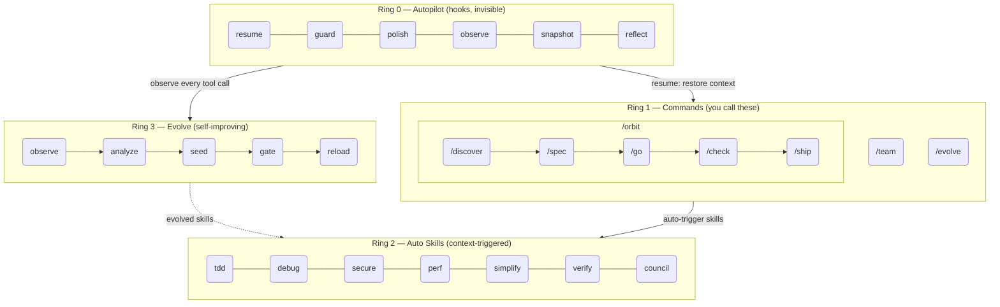
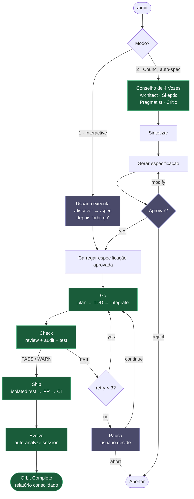

# epic harness

> Um arnês de agente de codificação IA auto-evolutivo — 8 comandos, 1 pipeline autônomo, habilidades de ativação automática, aprende com seus erros.

**8 comandos. Habilidades de ativação automática. Auto-evolutivo.**

<p align="center">
<a href="../../README.md">English</a> | <a href="../ja/README.md">日本語</a> | <a href="../ko/README.md">한국어</a> | <a href="../de/README.md">Deutsch</a> | <a href="../fr/README.md">Français</a> | <a href="../zh-CN/README.md">简体中文</a> | <a href="../zh-TW/README.md">繁體中文</a> | <a href="../pt-BR/README.md">Português</a> | <a href="../es/README.md">Español</a> | <a href="../hi/README.md">हिन्दी</a>
</p>

<p align="center">
  <a href="LICENSE"></a>
  
  
  
  <a href="https://buymeacoffee.com/epicsaga"></a>
</p>

Um plugin do Claude Code que **substitui mais de 30 comandos por 8**, **ativa habilidades automaticamente** com base no que você está fazendo, e **evolui novas habilidades** a partir dos seus próprios padrões de falha. Menos superfície para memorizar. Mais inteligência por tecla pressionada.

<p align="center">
  
</p>

## Instalação

> **Primeira vez?** Leia o [Guia de Início Rápido (5 min)](../../QUICKSTART.md).

```bash
# Claude Code
/plugin marketplace add epicsagas/plugins && /plugin install epic@epicsagas

# Qualquer outra ferramenta
cargo install epic-harness && epic install
```

| Ambiente | Método |
|----------|--------|
| **Claude Code** | Marketplace de plugins (acima) |
| **macOS** | `brew install epicsagas/tap/epic-harness` |
| **Qualquer (com Rust)** | `cargo install epic-harness` |
| **A partir do código-fonte** | `git clone` + `cargo install --path .` |

Pré-requisitos: **Git**. Instalações a partir do código-fonte ou binário também precisam do [conjunto de ferramentas Rust](https://rustup.rs).

### `epic install` — assistente de configuração

Após instalar o binário, execute `epic install` (ou `epic install claude`) para:

1. Criar a estrutura de diretórios `~/.harness/`
2. Sincronizar comandos, habilidades e agentes para o diretório de configuração da ferramenta
3. Registrar o servidor MCP (harness-mem) para o Claude Code
4. Criar `~/.harness/config.toml` com valores padrão se ausente

No Claude Code, `hooks/setup.sh` é executado automaticamente no início da sessão e instala o binário se estiver ausente. Nenhuma etapa manual é necessária após o clone inicial.

### Outras ferramentas

```bash
epic install codex        # Codex CLI   → ~/.codex/ + ~/.agents/skills/
epic install gemini       # Gemini CLI  → ~/.gemini/
epic install cursor       # Cursor      → ~/.cursor/ (requer Cursor 1.7+)
epic install opencode     # OpenCode    → ~/.config/opencode/
epic install cline        # Cline       → ~/Documents/Cline/Rules/
epic install aider        # Aider       → ~/.aider.conf.yml + ~/.aider/
epic install              # Menu interativo
```

Os arquivos de integração são **sincronizados** a partir do binário: arquivos ausentes ou desatualizados são escritos. `GEMINI.md` e `AGENTS.md` são criados apenas quando ausentes.

### Verificação

```bash
epic --version              # Binário instalado
ls ~/.harness/              # Diretório de dados existe
```

Dentro de uma sessão do Claude Code: `/evolve status`

### Demonstração Rápida

**Um comando, pipeline completo:**
```bash
$ /orbit
# Escolha o modo:
#   1. Interativo  — você executa /discover + /spec, depois "orbit go"
#   2. Conselho    — o conselho de 4 vozes gera a especificação, você aprova
→ spec aprovada → go (TDD) → check (PASS) → ship (PR + CI) → evolve
```

**Ou avance passo a passo manualmente:**
```bash
$ /spec "Add JWT auth to the login API"
  → Esclarece requisitos → produz SPEC-*.md

$ /go
  → Planeja automaticamente → subagentes TDD → DONE (4 min)

$ /check
  → Revisão de código + auditoria de segurança + testes em paralelo → PASS

$ /ship
  → Cria PR → CI verde → mesclado
```

## Arquitetura: Modelo de 4 Anéis



## /orbit — Pipeline Autônomo

`/orbit` encapsula todo o pipeline manual em uma única execução autônoma.



**Nós roxos** — pontos de controle humanos: seleção de modo, aprovação de especificação, pausa por 3 falhas de check.
**Nós verdes** — autônomos: go, check, ship, evolve executam sem intervenção do usuário.

Estado persistido em `$HARNESS_DIR/orbit/PIPELINE-{timestamp}.json` — sobrevive à compactação de contexto.

## Comandos

| Comando | O que faz |
|---------|-----------|
| `/discover` | Explorar e definir o problema antes de especificar uma solução — 5 Porquês, JTBD, questionamento socrático |
| `/spec` | Definir o que construir — esclarecer requisitos, produzir uma especificação |
| `/go` | Construir — planejamento automático, subagentes TDD, modelo de resultado de 4 estados (DONE/CONCERNS/NEEDS_CONTEXT/BLOCKED), execução paralela com isolamento de worktree |
| `/check` | Verificar — despacho de especialistas adaptativo (baseado em escopo), revisão de código + auditoria de segurança + desempenho em paralelo |
| `/ship` | Publicar — teste de pré-voo isolado, depois PR, CI, mesclagem |
| `/team` | Criar e sincronizar equipes de agentes em nível de organização entre projetos |
| `/evolve` | Gatilho manual de evolução / status / rollback |
| `/orbit` | **Pipeline autônomo** — executa spec → go → check → ship de uma vez. Escolha o modo interativo ou de conselho. |

---

## Habilidades Automáticas (Ring 2)

As habilidades são ativadas automaticamente. Você não as invoca.

| Habilidade | Ativa quando |
|------------|-------------|
| **tdd** | Implementação de nova funcionalidade |
| **debug** | Falha de teste ou erro |
| **discover** | Solicitação vaga, solução sem problema ou reclamação sem foco |
| **secure** | Código de Auth/DB/API/secrets modificado |
| **perf** | Loops, consultas, código de renderização |
| **simplify** | Arquivo > 200 linhas ou alta complexidade |
| **document** | API pública adicionada ou modificada |
| **verify** | Antes de completar /go ou /ship |
| **context** | Janela de contexto > 70% usada |
| **council** | Decisões arquiteturais ou de design ambíguas |
| **agent-introspection** | Autodepuração do agente após falhas repetidas |

## Hooks (Ring 0)

Executados de forma invisível. Binário único em Rust (`epic-harness`) com subcomandos.

| Hook | Quando | O que faz |
|------|--------|-----------|
| **resume** | Início de sessão | Restaurar contexto, carregar memória, detectar stack |
| **guard** | Antes de Bash | Bloquear force-push-to-main, rm -rf /, DROP prod |
| **polish** | Após Edit | Autoformatar (Biome/Prettier/ruff/gofmt) + verificação de tipos |
| **observe** | Cada uso de ferramenta | Registrar em `~/.harness/projects/{slug}/obs/` para evolução + dicas de GateGuard |
| **snapshot** | Antes de compactar | Salvar estado em `~/.harness/projects/{slug}/sessions/` |
| **reflect** | Fim de sessão | Analisar falhas, semear habilidades evoluídas, portão, extrair instintos |

Polish retroalimenta em observe: falha de formato → `lint_fail`, erro de TypeScript → `build_fail`. O thrashing Edit→Error é detectado mesmo quando os erros vêm de polish.

Cada sessão escreve seu próprio `session_{date}_{pid}_{random}.jsonl` — múltiplas sessões no mesmo projeto não corrompem os dados umas das outras.

### Perfis de Hook

Via `~/.harness/config.toml` ou variável de ambiente `EPIC_HOOK_PROFILE`:

| Perfil | Hooks ativos |
|--------|-------------|
| `minimal` | guard, observe, resume |
| `standard` (padrão) | os anteriores + polish, reflect, snapshot |
| `strict` | todos os hooks + futuras verificações apenas de strict |

### Regras de Guard Personalizadas

Adicione regras específicas do projeto via `.harness/guard-rules.yaml` na raiz do seu projeto:

```yaml
blocked:
  - pattern: kubectl\s+delete\s+namespace | msg: Namespace deletion blocked
warned:
  - pattern: docker\s+system\s+prune | msg: Docker prune — verify first
```

## Equipe (`epic team`)

As equipes são de **nível de organização**, não vinculadas ao projeto. Executar `/team` em qualquer projeto enriquece um pool compartilhado de definições de agentes — nunca sobrescreve silenciosamente.

```bash
epic team                              # Interativo: escanear → projetar → escrever → sincronizar
epic team sync backend                 # Despachar agentes → .claude/agents/backend/
epic team link backend                 # Despachar + registrar projeto na configuração da equipe
epic team list                         # Todas as equipes na organização atual
epic team list --org netflix           # Equipes em uma organização nomeada
epic team show backend --playbook      # Configuração + playbook completo
epic team delete backend               # Retirar apenas do projeto atual
epic team delete backend --global      # Excluir permanentemente do repositório da organização
```

Após sincronizar, os agentes estão disponíveis na próxima sessão: `@domain-expert`, `@reviewer`, `@tester`, etc.

| Tipo | Palavra-chave | Agentes padrão |
|------|--------------|----------------|
| Alinhado ao fluxo | `stream` | domain-expert, reviewer, tester |
| Plataforma | `platform` | api-designer, infra-specialist, dx-agent |
| Habilitador | `enabling` | specialist |
| Subsistema complicado | `subsystem` | domain-specialist, integration-tester |

Multi-organização: `epic team --org netflix` — topologia separada por organização.

Estratégia de mesclagem: agentes alterados solicitam confirmação (padrão: manter existente, backup em `.history/`). O playbook sempre é acrescentado.

## Suporte Multi-Ferramenta

Todas as ferramentas compartilham o mesmo diretório de dados `~/.harness/projects/{slug}/`.

| Ferramenta | Ring 0 Hooks | Comandos | Habilidades | Agentes |
|------------|-------------|----------|-------------|---------|
| **Claude Code** | ✓ Completo | ✓ 8 comandos (incl. /orbit) | ✓ 11 habilidades | ✓ 4 |
| **Codex CLI** | ✓ Completo¹ | ✓ 8 prompts (incl. /orbit) | ✓ 7 | ✓ 4 |
| **Gemini CLI** | ✓ Parcial² | ✓ 8 comandos (incl. /orbit) | ✓ 7 | ✓ 4 |
| **Cursor** | ✓ Completo³ | ✓ 8 comandos (incl. /orbit) | ✓ via rules | ✓ 4 |
| **OpenCode** | ✓ Parcial⁴ | ✓ 8 comandos (incl. /orbit) | — | ✓ 4 |
| **Cline** | ✓ Completo⁵ | — | — | — |
| **Aider** | —⁶ | — | — | — |

¹ `codex_hooks = true` em `~/.codex/config.toml` · ² Guard no nível `BeforeModel` · ³ Cursor 1.7+ · ⁴ Plugin JS · ⁵ 5 scripts de hook · ⁶ Apenas convenções

## Memória Unificada — WIP

> **Status: Em Desenvolvimento.** Ainda não totalmente funcional. Comandos CLI, ferramentas MCP e interface web estão em andamento.

Todos os agentes compartilham um grafo de conhecimento em `~/.harness/memory.db` (SQLite com busca de texto completo). Sem runtime externo.

```
score = recency(25%) + importance(35%) + access_frequency(15%) + FTS_match(25%)
```

### CLI

```bash
epic mem recall "auth refactor" --project my-project   # Recuperação inteligente
epic mem add --title "JWT rotation" --type decision    # Adicionar nó
epic mem search "JWT"                                  # Busca FTS5
epic mem query --type decision --project my-project    # Filtrar
epic mem context --project my-project                  # Contexto do projeto
epic mem serve                                         # Interface web → :7700
epic mem mcp-install                                   # Registrar servidor MCP
epic mem export --out ./docs/memory                    # Exportar para Markdown
```

### Ferramentas MCP (6)

| Ferramenta | Propósito |
|------------|----------|
| `mem_recall` | Recuperação contextual inteligente com hint + project + vizinhos do grafo |
| `mem_add` | Adicionar nó com importância automática por tipo (ou explícita 0.0–1.0) |
| `mem_search` | Busca por palavra-chave (texto completo), classificada por importância |
| `mem_query` | Filtrar por tag/tipo/projeto |
| `mem_context` | Recuperação inteligente com escopo de projeto (sem hint) |
| `mem_related` | Traversal do grafo a partir de um ID de nó (encontra conhecimento conectado) |

### Tipos de Nó

| Tipo | Criado por | Importância |
|------|-----------|-------------|
| `decision` | Manual / MCP | 0.9 |
| `resolution` | Manual / MCP | 0.8 |
| `concept` | Manual / MCP | 0.7 |
| `project` | Manual / MCP | 0.7 |
| `instinct` | Auto (reflect) | 0.7 |
| `pattern` | Auto (reflect) | 0.5 |
| `error` | Auto (reflect) | 0.4 |
| `session` | Auto (reflect) | 0.2 |

Ciclo de vida: mais de 30 dias sem acesso → 10% de decaimento de importância (mínimo 0.05). Mais de 180 dias → marcado como `stale`, excluído da recuperação. A tag `pinned` evita o decaimento.

## Evolve (Ring 3)

Funde os padrões de evolução automatizada do [A-Evolve](https://github.com/A-EVO-Lab/a-evolve) no sistema de hooks do Claude Code.

### Pontuação

Cada chamada de ferramenta é pontuada em 3 eixos (pesos configuráveis via `~/.harness/config.toml`):

```
composite = 0.5 × tool_success + 0.3 × output_quality + 0.2 × execution_cost
```

Classificação de falhas (9 tipos): `type_error` · `syntax_error` · `test_fail` · `lint_fail` · `build_fail` · `permission_denied` · `timeout` · `not_found` · `runtime_error`

### Detecção de Padrões

| Padrão | Detecta | Limiar padrão |
|--------|---------|--------------|
| `repeated_same_error` | Mesmo erro N+ vezes | 3 |
| `fix_then_break` | Sucesso de edição → falhas de build/teste | 3 lookahead, 2 ciclos |
| `long_debug_loop` | Preso no mesmo arquivo | 5 operações |
| `thrashing` | Alternância Edit↔Error | 3 edições, 3 erros |

### Fluxo de Evolução

```
Observe (PostToolUse — pontuação em 3 eixos)
    ↓ obs/session_{id}.jsonl
Analyze (SessionEnd)
    ↓ pontuações por ferramenta, por extensão + padrões
Propose (Solver — graduado por pontuação: ≥0.90 pular, ≥0.70 moderado, <0.70 completo)
    ↓ SkillProposal[] com confiança
Curate (Aceitar/Mesclar/Pular, feedback mascarado do solver)
    ↓ evolved/{skill}/SKILL.md + meta.json
Gate (verificação de formato, dedup, limite 10, promoção com portão ≥ 3 sessões)
    ↓ evolved_backup/ (melhor checkpoint)
Instinct (padrões de alto sucesso → nós cross-project memory.db)
    ↓
Reload (próxima sessão — resume carrega habilidades evoluídas)
```

Semeadura de habilidades: ferramenta fraca (sucesso <60%, mín. 5 obs), tipo de arquivo fraco (sucesso <50%, mín. 3 obs), erro de alta frequência (5+ ocorrências).

Estagnação: 3 sessões sem melhora de 5% → rollback automático para o melhor checkpoint.

```bash
/evolve              # Executar agora
/evolve status       # Painel: pontuações, tendências, padrões, habilidades
/evolve history      # Histórico completo + efetividade de habilidades
/evolve cross-project # Análise de padrões entre projetos
/evolve rollback     # Restaurar o melhor anterior
/evolve reset        # Limpar todos os dados de evolução
```

### Efetividade de Habilidades

Cada habilidade evoluída é rastreada com atribuição A/B:

```
/evolve history → Skill Effectiveness

| Skill              | With | Without | Delta |
|--------------------|------|---------|-------|
| evo-ts-care        | 0.87 | 0.72    | +15%  |
| evo-bash-discipline| 0.65 | 0.68    | -3%   |
```

Delta positivo = efetivo. Negativo = considere remover via `/evolve rollback`.

### Presets de Início a Frio

Na primeira sessão, presets de habilidades apropriados para o stack são aplicados automaticamente:

| Stack | Presets |
|-------|---------|
| Node.js/TypeScript | `evo-ts-care`, `evo-fix-build-fail` |
| Go | `evo-go-care` |
| Python | `evo-py-care` |
| Rust | `evo-rs-care` |

### Aprendizado de Instintos

Padrões de alto sucesso são extraídos e promovidos entre projetos:

```
observe (100% confirmado) → extract_instincts() → instinct node (confiança ≥ 0.8)
    → promover para global quando observado em ≥ 2 projetos
```

## Aprendizado Entre Projetos

Ative para compartilhar padrões de falha entre projetos:

```bash
touch ~/.harness/projects/{slug}/.cross-project-enabled
```

Fim de sessão → exporta padrões anonimizados para `~/.harness/global_patterns.jsonl`. Início de sessão → mostra dicas das áreas fracas de outros projetos.

## Dados do Projeto

Todos os dados vivem em `~/.harness/` (diretório home), não na raiz do seu projeto. Sobrevive à exclusão do projeto, não polui o histórico do git.

```
~/.harness/
├── memory.db                  # Grafo de conhecimento SQLite (nós + arestas + FTS5)
├── graph.json                 # Grafo em cache (para interface web)
├── config.toml                # Configuração do usuário
├── global_patterns.jsonl      # Padrões entre projetos (opt-in)
├── orgs/                      # Repositório global da equipe
│   └── {org}/teams/{team}/
│       ├── config.json, mission.md, playbook.md, agents/, .history/
└── projects/{slug}/
    ├── memory/                # Padrões e regras do projeto
    ├── sessions/              # Snapshots de sessão (para resume)
    ├── obs/                   # Registros de observação de uso de ferramentas (JSONL)
    ├── evolved/               # Habilidades auto-evoluídas
    │   ├── manifest.json
    │   └── {skill}/SKILL.md + meta.json
    ├── evolved_backup/        # Melhor checkpoint (para rollback)
    ├── dispatch/              # Registros de despacho de habilidades
    ├── evolution.jsonl        # Histórico completo de evolução
    └── metrics.json           # Estatísticas agregadas + atribuição de habilidades
```

Compartilhe regras de segurança com sua equipe: `.harness/guard-rules.yaml` na raiz do projeto (comprometido no git).

## Configuração

Todos os parâmetros ajustáveis em `~/.harness/config.toml`. Ausente = padrões no código.

```toml
# Prioridade: variável de ambiente (EPIC_HOOK_PROFILE) > este arquivo > padrões

[hook]
profile = "standard"         # "minimal" | "standard" | "strict"
gateguard_hints = true

[scoring]
weights = [0.5, 0.3, 0.2]   # [success, quality, cost]

[evolution]
max_skills = 10
stagnation_limit = 3
improvement_threshold = 0.05
gated_promotion_min = 3

[pattern]
# repeated_error_min = 3
# debug_loop_min = 5
# graduated_scope_skip = 0.90
# graduated_scope_moderate = 0.70

[instinct]
# confidence_threshold = 0.8
# promotion_min_projects = 2
# max_instincts = 20
# min_observations = 10
# min_avg_score = 0.5
```

## Desenvolvimento

```bash
cargo install --path .                                        # Compilar + instalar
cp ~/.cargo/bin/epic-harness hooks/bin/epic-harness           # Atualizar binário do plugin
cargo test                                                    # Testes
```

Os hooks procuram o binário em dois lugares: `hooks/bin/epic-harness` (plugin local) → `~/.cargo/bin/epic-harness` (PATH).

## Links

- [Changelog](../../CHANGELOG.md) — histórico de versões
- [Contributing](../../CONTRIBUTING.md) — como contribuir
- [Security](../../SECURITY.md) — reportar vulnerabilidades
- [Issues](https://github.com/epicsagas/epic-harness/issues) — relatórios de bugs e solicitações de funcionalidades

## Agradecimentos

- [a-evolve](https://github.com/A-EVO-Lab/a-evolve) — Padrões de evolução automatizada e benchmarks
- [agent-skills](https://github.com/addyosmani/agent-skills) — Sistema de habilidades de agente do Claude Code
- [everything-claude-code](https://github.com/affaan-m/everything-claude-code) — Padrões abrangentes do Claude Code
- [gstack](https://github.com/garrytan/gstack) — Referência de arquitetura de plugins
- [harness](https://github.com/revfactory/harness) — Padrões de infraestrutura de hooks e arnês
- [serena](https://github.com/oraios/serena) — Design de agentes autônomos
- [SuperClaude Framework](https://github.com/SuperClaude-Org/SuperClaude_Framework) — Arquitetura de framework multi-comando
- [superpowers](https://github.com/obra/superpowers) — Padrões de extensão do Claude Code

## Licença

[Apache 2.0](../../LICENSE)
