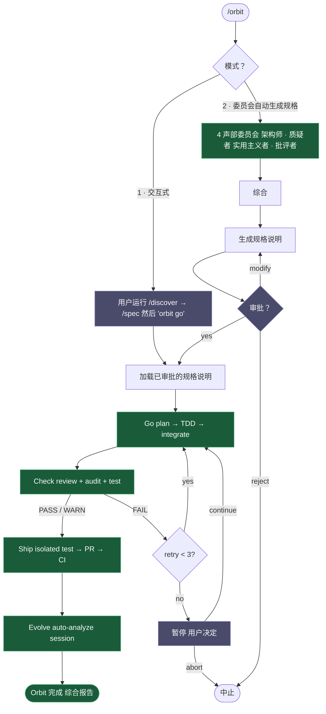
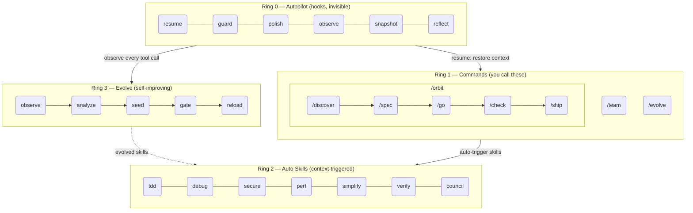

<h1 align="center">Epic Harness</h1>

<blockqoute><p align="center">一个自我进化的 AI 编程智能体框架 — 8 条命令、1 条自主流水线、自动触发技能，从你的失败中学习。</p></blockqoute>

<p align="center"><b>8 条命令。自动触发技能。自我进化。</b></p>

<p align="center">
<a href="../../README.md">English</a> | <a href="../ja/README.md">日本語</a> | <a href="../ko/README.md">한국어</a> | <a href="../de/README.md">Deutsch</a> | <a href="../fr/README.md">Français</a> | <a href="../zh-CN/README.md">简体中文</a> | <a href="../zh-TW/README.md">繁體中文</a> | <a href="../pt-BR/README.md">Português</a> | <a href="../es/README.md">Español</a> | <a href="../hi/README.md">हिन्दी</a>
</p>

<p align="center">
  <a href="LICENSE"></a>
  
  
  
  <a href="https://buymeacoffee.com/epicsaga"></a>
</p>

一个 Claude Code 插件，**用 8 条命令替代 30+ 条命令**，**根据你正在做的事情自动触发技能**，并**从你自己的失败模式中进化出新技能**。需要记忆的操作面更小，每次击键的智能含量更高。

<p align="center">
  
</p>

---

## 功能说明

一条命令，就能把功能从想法推进到合并。需要的技能会在关键时刻自动介入。每次会话之后，代理都会更强一点。

```bash
$ /orbit "为登录 API 添加 JWT 认证"
→ spec approved → go (TDD subagents) → check (PASS) → ship (PR + CI) → evolve
```

也可以手动分步执行，保持完整掌控：

```bash
/spec "为登录 API 添加 JWT 认证"   # 澄清需求 → SPEC-*.md
/go                                # 自动规划 → TDD 子代理 → 4 分钟
/check                             # 并行评审 + 安全 + 测试 → PASS
/ship                              # 隔离测试 → PR → CI 绿色
```

技能会在后台自动触发 —— 无需额外命令：

```
正在开发新功能？         → 触发 tdd（强制 Red→Green→Refactor）
测试失败？               → 触发 debug（先找根因，不靠盲修）
修改了 auth 或 DB？      → 触发 secure（OWASP 清单，不走捷径）
文件超过 200 行？        → 触发 simplify（提取、重命名、简化）
```

会话结束后，**evolve 循环**会识别瓶颈、生成针对性技能，并在下一次会话自动加载。今天卡在 TypeScript 构建，下一次就会有 `evo-ts-care`。

---

## 安装

> **第一次使用？** 请阅读 [快速入门指南（5 分钟）](../../QUICKSTART.md)。

```bash
# Claude Code
/plugin marketplace add epicsagas/plugins && /plugin install epic@epicsagas

# 任何其他工具
cargo install epic-harness && epic install
```

| 环境 | 方式 |
|-------------|--------|
| **Claude Code** | 插件市场（见上方） |
| **macOS** | `brew install epicsagas/tap/epic-harness` |
| **任意（含 Rust）** | `cargo install epic-harness` |
| **从源码** | `git clone` + `cargo install --path .` |

前置条件：**Git**。源码/二进制安装还需要 [Rust 工具链](https://rustup.rs)。

### `epic install` — 安装向导

安装二进制文件后，运行 `epic install`（或 `epic install claude`）以：

1. 创建 `~/.harness/` 目录结构
2. 将命令、技能和智能体同步到工具的配置目录
3. 为 Claude Code 注册 MCP 服务器（harness-mem）
4. 若不存在，则创建含默认值的 `~/.harness/config.toml`

在 Claude Code 中，`hooks/setup.sh` 在会话启动时自动运行，并在二进制文件缺失时自动安装。初次克隆后无需手动操作。

### 其他工具

```bash
epic install codex        # Codex CLI   → ~/.codex/ + ~/.agents/skills/
epic install gemini       # Gemini CLI  → ~/.gemini/
epic install cursor       # Cursor      → ~/.cursor/ (需要 Cursor 1.7+)
epic install opencode     # OpenCode    → ~/.config/opencode/
epic install cline        # Cline       → ~/Documents/Cline/Rules/
epic install aider        # Aider       → ~/.aider.conf.yml + ~/.aider/
epic install              # 交互式菜单
```

集成文件从二进制**同步**而来：缺失或过时的文件会被写入。`GEMINI.md` 和 `AGENTS.md` 仅在不存在时才会创建。

### 验证

```bash
epic --version              # 二进制已安装
ls ~/.harness/              # 数据目录存在
```

在 Claude Code 会话中：`/evolve status`

### 快速演示

**一条命令，完整流水线：**
```bash
$ /orbit
# 选择模式：
#   1. 交互式  — 你运行 /discover + /spec，然后输入 "orbit go"
#   2. 委员会  — 4 声部委员会生成规格说明，由你审批
→ spec approved → go (TDD) → check (PASS) → ship (PR + CI) → evolve
```

**或逐步手动执行：**
```bash
$ /spec "Add JWT auth to the login API"
  → 澄清需求 → 生成 SPEC-*.md

$ /go
  → 自动规划 → TDD 子智能体 → 完成（4 分钟）

$ /check
  → 并行代码审查 + 安全审计 + 测试 → PASS

$ /ship
  → 创建 PR → CI 通过 → 合并
```

## /orbit — 自主流水线

`/orbit` 将整个手动流水线包装成一次自主执行。



**紫色节点** — 人工检查点：模式选择、规格审批、3 次检查失败暂停。
**绿色节点** — 自主执行：go、check、ship、evolve 无需用户干预。

状态持久化于 `$HARNESS_DIR/orbit/PIPELINE-{timestamp}.json` — 在上下文压缩后仍可恢复。

## 命令

| 命令 | 功能 |
|---------|-------------|
| `/discover` | 在指定解决方案前探索并定义问题 — 五问法、JTBD、苏格拉底式提问 |
| `/spec` | 定义要构建的内容 — 澄清需求，生成规格说明 |
| `/go` | 构建 — 自动规划、TDD 子智能体、4 状态结果模型（DONE/CONCERNS/NEEDS_CONTEXT/BLOCKED）、使用工作树隔离的并行执行 |
| `/check` | 验证 — 自适应专家调度（基于范围）、并行代码审查 + 安全审计 + 性能分析 |
| `/ship` | 发布 — 隔离预飞行测试，然后 PR、CI、合并 |
| `/team` | 跨项目创建并同步组织级智能体团队 |
| `/evolve` | 手动触发进化 / 查看状态 / 回滚 |
| `/orbit` | **自主流水线** — 一键执行 spec → go → check → ship。可选交互式或委员会模式。 |

---

## 自动技能（Ring 2）

技能自动触发，无需手动调用。

| 技能 | 触发时机 |
|-------|--------------|
| **tdd** | 新功能实现 |
| **debug** | 测试失败或出现错误 |
| **discover** | 请求模糊、先给出解决方案而无问题描述，或无焦点的抱怨 |
| **secure** | 涉及 Auth/DB/API/secrets 的代码 |
| **perf** | 循环、查询、渲染代码 |
| **simplify** | 文件超过 200 行或复杂度过高 |
| **document** | 新增或修改了公共 API |
| **verify** | 在完成 /go 或 /ship 之前 |
| **context** | 上下文窗口使用超过 70% |
| **council** | 模糊的架构或设计决策 |
| **agent-introspection** | 智能体在反复失败后进行自我调试 |

## 钩子（Ring 0）

无感运行。单一 Rust 二进制文件（`epic-harness`），含多个子命令。

| 钩子 | 时机 | 功能 |
|------|------|------|
| **resume** | 会话启动 | 恢复上下文、加载内存、检测技术栈 |
| **guard** | Bash 执行前 | 阻止强制推送到 main、rm -rf /、DROP 生产库 |
| **polish** | Edit 执行后 | 自动格式化（Biome/Prettier/ruff/gofmt）+ 类型检查 |
| **observe** | 每次工具调用 | 记录到 `~/.harness/projects/{slug}/obs/`，用于进化 + GateGuard 提示 |
| **snapshot** | 压缩前 | 将状态保存到 `~/.harness/projects/{slug}/sessions/` |
| **reflect** | 会话结束 | 分析失败、播种进化技能、门控、提取直觉 |

Polish 反馈至 observe：格式化失败 → `lint_fail`，TypeScript 错误 → `build_fail`。即使错误来自 polish，Edit→Error 抖振也会被检测到。

每个会话写入各自的 `session_{date}_{pid}_{random}.jsonl` — 同一项目上的多个会话不会互相污染数据。

### 钩子配置文件

通过 `~/.harness/config.toml` 或 `EPIC_HOOK_PROFILE` 环境变量配置：

| 配置文件 | 激活的钩子 |
|---------|-------------|
| `minimal` | guard、observe、resume |
| `standard`（默认） | 以上 + polish、reflect、snapshot |
| `strict` | 所有钩子 + 未来的 strict-only 检查 |

### 自定义守卫规则

在项目根目录的 `.harness/guard-rules.yaml` 中添加项目专属规则：

```yaml
blocked:
  - pattern: kubectl\s+delete\s+namespace | msg: Namespace deletion blocked
warned:
  - pattern: docker\s+system\s+prune | msg: Docker prune — verify first
```

## 团队（`epic team`）

团队是**组织级别**的，不绑定到具体项目。在任意项目中运行 `/team` 都会丰富共享的智能体定义池 — 不会静默覆盖。

```bash
epic team                              # 交互式：扫描 → 设计 → 写入 → 同步
epic team sync backend                 # 调度智能体 → .claude/agents/backend/
epic team link backend                 # 调度 + 在团队配置中注册项目
epic team list                         # 当前组织的所有团队
epic team list --org netflix           # 指定组织的团队
epic team show backend --playbook      # 配置 + 完整 playbook
epic team delete backend               # 仅从当前项目撤销
epic team delete backend --global      # 从组织存储中永久删除
```

同步后，下次会话中即可使用智能体：`@domain-expert`、`@reviewer`、`@tester` 等。

| 类型 | 关键词 | 默认智能体 |
|------|---------|---------------|
| Stream-aligned | `stream` | domain-expert、reviewer、tester |
| Platform | `platform` | api-designer、infra-specialist、dx-agent |
| Enabling | `enabling` | specialist |
| Complicated Subsystem | `subsystem` | domain-specialist、integration-tester |

多组织支持：`epic team --org netflix` — 每个组织有独立的拓扑结构。

合并策略：变更的智能体会提示确认（默认：保留现有，备份到 `.history/`）。Playbook 始终追加。

## 多工具支持

所有工具共享同一个 `~/.harness/projects/{slug}/` 数据目录。

| 工具 | Ring 0 钩子 | 命令 | 技能 | 智能体 |
|------|-------------|----------|--------|--------|
| **Claude Code** | ✓ 完整 | ✓ 8 条命令（含 /orbit） | ✓ 11 个技能 | ✓ 4 |
| **Codex CLI** | ✓ 完整¹ | ✓ 8 条提示词（含 /orbit） | ✓ 7 | ✓ 4 |
| **Gemini CLI** | ✓ 部分² | ✓ 8 条命令（含 /orbit） | ✓ 7 | ✓ 4 |
| **Cursor** | ✓ 完整³ | ✓ 8 条命令（含 /orbit） | ✓ 通过规则 | ✓ 4 |
| **OpenCode** | ✓ 部分⁴ | ✓ 8 条命令（含 /orbit） | — | ✓ 4 |
| **Cline** | ✓ 完整⁵ | — | — | — |
| **Aider** | —⁶ | — | — | — |

¹ `codex_hooks = true` 在 `~/.codex/config.toml` · ² 守卫在 `BeforeModel` 级别 · ³ Cursor 1.7+ · ⁴ JS 插件 · ⁵ 5 个钩子脚本 · ⁶ 仅约定

## 统一内存

所有智能体共享存储于 `~/.harness/memory.db` 的知识图谱（SQLite，含全文搜索）。无需外部运行时。

```
score = recency(25%) + importance(35%) + access_frequency(15%) + FTS_match(25%)
```

### CLI

```bash
epic mem recall "auth refactor" --project my-project   # 智能检索
epic mem add --title "JWT rotation" --type decision    # 添加节点
epic mem search "JWT"                                  # FTS5 搜索
epic mem query --type decision --project my-project    # 过滤
epic mem context --project my-project                  # 项目上下文
epic mem serve                                         # Web UI → :7700 or custom port with --port 8800
epic mem mcp-install                                   # 注册 MCP 服务器
epic mem export --out ./docs/memory                    # 导出为 Markdown
```

### MCP 工具（6 个）

| 工具 | 用途 |
|------|---------|
| `mem_recall` | 基于提示 + 项目 + 图邻居的智能上下文检索 |
| `mem_add` | 按类型自动设置重要性添加节点（或显式 0.0–1.0） |
| `mem_search` | 关键词搜索（全文），按重要性排序 |
| `mem_query` | 按标签/类型/项目过滤 |
| `mem_context` | 项目范围的智能检索（无提示） |
| `mem_related` | 从节点 ID 进行图遍历（发现关联知识） |

### 节点类型

| 类型 | 创建方式 | 重要性 |
|------|-----------|------------|
| `decision` | 手动 / MCP | 0.9 |
| `resolution` | 手动 / MCP | 0.8 |
| `concept` | 手动 / MCP | 0.7 |
| `project` | 手动 / MCP | 0.7 |
| `instinct` | 自动（reflect） | 0.7 |
| `pattern` | 自动（reflect） | 0.5 |
| `error` | 自动（reflect） | 0.4 |
| `session` | 自动（reflect） | 0.2 |

生命周期：超过 30 天未访问 → 重要性衰减 10%（下限 0.05）。超过 180 天 → 标记为 `stale`，从检索中排除。`pinned` 标签可防止衰减。

> **Web UI**：图形可视化正在积极改进中——聚类、邻居高亮和离线回退已最近添加。更多改进正在进行中。

## 进化（Ring 3）

将 [A-Evolve](https://github.com/A-EVO-Lab/a-evolve) 自动化进化模式融入 Claude Code 的钩子系统。

### 评分

每次工具调用在 3 个维度上评分（权重可通过 `~/.harness/config.toml` 配置）：

```
composite = 0.5 × tool_success + 0.3 × output_quality + 0.2 × execution_cost
```

失败分类（9 种）：`type_error` · `syntax_error` · `test_fail` · `lint_fail` · `build_fail` · `permission_denied` · `timeout` · `not_found` · `runtime_error`

### 模式检测

| 模式 | 检测内容 | 默认阈值 |
|---------|---------|-------------------|
| `repeated_same_error` | 相同错误出现 N+ 次 | 3 |
| `fix_then_break` | 编辑成功 → 构建/测试失败 | 回溯 3 步，2 个周期 |
| `long_debug_loop` | 卡在同一文件 | 5 次操作 |
| `thrashing` | Edit↔Error 交替出现 | 3 次编辑，3 次错误 |

### 进化流程

```
Observe (PostToolUse — 3-axis scoring)
    ↓ obs/session_{id}.jsonl
Analyze (SessionEnd)
    ↓ per-tool, per-ext scores + patterns
Propose (Solver — graduated by score: ≥0.90 skip, ≥0.70 moderate, <0.70 full)
    ↓ SkillProposal[] with confidence
Curate (Accept/Merge/Skip, feedback masked from solver)
    ↓ evolved/{skill}/SKILL.md + meta.json
Gate (format check, dedup, cap 10, gated promotion ≥ 3 sessions)
    ↓ evolved_backup/ (best checkpoint)
Instinct (high-success patterns → cross-project memory.db nodes)
    ↓
Reload (next session — resume loads evolved skills)
```

技能播种：弱工具（成功率 <60%，最少 5 次观测）、弱文件类型（成功率 <50%，最少 3 次观测）、高频错误（5+ 次出现）。

停滞处理：连续 3 个会话无 5% 改善 → 自动回滚到最佳检查点。

```bash
/evolve              # 立即运行
/evolve status       # 仪表盘：评分、趋势、模式、技能
/evolve history      # 完整历史 + 技能效果
/evolve cross-project # 跨项目模式分析
/evolve rollback     # 恢复上一个最佳版本
/evolve reset        # 清除所有进化数据
```

### 技能有效性

每个进化技能都通过 A/B 归因追踪：

```
/evolve history → Skill Effectiveness

| Skill              | With | Without | Delta |
|--------------------|------|---------|-------|
| evo-ts-care        | 0.87 | 0.72    | +15%  |
| evo-bash-discipline| 0.65 | 0.68    | -3%   |
```

正增量 = 有效。负增量 = 考虑通过 `/evolve rollback` 移除。

### 冷启动预设

首次会话时，会根据检测到的技术栈自动应用适合的预设技能：

| 技术栈 | 预设 |
|-------|---------|
| Node.js/TypeScript | `evo-ts-care`、`evo-fix-build-fail` |
| Go | `evo-go-care` |
| Python | `evo-py-care` |
| Rust | `evo-rs-care` |

### 直觉学习

高成功率模式被提取并在项目间推广：

```
observe (100% confirmed) → extract_instincts() → instinct node (confidence ≥ 0.8)
    → promote to global when observed in ≥ 2 projects
```

## 架构：4-Ring 模型



## 跨项目学习

选择加入以在项目间共享失败模式：

```bash
touch ~/.harness/projects/{slug}/.cross-project-enabled
```

会话结束 → 将匿名化模式导出到 `~/.harness/global_patterns.jsonl`。会话开始 → 显示来自其他项目薄弱领域的提示。

## 项目数据

所有数据存储于 `~/.harness/`（主目录），而非项目根目录。项目删除后数据仍然存在，不会污染 git 历史。

```
~/.harness/
├── memory.db                  # SQLite 知识图谱（节点 + 边 + FTS5）
├── graph.json                 # 缓存的图（用于 Web UI）
├── config.toml                # 用户配置
├── global_patterns.jsonl      # 跨项目模式（选择加入）
├── orgs/                      # 团队全局存储
│   └── {org}/teams/{team}/
│       ├── config.json, mission.md, playbook.md, agents/, .history/
└── projects/{slug}/
    ├── memory/                # 项目模式和规则
    ├── sessions/              # 会话快照（用于恢复）
    ├── obs/                   # 工具使用观测日志（JSONL）
    ├── evolved/               # 自动进化的技能
    │   ├── manifest.json
    │   └── {skill}/SKILL.md + meta.json
    ├── evolved_backup/        # 最佳检查点（用于回滚）
    ├── dispatch/              # 技能调度日志
    ├── evolution.jsonl        # 完整进化历史
    └── metrics.json           # 聚合统计 + 技能归因
```

将安全规则与团队共享：在项目根目录（提交到 git）放置 `.harness/guard-rules.yaml`。

## 配置

所有可调参数均在 `~/.harness/config.toml` 中。缺省 = 硬编码默认值。

```toml
# 优先级：环境变量（EPIC_HOOK_PROFILE）> 本文件 > 默认值

[hook]
profile = "standard"         # "minimal" | "standard" | "strict"
gateguard_hints = true

[scoring]
weights = [0.5, 0.3, 0.2]   # [success, quality, cost]

[evolution]
max_skills = 10
stagnation_limit = 3
improvement_threshold = 0.05
gated_promotion_min = 3

[pattern]
# repeated_error_min = 3
# debug_loop_min = 5
# graduated_scope_skip = 0.90
# graduated_scope_moderate = 0.70

[instinct]
# confidence_threshold = 0.8
# promotion_min_projects = 2
# max_instincts = 20
# min_observations = 10
# min_avg_score = 0.5
```

## 开发

```bash
cargo install --path .                                        # 构建 + 安装
cp ~/.cargo/bin/epic-harness hooks/bin/epic-harness           # 更新插件二进制文件
cargo test                                                    # 测试
```

钩子在两处查找二进制文件：`hooks/bin/epic-harness`（插件本地）→ `~/.cargo/bin/epic-harness`（PATH）。

## 链接

- [更新日志](../../CHANGELOG.md) — 发布历史
- [贡献指南](../../CONTRIBUTING.md) — 如何贡献
- [安全策略](../../SECURITY.md) — 报告漏洞
- [Issues](https://github.com/epicsagas/epic-harness/issues) — 错误报告和功能请求

## 致谢

- [a-evolve](https://github.com/A-EVO-Lab/a-evolve) — 自动化进化与基准测试模式
- [agent-skills](https://github.com/addyosmani/agent-skills) — Claude Code 智能体技能系统
- [everything-claude-code](https://github.com/affaan-m/everything-claude-code) — 全面的 Claude Code 模式
- [gstack](https://github.com/garrytan/gstack) — 插件架构参考
- [harness](https://github.com/revfactory/harness) — 钩子与框架基础设施模式
- [serena](https://github.com/oraios/serena) — 自主智能体设计
- [SuperClaude Framework](https://github.com/SuperClaude-Org/SuperClaude_Framework) — 多命令框架架构
- [superpowers](https://github.com/obra/superpowers) — Claude Code 扩展模式

## 许可证

[Apache 2.0](../../LICENSE)
