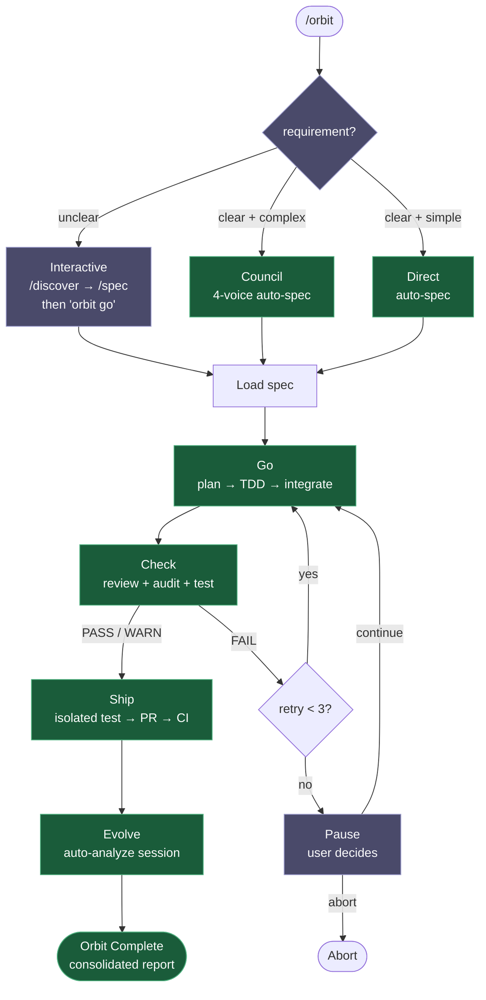
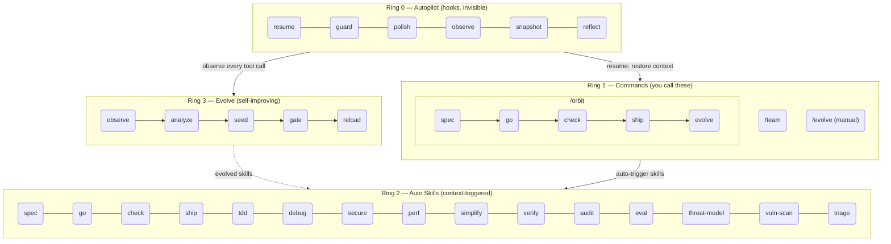

<h1 align="center">Epic Harness</h1>

<blockquote><p align="center">一个自我进化的 AI 编程智能体框架 — 3 个命令、26 个技能、1 条自主流水线，从你的失败中学习。</p></blockquote>

<p align="center"><b>更少的记忆负担。每次按键更多的智能。每次会话都在变得更聪明。</b></p>

<p align="center">
<a href="../../README.md">English</a> | <a href="../ja/README.md">日本語</a> | <a href="../ko/README.md">한국어</a> | <a href="../de/README.md">Deutsch</a> | <a href="../fr/README.md">Français</a> | 简体中文 | <a href="../zh-TW/README.md">繁體中文</a> | <a href="../pt-BR/README.md">Português</a> | <a href="../es/README.md">Español</a> | <a href="../hi/README.md">हिन्दी</a>
</p>

<p align="center">
  <a href="https://github.com/epicsagas/epic-harness/stargazers"></a>
  <a href="https://github.com/epicsagas/epic-harness/network/members"></a>
  <a href="https://github.com/epicsagas/epic-harness/issues"></a>
  <a href="https://github.com/epicsagas/epic-harness/commits/main"></a>
</p>
<p align="center">
  <a href="../../LICENSE"></a>
  
  
  
  <a href="https://buymeacoffee.com/epicsaga"></a>
</p>

一个 Claude Code 插件，**将 30+ 条命令整合为 3 个命令 + 26 个自动触发技能**，根据你正在做的事情**自动触发技能**，并从你的失败模式中**进化出新的技能**。

<p align="center">
  
</p>

---


### Web 控制面板 — 会话启动时自动打开

10 屏实时指标，覆盖 eval 评分、工具统计、orbit 流水线、进化技能和 hook 健康。首次 Claude Code 会话时自动打开 — 无需手动配置。

<p align="center">
  
  
</p>

```bash
# 首次会话时自动启动（默认：http://localhost:7700）
# 在 ~/.harness/config.toml 中配置端口或禁用：
[dashboard]
port = 7700       # 设为 0 以禁用自动启动
auto_open = true  # 首次会话时打开浏览器
```

页面：**Dashboard** · /orbit 流水线 · 命令 (3) · 技能 (26) · 实时智能体 · Eval & Evolve · Hooks (6) · 集成 (6) · harness-mem · 设置

---

## 它做什么

一条命令即可端到端交付功能。技能无需你主动调用即可触发。智能体在每次会话后变得更聪明。

```bash
$ /orbit "为登录 API 添加 JWT 认证"
→ spec 已批准 → go（TDD 子智能体） → check（通过） → ship（PR + CI） → evolve
```

也可以直接调用管道技能：

```bash
/spec "为登录 API 添加 JWT 认证"   # 明确需求 → SPEC-*.md
/go                                  # 自动规划 → TDD 子智能体 → 4 分钟
/check                               # 并行审查 + 安全审计 + 测试 → 通过
/ship                                # 隔离测试 → PR → CI 通过
```

技能在后台自动触发 — 无需额外命令：

```
正在编写功能？    → tdd 触发（强制执行 Red→Green→Refactor）
测试失败？        → debug 触发（优先根因分析，不盲目修复）
涉及认证或数据库？  → secure 触发（OWASP 检查清单，不走捷径）
文件超过 200 行？  → simplify 触发（提取、重命名、精简）
```

会话结束后，**evolve 循环**分析出错的原因，生成针对性技能，并在下次会话时加载。之前在 TypeScript 构建失败中挣扎的智能体，下次将拥有一个 `evo-ts-care` 技能。

---

## 安装

> **首次使用？** 阅读[快速入门指南（5 分钟）](../../docs/quickstart.md)。

epic-harness 以**插件**形式分发 — 技能、hooks 和 `harness-mem` MCP 服务器直接从插件布局（`skills/`、`hooks.json`、`.mcp.json`）加载。没有 `install` 子命令，各工具直接从磁盘读取插件。

### Claude Code（推荐）

```
/plugin marketplace add epicsagas/plugins
/plugin install epic@epicsagas
```

一步自动安装二进制文件、技能、hooks 和 `harness-mem` MCP 服务器。

### agy（Antigravity CLI）

```bash
agy plugin install .
```

27 个技能、hooks 和 `harness-mem` MCP 服务器从插件的 `plugin.json` + `skills/` + `hooks.json` + `.mcp.json` 自动发现。

### Codex CLI

```bash
codex plugin marketplace add epicsagas/plugins
```

技能和智能体立即可用 — 无需进一步操作。

### 仅二进制（无插件宿主）

```bash
brew install epicsagas/tap/epic-harness      # macOS / Linux (Homebrew)
cargo binstall epic-harness                  # 预编译二进制 (Rust)
cargo install epic-harness                   # 从源码构建
```

没有 Homebrew？使用安装脚本：

```bash
curl --proto '=https' --tlsv1.2 -LsSf \
  https://github.com/epicsagas/epic-harness/releases/latest/download/install.sh | sh
```

Windows:

```powershell
irm https://github.com/epicsagas/epic-harness/releases/latest/download/install.ps1 | iex
```

二进制文件在首次 hook 运行时自动播种 `~/.harness/config.toml` 和 `HARNESS.md` — 无需安装向导或 `install` 步骤。

> 使用 `epic-harness --version` 验证。通过 `brew upgrade epic-harness` 或重新运行安装脚本来更新。

前置条件：**Git**。源码/二进制安装还需要 [Rust 工具链](https://rustup.rs)。

### 验证

```bash
epic --version              # 二进制已安装
ls ~/.harness/              # 数据目录（首次会话自动创建）
```

在 Claude Code 会话中：`/evolve status`

> **遥测**：使用量报告默认开启（opt-out）。使用 `epic-harness telemetry status|on|off` 切换。

---

## 命令

| 命令 | 功能说明 |
|---------|-------------|
| `/orbit` | **完整自主流水线**：一次性完成 spec → go → check → ship → evolve |
| `/team` | 浏览组织库、雇佣现有团队或设计新团队（3-6 个智能体，同步到 `.claude/agents/`） |
| `/evolve` | 手动进化触发 — 分析会话、查看仪表板、检查技能效果、回滚 |

管道阶段（`/spec`、`/go`、`/check`、`/ship`、`/discover`）现在是**技能** — 根据上下文自动触发，也可以按名称直接调用。旧命令名通过别名路由继续有效。

---

## /orbit — 自主流水线

`/orbit` 将整个流水线封装为一次自主执行。选择一个模式 — 之后直到创建 PR 之前完全无需干预。



**紫色** — 人工步骤：模式选择（不明确 → 交互式）、3 次检查失败暂停。
**绿色** — 明确 + 复杂 → 委员会自动生成 spec；明确 + 简单 → 直接构建；两者完全自主。

状态持久化在 `$HARNESS_DIR/orbit/PIPELINE-{timestamp}.json` — 在上下文压缩后仍然保留。

> **注意事项**：当修改 orbit 本身或仅编辑文档时，智能体可能会绕过流水线。参见[已知问题（智能体判断）](#已知问题智能体判断)。

---

## 自动技能（Ring 2）

技能根据上下文自动触发。你不需要手动调用它们。

| 技能 | 触发时机 |
|-------|--------------|
| **spec** | 需要定义需求时 — 转换为编号的 R + AC 文档 |
| **go** | 构建阶段 — 自动规划 → TDD 子智能体 → 并行执行 → AC 验证 |
| **check** | 审查阶段 — 并行代码审查 + 安全审计 + 测试，按范围附加检查 |
| **ship** | 发布阶段 — 隔离测试 → 包含完整检查报告的 PR → CI 监控 + 自动修复 |
| **audit** | 全面审计 — 并行代码质量 + 安全 + 测试审查，语义去重 |
| **eval** | 基于基线对比的质量回归评估 — 正确性、性能、质量 |
| **tdd** | 新功能实现或 Bug 修复 |
| **debug** | 测试失败或运行时错误 |
| **discover** | 需求模糊、没有明确问题的解决方案、缺乏焦点的抱怨 |
| **secure** | 涉及认证 / 数据库 / API / 密钥代码 |
| **threat-model** | 安全范围界定 — 信任边界枚举、威胁参与者、场景 → THREAT_MODEL.md |
| **vuln-scan** | 系统性漏洞扫描 — 注入、认证、数据暴露、依赖 → VULN-FINDINGS.json |
| **triage** | 对抗性验证 — 严重性调整、链式分析、根因分组 → TRIAGE.json |
| **perf** | 循环、查询、渲染、批量操作 |
| **simplify** | 文件超过 200 行或圈复杂度过高 |
| **document** | 公共 API 新增或签名变更 |
| **verify** | 在完成 `/go` 或 `/ship` 之前 |
| **context** | 上下文窗口超过 70% |
| **council** | 存在歧义的架构或设计决策 |
| **orchestrate** | 多智能体编排状态和实时智能体干预 |
| **agent-introspection** | 连续 3+ 次失败或循环重试模式 |
| **reflect** | 按需：你是否在将 AI 作为思维放大器？基于事实的冷静自我评估 |
| **commit** | 约定式提交生成 — 从 git diff 自动生成 |

> **Token 预算说明：** Claude Code 将技能描述加载到每个会话上下文中。epic 的 26 个技能在默认的 `skillListingBudgetFraction: 0.01`（1%）内可以容纳。如果你安装了额外技能（例如 episteme、alcove、obscura），合计总量可能超出预算并触发 "descriptions dropped" 警告。在 `~/.claude/settings.json` 中添加以下配置来修复：
>
> ```json
> "skillListingBudgetFraction": 0.02
> ```
>
> 如果你安装了 20+ 个技能，请使用 `0.03`。

---

## Evolve（Ring 3）

框架监控每一次工具调用，在 3 个维度上评分，检测失败模式，并生成针对性技能 — 在会话结束时自动完成。

### 评分

```
composite = 0.5 × tool_success + 0.3 × output_quality + 0.2 × execution_cost
```

失败分类（9 种类型）：`type_error` · `syntax_error` · `test_fail` · `lint_fail` · `build_fail` · `permission_denied` · `timeout` · `not_found` · `runtime_error`

### 模式检测

| 模式 | 检测内容 | 默认阈值 |
|---------|---------|-------------------|
| `repeated_same_error` | 相同错误出现 N+ 次 | 3 |
| `fix_then_break` | 编辑成功 → 构建/测试失败 | 3 次回溯，2 个周期 |
| `long_debug_loop` | 卡在同一个文件上 | 5 次操作 |
| `thrashing` | 编辑与错误交替出现 | 3 次编辑，3 次错误 |

### 进化流程

```
Observe（PostToolUse — 3 轴评分）
    ↓ obs/session_{id}.jsonl
Analyze（SessionEnd）
    ↓ 按工具、按扩展名的评分 + 模式
Propose（Solver — 按评分渐进：≥0.90 跳过，≥0.70 适度，<0.70 完整）
    ↓ SkillProposal[] 带置信度
Curate（Accept/Merge/Skip，反馈对 solver 不可见）
    ↓ evolved/{skill}/SKILL.md + meta.json
Gate（格式检查、去重、上限 10、≥ 3 次会话的门控提升）
    ↓ evolved_backup/（最佳检查点）
Instinct（高成功率模式 → 跨项目 memory.db 节点）
    ↓
Reload（下次会话 — resume 加载进化技能）
```

技能播种：弱工具（成功率 <60%，最少 5 次观测），弱文件类型（成功率 <50%，最少 3 次观测），高频错误（5+ 次出现）。

停滞：连续 3 次会话无 5% 提升 → 自动回滚到最佳检查点。

### SkillOpt 启发的优化

三种受深度学习启发、改编自 [SkillOpt](https://arxiv.org/abs/2605.23904) 的技术：

| 技术 | 工作原理 |
|-----------|-------------|
| **负反馈缓冲** | 被拒绝的提案带 TTL 过期时间存储；生成新提案前先检查缓冲区 |
| **小批量反思** | 观测数据分解为固定大小的批次进行结构化模式提取；当主要错误 ≥60% + ≥2 个不同文件时可复用 |
| **慢速/元更新** | 对最近 5 次会话进行线性回归，将 epoch 分类为 Improving / Regressing / PersistentFailure / StableSuccess；自动淘汰表现不佳的技能 |

### Prompt 自动调优

表现不佳的进化技能会在 `<!-- auto-tuned -->` 分隔符之后追加针对性调优指导。原始内容永远不会被修改。连续 3 次下降会话 → 自动回滚调优，历史记录清除。

### 技能效果

每个进化技能都有 A/B 归因追踪：

```
/evolve history → 技能效果

| 技能               | 使用时 | 未使用时 | 差值 |
|--------------------|--------|----------|------|
| evo-ts-care        | 0.87   | 0.72     | +15% |
| evo-bash-discipline| 0.65   | 0.68     | -3%  |
```

正差值 = 有效。负差值 = 考虑通过 `/evolve rollback` 移除。

### 冷启动预设

首次会话时，根据技术栈自动应用预设技能：

| 技术栈 | 预设 |
|-------|---------|
| Node.js/TypeScript | `evo-ts-care`、`evo-fix-build-fail` |
| Go | `evo-go-care` |
| Python | `evo-py-care` |
| Rust | `evo-rs-care` |

### Instinct 学习

高成功率模式被提取并跨项目推广：

```
observe（100% 确认）→ extract_instincts() → instinct 节点（置信度 ≥ 0.8）
    → 在 ≥ 2 个项目中观察到时提升为全局
```

```bash
/evolve              # 立即运行
/evolve status       # 仪表板：评分、趋势、模式、技能
/evolve history      # 完整历史 + 技能效果
/evolve cross-project # 跨项目模式分析
/evolve rollback     # 恢复之前的最佳状态
/evolve reset        # 清除所有进化数据
```

---

## 安全流水线

三阶段漏洞评估流水线，移植自 [defending-code](https://github.com/anthropics/defending-code-reference-harness)：

```bash
/threat-model    # 1. 信任边界、威胁参与者、场景 → THREAT_MODEL.md
/vuln-scan       # 2. 4 维扫描器（注入、认证、数据暴露、依赖）→ VULN-FINDINGS.json
/triage          # 3. 对抗性验证、严重性调整、链式分析 → TRIAGE.json
```

### Audit `--strict` 模式

对于安全评估，`--strict` 模式强制各审计模式之间保持独立性：
- 代码、安全和测试审查者仅接收 diff + spec — 不包含构建者上下文
- 交叉检查独立性：各模式在综合之前独立运行
- 盲评分防止锚定偏差

可选的评估上下文通过项目根目录的 `.harness/engagement.md` 提供（授权、范围、约束、排除项）。参见 `docs/references/engagement.md` 获取模板。

---

## Hooks（Ring 0）

在每次会话中无形运行。单个 Rust 二进制文件（`epic-harness`）包含多个子命令。

| Hook | 触发时机 | 功能 |
|------|---------|------|
| **resume** | 会话启动 | 恢复上下文、加载记忆、检测技术栈 |
| **guard** | Bash 执行前 | 阻止强制推送到 main、`rm -rf /`、删除生产数据库 |
| **polish** | Edit 之后 | 自动格式化（Biome/Prettier/ruff/gofmt）+ 类型检查 |
| **observe** | 每次工具使用 | 记录到 `~/.harness/projects/{slug}/obs/` 用于进化 |
| **snapshot** | compact 之前 | 保存状态到 `~/.harness/projects/{slug}/sessions/` |
| **reflect** | 会话结束 | 分析失败、播种进化技能、门控、提取 instincts |

Polish 反馈到 observe：格式化失败 → `lint_fail`，TypeScript 错误 → `build_fail`。编辑→错误交替模式即使在错误来自 polish 时也能被检测到。

每次会话写入自己的 `session_{date}_{pid}_{random}.jsonl` — 多个并发会话不会互相破坏数据。

### Hook 配置方案

通过 `~/.harness/config.toml` 或 `EPIC_HOOK_PROFILE` 环境变量：

| 方案 | 活跃 hooks |
|---------|-------------|
| `minimal` | guard、observe、resume |
| `standard`（默认） | 以上 + polish、reflect、snapshot |
| `strict` | 所有 hooks + 未来的严格模式专用检查 |

### 自定义 Guard 规则

通过项目根目录的 `.harness/guard-rules.yaml` 添加项目特定规则：

```yaml
blocked:
  - pattern: kubectl\s+delete\s+namespace | msg: Namespace deletion blocked
warned:
  - pattern: docker\s+system\s+prune | msg: Docker prune — verify first
```

---

## Team（`epic team`）

团队是**组织级别**的，不绑定到项目。在任何项目中运行 `/team` 都会丰富共享的智能体定义池 — 永远不会静默覆盖。

```bash
epic team                              # 交互式：扫描 → 设计 → 写入 → 同步
epic team sync backend                 # 分发智能体 → .claude/agents/backend/
epic team link backend                 # 分发 + 在团队配置中注册项目
epic team list                         # 当前组织的所有团队
epic team list --org netflix           # 指定组织的团队
epic team show backend --playbook      # 配置 + 完整 playbook
epic team delete backend               # 仅从当前项目撤回
epic team delete backend --global      # 从组织存储中永久删除
```

同步后，智能体在下次会话中可用：`@domain-expert`、`@reviewer`、`@tester` 等。

| 类型 | 关键词 | 默认智能体 |
|------|---------|---------------|
| 流对齐（Stream-aligned） | `stream` | domain-expert、reviewer、tester |
| 平台（Platform） | `platform` | api-designer、infra-specialist、dx-agent |
| 赋能（Enabling） | `enabling` | specialist |
| 复杂子系统（Complicated Subsystem） | `subsystem` | domain-specialist、integration-tester |

多组织：`epic team --org netflix` — 每个组织独立的拓扑。

合并策略：变更的智能体会提示（默认：保留现有，备份到 `.history/`）。Playbook 始终追加。

---

## 多工具支持

所有工具共享相同的 `~/.harness/projects/{slug}/` 数据目录。

| 工具 | Ring 0 Hooks | 命令 | 技能 | 智能体 |
|------|-------------|----------|--------|--------|
| **Claude Code** | ✓ 完整 | ✓ 3 条命令（含 /orbit） | ✓ 26 个技能 | Live |
| **Codex CLI** | ✓ 完整¹ | ✓ 3 个提示（含 /orbit） | ✓ 26 | — |
| **Antigravity** | ✓ 部分² | ✓ 3 条命令（含 /orbit） | ✓ 26 | — |
| **Cursor** | ✓ 完整³ | ✓ 3 条命令（含 /orbit） | ✓ 通过 rules | Live |
| **OpenCode** | ✓ 部分⁴ | ✓ 3 条命令（含 /orbit） | — | — |
| **Cline** | ✓ 完整⁵ | — | — | — |
| **Aider** | —⁶ | — | — | — |

¹ `codex_hooks = true` 在 `~/.codex/config.toml` 中 · ² 插件安装；子智能体支持尚不可用 · ³ Cursor 1.7+ · ⁴ JS 插件 · ⁵ 5 个 hook 脚本 · ⁶ 仅 Conventions

---

## 架构：4-Ring 模型



---

## 跨项目学习

选择性加入以跨项目共享失败模式：

```bash
touch ~/.harness/projects/{slug}/.cross-project-enabled
```

会话结束 → 导出匿名化模式到 `~/.harness/global_patterns.jsonl`。会话启动 → 显示来自其他项目薄弱环节的提示。

---

## 统一记忆

所有智能体共享 `~/.harness/memory.db`（SQLite 配合全文搜索）中的知识图谱。无需外部运行时。

```
score = recency(25%) + importance(35%) + access_frequency(15%) + FTS_match(25%)
```

### CLI

```bash
epic mem recall "auth refactor" --project my-project   # 智能召回
epic mem add --title "JWT rotation" --type decision    # 添加节点
epic mem search "JWT"                                  # FTS5 搜索
epic mem list --type decision --project my-project    # 过滤
epic mem context --project my-project                  # 项目上下文
epic mem serve                                         # Web UI → :7700 或使用 --port 8800 指定端口
epic mem mcp-install                                   # 注册 MCP 服务器
epic mem export --out ./docs/memory                    # 导出为 Markdown
```

### MCP 工具（6 个）

| 工具 | 用途 |
|------|---------|
| `mem_recall` | 带 hint + project + 图邻居的智能上下文召回 |
| `mem_add` | 按类型自动分配重要性添加节点（或显式指定 0.0–1.0） |
| `mem_search` | 关键词搜索（全文），按重要性排序 |
| `mem_query` | 按标签/类型/项目过滤 |
| `mem_context` | 项目范围的智能召回（无需 hint） |
| `mem_related` | 从节点 ID 进行图遍历（查找关联知识） |

### 节点类型

| 类型 | 创建方式 | 重要性 |
|------|-----------|------------|
| `decision` | 手动 / MCP | 0.9 |
| `resolution` | 手动 / MCP | 0.8 |
| `concept` | 手动 / MCP | 0.7 |
| `project` | 手动 / MCP | 0.7 |
| `instinct` | 自动（reflect） | 0.7 |
| `pattern` | 自动（reflect） | 0.5 |
| `error` | 自动（reflect） | 0.4 |
| `session` | 自动（reflect） | 0.2 |

生命周期：30+ 天未访问 → 10% 重要性衰减（下限 0.05）。180+ 天 → 标记为 `stale`，从召回中排除。`pinned` 标签防止衰减。

---

<details>
<summary><strong>项目数据 — 目录布局</strong></summary>

## 项目数据

所有数据存储在 `~/.harness/`（主目录）中，不在你的项目根目录。不受项目删除影响，不会污染 git 历史。

```
~/.harness/
├── memory.db                  # SQLite 知识图谱（节点 + 边 + FTS5）
├── graph.json                 # 缓存图（用于 Web UI）
├── config.toml                # 用户配置
├── global_patterns.jsonl      # 跨项目模式（选择性加入）
├── orgs/                      # 团队全局存储
│   └── {org}/teams/{team}/
│       ├── config.json, mission.md, playbook.md, agents/, .history/
└── projects/{slug}/
    ├── memory/                # 项目模式和规则
    ├── sessions/              # 会话快照（用于 resume）
    ├── obs/                   # 工具使用观测日志（JSONL）
    ├── evolved/               # 自动进化技能
    │   ├── manifest.json
    │   └── {skill}/SKILL.md + meta.json
    ├── evolved_backup/        # 最佳检查点（用于回滚）
    ├── dispatch/              # 技能调度日志
    ├── evolution.jsonl        # 完整进化历史
    └── metrics.json           # 聚合统计 + 技能归因
```

与团队共享安全规则：在项目根目录放置 `.harness/guard-rules.yaml`（提交到 git）。

</details>

---

<details>
<summary><strong>配置 — config.toml 参考</strong></summary>

## 配置

`~/.harness/config.toml` 中的所有可调参数。未设置 = 硬编码默认值。

```toml
# 优先级：环境变量（EPIC_HOOK_PROFILE）> 此文件 > 默认值

[hook]
profile = "standard"         # "minimal" | "standard" | "strict"
gateguard_hints = true

[scoring]
weights = [0.5, 0.3, 0.2]   # [success, quality, cost]

[evolution]
max_skills = 10
stagnation_limit = 3
improvement_threshold = 0.05
gated_promotion_min = 3

[pattern]
# repeated_error_min = 3
# debug_loop_min = 5
# graduated_scope_skip = 0.90
# graduated_scope_moderate = 0.70

[instinct]
# confidence_threshold = 0.8
# promotion_min_projects = 2
# max_instincts = 20
# min_observations = 10
# min_avg_score = 0.5
```

</details>

---

## 已知问题（智能体判断）

这些问题源于智能体对上下文的解读，而非代码中的 Bug。列在此处以便用户知晓需要注意什么。

### 已发现问题

| 问题 | 触发时机 | 现象 | 解决方法 |
|-------|---------|-------------|------------|
| **Orbit 自修改绕过** | `/orbit` 被要求改进 orbit 本身时 | 智能体可能完全跳过 orbit 流水线，直接在 main 上临时编辑文件，导致更改未提交且没有 spec/PR/可追溯性 | orbit 完成后，检查 `git status`。如果更改在 main 上且没有流水线状态，手动提交或从单独的分支重新运行 `/orbit` |
| **仅文档任务跳过协议** | `/orbit` 收到仅 markdown 变更（无代码需测试）时 | 智能体可能判断 TDD/测试阶段无意义而跳过完整流水线 | 对纯文档变更可以接受。对于混合代码+文档的情况，确保智能体不跳过与代码相关的阶段 |
| **模式误判** | 需求处于 Direct 和 Council 的边界时 | 智能体可能选择 Direct 而 Council（4 声音）能捕获更多边界情况，或选择 Council 而 Direct 就够了 | 如果智能体选择的模式感觉不对，明确说"使用 Council 模式"或"使用 Direct 模式" |

### 有意的设计选择

这些曾被考虑增强但经过评估后保持原样：

| 选择 | 为何未增强 | 理由 |
|--------|-----------------|-----------|
| **Worktree 在 Go 阶段而非 orbit 启动时进入** | 可以更早隔离 | 预检/模式/spec 都是只读的。更早隔离增加复杂性但无收益 — 分支直到 Go 阶段才创建 |
| **Worktree 在 Ship 后保留** | 可以在 PR 合并后自动删除 | 该分支是 PR 的 HEAD。合并前删除会破坏 PR。清理留给用户在合并后处理 |
| **分支命名为 `orbit-{slug}` 而非 `feature/{slug}`** | 可以匹配常规分支命名 | `EnterWorktree` 不允许名称中包含 `/`。创建后重命名增加了一个步骤但仅有美观收益 |
| **文档变更无轻量流水线路径** | 可以检测仅文档并跳过 TDD/测试 | 检测脆弱（什么算"文档"？）。添加单独路径增加了协议复杂性但收益有限 |

---

## 故障排除

<details>
<summary>安装后提示 command not found: epic</summary>

将 Cargo bin 目录添加到你的 PATH：

```bash
export PATH="$HOME/.cargo/bin:$PATH"
```

将此行添加到你的 `~/.zshrc` 或 `~/.bashrc` 使其永久生效。
</details>

<details>
<summary>Hooks 在 Claude Code 中未触发</summary>

重新运行安装以将 hooks 同步到 Claude Code 设置：

```bash
/plugin install epic@epicsagas
```

然后重启 Claude Code。Hooks 写入到 `~/.claude/settings.json`。
</details>

<details>
<summary>macOS 上出现 Permission denied（Gatekeeper）</summary>

macOS 可能阻止从互联网下载的未签名二进制文件：

```bash
xattr -d com.apple.quarantine ~/.cargo/bin/epic-harness
xattr -d com.apple.quarantine ~/.cargo/bin/epic
```
</details>

<details>
<summary>epic：插件 hooks 中找不到二进制文件</summary>

插件首先在 `hooks/bin/epic-harness` 中查找二进制文件。通过 `cargo install` 更新后，请复制它：

```bash
cp ~/.cargo/bin/epic-harness hooks/bin/epic-harness
```
</details>

---

## 开发

```bash
cargo install --path .                                        # 构建 + 安装
cp ~/.cargo/bin/epic-harness hooks/bin/epic-harness           # 更新插件二进制
cargo test                                                    # 测试
```

Hooks 在两个位置查找二进制文件：`hooks/bin/epic-harness`（插件本地） → `~/.cargo/bin/epic-harness`（PATH）。

---

## 链接

- [更新日志](../../CHANGELOG.md) — 发布历史
- [贡献指南](../../CONTRIBUTING.md) — 如何贡献
- [安全政策](../../SECURITY.md) — 报告漏洞
- [问题追踪](https://github.com/epicsagas/epic-harness/issues) — Bug 报告和功能请求

## 致谢

- [a-evolve](https://github.com/A-EVO-Lab/a-evolve) — 自动进化和基准测试模式
- [agent-skills](https://github.com/addyosmani/agent-skills) — Claude Code 智能体技能系统
- [everything-claude-code](https://github.com/affaan-m/everything-claude-code) — 综合 Claude Code 模式
- [gstack](https://github.com/garrytan/gstack) — 插件架构参考
- [harness](https://github.com/revfactory/harness) — Hook 和框架基础设施模式
- [serena](https://github.com/oraios/serena) — 自主智能体设计
- [SuperClaude Framework](https://github.com/SuperClaude-Org/SuperClaude_Framework) — 多命令框架架构
- [superpowers](https://github.com/obra/superpowers) — Claude Code 扩展模式

## 许可证

[Apache 2.0](../../LICENSE)
