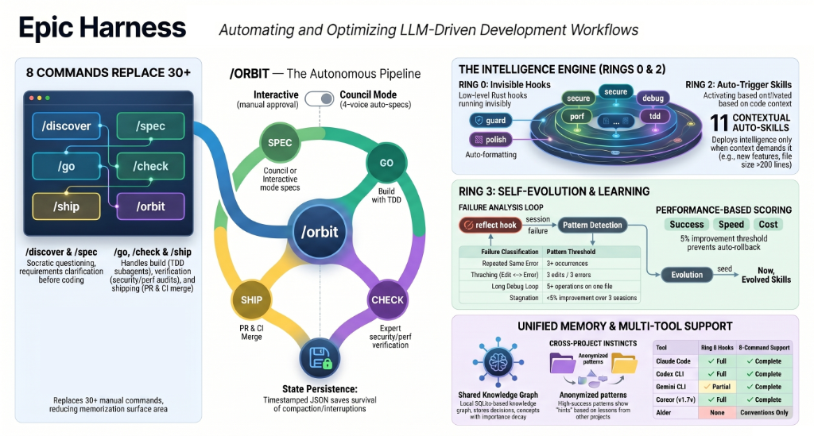
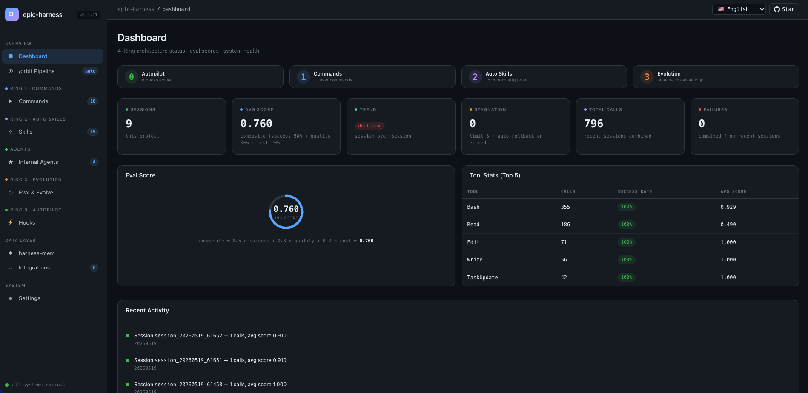
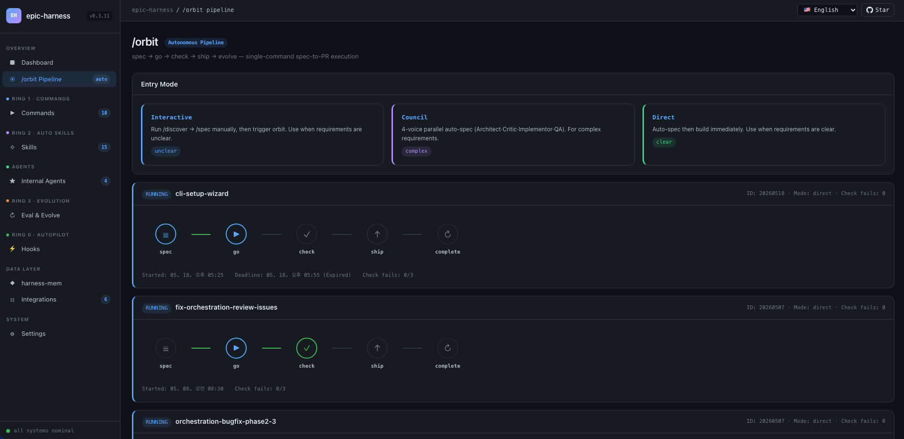
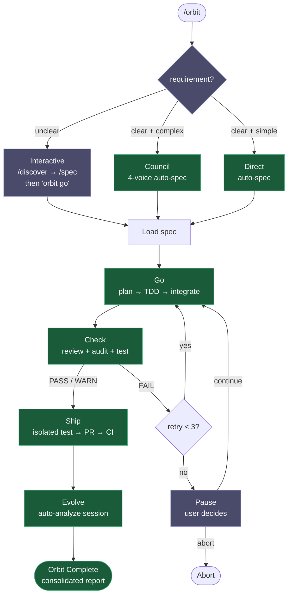
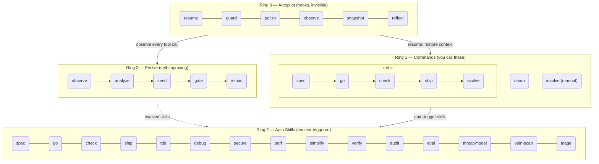

<h1 align="center">Epic Harness</h1>

<blockquote><p align="center">一個自我進化的 AI 程式設計智能體框架 — 3 條命令、26 個技能、1 條自主流水線，從你的失敗中學習。</p></blockquote>

<p align="center"><b>需要記憶的更少。每次按鍵的智慧含量更高。每次會話都變得更聰明。</b></p>

<p align="center">
<a href="../../README.md">English</a> | <a href="../ja/README.md">日本語</a> | <a href="../ko/README.md">한국어</a> | <a href="../de/README.md">Deutsch</a> | <a href="../fr/README.md">Français</a> | <a href="../zh-CN/README.md">简体中文</a> | <a href="../zh-TW/README.md">繁體中文</a> | <a href="../pt-BR/README.md">Português</a> | <a href="../es/README.md">Español</a> | <a href="../hi/README.md">हिन्दी</a>
</p>

<p align="center">
  <a href="https://github.com/epicsagas/epic-harness/stargazers"></a>
  <a href="https://github.com/epicsagas/epic-harness/network/members"></a>
  <a href="https://github.com/epicsagas/epic-harness/issues"></a>
  <a href="https://github.com/epicsagas/epic-harness/commits/main"></a>
</p>
<p align="center">
  <a href="../../LICENSE"></a>
  
  
  
  <a href="https://buymeacoffee.com/epicsaga"></a>
</p>

一個 Claude Code 外掛，將 30+ 條命令整合為 **3 條命令 + 26 個自動觸發技能**，並**從你自己的失敗模式中進化出新技能**。

<p align="center">
  
</p>

---


### Web 控制面板 — 會話啟動時自動開啟

10 螢幕即時指標，涵蓋 eval 評分、工具統計、orbit 流水線、進化技能和掛鉤健康狀態。首次 Claude Code 會話時自動開啟 — 無需手動設定。

<p align="center">
  
  
</p>

```bash
# 首次會話時自動啟動（預設：http://localhost:7700）
# 在 ~/.harness/config.toml 中設定連接埠或停用：
[dashboard]
port = 7700       # 設為 0 以停用自動啟動
auto_open = true  # 首次會話時開啟瀏覽器
```

螢幕：**Dashboard** · /orbit 流水線 · 命令（3） · 技能（26） · 即時智能體 · Eval 與 Evolve · 掛鉤（6） · 整合（6） · harness-mem · 設定

---

## 功能說明

一條命令，就能端到端交付一個功能。技能會在你不知情的情況下自動觸發。每次會話後智能體都會變得更聰明。

```bash
$ /orbit "為登入 API 新增 JWT 驗證"
→ spec approved → go (TDD subagents) → check (PASS) → ship (PR + CI) → evolve
```

也可以直接呼叫管道技能：

```bash
/spec "為登入 API 新增 JWT 驗證"   # 釐清需求 → SPEC-*.md
/go                                # 自動規劃 → TDD 子智能體 → 4 分鐘
/check                             # 平行審查 + 安全 + 測試 → PASS
/ship                              # 隔離測試 → PR → CI 綠燈
```

技能會在背景自動觸發 — 不需要額外命令：

```
正在開發新功能？         → tdd 觸發（強制 Red→Green→Refactor）
測試失敗？               → debug 觸發（先找根因，不做盲修）
修改了 auth 或 DB？      → secure 觸發（OWASP 檢查清單，不走捷徑）
檔案超過 200 行？        → simplify 觸發（抽取、重新命名、簡化）
```

會話結束後，**evolve 迴圈**會分析什麼壞了、生成針對性技能，並在下一次會話載入。今天卡在 TypeScript 建置失敗，下一次就有 `evo-ts-care` 技能幫你起跑。

---

## 安裝

> **第一次使用？** 請閱讀[快速入門指南（5 分鐘）](../../docs/quickstart.md)。

epic-harness 以**外掛**形式分發 — 技能、掛鉤和 `harness-mem` MCP 伺服器直接從外掛佈局（`skills/`、`hooks.json`、`.mcp.json`）載入。沒有 `install` 子命令，各工具直接從磁碟讀取外掛。

### Claude Code（推薦）

```
/plugin marketplace add epicsagas/plugins
/plugin install epic@epicsagas
```

一步自動安裝二進位檔案、技能、掛鉤和 `harness-mem` MCP 伺服器。

### agy（Antigravity CLI）

```bash
agy plugin install .
```

27 個技能、掛鉤和 `harness-mem` MCP 伺服器從外掛的 `plugin.json` + `skills/` + `hooks.json` + `.mcp.json` 自動發現。

### Codex CLI

```bash
codex plugin marketplace add epicsagas/plugins
```

技能和智能體立即可用 — 無需額外步驟。

### 僅二進位（無外掛宿主）

```bash
brew install epicsagas/tap/epic-harness      # macOS / Linux (Homebrew)
cargo binstall epic-harness                  # 預建二進位 (Rust)
cargo install epic-harness                   # 從原始碼建置
```

沒有 Homebrew？使用安裝腳本：

```bash
curl --proto '=https' --tlsv1.2 -LsSf \
  https://github.com/epicsagas/epic-harness/releases/latest/download/install.sh | sh
```

Windows:

```powershell
irm https://github.com/epicsagas/epic-harness/releases/latest/download/install.ps1 | iex
```

二進位檔案在首次掛鉤執行時自動播種 `~/.harness/config.toml` 和 `HARNESS.md` — 無需安裝精靈或 `install` 步驟。

> 執行 `epic-harness --version` 驗證安裝。使用 `brew upgrade epic-harness` 或重新執行安裝腳本進行更新。

前置條件：**Git**。原始碼/二進位安裝還需要 [Rust 工具鏈](https://rustup.rs)。

### 驗證

```bash
epic --version              # 二進位已安裝
ls ~/.harness/              # 資料目錄（首次工作階段自動建立）
```

在 Claude Code 工作階段中：`/evolve status`

> **遙測**：使用量報告預設開啟（opt-out）。使用 `epic-harness telemetry status|on|off` 切換。

---

## 遙測

epic-harness 預設收集**匿名**使用遙測（opt-out），以改進 hook 可靠性和技能進化。事件傳送到 Posthog。

**我們收集：** 命令名稱、持續時間、結果（成功/失敗）、失敗分類、hook 阻止/失敗事件 — 以及 `product`、`product_version`、`os` 和隨機 `install_id`（首次執行時產生的 UUID，儲存在 `~/.config/epic-harness/install-id`）。

**我們絕不收集：** 原始碼、檔案內容、檔案路徑、環境變數、金鑰或任何個人識別資訊。

**控制：**

```bash
epic-harness telemetry status   # 顯示目前同意狀態
epic-harness telemetry off      # 停用（立即停止傳送）
epic-harness telemetry on       # 重新啟用
```

同意儲存在 `~/.config/epic-harness/telemetry-consent`。關閉時不傳送任何遙測。

---

## 命令

| 命令 | 功能 |
|---------|-------------|
| `/orbit` | **完整自主流水線**：spec → go → check → ship → evolve 一次執行 |
| `/team` | 瀏覽組織庫、聘請現有團隊，或設計新團隊（3–6 個智能體，同步到 `.claude/agents/`） |
| `/evolve` | 手動進化觸發 — 分析工作階段、查看儀表板、檢查技能效果、回滾 |

管道階段（`/spec`、`/go`、`/check`、`/ship`、`/discover`）現在是**技能** — 根據上下文自動觸發，也可以按名稱直接呼叫。舊命令名透過別名路由繼續有效。

---

## /orbit — 自主流水線

`/orbit` 將整個流水線包裝為一次自主執行。選擇模式後 — 其餘全程自動，直到 PR 建立。



**紫色** — 人工步驟：模式選擇（不明確 → 互動式）、3 次檢查失敗暫停。
**綠色** — 明確 + 複雜 → 委員會自動生成規格；明確 + 簡單 → 直接建構；兩者皆完全自主。

狀態持久化於 `$HARNESS_DIR/orbit/PIPELINE-{timestamp}.json` — 在上下文壓縮後仍可恢復。

> **注意**：智能體在修改 orbit 本身或僅編輯文件時可能繞過流水線。參見[已知問題（智能體判斷）](#已知問題智能體判斷)。

---

## 自動技能（Ring 2）

技能根據上下文自動觸發。你不需要手動呼叫它們。

| 技能 | 觸發時機 |
|-------|--------------|
| **spec** | 需要定義需求時 — 轉換為編號的 R + AC 文件 |
| **go** | 建構階段 — 自動規劃 → TDD 子代理 → 平行執行 → AC 驗證 |
| **check** | 審查階段 — 平行程式碼審查 + 安全稽核 + 測試，按範圍附加檢查 |
| **ship** | 發佈階段 — 隔離測試 → 包含完整檢查報告的 PR → CI 監控 + 自動修復 |
| **audit** | 完整稽核 — 平行程式碼品質 + 安全 + 測試審查，含語意去重 |
| **eval** | 品質回歸評估，含基線比較 — 正確性、效能、品質 |
| **tdd** | 新功能實作或錯誤修復 |
| **debug** | 測試失敗或執行時期錯誤 |
| **discover** | 模糊的請求、先給出解決方案而無問題描述、無焦點的抱怨 |
| **secure** | 涉及 Auth / DB / API / secrets 的程式碼 |
| **threat-model** | 安全範圍界定 — 信任邊界列舉、威脅行為者、情境 → THREAT_MODEL.md |
| **vuln-scan** | 系統化漏洞掃描 — 注入、驗證、資料暴露、依賴項 → VULN-FINDINGS.json |
| **triage** | 對抗性驗證 — 嚴重性調整、鏈式分析、根因分組 → TRIAGE.json |
| **perf** | 迴圈、查詢、渲染、批次操作 |
| **simplify** | 檔案超過 200 行或圈複雜度過高 |
| **document** | 新增或修改了公開 API 簽名 |
| **verify** | 在完成 `/go` 或 `/ship` 之前 |
| **context** | 上下文視窗使用超過 70% |
| **council** | 模糊的架構或設計決策 |
| **orchestrate** | 多代理編排狀態和即時代理干預 |
| **agent-introspection** | 連續 3 次以上失敗或循環重試模式 |
| **reflect** | 按需觸發：你是否將 AI 作為思考放大器？基於冷證據的自我評估 |
| **commit** | 約定式提交生成 — 從 git diff 自動生成 |

> **Token 預算注意事項：** Claude Code 會將技能描述載入每個會話的上下文中。epic 的 26 個技能在預設的 `skillListingBudgetFraction: 0.01`（1%）內可容納。如果你安裝了額外技能（例如 episteme、alcove、obscura），合計總數可能超過預算並觸發「descriptions dropped」警告。在 `~/.claude/settings.json` 中加入以下設定以修正：
>
> ```json
> "skillListingBudgetFraction": 0.02
> ```
>
> 如果安裝了 20+ 個技能，請使用 `0.03`。

---

## 進化（Ring 3）

框架會監控每次工具呼叫，在 3 個維度上評分，偵測失敗模式，並生成針對性技能 — 在工作階段結束時自動完成。

### 評分

```
composite = 0.5 × tool_success + 0.3 × output_quality + 0.2 × execution_cost
```

失敗分類（9 種）：`type_error` · `syntax_error` · `test_fail` · `lint_fail` · `build_fail` · `permission_denied` · `timeout` · `not_found` · `runtime_error`

### 模式偵測

| 模式 | 偵測內容 | 預設閾值 |
|---------|---------|-------------------|
| `repeated_same_error` | 相同錯誤出現 N+ 次 | 3 |
| `fix_then_break` | 編輯成功 → 建置/測試失敗 | 回溯 3 步，2 個週期 |
| `long_debug_loop` | 卡在同一檔案 | 5 次操作 |
| `thrashing` | Edit↔Error 交替出現 | 3 次編輯，3 次錯誤 |

### 進化流程

```
Observe (PostToolUse — 3-axis scoring)
    ↓ obs/session_{id}.jsonl
Analyze (SessionEnd)
    ↓ per-tool, per-ext scores + patterns
Propose (Solver — graduated by score: ≥0.90 skip, ≥0.70 moderate, <0.70 full)
    ↓ SkillProposal[] with confidence
Curate (Accept/Merge/Skip, feedback masked from solver)
    ↓ evolved/{skill}/SKILL.md + meta.json
Gate (format check, dedup, cap 10, gated promotion ≥ 3 sessions)
    ↓ evolved_backup/ (best checkpoint)
Instinct (high-success patterns → cross-project memory.db nodes)
    ↓
Reload (next session — resume loads evolved skills)
```

技能播種：弱工具（成功率 <60%，最少 5 次觀測）、弱檔案類型（成功率 <50%，最少 3 次觀測）、高頻錯誤（5+ 次出現）。

停滯處理：連續 3 個工作階段無 5% 改善 → 自動回滾到最佳檢查點。

### SkillOpt 啟發的最佳化

三種受深度學習啟發的技術，改編自 [SkillOpt](https://arxiv.org/abs/2605.23904)：

| 技術 | 運作方式 |
|-----------|-------------|
| **負反饋緩衝區** | 被拒絕的提案以 TTL 為基礎的過期機制儲存；未來的提案在生成前會先對照緩衝區檢查 |
| **小批次反思** | 觀測資料分解為固定大小的批次以進行結構化模式提取；當主要錯誤 ≥60% + ≥2 個不同檔案時可重複使用 |
| **慢速/元更新** | 對最近 5 個工作階段進行線性迴歸，將 epoch 分類為 Improving / Regressing / PersistentFailure / StableSuccess；自動淘汰表現不佳的技能 |

### 提示詞自動調校

表現不佳的進化技能會收到針對性的調校指引，附加在 `<!-- auto-tuned -->` 分隔符之後。原始內容永不修改。連續 3 個下降的工作階段 → 自動回滾調校，歷史記錄清除。

### 技能有效性

每個進化技能都透過 A/B 歸因追蹤：

```
/evolve history → Skill Effectiveness

| Skill              | With | Without | Delta |
|--------------------|------|---------|-------|
| evo-ts-care        | 0.87 | 0.72    | +15%  |
| evo-bash-discipline| 0.65 | 0.68    | -3%   |
```

正增量 = 有效。負增量 = 考慮透過 `/evolve rollback` 移除。

### 冷啟動預設

首次工作階段時，會根據偵測到的技術堆疊自動套用適合的預設技能：

| 技術堆疊 | 預設 |
|-------|---------|
| Node.js/TypeScript | `evo-ts-care`、`evo-fix-build-fail` |
| Go | `evo-go-care` |
| Python | `evo-py-care` |
| Rust | `evo-rs-care` |

### 直覺學習

高成功率模式被提取並在專案間推廣：

```
observe (100% confirmed) → extract_instincts() → instinct node (confidence ≥ 0.8)
    → promote to global when observed in ≥ 2 projects
```

```bash
/evolve              # 立即執行
/evolve status       # 儀表板：評分、趨勢、模式、技能
/evolve history      # 完整歷史 + 技能效果
/evolve cross-project # 跨專案模式分析
/evolve rollback     # 恢復上一個最佳版本
/evolve reset        # 清除所有進化資料
```

---

## 安全流水線

三階段漏洞評估流水線，移植自 [defending-code](https://github.com/anthropics/defending-code-reference-harness)：

```bash
/threat-model    # 1. 信任邊界、威脅行為者、情境 → THREAT_MODEL.md
/vuln-scan       # 2. 4 維度掃描器（注入、驗證、資料暴露、依賴項） → VULN-FINDINGS.json
/triage          # 3. 對抗性驗證、嚴重性調整、鏈式分析 → TRIAGE.json
```

### 稽核 `--strict` 模式

用於安全評估專案，`--strict` 模式強制各稽核模式之間的獨立性：
- 程式碼、安全和測試審查者僅收到 diff + spec — 不含建構者上下文
- 交叉檢查獨立性：各模式在綜合之前各自獨立執行
- 盲評分防止錨定偏差

可選的評估專案上下文，透過專案根目錄的 `.harness/engagement.md` 提供（授權、範圍、限制、排除）。參見 `docs/references/engagement.md` 取得範本。

---

## 掛鉤（Ring 0）

在每個工作階段中無感執行。單一 Rust 二進位檔案（`epic-harness`），含多個子命令。

| 掛鉤 | 時機 | 功能 |
|------|------|------|
| **resume** | 工作階段啟動 | 恢復上下文、載入記憶、偵測技術堆疊 |
| **guard** | Bash 執行前 | 阻止強制推送到 main、`rm -rf /`、DROP 生產庫 |
| **polish** | Edit 執行後 | 自動格式化（Biome/Prettier/ruff/gofmt）+ 型別檢查 |
| **observe** | 每次工具呼叫 | 記錄到 `~/.harness/projects/{slug}/obs/`，用於進化 |
| **snapshot** | 壓縮前 | 將狀態儲存到 `~/.harness/projects/{slug}/sessions/` |
| **reflect** | 工作階段結束 | 分析失敗、播種進化技能、門控、提取直覺 |

Polish 回饋至 observe：格式化失敗 → `lint_fail`，TypeScript 錯誤 → `build_fail`。即使錯誤來自 polish，Edit→Error 抖振也會被偵測到。

每個工作階段寫入各自的 `session_{date}_{pid}_{random}.jsonl` — 多個並行工作階段不會互相損壞資料。

### 掛鉤設定檔

透過 `~/.harness/config.toml` 或 `EPIC_HOOK_PROFILE` 環境變數設定：

| 設定檔 | 啟用的掛鉤 |
|---------|-------------|
| `minimal` | guard、observe、resume |
| `standard`（預設） | 以上 + polish、reflect、snapshot |
| `strict` | 所有掛鉤 + 未來的 strict-only 檢查 |

### 自訂守衛規則

在專案根目錄的 `.harness/guard-rules.yaml` 中新增專案專屬規則：

```yaml
blocked:
  - pattern: kubectl\s+delete\s+namespace | msg: Namespace deletion blocked
warned:
  - pattern: docker\s+system\s+prune | msg: Docker prune — verify first
```

---

## 團隊（`epic team`）

團隊是**組織級別**的，不綁定到特定專案。在任意專案中執行 `/team` 都會豐富共享的智能體定義池 — 不會靜默覆寫。

```bash
epic team                              # 互動式：掃描 → 設計 → 寫入 → 同步
epic team sync backend                 # 調度智能體 → .claude/agents/backend/
epic team link backend                 # 調度 + 在團隊設定中註冊專案
epic team list                         # 目前組織的所有團隊
epic team list --org netflix           # 指定組織的團隊
epic team show backend --playbook      # 設定 + 完整 playbook
epic team delete backend               # 僅從目前專案撤銷
epic team delete backend --global      # 從組織儲存中永久刪除
```

同步後，下次工作階段中即可使用智能體：`@domain-expert`、`@reviewer`、`@tester` 等。

| 類型 | 關鍵字 | 預設智能體 |
|------|---------|---------------|
| Stream-aligned | `stream` | domain-expert、reviewer、tester |
| Platform | `platform` | api-designer、infra-specialist、dx-agent |
| Enabling | `enabling` | specialist |
| Complicated Subsystem | `subsystem` | domain-specialist、integration-tester |

多組織支援：`epic team --org netflix` — 每個組織有獨立的拓撲結構。

合併策略：變更的智能體會提示確認（預設：保留現有，備份到 `.history/`）。Playbook 始終附加。

---

## 多工具支援

所有工具共享同一個 `~/.harness/projects/{slug}/` 資料目錄。

| 工具 | Ring 0 掛鉤 | 命令 | 技能 | 智能體 |
|------|-------------|----------|--------|--------|
| **Claude Code** | ✓ 完整 | ✓ 3 條命令（含 /orbit） | ✓ 26 個技能 | Live |
| **Codex CLI** | ✓ 完整¹ | ✓ 3 條提示詞（含 /orbit） | ✓ 26 | — |
| **Antigravity** | ✓ 部分² | ✓ 3 條命令（含 /orbit） | ✓ 26 | — |
| **Cursor** | ✓ 完整³ | ✓ 3 條命令（含 /orbit） | ✓ 透過 rules | Live |
| **OpenCode** | ✓ 部分⁴ | ✓ 3 條命令（含 /orbit） | — | — |
| **Cline** | ✓ 完整⁵ | — | — | — |
| **Aider** | —⁶ | — | — | — |

¹ `codex_hooks = true` 在 `~/.codex/config.toml` · ² 外掛安裝；子代理支援尚不可用 · ³ Cursor 1.7+ · ⁴ JS 外掛 · ⁵ 5 個掛鉤腳本 · ⁶ 僅約定

---

## 架構：4-Ring 模型



---

## 跨專案學習

選擇加入以在專案間共享失敗模式：

```bash
touch ~/.harness/projects/{slug}/.cross-project-enabled
```

工作階段結束 → 將匿名化模式匯出到 `~/.harness/global_patterns.jsonl`。工作階段開始 → 顯示來自其他專案薄弱領域的提示。

---

## 統一記憶

所有智能體共享儲存於 `~/.harness/memory.db` 的知識圖譜（SQLite，含全文搜尋）。無需外部執行時期。

```
score = recency(25%) + importance(35%) + access_frequency(15%) + FTS_match(25%)
```

### CLI

```bash
epic mem recall "auth refactor" --project my-project   # 智慧檢索
epic mem add --title "JWT rotation" --type decision    # 新增節點
epic mem search "JWT"                                  # FTS5 搜尋
epic mem list --type decision --project my-project    # 過濾
epic mem context --project my-project                  # 專案上下文
epic mem serve                                         # Web UI → :7700 或使用 --port 8800 自訂連接埠
epic mem mcp-install                                   # 註冊 MCP 伺服器
epic mem export --out ./docs/memory                    # 匯出為 Markdown
```

### MCP 工具（6 個）

| 工具 | 用途 |
|------|---------|
| `mem_recall` | 基於提示 + 專案 + 圖鄰居的智慧上下文檢索 |
| `mem_add` | 按類型自動設定重要性新增節點（或顯式 0.0–1.0） |
| `mem_search` | 關鍵字搜尋（全文），按重要性排序 |
| `mem_query` | 按標籤/類型/專案過濾 |
| `mem_context` | 專案範圍的智慧檢索（無提示） |
| `mem_related` | 從節點 ID 進行圖遍歷（發現關聯知識） |

### 節點類型

| 類型 | 建立方式 | 重要性 |
|------|-----------|------------|
| `decision` | 手動 / MCP | 0.9 |
| `resolution` | 手動 / MCP | 0.8 |
| `concept` | 手動 / MCP | 0.7 |
| `project` | 手動 / MCP | 0.7 |
| `instinct` | 自動（reflect） | 0.7 |
| `pattern` | 自動（reflect） | 0.5 |
| `error` | 自動（reflect） | 0.4 |
| `session` | 自動（reflect） | 0.2 |

生命週期：超過 30 天未存取 → 重要性衰減 10%（下限 0.05）。超過 180 天 → 標記為 `stale`，從檢索中排除。`pinned` 標籤可防止衰減。

---

<details>
<summary><strong>專案資料 — 目錄結構</strong></summary>

## 專案資料

所有資料儲存於 `~/.harness/`（家目錄），而非你的專案根目錄。專案刪除後資料仍然存在，不會污染 git 歷史。

```
~/.harness/
├── memory.db                  # SQLite 知識圖譜（節點 + 邊 + FTS5）
├── graph.json                 # 快取的圖（用於 Web UI）
├── config.toml                # 使用者設定
├── global_patterns.jsonl      # 跨專案模式（選擇加入）
├── orgs/                      # 團隊全域儲存
│   └── {org}/teams/{team}/
│       ├── config.json, mission.md, playbook.md, agents/, .history/
└── projects/{slug}/
    ├── memory/                # 專案模式和規則
    ├── sessions/              # 工作階段快照（用於恢復）
    ├── obs/                   # 工具使用觀測日誌（JSONL）
    ├── evolved/               # 自動進化的技能
    │   ├── manifest.json
    │   └── {skill}/SKILL.md + meta.json
    ├── evolved_backup/        # 最佳檢查點（用於回滾）
    ├── dispatch/              # 技能調度日誌
    ├── evolution.jsonl        # 完整進化歷史
    └── metrics.json           # 彙總統計 + 技能歸因
```

將安全規則與團隊共享：在專案根目錄放置 `.harness/guard-rules.yaml`（提交到 git）。

</details>

---

<details>
<summary><strong>設定 — config.toml 參考</strong></summary>

## 設定

所有可調整參數均在 `~/.harness/config.toml` 中。缺省 = 硬式編碼預設值。

```toml
# 優先順序：環境變數（EPIC_HOOK_PROFILE）> 本檔案 > 預設值

[hook]
profile = "standard"         # "minimal" | "standard" | "strict"
gateguard_hints = true

[scoring]
weights = [0.5, 0.3, 0.2]   # [success, quality, cost]

[evolution]
max_skills = 10
stagnation_limit = 3
improvement_threshold = 0.05
gated_promotion_min = 3

[pattern]
# repeated_error_min = 3
# debug_loop_min = 5
# graduated_scope_skip = 0.90
# graduated_scope_moderate = 0.70

[instinct]
# confidence_threshold = 0.8
# promotion_min_projects = 2
# max_instincts = 20
# min_observations = 10
# min_avg_score = 0.5
```

</details>

---

## 已知問題（智能體判斷）

這些問題源於智能體對上下文的解釋，而非程式碼缺陷。列出這些是讓使用者知道需要注意什麼。

### 已發現問題

| 問題 | 觸發條件 | 現象 | 解決方法 |
|------|---------|------|---------|
| **Orbit 自我修改繞過** | 請求 `/orbit` 改進 orbit 自身 | 智能體可能跳過整個 orbit 流水線，直接在 main 分支上臨時編輯檔案，沒有 spec/PR/可追溯性，變更處於未提交狀態 | orbit 完成後檢查 `git status`。如果 main 上有變更但沒有流水線狀態，手動提交或從單獨的分支重新執行 `/orbit` |
| **純文件任務跳過協議** | 向 `/orbit` 提供僅 Markdown 的變更（無測試程式碼） | 智能體可能判斷 TDD/測試階段無意義而跳過整個流水線 | 純文件變更可接受。混合程式碼 + 文件時，確保程式碼相關階段未被跳過 |
| **模式誤判** | 請求處於 Direct 和 Council 的邊界 | 智能體可能選擇 Direct 而 Council（4 方審查）會發現更多邊界情況，或反之 | 如果智能體的模式選擇看起來不合適，明確指定「使用 Council 模式」或「使用 Direct 模式」 |

### 刻意保留的設計選擇

以下選擇曾考慮增強，但經評估後維持現狀：

| 選擇 | 未增強的原因 | 依據 |
|------|------------|------|
| **僅在 Go 階段進入工作樹** | 可以從 preflight 開始隔離 | Preflight/mode/spec 是唯讀的。更早隔離增加複雜度但無收益 — 分支本身在 Go 階段才建立 |
| **Ship 後保留工作樹** | 可以在 PR 合併後自動刪除 | 分支是 PR 的 head 引用。合併前刪除會損壞 PR。清理留給使用者在合併後處理 |
| **分支名使用 `orbit-{slug}` 而非 `feature/{slug}`** | 可以匹配常規分支命名 | `EnterWorktree` 不允許名稱中包含 `/`。建立後重新命名僅增加步驟，只有外觀上的收益 |
| **純文件變更無輕量流程路徑** | 可以偵測 doc-only 並跳過 TDD/測試 | 偵測不可靠（什麼算「文件」？）。協議複雜度增加的代價大於邊際收益 |

---

## 疑難排解

<details>
<summary>安裝後出現 command not found: epic</summary>

將 Cargo bin 目錄加入你的 PATH：

```bash
export PATH="$HOME/.cargo/bin:$PATH"
```

將此行加入你的 `~/.zshrc` 或 `~/.bashrc` 使其永久生效。
</details>

<details>
<summary>掛鉤在 Claude Code 中未觸發</summary>

重新安裝外掛以重新載入掛鉤：

```
/plugin install epic@epicsagas
```

然後重新啟動 Claude Code。掛鉤從外掛的 `hooks.json` 載入。
</details>

<details>
<summary>macOS 上出現 Permission denied（Gatekeeper）</summary>

macOS 可能會封鎖從網路下載的未簽名二進位：

```bash
xattr -d com.apple.quarantine ~/.cargo/bin/epic-harness
xattr -d com.apple.quarantine ~/.cargo/bin/epic
```
</details>

<details>
<summary>epic：外掛掛鉤內找不到二進位</summary>

外掛會先在 `hooks/bin/epic-harness` 尋找二進位。透過 `cargo install` 更新後，請複製它：

```bash
cp ~/.cargo/bin/epic-harness hooks/bin/epic-harness
```
</details>

---

## 開發

```bash
cargo install --path .                                        # 建置 + 安裝
cp ~/.cargo/bin/epic-harness hooks/bin/epic-harness           # 更新外掛二進位
cargo test                                                    # 測試
```

掛鉤在兩處尋找二進位：`hooks/bin/epic-harness`（外掛本地）→ `~/.cargo/bin/epic-harness`（PATH）。

---

## 連結

- [更新日誌](../../CHANGELOG.md) — 發佈歷史
- [貢獻指南](../../CONTRIBUTING.md) — 如何貢獻
- [安全政策](../../SECURITY.md) — 回報漏洞
- [Issues](https://github.com/epicsagas/epic-harness/issues) — 錯誤回報和功能請求

## 致謝

- [a-evolve](https://github.com/A-EVO-Lab/a-evolve) — 自動化進化與基準測試模式
- [agent-skills](https://github.com/addyosmani/agent-skills) — Claude Code 智能體技能系統
- [everything-claude-code](https://github.com/affaan-m/everything-claude-code) — 全面的 Claude Code 模式
- [gstack](https://github.com/garrytan/gstack) — 外掛架構參考
- [harness](https://github.com/revfactory/harness) — 掛鉤與框架基礎設施模式
- [serena](https://github.com/oraios/serena) — 自主智能體設計
- [SuperClaude Framework](https://github.com/SuperClaude-Org/SuperClaude_Framework) — 多命令框架架構
- [superpowers](https://github.com/obra/superpowers) — Claude Code 擴充模式

## 授權條款

[Apache 2.0](../../LICENSE)
