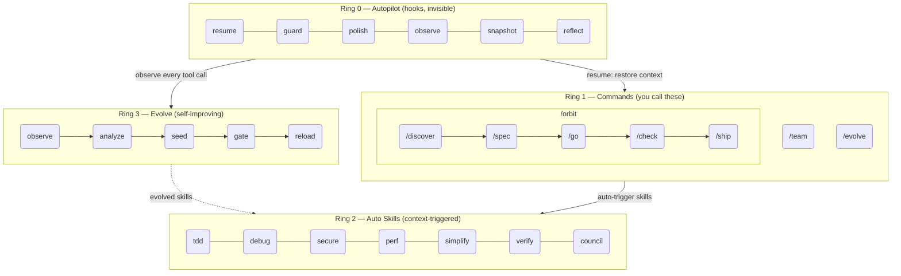
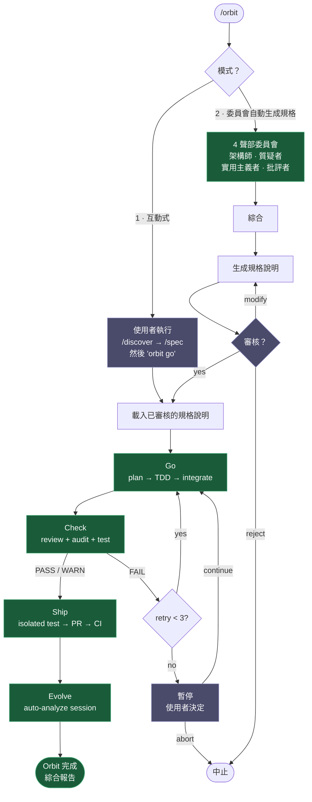

# epic harness

> 一個自我進化的 AI 程式設計智能體框架 — 8 條命令、1 條自主流水線、自動觸發技能，從你的失敗中學習。

**8 條命令。自動觸發技能。自我進化。**

<p align="center">
<a href="../../README.md">English</a> | <a href="../ja/README.md">日本語</a> | <a href="../ko/README.md">한국어</a> | <a href="../de/README.md">Deutsch</a> | <a href="../fr/README.md">Français</a> | <a href="../zh-CN/README.md">简体中文</a> | <a href="../zh-TW/README.md">繁體中文</a> | <a href="../pt-BR/README.md">Português</a> | <a href="../es/README.md">Español</a> | <a href="../hi/README.md">हिन्दी</a>
</p>

<p align="center">
  <a href="LICENSE"></a>
  
  
  
  <a href="https://buymeacoffee.com/epicsaga"></a>
</p>

一個 Claude Code 外掛，**用 8 條命令取代 30+ 條命令**，**根據你正在做的事情自動觸發技能**，並**從你自己的失敗模式中進化出新技能**。需要記憶的操作面更小，每次按鍵的智慧含量更高。

<p align="center">
  
</p>

## 安裝

> **第一次使用？** 請閱讀 [快速入門指南（5 分鐘）](../../QUICKSTART.md)。

```bash
# Claude Code
/plugin marketplace add epicsagas/plugins && /plugin install epic@epicsagas

# 任何其他工具
cargo install epic-harness && epic install
```

| 環境 | 方式 |
|-------------|--------|
| **Claude Code** | 外掛市集（見上方） |
| **macOS** | `brew install epicsagas/tap/epic-harness` |
| **任意（含 Rust）** | `cargo install epic-harness` |
| **從原始碼** | `git clone` + `cargo install --path .` |

前置條件：**Git**。原始碼/二進位安裝還需要 [Rust 工具鏈](https://rustup.rs)。

### `epic install` — 安裝精靈

安裝二進位檔案後，執行 `epic install`（或 `epic install claude`）以：

1. 建立 `~/.harness/` 目錄結構
2. 將命令、技能和智能體同步到工具的設定目錄
3. 為 Claude Code 註冊 MCP 伺服器（harness-mem）
4. 若不存在，則建立含預設值的 `~/.harness/config.toml`

在 Claude Code 中，`hooks/setup.sh` 在工作階段啟動時自動執行，並在二進位檔案缺失時自動安裝。初次複製後無需手動操作。

### 其他工具

```bash
epic install codex        # Codex CLI   → ~/.codex/ + ~/.agents/skills/
epic install gemini       # Gemini CLI  → ~/.gemini/
epic install cursor       # Cursor      → ~/.cursor/ (需要 Cursor 1.7+)
epic install opencode     # OpenCode    → ~/.config/opencode/
epic install cline        # Cline       → ~/Documents/Cline/Rules/
epic install aider        # Aider       → ~/.aider.conf.yml + ~/.aider/
epic install              # 互動式選單
```

整合檔案從二進位**同步**而來：缺失或過時的檔案會被寫入。`GEMINI.md` 和 `AGENTS.md` 僅在不存在時才會建立。

### 驗證

```bash
epic --version              # 二進位已安裝
ls ~/.harness/              # 資料目錄存在
```

在 Claude Code 工作階段中：`/evolve status`

### 快速示範

**一條命令，完整流水線：**
```bash
$ /orbit
# 選擇模式：
#   1. 互動式  — 你執行 /discover + /spec，然後輸入 "orbit go"
#   2. 委員會  — 4 聲部委員會生成規格說明，由你審核
→ spec approved → go (TDD) → check (PASS) → ship (PR + CI) → evolve
```

**或逐步手動執行：**
```bash
$ /spec "Add JWT auth to the login API"
  → 釐清需求 → 生成 SPEC-*.md

$ /go
  → 自動規劃 → TDD 子智能體 → 完成（4 分鐘）

$ /check
  → 平行程式碼審查 + 安全審計 + 測試 → PASS

$ /ship
  → 建立 PR → CI 通過 → 合併
```

## 架構：4-Ring 模型



## /orbit — 自主流水線

`/orbit` 將整個手動流水線包裝成一次自主執行。



**紫色節點** — 人工檢查點：模式選擇、規格審核、3 次檢查失敗暫停。
**綠色節點** — 自主執行：go、check、ship、evolve 無需使用者介入。

狀態持久化於 `$HARNESS_DIR/orbit/PIPELINE-{timestamp}.json` — 在上下文壓縮後仍可恢復。

## 命令

| 命令 | 功能 |
|---------|-------------|
| `/discover` | 在指定解決方案前探索並定義問題 — 五問法、JTBD、蘇格拉底式提問 |
| `/spec` | 定義要建構的內容 — 釐清需求，生成規格說明 |
| `/go` | 建構 — 自動規劃、TDD 子智能體、4 狀態結果模型（DONE/CONCERNS/NEEDS_CONTEXT/BLOCKED）、使用工作樹隔離的平行執行 |
| `/check` | 驗證 — 自適應專家調度（基於範圍）、平行程式碼審查 + 安全審計 + 效能分析 |
| `/ship` | 發佈 — 隔離預飛行測試，然後 PR、CI、合併 |
| `/team` | 跨專案建立並同步組織級智能體團隊 |
| `/evolve` | 手動觸發進化 / 查看狀態 / 回滾 |
| `/orbit` | **自主流水線** — 一鍵執行 spec → go → check → ship。可選互動式或委員會模式。 |

---

## 自動技能（Ring 2）

技能自動觸發，無需手動呼叫。

| 技能 | 觸發時機 |
|-------|--------------|
| **tdd** | 新功能實作 |
| **debug** | 測試失敗或出現錯誤 |
| **discover** | 請求模糊、先給出解決方案而無問題描述，或無焦點的抱怨 |
| **secure** | 涉及 Auth/DB/API/secrets 的程式碼 |
| **perf** | 迴圈、查詢、渲染程式碼 |
| **simplify** | 檔案超過 200 行或複雜度過高 |
| **document** | 新增或修改了公開 API |
| **verify** | 在完成 /go 或 /ship 之前 |
| **context** | 上下文視窗使用超過 70% |
| **council** | 模糊的架構或設計決策 |
| **agent-introspection** | 智能體在反覆失敗後進行自我除錯 |

## 掛鉤（Ring 0）

無感執行。單一 Rust 二進位檔案（`epic-harness`），含多個子命令。

| 掛鉤 | 時機 | 功能 |
|------|------|------|
| **resume** | 工作階段啟動 | 恢復上下文、載入記憶體、偵測技術堆疊 |
| **guard** | Bash 執行前 | 阻止強制推送到 main、rm -rf /、DROP 生產庫 |
| **polish** | Edit 執行後 | 自動格式化（Biome/Prettier/ruff/gofmt）+ 型別檢查 |
| **observe** | 每次工具呼叫 | 記錄到 `~/.harness/projects/{slug}/obs/`，用於進化 + GateGuard 提示 |
| **snapshot** | 壓縮前 | 將狀態儲存到 `~/.harness/projects/{slug}/sessions/` |
| **reflect** | 工作階段結束 | 分析失敗、播種進化技能、門控、提取直覺 |

Polish 回饋至 observe：格式化失敗 → `lint_fail`，TypeScript 錯誤 → `build_fail`。即使錯誤來自 polish，Edit→Error 抖振也會被偵測到。

每個工作階段寫入各自的 `session_{date}_{pid}_{random}.jsonl` — 同一專案上的多個工作階段不會互相污染資料。

### 掛鉤設定檔

透過 `~/.harness/config.toml` 或 `EPIC_HOOK_PROFILE` 環境變數設定：

| 設定檔 | 啟用的掛鉤 |
|---------|-------------|
| `minimal` | guard、observe、resume |
| `standard`（預設） | 以上 + polish、reflect、snapshot |
| `strict` | 所有掛鉤 + 未來的 strict-only 檢查 |

### 自訂守衛規則

在專案根目錄的 `.harness/guard-rules.yaml` 中新增專案專屬規則：

```yaml
blocked:
  - pattern: kubectl\s+delete\s+namespace | msg: Namespace deletion blocked
warned:
  - pattern: docker\s+system\s+prune | msg: Docker prune — verify first
```

## 團隊（`epic team`）

團隊是**組織級別**的，不綁定到特定專案。在任意專案中執行 `/team` 都會豐富共享的智能體定義池 — 不會靜默覆寫。

```bash
epic team                              # 互動式：掃描 → 設計 → 寫入 → 同步
epic team sync backend                 # 調度智能體 → .claude/agents/backend/
epic team link backend                 # 調度 + 在團隊設定中註冊專案
epic team list                         # 目前組織的所有團隊
epic team list --org netflix           # 指定組織的團隊
epic team show backend --playbook      # 設定 + 完整 playbook
epic team delete backend               # 僅從目前專案撤銷
epic team delete backend --global      # 從組織儲存中永久刪除
```

同步後，下次工作階段中即可使用智能體：`@domain-expert`、`@reviewer`、`@tester` 等。

| 類型 | 關鍵字 | 預設智能體 |
|------|---------|---------------|
| Stream-aligned | `stream` | domain-expert、reviewer、tester |
| Platform | `platform` | api-designer、infra-specialist、dx-agent |
| Enabling | `enabling` | specialist |
| Complicated Subsystem | `subsystem` | domain-specialist、integration-tester |

多組織支援：`epic team --org netflix` — 每個組織有獨立的拓撲結構。

合併策略：變更的智能體會提示確認（預設：保留現有，備份到 `.history/`）。Playbook 始終附加。

## 多工具支援

所有工具共享同一個 `~/.harness/projects/{slug}/` 資料目錄。

| 工具 | Ring 0 掛鉤 | 命令 | 技能 | 智能體 |
|------|-------------|----------|--------|--------|
| **Claude Code** | ✓ 完整 | ✓ 8 條命令（含 /orbit） | ✓ 11 個技能 | ✓ 4 |
| **Codex CLI** | ✓ 完整¹ | ✓ 8 條提示詞（含 /orbit） | ✓ 7 | ✓ 4 |
| **Gemini CLI** | ✓ 部分² | ✓ 8 條命令（含 /orbit） | ✓ 7 | ✓ 4 |
| **Cursor** | ✓ 完整³ | ✓ 8 條命令（含 /orbit） | ✓ 透過規則 | ✓ 4 |
| **OpenCode** | ✓ 部分⁴ | ✓ 8 條命令（含 /orbit） | — | ✓ 4 |
| **Cline** | ✓ 完整⁵ | — | — | — |
| **Aider** | —⁶ | — | — | — |

¹ `codex_hooks = true` 在 `~/.codex/config.toml` · ② 守衛在 `BeforeModel` 級別 · ③ Cursor 1.7+ · ④ JS 外掛 · ⑤ 5 個掛鉤腳本 · ⑥ 僅約定

## 統一記憶體 — 開發中

> **狀態：開發中。** 尚未完全可用。CLI 命令、MCP 工具和 Web UI 仍在開發中。

所有智能體共享儲存於 `~/.harness/memory.db` 的知識圖譜（SQLite，含全文搜尋）。無需外部執行時期。

```
score = recency(25%) + importance(35%) + access_frequency(15%) + FTS_match(25%)
```

### CLI

```bash
epic mem recall "auth refactor" --project my-project   # 智慧檢索
epic mem add --title "JWT rotation" --type decision    # 新增節點
epic mem search "JWT"                                  # FTS5 搜尋
epic mem query --type decision --project my-project    # 過濾
epic mem context --project my-project                  # 專案上下文
epic mem serve                                         # Web UI → :7700
epic mem mcp-install                                   # 註冊 MCP 伺服器
epic mem export --out ./docs/memory                    # 匯出為 Markdown
```

### MCP 工具（6 個）

| 工具 | 用途 |
|------|---------|
| `mem_recall` | 基於提示 + 專案 + 圖鄰居的智慧上下文檢索 |
| `mem_add` | 按類型自動設定重要性新增節點（或顯式 0.0–1.0） |
| `mem_search` | 關鍵字搜尋（全文），按重要性排序 |
| `mem_query` | 按標籤/類型/專案過濾 |
| `mem_context` | 專案範圍的智慧檢索（無提示） |
| `mem_related` | 從節點 ID 進行圖遍歷（發現關聯知識） |

### 節點類型

| 類型 | 建立方式 | 重要性 |
|------|-----------|------------|
| `decision` | 手動 / MCP | 0.9 |
| `resolution` | 手動 / MCP | 0.8 |
| `concept` | 手動 / MCP | 0.7 |
| `project` | 手動 / MCP | 0.7 |
| `instinct` | 自動（reflect） | 0.7 |
| `pattern` | 自動（reflect） | 0.5 |
| `error` | 自動（reflect） | 0.4 |
| `session` | 自動（reflect） | 0.2 |

生命週期：超過 30 天未存取 → 重要性衰減 10%（下限 0.05）。超過 180 天 → 標記為 `stale`，從檢索中排除。`pinned` 標籤可防止衰減。

## 進化（Ring 3）

將 [A-Evolve](https://github.com/A-EVO-Lab/a-evolve) 自動化進化模式融入 Claude Code 的掛鉤系統。

### 評分

每次工具呼叫在 3 個維度上評分（權重可透過 `~/.harness/config.toml` 設定）：

```
composite = 0.5 × tool_success + 0.3 × output_quality + 0.2 × execution_cost
```

失敗分類（9 種）：`type_error` · `syntax_error` · `test_fail` · `lint_fail` · `build_fail` · `permission_denied` · `timeout` · `not_found` · `runtime_error`

### 模式偵測

| 模式 | 偵測內容 | 預設閾值 |
|---------|---------|-------------------|
| `repeated_same_error` | 相同錯誤出現 N+ 次 | 3 |
| `fix_then_break` | 編輯成功 → 建置/測試失敗 | 回溯 3 步，2 個週期 |
| `long_debug_loop` | 卡在同一檔案 | 5 次操作 |
| `thrashing` | Edit↔Error 交替出現 | 3 次編輯，3 次錯誤 |

### 進化流程

```
Observe (PostToolUse — 3-axis scoring)
    ↓ obs/session_{id}.jsonl
Analyze (SessionEnd)
    ↓ per-tool, per-ext scores + patterns
Propose (Solver — graduated by score: ≥0.90 skip, ≥0.70 moderate, <0.70 full)
    ↓ SkillProposal[] with confidence
Curate (Accept/Merge/Skip, feedback masked from solver)
    ↓ evolved/{skill}/SKILL.md + meta.json
Gate (format check, dedup, cap 10, gated promotion ≥ 3 sessions)
    ↓ evolved_backup/ (best checkpoint)
Instinct (high-success patterns → cross-project memory.db nodes)
    ↓
Reload (next session — resume loads evolved skills)
```

技能播種：弱工具（成功率 <60%，最少 5 次觀測）、弱檔案類型（成功率 <50%，最少 3 次觀測）、高頻錯誤（5+ 次出現）。

停滯處理：連續 3 個工作階段無 5% 改善 → 自動回滾到最佳檢查點。

```bash
/evolve              # 立即執行
/evolve status       # 儀表板：評分、趨勢、模式、技能
/evolve history      # 完整歷史 + 技能效果
/evolve cross-project # 跨專案模式分析
/evolve rollback     # 恢復上一個最佳版本
/evolve reset        # 清除所有進化資料
```

### 技能有效性

每個進化技能都透過 A/B 歸因追蹤：

```
/evolve history → Skill Effectiveness

| Skill              | With | Without | Delta |
|--------------------|------|---------|-------|
| evo-ts-care        | 0.87 | 0.72    | +15%  |
| evo-bash-discipline| 0.65 | 0.68    | -3%   |
```

正增量 = 有效。負增量 = 考慮透過 `/evolve rollback` 移除。

### 冷啟動預設

首次工作階段時，會根據偵測到的技術堆疊自動套用適合的預設技能：

| 技術堆疊 | 預設 |
|-------|---------|
| Node.js/TypeScript | `evo-ts-care`、`evo-fix-build-fail` |
| Go | `evo-go-care` |
| Python | `evo-py-care` |
| Rust | `evo-rs-care` |

### 直覺學習

高成功率模式被提取並在專案間推廣：

```
observe (100% confirmed) → extract_instincts() → instinct node (confidence ≥ 0.8)
    → promote to global when observed in ≥ 2 projects
```

## 跨專案學習

選擇加入以在專案間共享失敗模式：

```bash
touch ~/.harness/projects/{slug}/.cross-project-enabled
```

工作階段結束 → 將匿名化模式匯出到 `~/.harness/global_patterns.jsonl`。工作階段開始 → 顯示來自其他專案薄弱領域的提示。

## 專案資料

所有資料儲存於 `~/.harness/`（主目錄），而非專案根目錄。專案刪除後資料仍然存在，不會污染 git 歷史。

```
~/.harness/
├── memory.db                  # SQLite 知識圖譜（節點 + 邊 + FTS5）
├── graph.json                 # 快取的圖（用於 Web UI）
├── config.toml                # 使用者設定
├── global_patterns.jsonl      # 跨專案模式（選擇加入）
├── orgs/                      # 團隊全域儲存
│   └── {org}/teams/{team}/
│       ├── config.json, mission.md, playbook.md, agents/, .history/
└── projects/{slug}/
    ├── memory/                # 專案模式和規則
    ├── sessions/              # 工作階段快照（用於恢復）
    ├── obs/                   # 工具使用觀測日誌（JSONL）
    ├── evolved/               # 自動進化的技能
    │   ├── manifest.json
    │   └── {skill}/SKILL.md + meta.json
    ├── evolved_backup/        # 最佳檢查點（用於回滾）
    ├── dispatch/              # 技能調度日誌
    ├── evolution.jsonl        # 完整進化歷史
    └── metrics.json           # 彙總統計 + 技能歸因
```

將安全規則與團隊共享：在專案根目錄（提交到 git）放置 `.harness/guard-rules.yaml`。

## 設定

所有可調整參數均在 `~/.harness/config.toml` 中。缺省 = 硬式編碼預設值。

```toml
# 優先順序：環境變數（EPIC_HOOK_PROFILE）> 本檔案 > 預設值

[hook]
profile = "standard"         # "minimal" | "standard" | "strict"
gateguard_hints = true

[scoring]
weights = [0.5, 0.3, 0.2]   # [success, quality, cost]

[evolution]
max_skills = 10
stagnation_limit = 3
improvement_threshold = 0.05
gated_promotion_min = 3

[pattern]
# repeated_error_min = 3
# debug_loop_min = 5
# graduated_scope_skip = 0.90
# graduated_scope_moderate = 0.70

[instinct]
# confidence_threshold = 0.8
# promotion_min_projects = 2
# max_instincts = 20
# min_observations = 10
# min_avg_score = 0.5
```

## 開發

```bash
cargo install --path .                                        # 建置 + 安裝
cp ~/.cargo/bin/epic-harness hooks/bin/epic-harness           # 更新外掛二進位檔案
cargo test                                                    # 測試
```

掛鉤在兩處尋找二進位檔案：`hooks/bin/epic-harness`（外掛本地）→ `~/.cargo/bin/epic-harness`（PATH）。

## 連結

- [更新日誌](../../CHANGELOG.md) — 發佈歷史
- [貢獻指南](../../CONTRIBUTING.md) — 如何貢獻
- [安全政策](../../SECURITY.md) — 回報漏洞
- [Issues](https://github.com/epicsagas/epic-harness/issues) — 錯誤回報和功能請求

## 致謝

- [a-evolve](https://github.com/A-EVO-Lab/a-evolve) — 自動化進化與基準測試模式
- [agent-skills](https://github.com/addyosmani/agent-skills) — Claude Code 智能體技能系統
- [everything-claude-code](https://github.com/affaan-m/everything-claude-code) — 全面的 Claude Code 模式
- [gstack](https://github.com/garrytan/gstack) — 外掛架構參考
- [harness](https://github.com/revfactory/harness) — 掛鉤與框架基礎設施模式
- [serena](https://github.com/oraios/serena) — 自主智能體設計
- [SuperClaude Framework](https://github.com/SuperClaude-Org/SuperClaude_Framework) — 多命令框架架構
- [superpowers](https://github.com/obra/superpowers) — Claude Code 擴充模式

## 授權條款

[Apache 2.0](../../LICENSE)
